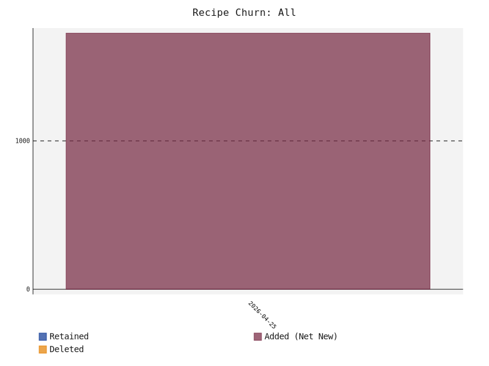
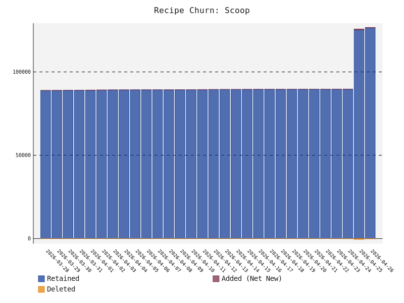
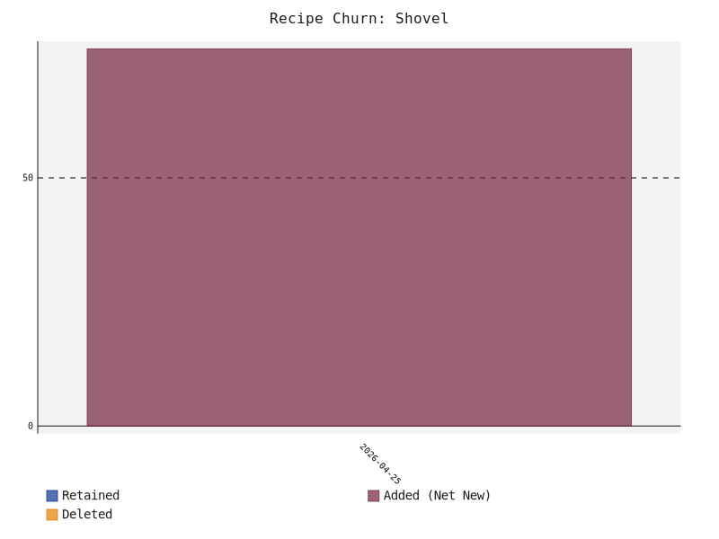

# scoop-radar
A data-driven, automated discovery and ranking engine for the Scoop package manager ecosystem on Windows

# Build Status


# Acknowledgements
This project was heavily inspired by the original `awesome-scoop` directories maintained by [algomaniac](https://github.com/algomaniac) and [tapannallan](https://github.com/tapannallan).

# 📊 Ecosystem Health
* **Total Unique Recipes**: 30933
* **Ecosystem Auto-Update Health**: 85.37%
* **Ecosystem Reliability**: 89.9% (Sampled URL Health)
* **Official vs. Community**: 48312 Official / 78974 Community
* **Bucket Ecosystem**: 1162 Scoop / 24 Shovel
* **Bucket Graveyard (Stale > 1 Year)**: 🪦 409

### Ecosystem Growth (All Recipes)
<picture>
  <source media="(prefers-color-scheme: dark)" srcset="growth_all_dark.svg">
  <source media="(prefers-color-scheme: light)" srcset="growth_all_light.svg">
  
</picture>

### Scoop vs Shovel Growth
<p align="center">
  <picture>
    <source media="(prefers-color-scheme: dark)" srcset="growth_scoop_dark.svg">
    <source media="(prefers-color-scheme: light)" srcset="growth_scoop_light.svg">
    
  </picture>
  <picture>
    <source media="(prefers-color-scheme: dark)" srcset="growth_shovel_dark.svg">
    <source media="(prefers-color-scheme: light)" srcset="growth_shovel_light.svg">
    
  </picture>
</p>

# 🚀 Getting Started
To add and use any of the buckets listed below, simply run the following command in your terminal:
```powershell
scoop bucket add <bucket-name> <bucket-url>
```
For example, to add a specific bucket, find its URL from the list below and run:
```powershell
scoop bucket add my-awesome-bucket https://github.com/user/my-awesome-bucket
```
After adding the bucket, you can install any of its applications like this:
```powershell
scoop install my-awesome-bucket/<app-name>
```

# Third party buckets by popularity


## 💎 Hidden Gems
These buckets are actively maintained and feature a high percentage of **unique** applications not found in official repositories. Great for discovering niche tools!

| Repository | Unique Recipes | Total Recipes | Score | Auto-Update |
| :--- | :---: | :---: | :---: | :---: |
| **[AntonOks/scoop-aoks](directory/AntonOks+scoop-aoks.md)** | 💎 241 (100.0%) | 📦 241 | ⭐ 1.0 | 🔄 99% |
| **[davidxuang/scoop-type](directory/davidxuang+scoop-type.md)** | 💎 113 (100.0%) | 📦 113 | ⭐ 1.0 | 🔄 100% |
| **[suquiya/suquiya_bucket](directory/suquiya+suquiya_bucket.md)** | 💎 47 (100.0%) | 📦 47 | ⭐ 1.0 | 🔄 96% |
| **[specter119/scoop-dsms](directory/specter119+scoop-dsms.md)** | 💎 47 (100.0%) | 📦 47 | ⭐ 1.0 | 🔄 98% |
| **[Scoopforge/Extras-Plus](directory/Scoopforge+Extras-Plus.md)** | 💎 45 (100.0%) | 📦 45 | ⭐ 1.0 | 🔄 100% |
| **[unoun/scoop-bucket](directory/unoun+scoop-bucket.md)** | 💎 38 (100.0%) | 📦 38 | ⭐ 1.0 | 🔄 89% |
| **[matracey/scoop-bucket](directory/matracey+scoop-bucket.md)** | 💎 44 (100.0%) | 📦 44 | ⭐ 1.0 | 🔄 100% |
| **[asimov-platform/scoop-bucket](directory/asimov-platform+scoop-bucket.md)** | 💎 33 (100.0%) | 📦 33 | ⭐ 1.0 | 🔄 100% |
| **[ppyv/scoop-jp-fonts](directory/ppyv+scoop-jp-fonts.md)** | 💎 33 (100.0%) | 📦 33 | ⭐ 1.0 | 🔄 100% |
| **[icecreamZeng/scoop-bucket](directory/icecreamZeng+scoop-bucket.md)** | 💎 29 (100.0%) | 📦 29 | ⭐ 1.0 | 🔄 66% |


## 🔥 Trending
These active buckets are rapidly climbing the ranks due to recent, high-quality updates and growing recipe counts!

| Repository | Rank Change | Current Rank | Recipes | Score | Auto-Update |
| :--- | :---: | :---: | :---: | :---: | :---: |
| **[leic4u/Scoop-Store](directory/leic4u+Scoop-Store.md)** | 📈 +33 | 🏆 #126 | 📦 38 | ⭐ 1.0 | 🔄 97% |
| **[jbwfu/scoop-bucket](directory/jbwfu+scoop-bucket.md)** | 📈 +33 | 🏆 #127 | 📦 38 | ⭐ 1.0 | 🔄 97% |
| **[MoonWX/scoop_bucket](directory/MoonWX+scoop_bucket.md)** | 📈 +23 | 🏆 #225 | 📦 17 | ⭐ 1.0 | 🔄 100% |
| **[wzv5/ScoopBucket](directory/wzv5+ScoopBucket.md)** | 📈 +14 | 🏆 #144 | 📦 34 | ⭐ 1.0 | 🔄 97% |
| **[joaoricarte/jr-bucket](directory/joaoricarte+jr-bucket.md)** | 📈 +11 | 🏆 #115 | 📦 44 | ⭐ 1.0 | 🔄 95% |


## 🥄 Scoop Compatible Buckets
These buckets are fully compatible with Scoop (and Shovel). They contain standard JSON manifests.

<details>
<summary><b>Click to expand 1162 Scoop buckets</b></summary>

| Repository | Recipes | Score | Auto-Update | Badges |
| :--- | :---: | :---: | :---: | :--- |
| **[anderlli0053/DEV-tools](directory/anderlli0053+DEV-tools.md)** | 📦 23621 | ⭐ 1.0 | 🔄 83% |  |
| **[okibcn/ScoopMaster](directory/okibcn+ScoopMaster.md)** | 📦 19337 | ⭐ 1.0 | 🔄 84% |  |
| **[cmontage/scoopbucket-third](directory/cmontage+scoopbucket-third.md)** | 📦 13731 | ⭐ 1.0 | 🔄 87% |  |
| **[kkzzhizhou/scoop-apps](directory/kkzzhizhou+scoop-apps.md)** | 📦 13531 | ⭐ 1.0 | 🔄 87% |  |
| **[lzwme/scoop-proxy-cn](directory/lzwme+scoop-proxy-cn.md)** | 📦 10673 | ⭐ 1.0 | 🔄 86% |  |
| **[lvyuemeng/scoop-cn](directory/lvyuemeng+scoop-cn.md)** | 📦 6351 | ⭐ 1.0 | 🔄 85% |  |
| **[duzyn/scoop-cn](directory/duzyn+scoop-cn.md)** | 📦 6337 | ⭐ 1.0 | 🔄 85% |  |
| **[hoilc/scoop-lemon](directory/hoilc+scoop-lemon.md)** | 📦 2520 | ⭐ 1.0 | 🔄 95% |  |
| **[ScoopInstaller/Extras](directory/ScoopInstaller+Extras.md)** | 📦 2300 | ⭐ 1.0 | 🔄 92% | 👑 Official Scoop<br>⭐ Known Shovel |
| **[ScoopInstaller/Main](directory/ScoopInstaller+Main.md)** | 📦 1506 | ⭐ 1.0 | 🔄 94% | 👑 Official Scoop<br>⭐ Known Shovel |
| **[DoveBoy/Apps](directory/DoveBoy+Apps.md)** | 📦 811 | ⭐ 1.0 | 🔄 100% |  |
| **[bright-angel/scoop-bucket](directory/bright-angel+scoop-bucket.md)** | 📦 773 | ⭐ 1.0 | 🔄 84% |  |
| **[dodorz/scoop](directory/dodorz+scoop.md)** | 📦 725 | ⭐ 1.0 | 🔄 84% |  |
| **[ScoopInstaller/Versions](directory/ScoopInstaller+Versions.md)** | 📦 571 | ⭐ 1.0 | 🔄 74% | 👑 Official Scoop<br>⭐ Known Shovel |
| **[Calinou/scoop-games](directory/Calinou+scoop-games.md)** | 📦 398 | ⭐ 1.0 | 🔄 92% | ⭐ Known Scoop<br>⭐ Known Shovel |
| **[ScoopInstaller/PHP](directory/ScoopInstaller+PHP.md)** | 📦 391 | ⭐ 1.0 | 🔄 4% | 👑 Official Scoop<br>⭐ Known Shovel |
| **[matthewjberger/scoop-nerd-fonts](directory/matthewjberger+scoop-nerd-fonts.md)** | 📦 366 | ⭐ 1.0 | 🔄 92% | ⭐ Known Scoop<br>⭐ Known Shovel |
| **[rivy/scoop-bucket](directory/rivy+scoop-bucket.md)** | 📦 356 | ⭐ 1.0 | 🔄 79% |  |
| **[xrgzs/sdoog](directory/xrgzs+sdoog.md)** | 📦 342 | ⭐ 1.0 | 🔄 93% |  |
| **[naderi/scoop-bucket](directory/naderi+scoop-bucket.md)** | 📦 336 | ⭐ 1.0 | 🔄 96% |  |
| **[ScoopInstaller/Java](directory/ScoopInstaller+Java.md)** | 📦 329 | ⭐ 1.0 | 🔄 86% | 👑 Official Scoop<br>⭐ Known Shovel |
| **[akirco/aki-apps](directory/akirco+aki-apps.md)** | 📦 302 | ⭐ 1.0 | 🔄 86% |  |
| **[ScoopInstaller/Nirsoft](directory/ScoopInstaller+Nirsoft.md)** | 📦 290 | ⭐ 1.0 | 🔄 100% | 👑 Official Scoop |
| **[wwvl/Scoop-Cursor](directory/wwvl+Scoop-Cursor.md)** | 📦 288 | ⭐ 1.0 | 🔄 0% |  |
| **[chawyehsu/dorado](directory/chawyehsu+dorado.md)** | 📦 271 | ⭐ 1.0 | 🔄 94% |  |
| **[arch3rPro/PST-Bucket](directory/arch3rPro+PST-Bucket.md)** | 📦 260 | ⭐ 1.0 | 🔄 93% |  |
| **[AntonOks/scoop-aoks](directory/AntonOks+scoop-aoks.md)** | 📦 241 | ⭐ 1.0 | 🔄 99% |  |
| **[kodybrown/scoop-nirsoft](directory/kodybrown+scoop-nirsoft.md)** | 📦 276 | ⭐ 1.0 | 🔄 100% |  |
| **[aliesbelik/poldi](directory/aliesbelik+poldi.md)** | 📦 220 | ⭐ 1.0 | 🔄 100% |  |
| **[gdm257/scoop-257](directory/gdm257+scoop-257.md)** | 📦 192 | ⭐ 1.0 | 🔄 90% |  |
| **[Jadeiin/scoop](directory/Jadeiin+scoop.md)** | 📦 190 | ⭐ 1.0 | 🔄 99% |  |
| **[Weidows-projects/scoop-3rd](directory/Weidows-projects+scoop-3rd.md)** | 📦 189 | ⭐ 1.0 | 🔄 86% |  |
| **[kris3713/MyScoop](directory/kris3713+MyScoop.md)** | 📦 224 | ⭐ 1.0 | 🔄 92% |  |
| **[WinApps-share/WinApps-bucket](directory/WinApps-share+WinApps-bucket.md)** | 📦 179 | ⭐ 1.0 | 🔄 95% |  |
| **[brian6932/dank-scoop](directory/brian6932+dank-scoop.md)** | 📦 183 | ⭐ 1.0 | 🔄 97% |  |
| **[hu3rror/scoop-muggle](directory/hu3rror+scoop-muggle.md)** | 📦 164 | ⭐ 1.0 | 🔄 82% |  |
| **[ShuguangSun/sgs-scoop-bucket](directory/ShuguangSun+sgs-scoop-bucket.md)** | 📦 158 | ⭐ 1.0 | 🔄 76% |  |
| **[KnotUntied/scoop-fonts](directory/KnotUntied+scoop-fonts.md)** | 📦 161 | ⭐ 1.0 | 🔄 67% |  |
| **[ACooper81/scoop-apps](directory/ACooper81+scoop-apps.md)** | 📦 152 | ⭐ 1.0 | 🔄 94% |  |
| **[qzxst/scoop-qzxst](directory/qzxst+scoop-qzxst.md)** | 📦 151 | ⭐ 1.0 | 🔄 98% |  |
| **[ViCrack/scoop-bucket](directory/ViCrack+scoop-bucket.md)** | 📦 148 | ⭐ 1.0 | 🔄 99% |  |
| **[batkiz/backit](directory/batkiz+backit.md)** | 📦 146 | ⭐ 1.0 | 🔄 99% |  |
| **[tomcdj71/scoop-dev-apps](directory/tomcdj71+scoop-dev-apps.md)** | 📦 146 | ⭐ 1.0 | 🔄 88% |  |
| **[ptbwu/dango](directory/ptbwu+dango.md)** | 📦 141 | ⭐ 1.0 | 🔄 89% |  |
| **[abgox/abgo_bucket](directory/abgox+abgo_bucket.md)** | 📦 166 | ⭐ 1.0 | 🔄 99% |  |
| **[mo-san/scoop-bucket](directory/mo-san+scoop-bucket.md)** | 📦 133 | ⭐ 1.0 | 🔄 99% |  |
| **[ScoopInstaller/Nonportable](directory/ScoopInstaller+Nonportable.md)** | 📦 131 | ⭐ 1.0 | 🔄 88% | 👑 Official Scoop |
| **[Capella87/capella-bucket](directory/Capella87+capella-bucket.md)** | 📦 119 | ⭐ 1.0 | 🔄 96% |  |
| **[ygguorun/scoop-bucket](directory/ygguorun+scoop-bucket.md)** | 📦 119 | ⭐ 1.0 | 🔄 73% |  |
| **[tldrw/scoop-security](directory/tldrw+scoop-security.md)** | 📦 119 | ⭐ 1.0 | 🔄 97% |  |
| **[davidxuang/scoop-type](directory/davidxuang+scoop-type.md)** | 📦 113 | ⭐ 1.0 | 🔄 100% |  |
| **[tomcdj71/scoop-essential-apps](directory/tomcdj71+scoop-essential-apps.md)** | 📦 113 | ⭐ 1.0 | 🔄 97% |  |
| **[huangnauh/carrot](directory/huangnauh+carrot.md)** | 📦 113 | ⭐ 1.0 | 🔄 99% |  |
| **[hetingde/Meta](directory/hetingde+Meta.md)** | 📦 369 | ⭐ 1.0 | 🔄 98% |  |
| **[magicedy/scoop-bucket-m](directory/magicedy+scoop-bucket-m.md)** | 📦 107 | ⭐ 1.0 | 🔄 91% |  |
| **[zeldrisho/scoop-bucket](directory/zeldrisho+scoop-bucket.md)** | 📦 106 | ⭐ 1.0 | 🔄 97% |  |
| **[brave-simpletons/scoop-the-business](directory/brave-simpletons+scoop-the-business.md)** | 📦 105 | ⭐ 1.0 | 🔄 92% |  |
| **[jqk/scoopbucket](directory/jqk+scoopbucket.md)** | 📦 100 | ⭐ 1.0 | 🔄 82% |  |
| **[amorphobia/siku](directory/amorphobia+siku.md)** | 📦 100 | ⭐ 1.0 | 🔄 95% |  |
| **[cesaryuan/scoop-cesar](directory/cesaryuan+scoop-cesar.md)** | 📦 92 | ⭐ 1.0 | 🔄 82% |  |
| **[HUMORCE/nuke](directory/HUMORCE+nuke.md)** | 📦 90 | ⭐ 1.0 | 🔄 79% |  |
| **[Scoopforge/Extras-CN](directory/Scoopforge+Extras-CN.md)** | 📦 89 | ⭐ 1.0 | 🔄 97% |  |
| **[WantChane/doge_bucket](directory/WantChane+doge_bucket.md)** | 📦 88 | ⭐ 1.0 | 🔄 99% |  |
| **[souhaiebtar/scoop-apps](directory/souhaiebtar+scoop-apps.md)** | 📦 86 | ⭐ 1.0 | 🔄 93% |  |
| **[gregwen/grewen-scoop](directory/gregwen+grewen-scoop.md)** | 📦 86 | ⭐ 1.0 | 🔄 95% |  |
| **[lewis-yeung/scoop-bucket](directory/lewis-yeung+scoop-bucket.md)** | 📦 85 | ⭐ 1.0 | 🔄 86% |  |
| **[ZhangTianrong/scoop-bucket](directory/ZhangTianrong+scoop-bucket.md)** | 📦 82 | ⭐ 1.0 | 🔄 93% |  |
| **[echoiron/echo-scoop](directory/echoiron+echo-scoop.md)** | 📦 82 | ⭐ 1.0 | 🔄 0% |  |
| **[Donaldduck8/malware-analysis-bucket](directory/Donaldduck8+malware-analysis-bucket.md)** | 📦 80 | ⭐ 1.0 | 🔄 69% |  |
| **[ChuckieChen945/Tangyuan](directory/ChuckieChen945+Tangyuan.md)** | 📦 79 | ⭐ 1.0 | 🔄 51% |  |
| **[hermanjustnu/scoop-emulators](directory/hermanjustnu+scoop-emulators.md)** | 📦 83 | ⭐ 1.0 | 🔄 89% |  |
| **[rasa/scoops](directory/rasa+scoops.md)** | 📦 78 | ⭐ 1.0 | 🔄 71% |  |
| **[babo4d/scoop-xrtools](directory/babo4d+scoop-xrtools.md)** | 📦 78 | ⭐ 1.0 | 🔄 95% |  |
| **[kengwang/scoop-ctftools-bucket](directory/kengwang+scoop-ctftools-bucket.md)** | 📦 77 | ⭐ 1.0 | 🔄 99% |  |
| **[KnotUntied/scoop-knotuntied](directory/KnotUntied+scoop-knotuntied.md)** | 📦 77 | ⭐ 1.0 | 🔄 82% |  |
| **[maqibg/MQBucket](directory/maqibg+MQBucket.md)** | 📦 77 | ⭐ 1.0 | 🔄 100% |  |
| **[404NetworkError/scoop-bucket](directory/404NetworkError+scoop-bucket.md)** | 📦 81 | ⭐ 1.0 | 🔄 96% |  |
| **[niheaven/scoop-sysinternals](directory/niheaven+scoop-sysinternals.md)** | 📦 75 | ⭐ 1.0 | 🔄 100% | ⭐ Known Scoop |
| **[TheRandomLabs/scoop-nonportable](directory/TheRandomLabs+scoop-nonportable.md)** | 📦 73 | ⭐ 1.0 | 🔄 86% | <br>⭐ Known Shovel |
| **[cscnk52/cetacea](directory/cscnk52+cetacea.md)** | 📦 73 | ⭐ 1.0 | 🔄 100% |  |
| **[cc713/ownscoop](directory/cc713+ownscoop.md)** | 📦 76 | ⭐ 1.0 | 🔄 100% |  |
| **[LuoHuiRu/ScoopBucket](directory/LuoHuiRu+ScoopBucket.md)** | 📦 76 | ⭐ 1.0 | 🔄 92% |  |
| **[huxiaoning/scoop_bucket](directory/huxiaoning+scoop_bucket.md)** | 📦 70 | ⭐ 1.0 | 🔄 83% |  |
| **[warexify/scoop-edk2-buildtools](directory/warexify+scoop-edk2-buildtools.md)** | 📦 65 | ⭐ 1.0 | 🔄 75% |  |
| **[qwerty12/scoop-alts](directory/qwerty12+scoop-alts.md)** | 📦 60 | ⭐ 1.0 | 🔄 78% |  |
| **[li-ruijie/scoop](directory/li-ruijie+scoop.md)** | 📦 59 | ⭐ 1.0 | 🔄 100% |  |
| **[Velgus/Scoop-Portapps](directory/Velgus+Scoop-Portapps.md)** | 📦 61 | ⭐ 1.0 | 🔄 100% |  |
| **[seumsc/scoop-seu](directory/seumsc+scoop-seu.md)** | 📦 57 | ⭐ 1.0 | 🔄 95% |  |
| **[hymkor/scoop-bucket](directory/hymkor+scoop-bucket.md)** | 📦 57 | ⭐ 1.0 | 🔄 100% |  |
| **[JourneyOver/scoop-buckets](directory/JourneyOver+scoop-buckets.md)** | 📦 55 | ⭐ 1.0 | 🔄 95% |  |
| **[epoweripione/scoop-bucket](directory/epoweripione+scoop-bucket.md)** | 📦 55 | ⭐ 1.0 | 🔄 100% |  |
| **[cderv/r-bucket](directory/cderv+r-bucket.md)** | 📦 54 | ⭐ 1.0 | 🔄 94% |  |
| **[mvrpl/windows-apps](directory/mvrpl+windows-apps.md)** | 📦 53 | ⭐ 1.0 | 🔄 94% |  |
| **[milnak/scoop-bucket](directory/milnak+scoop-bucket.md)** | 📦 52 | ⭐ 1.0 | 🔄 98% |  |
| **[Befod/Xeno](directory/Befod+Xeno.md)** | 📦 51 | ⭐ 1.0 | 🔄 100% |  |
| **[beer-psi/scoop-bucket](directory/beer-psi+scoop-bucket.md)** | 📦 51 | ⭐ 1.0 | 🔄 80% |  |
| **[windedge/ladle-bucket](directory/windedge+ladle-bucket.md)** | 📦 49 | ⭐ 1.0 | 🔄 100% |  |
| **[aoisummer/scoop-bucket](directory/aoisummer+scoop-bucket.md)** | 📦 49 | ⭐ 1.0 | 🔄 92% |  |
| **[IsaacShoebottom/scoop-bucket](directory/IsaacShoebottom+scoop-bucket.md)** | 📦 49 | ⭐ 1.0 | 🔄 98% |  |
| **[LaelLuo/scoop](directory/LaelLuo+scoop.md)** | 📦 52 | ⭐ 1.0 | 🔄 100% |  |
| **[richardkng/ScoopBucket](directory/richardkng+ScoopBucket.md)** | 📦 52 | ⭐ 1.0 | 🔄 96% |  |
| **[suquiya/suquiya_bucket](directory/suquiya+suquiya_bucket.md)** | 📦 47 | ⭐ 1.0 | 🔄 96% |  |
| **[apeiraco/scoop-bucket](directory/apeiraco+scoop-bucket.md)** | 📦 46 | ⭐ 1.0 | 🔄 96% |  |
| **[nateify/scoop-nateify](directory/nateify+scoop-nateify.md)** | 📦 46 | ⭐ 1.0 | 🔄 96% |  |
| **[jonz94/scoop-sarasa-nerd-fonts](directory/jonz94+scoop-sarasa-nerd-fonts.md)** | 📦 49 | ⭐ 1.0 | 🔄 100% |  |
| **[Scoopforge/Extras-Plus](directory/Scoopforge+Extras-Plus.md)** | 📦 45 | ⭐ 1.0 | 🔄 100% |  |
| **[kt-devhub/extra](directory/kt-devhub+extra.md)** | 📦 45 | ⭐ 1.0 | 🔄 89% |  |
| **[joaoricarte/jr-bucket](directory/joaoricarte+jr-bucket.md)** | 📦 44 | ⭐ 1.0 | 🔄 95% |  |
| **[issaclin32/scoop-bucket](directory/issaclin32+scoop-bucket.md)** | 📦 44 | ⭐ 1.0 | 🔄 68% |  |
| **[woyxiang/slug](directory/woyxiang+slug.md)** | 📦 44 | ⭐ 1.0 | 🔄 98% |  |
| **[zhoujin7/tomato](directory/zhoujin7+tomato.md)** | 📦 52 | ⭐ 1.0 | 🔄 85% |  |
| **[MMKubicki/ScoopBucket](directory/MMKubicki+ScoopBucket.md)** | 📦 43 | ⭐ 1.0 | 🔄 100% |  |
| **[Locietta/sniffer](directory/Locietta+sniffer.md)** | 📦 42 | ⭐ 1.0 | 🔄 100% |  |
| **[wanstarge/scoopx](directory/wanstarge+scoopx.md)** | 📦 42 | ⭐ 1.0 | 🔄 93% |  |
| **[Gladtbam/Bucket](directory/Gladtbam+Bucket.md)** | 📦 51 | ⭐ 1.0 | 🔄 96% |  |
| **[Spiraster/scoop-bucket](directory/Spiraster+scoop-bucket.md)** | 📦 41 | ⭐ 1.0 | 🔄 93% |  |
| **[ypxun/scoop_bucket](directory/ypxun+scoop_bucket.md)** | 📦 41 | ⭐ 1.0 | 🔄 100% |  |
| **[TianXiaTech/scoop-txt](directory/TianXiaTech+scoop-txt.md)** | 📦 40 | ⭐ 1.0 | 🔄 90% |  |
| **[leic4u/Scoop-Store](directory/leic4u+Scoop-Store.md)** | 📦 38 | ⭐ 1.0 | 🔄 97% |  |
| **[jbwfu/scoop-bucket](directory/jbwfu+scoop-bucket.md)** | 📦 38 | ⭐ 1.0 | 🔄 97% |  |
| **[Lutra-Fs/scoop-bucket](directory/Lutra-Fs+scoop-bucket.md)** | 📦 38 | ⭐ 1.0 | 🔄 95% |  |
| **[Deide/deide-bucket](directory/Deide+deide-bucket.md)** | 📦 38 | ⭐ 1.0 | 🔄 87% |  |
| **[unoun/scoop-bucket](directory/unoun+scoop-bucket.md)** | 📦 38 | ⭐ 1.0 | 🔄 89% |  |
| **[jat001/scoop-ox](directory/jat001+scoop-ox.md)** | 📦 38 | ⭐ 1.0 | 🔄 100% |  |
| **[p8rdev/scoop-portableapps](directory/p8rdev+scoop-portableapps.md)** | 📦 440 | ⭐ 1.0 | 🔄 100% |  |
| **[Paxxs/Cluttered-bucket](directory/Paxxs+Cluttered-bucket.md)** | 📦 46 | ⭐ 1.0 | 🔄 91% |  |
| **[NSPC911/le-bucket](directory/NSPC911+le-bucket.md)** | 📦 37 | ⭐ 1.0 | 🔄 97% |  |
| **[niceEli/Pail](directory/niceEli+Pail.md)** | 📦 41 | ⭐ 1.0 | 🔄 93% |  |
| **[Jastmaskerrr/Rojem-Scoop](directory/Jastmaskerrr+Rojem-Scoop.md)** | 📦 41 | ⭐ 1.0 | 🔄 95% |  |
| **[Strappazzon/scoop](directory/Strappazzon+scoop.md)** | 📦 36 | ⭐ 1.0 | 🔄 100% |  |
| **[mslxl/ScoopIt](directory/mslxl+ScoopIt.md)** | 📦 36 | ⭐ 1.0 | 🔄 92% |  |
| **[matracey/scoop-bucket](directory/matracey+scoop-bucket.md)** | 📦 44 | ⭐ 1.0 | 🔄 100% |  |
| **[iquiw/scoop-bucket](directory/iquiw+scoop-bucket.md)** | 📦 35 | ⭐ 1.0 | 🔄 100% |  |
| **[maoyeedy/Scoop](directory/maoyeedy+Scoop.md)** | 📦 35 | ⭐ 1.0 | 🔄 94% |  |
| **[maboloshi/scoop-private](directory/maboloshi+scoop-private.md)** | 📦 39 | ⭐ 1.0 | 🔄 82% |  |
| **[kkzzhizhou/scoop-zapps](directory/kkzzhizhou+scoop-zapps.md)** | 📦 34 | ⭐ 1.0 | 🔄 94% |  |
| **[wzv5/ScoopBucket](directory/wzv5+ScoopBucket.md)** | 📦 34 | ⭐ 1.0 | 🔄 97% |  |
| **[raisercostin/raiser-scoop-bucket](directory/raisercostin+raiser-scoop-bucket.md)** | 📦 34 | ⭐ 1.0 | 🔄 76% |  |
| **[maokwen/scoop-bucket](directory/maokwen+scoop-bucket.md)** | 📦 42 | ⭐ 1.0 | 🔄 95% |  |
| **[natecohen/scoop-av](directory/natecohen+scoop-av.md)** | 📦 33 | ⭐ 1.0 | 🔄 79% |  |
| **[MagicalDrizzle/scoop-personal](directory/MagicalDrizzle+scoop-personal.md)** | 📦 33 | ⭐ 1.0 | 🔄 79% |  |
| **[jcwillox/scoop-bucket](directory/jcwillox+scoop-bucket.md)** | 📦 33 | ⭐ 1.0 | 🔄 97% |  |
| **[kazzarin/bucket](directory/kazzarin+bucket.md)** | 📦 33 | ⭐ 1.0 | 🔄 97% |  |
| **[ZephyrY7/zault](directory/ZephyrY7+zault.md)** | 📦 33 | ⭐ 1.0 | 🔄 82% |  |
| **[asimov-platform/scoop-bucket](directory/asimov-platform+scoop-bucket.md)** | 📦 33 | ⭐ 1.0 | 🔄 100% |  |
| **[nicerloop/scoop-nicerloop](directory/nicerloop+scoop-nicerloop.md)** | 📦 32 | ⭐ 1.0 | 🔄 62% |  |
| **[Zevan770/scoop_zev](directory/Zevan770+scoop_zev.md)** | 📦 32 | ⭐ 1.0 | 🔄 91% |  |
| **[ppyv/scoop-jp-fonts](directory/ppyv+scoop-jp-fonts.md)** | 📦 33 | ⭐ 1.0 | 🔄 100% |  |
| **[lyrids921/scoop_bucket](directory/lyrids921+scoop_bucket.md)** | 📦 31 | ⭐ 1.0 | 🔄 100% |  |
| **[Vinfall/sb](directory/Vinfall+sb.md)** | 📦 35 | ⭐ 1.0 | 🔄 89% |  |
| **[LucasOe/scoop-lucasoe](directory/LucasOe+scoop-lucasoe.md)** | 📦 33 | ⭐ 1.0 | 🔄 97% |  |
| **[rivy/scoop.bucket.scoop-main](directory/rivy+scoop.bucket.scoop-main.md)** | 📦 1506 | ⭐ 1.0 | 🔄 94% |  |
| **[notPlancha/bucket](directory/notPlancha+bucket.md)** | 📦 29 | ⭐ 1.0 | 🔄 100% |  |
| **[icecreamZeng/scoop-bucket](directory/icecreamZeng+scoop-bucket.md)** | 📦 29 | ⭐ 1.0 | 🔄 66% |  |
| **[AruoTan/ScoopStdExt](directory/AruoTan+ScoopStdExt.md)** | 📦 29 | ⭐ 1.0 | 🔄 76% |  |
| **[jfut/scoop-jfut](directory/jfut+scoop-jfut.md)** | 📦 33 | ⭐ 1.0 | 🔄 94% |  |
| **[AkariiinMKII/Scoop4kariiin](directory/AkariiinMKII+Scoop4kariiin.md)** | 📦 33 | ⭐ 1.0 | 🔄 73% |  |
| **[janlindblom/scoops](directory/janlindblom+scoops.md)** | 📦 33 | ⭐ 1.0 | 🔄 58% |  |
| **[filip2cz/scoop-retro](directory/filip2cz+scoop-retro.md)** | 📦 47 | ⭐ 1.0 | 🔄 2% |  |
| **[tac091/scoop-multi](directory/tac091+scoop-multi.md)** | 📦 31 | ⭐ 1.0 | 🔄 87% |  |
| **[noql-net/scoop](directory/noql-net+scoop.md)** | 📦 28 | ⭐ 1.0 | 🔄 100% |  |
| **[cmontage/scoopbucket-soup](directory/cmontage+scoopbucket-soup.md)** | 📦 28 | ⭐ 1.0 | 🔄 100% |  |
| **[MetalDevOps/scoop-bucket](directory/MetalDevOps+scoop-bucket.md)** | 📦 27 | ⭐ 1.0 | 🔄 74% |  |
| **[Scoopforge/Main-Plus](directory/Scoopforge+Main-Plus.md)** | 📦 30 | ⭐ 1.0 | 🔄 100% |  |
| **[yurical/scoop-mint](directory/yurical+scoop-mint.md)** | 📦 29 | ⭐ 1.0 | 🔄 97% |  |
| **[TheRandomLabs/Scoop-Python](directory/TheRandomLabs+Scoop-Python.md)** | 📦 25 | ⭐ 1.0 | 🔄 100% |  |
| **[Montia37/ScoopBucket](directory/Montia37+ScoopBucket.md)** | 📦 25 | ⭐ 1.0 | 🔄 76% |  |
| **[NSIS-Dev/scoop-nsis](directory/NSIS-Dev+scoop-nsis.md)** | 📦 70 | ⭐ 1.0 | 🔄 100% |  |
| **[Bergbok/Scoop-Bucket](directory/Bergbok+Scoop-Bucket.md)** | 📦 28 | ⭐ 1.0 | 🔄 68% |  |
| **[kkkykin/Personal-Scoop-Bucket](directory/kkkykin+Personal-Scoop-Bucket.md)** | 📦 32 | ⭐ 1.0 | 🔄 100% |  |
| **[younger-1/scoop-it](directory/younger-1+scoop-it.md)** | 📦 24 | ⭐ 1.0 | 🔄 92% |  |
| **[Hayxi/Soap](directory/Hayxi+Soap.md)** | 📦 24 | ⭐ 1.0 | 🔄 96% |  |
| **[w4tchdoge/w4tchdoges-scoop-bucket](directory/w4tchdoge+w4tchdoges-scoop-bucket.md)** | 📦 24 | ⭐ 1.0 | 🔄 96% |  |
| **[Tomko-Taylor/scoop-bucket](directory/Tomko-Taylor+scoop-bucket.md)** | 📦 35 | ⭐ 1.0 | 🔄 91% |  |
| **[jonisb/Misc-scoops](directory/jonisb+Misc-scoops.md)** | 📦 23 | ⭐ 1.0 | 🔄 100% |  |
| **[ous50/ous50-bucket](directory/ous50+ous50-bucket.md)** | 📦 23 | ⭐ 1.0 | 🔄 96% |  |
| **[Milo123459/cone](directory/Milo123459+cone.md)** | 📦 23 | ⭐ 1.0 | 🔄 100% |  |
| **[rodrigost23/scoop-bucket](directory/rodrigost23+scoop-bucket.md)** | 📦 26 | ⭐ 1.0 | 🔄 96% |  |
| **[se35710/scoop-redhat](directory/se35710+scoop-redhat.md)** | 📦 22 | ⭐ 1.0 | 🔄 100% |  |
| **[bookyue/scoop-egg](directory/bookyue+scoop-egg.md)** | 📦 22 | ⭐ 1.0 | 🔄 100% |  |
| **[ropean/scoop](directory/ropean+scoop.md)** | 📦 25 | ⭐ 1.0 | 🔄 100% |  |
| **[artiga033/Armory](directory/artiga033+Armory.md)** | 📦 22 | ⭐ 1.0 | 🔄 86% |  |
| **[Doddddd/Bucket](directory/Doddddd+Bucket.md)** | 📦 29 | ⭐ 1.0 | 🔄 100% |  |
| **[strxnge-effects/scoopert](directory/strxnge-effects+scoopert.md)** | 📦 21 | ⭐ 1.0 | 🔄 71% |  |
| **[pfmoore/scoop-enk](directory/pfmoore+scoop-enk.md)** | 📦 21 | ⭐ 1.0 | 🔄 100% |  |
| **[maciakl/bucket](directory/maciakl+bucket.md)** | 📦 21 | ⭐ 1.0 | 🔄 100% |  |
| **[RakambdaOrg/Scoop](directory/RakambdaOrg+Scoop.md)** | 📦 21 | ⭐ 1.0 | 🔄 100% |  |
| **[tar80/scoop-bucket](directory/tar80+scoop-bucket.md)** | 📦 21 | ⭐ 1.0 | 🔄 95% |  |
| **[Ciberbago/ciber-bucket](directory/Ciberbago+ciber-bucket.md)** | 📦 21 | ⭐ 1.0 | 🔄 71% |  |
| **[borger/scoop-galaxy-integrations](directory/borger+scoop-galaxy-integrations.md)** | 📦 21 | ⭐ 1.0 | 🔄 100% |  |
| **[zhihaofans/Milk](directory/zhihaofans+Milk.md)** | 📦 26 | ⭐ 1.0 | 🔄 0% |  |
| **[Rinkerbel/scooped](directory/Rinkerbel+scooped.md)** | 📦 20 | ⭐ 1.0 | 🔄 100% |  |
| **[bodrick/scoop-bucket](directory/bodrick+scoop-bucket.md)** | 📦 20 | ⭐ 1.0 | 🔄 100% |  |
| **[crisipa/scoopbucket](directory/crisipa+scoopbucket.md)** | 📦 20 | ⭐ 1.0 | 🔄 100% |  |
| **[owenvoke/scoop-bucket](directory/owenvoke+scoop-bucket.md)** | 📦 20 | ⭐ 1.0 | 🔄 100% |  |
| **[yak1ex/scoop-bucket](directory/yak1ex+scoop-bucket.md)** | 📦 20 | ⭐ 1.0 | 🔄 90% |  |
| **[amano41/scoop-bucket](directory/amano41+scoop-bucket.md)** | 📦 27 | ⭐ 1.0 | 🔄 96% |  |
| **[phnthnhnm/Scoop](directory/phnthnhnm+Scoop.md)** | 📦 19 | ⭐ 1.0 | 🔄 100% |  |
| **[Dott-rus/apps](directory/Dott-rus+apps.md)** | 📦 19 | ⭐ 1.0 | 🔄 100% |  |
| **[amorphobia/ScoopMirrored](directory/amorphobia+ScoopMirrored.md)** | 📦 19 | ⭐ 1.0 | 🔄 100% |  |
| **[anxshi/various-infills](directory/anxshi+various-infills.md)** | 📦 19 | ⭐ 1.0 | 🔄 100% |  |
| **[zeemanz/my-bucket](directory/zeemanz+my-bucket.md)** | 📦 19 | ⭐ 1.0 | 🔄 100% |  |
| **[fruini/scoop-bucket](directory/fruini+scoop-bucket.md)** | 📦 19 | ⭐ 1.0 | 🔄 89% |  |
| **[sqliuchang/scoop-bucket](directory/sqliuchang+scoop-bucket.md)** | 📦 19 | ⭐ 1.0 | 🔄 95% |  |
| **[plutotree/scoop-bucket](directory/plutotree+scoop-bucket.md)** | 📦 18 | ⭐ 1.0 | 🔄 100% |  |
| **[danalec/scoop-alts](directory/danalec+scoop-alts.md)** | 📦 18 | ⭐ 1.0 | 🔄 89% |  |
| **[The-Simples/scoop-minecraft](directory/The-Simples+scoop-minecraft.md)** | 📦 18 | ⭐ 1.0 | 🔄 89% |  |
| **[aviscaerulea/scoop-bucket](directory/aviscaerulea+scoop-bucket.md)** | 📦 18 | ⭐ 1.0 | 🔄 100% |  |
| **[NeonTowel/scoop-bucket](directory/NeonTowel+scoop-bucket.md)** | 📦 18 | ⭐ 1.0 | 🔄 94% |  |
| **[pasze888/scoop-keepass](directory/pasze888+scoop-keepass.md)** | 📦 26 | ⭐ 1.0 | 🔄 100% |  |
| **[TheCjw/scoop-retools](directory/TheCjw+scoop-retools.md)** | 📦 19 | ⭐ 1.0 | 🔄 79% |  |
| **[oxygen-dioxide/scoop-musician](directory/oxygen-dioxide+scoop-musician.md)** | 📦 24 | ⭐ 1.0 | 🔄 75% |  |
| **[typst-community/scoop-bucket](directory/typst-community+scoop-bucket.md)** | 📦 17 | ⭐ 1.0 | 🔄 100% |  |
| **[MoonWX/scoop_bucket](directory/MoonWX+scoop_bucket.md)** | 📦 17 | ⭐ 1.0 | 🔄 100% |  |
| **[touhoured/ScoopBucket](directory/touhoured+ScoopBucket.md)** | 📦 17 | ⭐ 1.0 | 🔄 94% |  |
| **[muxirr/march7th](directory/muxirr+march7th.md)** | 📦 17 | ⭐ 1.0 | 🔄 100% |  |
| **[jcwillox/scoop-python](directory/jcwillox+scoop-python.md)** | 📦 17 | ⭐ 1.0 | 🔄 100% |  |
| **[warthurton/scoop-ntwind](directory/warthurton+scoop-ntwind.md)** | 📦 18 | ⭐ 1.0 | 🔄 100% |  |
| **[BluYous/ScoopBucket](directory/BluYous+ScoopBucket.md)** | 📦 28 | ⭐ 1.0 | 🔄 100% |  |
| **[KO6FCH/scoop-ham](directory/KO6FCH+scoop-ham.md)** | 📦 20 | ⭐ 1.0 | 🔄 100% |  |
| **[IV16SL/iv16sl-scoop](directory/IV16SL+iv16sl-scoop.md)** | 📦 17 | ⭐ 1.0 | 🔄 100% |  |
| **[charmbracelet/scoop-bucket](directory/charmbracelet+scoop-bucket.md)** | 📦 16 | ⭐ 1.0 | 🔄 0% |  |
| **[seacanfly/scoop_bucket](directory/seacanfly+scoop_bucket.md)** | 📦 16 | ⭐ 1.0 | 🔄 100% |  |
| **[AyoungDukie/personal_bucket](directory/AyoungDukie+personal_bucket.md)** | 📦 16 | ⭐ 1.0 | 🔄 75% |  |
| **[ocodo/wezterm-alt-windows-icon-builds](directory/ocodo+wezterm-alt-windows-icon-builds.md)** | 📦 16 | ⭐ 1.0 | 🔄 100% |  |
| **[Snowflyt/snowforge](directory/Snowflyt+snowforge.md)** | 📦 15 | ⭐ 1.0 | 🔄 93% |  |
| **[nikkoura/scoop-bucket-elitedangerous](directory/nikkoura+scoop-bucket-elitedangerous.md)** | 📦 15 | ⭐ 1.0 | 🔄 100% |  |
| **[bughug/scoop](directory/bughug+scoop.md)** | 📦 15 | ⭐ 1.0 | 🔄 100% |  |
| **[prettycation/margin](directory/prettycation+margin.md)** | 📦 15 | ⭐ 1.0 | 🔄 93% |  |
| **[LuckyNum/scoop](directory/LuckyNum+scoop.md)** | 📦 15 | ⭐ 1.0 | 🔄 87% |  |
| **[ZhWn/ScoopBucket](directory/ZhWn+ScoopBucket.md)** | 📦 15 | ⭐ 1.0 | 🔄 100% |  |
| **[hmerritt/scoop-bucket](directory/hmerritt+scoop-bucket.md)** | 📦 15 | ⭐ 1.0 | 🔄 93% |  |
| **[ltguillaume/schep](directory/ltguillaume+schep.md)** | 📦 18 | ⭐ 1.0 | 🔄 100% |  |
| **[haomingz/scoop-bucket](directory/haomingz+scoop-bucket.md)** | 📦 14 | ⭐ 1.0 | 🔄 100% |  |
| **[0b1000/bucket](directory/0b1000+bucket.md)** | 📦 14 | ⭐ 1.0 | 🔄 93% |  |
| **[sliots/ScoopBucket](directory/sliots+ScoopBucket.md)** | 📦 14 | ⭐ 1.0 | 🔄 93% |  |
| **[GeorgeDong32/scoopgd](directory/GeorgeDong32+scoopgd.md)** | 📦 14 | ⭐ 1.0 | 🔄 100% |  |
| **[starise/Scoop-Gaming](directory/starise+Scoop-Gaming.md)** | 📦 17 | ⭐ 1.0 | 🔄 76% |  |
| **[kanami09/Scoop-xPack](directory/kanami09+Scoop-xPack.md)** | 📦 14 | ⭐ 1.0 | 🔄 57% |  |
| **[cainiao1992/scoop-chenxf](directory/cainiao1992+scoop-chenxf.md)** | 📦 17 | ⭐ 1.0 | 🔄 100% |  |
| **[jassielof/scoop-bucket](directory/jassielof+scoop-bucket.md)** | 📦 20 | ⭐ 1.0 | 🔄 100% |  |
| **[sbklb1/scoop-bucket](directory/sbklb1+scoop-bucket.md)** | 📦 13 | ⭐ 1.0 | 🔄 77% |  |
| **[Edenwize/scoop-apps](directory/Edenwize+scoop-apps.md)** | 📦 13 | ⭐ 1.0 | 🔄 46% |  |
| **[RecursiveMaple/scoop](directory/RecursiveMaple+scoop.md)** | 📦 13 | ⭐ 1.0 | 🔄 92% |  |
| **[Saturnyx/Unheard-Devtools](directory/Saturnyx+Unheard-Devtools.md)** | 📦 13 | ⭐ 1.0 | 🔄 85% |  |
| **[sh4869221b/scoop-bucket](directory/sh4869221b+scoop-bucket.md)** | 📦 13 | ⭐ 1.0 | 🔄 85% |  |
| **[santarl/scoop_bucket](directory/santarl+scoop_bucket.md)** | 📦 14 | ⭐ 1.0 | 🔄 86% |  |
| **[tkit1994/scoop_bucket](directory/tkit1994+scoop_bucket.md)** | 📦 16 | ⭐ 1.0 | 🔄 100% |  |
| **[pinebright/scoop-bucket](directory/pinebright+scoop-bucket.md)** | 📦 16 | ⭐ 1.0 | 🔄 88% |  |
| **[ddavness/scoop-roblox](directory/ddavness+scoop-roblox.md)** | 📦 12 | ⭐ 1.0 | 🔄 100% |  |
| **[guitarrapc/scoop-bucket](directory/guitarrapc+scoop-bucket.md)** | 📦 12 | ⭐ 1.0 | 🔄 100% |  |
| **[NECOtype/dip](directory/NECOtype+dip.md)** | 📦 12 | ⭐ 1.0 | 🔄 100% |  |
| **[WenSimEHRP/OpenTTD-bucket](directory/WenSimEHRP+OpenTTD-bucket.md)** | 📦 12 | ⭐ 1.0 | 🔄 75% |  |
| **[JotmKKmkLTzE/Scoop-apps](directory/JotmKKmkLTzE+Scoop-apps.md)** | 📦 12 | ⭐ 1.0 | 🔄 100% |  |
| **[Drunk-Dream/drudream](directory/Drunk-Dream+drudream.md)** | 📦 12 | ⭐ 1.0 | 🔄 92% |  |
| **[jinzhongjia/scoop-bucket](directory/jinzhongjia+scoop-bucket.md)** | 📦 12 | ⭐ 1.0 | 🔄 100% |  |
| **[szyha/bucket](directory/szyha+bucket.md)** | 📦 12 | ⭐ 1.0 | 🔄 100% |  |
| **[itsutsu/5coop](directory/itsutsu+5coop.md)** | 📦 12 | ⭐ 1.0 | 🔄 100% |  |
| **[Vader0pr/scoop-bucket](directory/Vader0pr+scoop-bucket.md)** | 📦 12 | ⭐ 1.0 | 🔄 100% |  |
| **[kfyangc/scoop-bucket](directory/kfyangc+scoop-bucket.md)** | 📦 12 | ⭐ 1.0 | 🔄 100% |  |
| **[thekips/scoop-bucket](directory/thekips+scoop-bucket.md)** | 📦 12 | ⭐ 1.0 | 🔄 83% |  |
| **[baaamn/Scoopercalifragilisticexpialidocious](directory/baaamn+Scoopercalifragilisticexpialidocious.md)** | 📦 12 | ⭐ 1.0 | 🔄 100% |  |
| **[Witchilich/scoop-witchilich](directory/Witchilich+scoop-witchilich.md)** | 📦 22 | ⭐ 1.0 | 🔄 95% |  |
| **[swxfe/miscbucket](directory/swxfe+miscbucket.md)** | 📦 11 | ⭐ 1.0 | 🔄 100% |  |
| **[jack-mil/scoop-bucket](directory/jack-mil+scoop-bucket.md)** | 📦 11 | ⭐ 1.0 | 🔄 100% |  |
| **[Jojo4GH/scoop-JojoIV](directory/Jojo4GH+scoop-JojoIV.md)** | 📦 11 | ⭐ 1.0 | 🔄 91% |  |
| **[Pengxn/xn](directory/Pengxn+xn.md)** | 📦 11 | ⭐ 1.0 | 🔄 100% |  |
| **[Cusox/scoop-bucket](directory/Cusox+scoop-bucket.md)** | 📦 11 | ⭐ 1.0 | 🔄 100% |  |
| **[sinister-kid/sinisterbucket](directory/sinister-kid+sinisterbucket.md)** | 📦 11 | ⭐ 1.0 | 🔄 91% |  |
| **[kltk/scoop-bucket](directory/kltk+scoop-bucket.md)** | 📦 15 | ⭐ 1.0 | 🔄 100% |  |
| **[chenxiaohong/scoop-bucket](directory/chenxiaohong+scoop-bucket.md)** | 📦 14 | ⭐ 1.0 | 🔄 93% |  |
| **[mgziminsky/scoop-bucket](directory/mgziminsky+scoop-bucket.md)** | 📦 22 | ⭐ 1.0 | 🔄 100% |  |
| **[TheRandomLabs/Scoop-Spotify](directory/TheRandomLabs+Scoop-Spotify.md)** | 📦 10 | ⭐ 1.0 | 🔄 90% |  |
| **[EFLKumo/jam](directory/EFLKumo+jam.md)** | 📦 10 | ⭐ 1.0 | 🔄 100% |  |
| **[dyuu7/docket](directory/dyuu7+docket.md)** | 📦 10 | ⭐ 1.0 | 🔄 80% |  |
| **[pierreteam/scoop-js-engine](directory/pierreteam+scoop-js-engine.md)** | 📦 10 | ⭐ 1.0 | 🔄 100% |  |
| **[kenjiwho/scoop-bucket](directory/kenjiwho+scoop-bucket.md)** | 📦 10 | ⭐ 1.0 | 🔄 100% |  |
| **[ycrack/scoop-ycrack](directory/ycrack+scoop-ycrack.md)** | 📦 10 | ⭐ 1.0 | 🔄 100% |  |
| **[lucaspimentel/scoop-bucket](directory/lucaspimentel+scoop-bucket.md)** | 📦 10 | ⭐ 1.0 | 🔄 100% |  |
| **[warthurton/scoop-misc](directory/warthurton+scoop-misc.md)** | 📦 10 | ⭐ 1.0 | 🔄 100% |  |
| **[choonyoong/scoop-bucket](directory/choonyoong+scoop-bucket.md)** | 📦 10 | ⭐ 1.0 | 🔄 100% |  |
| **[xfoxolx/ScoopBucket](directory/xfoxolx+ScoopBucket.md)** | 📦 10 | ⭐ 1.0 | 🔄 100% |  |
| **[NyaMisty/scoop_bucket_misty](directory/NyaMisty+scoop_bucket_misty.md)** | 📦 13 | ⭐ 1.0 | 🔄 100% |  |
| **[tetradice/scoop-iyokan-jp](directory/tetradice+scoop-iyokan-jp.md)** | 📦 13 | ⭐ 1.0 | 🔄 100% |  |
| **[nonperforming/scoop-godot](directory/nonperforming+scoop-godot.md)** | 📦 12 | ⭐ 1.0 | 🔄 0% |  |
| **[mvisonneau/scoops](directory/mvisonneau+scoops.md)** | 📦 11 | ⭐ 1.0 | 🔄 0% |  |
| **[bbkane/scoop-bucket](directory/bbkane+scoop-bucket.md)** | 📦 10 | ⭐ 1.0 | 🔄 0% |  |
| **[insomnimus/scoop-bucket](directory/insomnimus+scoop-bucket.md)** | 📦 10 | ⭐ 1.0 | 🔄 100% |  |
| **[bobo2334/scoop-bucket](directory/bobo2334+scoop-bucket.md)** | 📦 19 | ⭐ 1.0 | 🔄 95% |  |
| **[Vodes/Bucket](directory/Vodes+Bucket.md)** | 📦 9 | ⭐ 1.0 | 🔄 100% |  |
| **[narnaud/scoop-bucket](directory/narnaud+scoop-bucket.md)** | 📦 9 | ⭐ 1.0 | 🔄 100% |  |
| **[felixmaker/scoop-felixmaker](directory/felixmaker+scoop-felixmaker.md)** | 📦 9 | ⭐ 1.0 | 🔄 100% |  |
| **[MahdiAkrami01/scoop-bucket](directory/MahdiAkrami01+scoop-bucket.md)** | 📦 9 | ⭐ 1.0 | 🔄 100% |  |
| **[Deskehs/personalBucket](directory/Deskehs+personalBucket.md)** | 📦 9 | ⭐ 1.0 | 🔄 100% |  |
| **[chrismeller/scoop-bucket](directory/chrismeller+scoop-bucket.md)** | 📦 9 | ⭐ 1.0 | 🔄 100% |  |
| **[Virakal/ScoopBucket](directory/Virakal+ScoopBucket.md)** | 📦 9 | ⭐ 1.0 | 🔄 100% |  |
| **[muxinxy/scoop-bucket](directory/muxinxy+scoop-bucket.md)** | 📦 9 | ⭐ 1.0 | 🔄 100% |  |
| **[js0ny/bucket](directory/js0ny+bucket.md)** | 📦 9 | ⭐ 1.0 | 🔄 56% |  |
| **[yzlc/scoop](directory/yzlc+scoop.md)** | 📦 9 | ⭐ 1.0 | 🔄 56% |  |
| **[Lemon7ProPlus/ScoopBucket](directory/Lemon7ProPlus+ScoopBucket.md)** | 📦 9 | ⭐ 1.0 | 🔄 100% |  |
| **[coldmoon6261/panda](directory/coldmoon6261+panda.md)** | 📦 9 | ⭐ 1.0 | 🔄 100% |  |
| **[porti/scoop-bucket](directory/porti+scoop-bucket.md)** | 📦 9 | ⭐ 1.0 | 🔄 100% |  |
| **[LifeRoam/sbc](directory/LifeRoam+sbc.md)** | 📦 9 | ⭐ 1.0 | 🔄 100% |  |
| **[f1a3h/f1bsh](directory/f1a3h+f1bsh.md)** | 📦 9 | ⭐ 1.0 | 🔄 89% |  |
| **[ifvlaboratory/ScoopBucket-ifvlab](directory/ifvlaboratory+ScoopBucket-ifvlab.md)** | 📦 12 | ⭐ 1.0 | 🔄 83% |  |
| **[danielpauldd/scoop-bucket](directory/danielpauldd+scoop-bucket.md)** | 📦 12 | ⭐ 1.0 | 🔄 100% |  |
| **[wangzq/scoop-bucket](directory/wangzq+scoop-bucket.md)** | 📦 9 | ⭐ 1.0 | 🔄 44% |  |
| **[pynappo/scoop-bucket](directory/pynappo+scoop-bucket.md)** | 📦 9 | ⭐ 1.0 | 🔄 100% |  |
| **[LaurinSorgend/LaurinsStuff](directory/LaurinSorgend+LaurinsStuff.md)** | 📦 9 | ⭐ 1.0 | 🔄 100% |  |
| **[planitaicojp/bucket](directory/planitaicojp+bucket.md)** | 📦 9 | ⭐ 1.0 | 🔄 0% |  |
| **[rsteube/scoop-bucket](directory/rsteube+scoop-bucket.md)** | 📦 9 | ⭐ 1.0 | 🔄 0% |  |
| **[AndreiVernon/scoop-cone](directory/AndreiVernon+scoop-cone.md)** | 📦 8 | ⭐ 1.0 | 🔄 100% |  |
| **[Nevuly/frostbite](directory/Nevuly+frostbite.md)** | 📦 8 | ⭐ 1.0 | 🔄 100% |  |
| **[henshouse/scoop](directory/henshouse+scoop.md)** | 📦 8 | ⭐ 1.0 | 🔄 88% |  |
| **[zhangfeiran/mybucket](directory/zhangfeiran+mybucket.md)** | 📦 8 | ⭐ 1.0 | 🔄 50% |  |
| **[urihcim/scoop-urihcim](directory/urihcim+scoop-urihcim.md)** | 📦 8 | ⭐ 1.0 | 🔄 100% |  |
| **[AureateGarden/Zeo-Apps](directory/AureateGarden+Zeo-Apps.md)** | 📦 8 | ⭐ 1.0 | 🔄 100% |  |
| **[fahim-ahmed05/scoop-bucket](directory/fahim-ahmed05+scoop-bucket.md)** | 📦 8 | ⭐ 1.0 | 🔄 100% |  |
| **[jonz94/scoop-personal](directory/jonz94+scoop-personal.md)** | 📦 8 | ⭐ 1.0 | 🔄 100% |  |
| **[RuiNtD/my-scoop-bucket](directory/RuiNtD+my-scoop-bucket.md)** | 📦 8 | ⭐ 1.0 | 🔄 100% |  |
| **[Dicklesworthstone/scoop-bucket](directory/Dicklesworthstone+scoop-bucket.md)** | 📦 8 | ⭐ 1.0 | 🔄 25% |  |
| **[Pagliacii/pagliacii-bucket](directory/Pagliacii+pagliacii-bucket.md)** | 📦 8 | ⭐ 1.0 | 🔄 100% |  |
| **[BinToss/scoop-bucket](directory/BinToss+scoop-bucket.md)** | 📦 8 | ⭐ 1.0 | 🔄 100% |  |
| **[YDX-2147483647/scoop-bucket](directory/YDX-2147483647+scoop-bucket.md)** | 📦 8 | ⭐ 1.0 | 🔄 100% |  |
| **[mbl-35/scoop-srsrns](directory/mbl-35+scoop-srsrns.md)** | 📦 10 | ⭐ 1.0 | 🔄 100% |  |
| **[amorphobia/ScoopSources](directory/amorphobia+ScoopSources.md)** | 📦 10 | ⭐ 1.0 | 🔄 100% |  |
| **[zhangchaoza/scoop-extensions-bucket](directory/zhangchaoza+scoop-extensions-bucket.md)** | 📦 10 | ⭐ 1.0 | 🔄 80% |  |
| **[Himalian/custom-bucket](directory/Himalian+custom-bucket.md)** | 📦 8 | ⭐ 1.0 | 🔄 88% |  |
| **[gitfool/scoop-vpinball](directory/gitfool+scoop-vpinball.md)** | 📦 7 | ⭐ 1.0 | 🔄 100% |  |
| **[Bennett-Yang/benckets](directory/Bennett-Yang+benckets.md)** | 📦 7 | ⭐ 1.0 | 🔄 100% |  |
| **[back-lacking/personal-scoop](directory/back-lacking+personal-scoop.md)** | 📦 7 | ⭐ 1.0 | 🔄 29% |  |
| **[john180/scoop-bucket](directory/john180+scoop-bucket.md)** | 📦 7 | ⭐ 1.0 | 🔄 100% |  |
| **[raystack/scoop-bucket](directory/raystack+scoop-bucket.md)** | 📦 7 | ⭐ 1.0 | 🔄 0% |  |
| **[mattia72/scoop](directory/mattia72+scoop.md)** | 📦 7 | ⭐ 1.0 | 🔄 100% |  |
| **[doabell/scoop](directory/doabell+scoop.md)** | 📦 7 | ⭐ 1.0 | 🔄 100% |  |
| **[rr0001/scoop-srv-bucket](directory/rr0001+scoop-srv-bucket.md)** | 📦 7 | ⭐ 1.0 | 🔄 86% |  |
| **[juliomaranhao/scoop-bucket](directory/juliomaranhao+scoop-bucket.md)** | 📦 7 | ⭐ 1.0 | 🔄 100% |  |
| **[inertia42/chamber](directory/inertia42+chamber.md)** | 📦 7 | ⭐ 1.0 | 🔄 86% |  |
| **[kairexo/Scoop-Bucket](directory/kairexo+Scoop-Bucket.md)** | 📦 7 | ⭐ 1.0 | 🔄 100% |  |
| **[JamesWoolfenden/scoop](directory/JamesWoolfenden+scoop.md)** | 📦 8 | ⭐ 1.0 | 🔄 0% |  |
| **[lkhrs/eve-tools](directory/lkhrs+eve-tools.md)** | 📦 7 | ⭐ 1.0 | 🔄 100% |  |
| **[esureos/ScoopBucket](directory/esureos+ScoopBucket.md)** | 📦 7 | ⭐ 1.0 | 🔄 100% |  |
| **[nyable/mirai-bucket](directory/nyable+mirai-bucket.md)** | 📦 7 | ⭐ 1.0 | 🔄 71% |  |
| **[stasjok/my-scoop-bucket](directory/stasjok+my-scoop-bucket.md)** | 📦 7 | ⭐ 1.0 | 🔄 100% |  |
| **[RemySkye/RemyScoop](directory/RemySkye+RemyScoop.md)** | 📦 7 | ⭐ 1.0 | 🔄 43% |  |
| **[haukuen/endless](directory/haukuen+endless.md)** | 📦 9 | ⭐ 1.0 | 🔄 100% |  |
| **[robinovitch61/scoop-bucket](directory/robinovitch61+scoop-bucket.md)** | 📦 6 | ⭐ 1.0 | 🔄 0% |  |
| **[sammary114/self-custom](directory/sammary114+self-custom.md)** | 📦 6 | ⭐ 1.0 | 🔄 83% |  |
| **[mtpdx/scoop-bucket](directory/mtpdx+scoop-bucket.md)** | 📦 6 | ⭐ 1.0 | 🔄 100% |  |
| **[Exterminate5573/ScoopBucket](directory/Exterminate5573+ScoopBucket.md)** | 📦 6 | ⭐ 1.0 | 🔄 83% |  |
| **[SwingURM/scoop_bucket](directory/SwingURM+scoop_bucket.md)** | 📦 6 | ⭐ 1.0 | 🔄 100% |  |
| **[qwjyh/scoop_bucket](directory/qwjyh+scoop_bucket.md)** | 📦 6 | ⭐ 1.0 | 🔄 100% |  |
| **[alkuzad/scoop-bucket](directory/alkuzad+scoop-bucket.md)** | 📦 6 | ⭐ 1.0 | 🔄 67% |  |
| **[Juemuren/ScoopBucket](directory/Juemuren+ScoopBucket.md)** | 📦 6 | ⭐ 1.0 | 🔄 100% |  |
| **[LetsShareAll/ScoopBucket](directory/LetsShareAll+ScoopBucket.md)** | 📦 6 | ⭐ 1.0 | 🔄 100% |  |
| **[RRRainick/Scoop-Person](directory/RRRainick+Scoop-Person.md)** | 📦 6 | ⭐ 1.0 | 🔄 100% |  |
| **[PizzaKirby/scoop_bucket](directory/PizzaKirby+scoop_bucket.md)** | 📦 6 | ⭐ 1.0 | 🔄 100% |  |
| **[Koalhack/SCrispyBucket](directory/Koalhack+SCrispyBucket.md)** | 📦 7 | ⭐ 1.0 | 🔄 71% |  |
| **[BoringBoredom/scoop-bucket](directory/BoringBoredom+scoop-bucket.md)** | 📦 6 | ⭐ 1.0 | 🔄 100% |  |
| **[qyurila/scoop-bucket](directory/qyurila+scoop-bucket.md)** | 📦 6 | ⭐ 1.0 | 🔄 100% |  |
| **[schmitzCatz/awesome-scoop-bucket](directory/schmitzCatz+awesome-scoop-bucket.md)** | 📦 6 | ⭐ 1.0 | 🔄 100% |  |
| **[endowdly/endo-scoop](directory/endowdly+endo-scoop.md)** | 📦 7 | ⭐ 1.0 | 🔄 71% |  |
| **[pl4gue/scoup-bucket](directory/pl4gue+scoup-bucket.md)** | 📦 6 | ⭐ 1.0 | 🔄 100% |  |
| **[zaevi/scoop-bucket](directory/zaevi+scoop-bucket.md)** | 📦 8 | ⭐ 1.0 | 🔄 100% |  |
| **[yi-Xu-0100/scoop-bucket](directory/yi-Xu-0100+scoop-bucket.md)** | 📦 10 | ⭐ 1.0 | 🔄 90% |  |
| **[yefengwu/franket](directory/yefengwu+franket.md)** | 📦 10 | ⭐ 1.0 | 🔄 70% |  |
| **[0x0003/0x0003-s-bucket](directory/0x0003+0x0003-s-bucket.md)** | 📦 5 | ⭐ 1.0 | 🔄 100% |  |
| **[SnowSquire/scoop](directory/SnowSquire+scoop.md)** | 📦 5 | ⭐ 1.0 | 🔄 100% |  |
| **[Fleafa/myBucket](directory/Fleafa+myBucket.md)** | 📦 5 | ⭐ 1.0 | 🔄 100% |  |
| **[blacktop/scoop-bucket](directory/blacktop+scoop-bucket.md)** | 📦 5 | ⭐ 1.0 | 🔄 0% |  |
| **[pomberger/pom](directory/pomberger+pom.md)** | 📦 5 | ⭐ 1.0 | 🔄 80% |  |
| **[asoluter/Scoop-Asoluter](directory/asoluter+Scoop-Asoluter.md)** | 📦 5 | ⭐ 1.0 | 🔄 100% |  |
| **[wizaman/scoop-bucket](directory/wizaman+scoop-bucket.md)** | 📦 5 | ⭐ 1.0 | 🔄 100% |  |
| **[h-hg/dragon](directory/h-hg+dragon.md)** | 📦 5 | ⭐ 1.0 | 🔄 100% |  |
| **[NekoAria/scoop-neko](directory/NekoAria+scoop-neko.md)** | 📦 5 | ⭐ 1.0 | 🔄 100% |  |
| **[aliesbelik/astro](directory/aliesbelik+astro.md)** | 📦 5 | ⭐ 1.0 | 🔄 100% |  |
| **[diffway/ScoopBuckets](directory/diffway+ScoopBuckets.md)** | 📦 5 | ⭐ 1.0 | 🔄 100% |  |
| **[rmaimen/scoop_bucket_rm](directory/rmaimen+scoop_bucket_rm.md)** | 📦 5 | ⭐ 1.0 | 🔄 80% |  |
| **[pact-foundation/scoop](directory/pact-foundation+scoop.md)** | 📦 7 | ⭐ 1.0 | 🔄 0% |  |
| **[kkwpsv/ScoopBucket](directory/kkwpsv+ScoopBucket.md)** | 📦 6 | ⭐ 1.0 | 🔄 17% |  |
| **[scowalt/scoop-apps](directory/scowalt+scoop-apps.md)** | 📦 5 | ⭐ 1.0 | 🔄 100% |  |
| **[nostorg/scoop-nostr](directory/nostorg+scoop-nostr.md)** | 📦 10 | ⭐ 1.0 | 🔄 100% |  |
| **[amreus/bucket](directory/amreus+bucket.md)** | 📦 12 | ⭐ 1.0 | 🔄 75% |  |
| **[coatl-dev/scoop-coatl-dev](directory/coatl-dev+scoop-coatl-dev.md)** | 📦 7 | ⭐ 1.0 | 🔄 100% |  |
| **[osodevops/scoop-bucket](directory/osodevops+scoop-bucket.md)** | 📦 7 | ⭐ 1.0 | 🔄 100% |  |
| **[v2rayA/v2raya-scoop](directory/v2rayA+v2raya-scoop.md)** | 📦 7 | ⭐ 1.0 | 🔄 100% |  |
| **[fangchunxi1999/fcx19-bucket](directory/fangchunxi1999+fcx19-bucket.md)** | 📦 10 | ⭐ 1.0 | 🔄 100% |  |
| **[mistyrosetta/mistyscoop](directory/mistyrosetta+mistyscoop.md)** | 📦 5 | ⭐ 1.0 | 🔄 100% |  |
| **[JHXs/MyBucket](directory/JHXs+MyBucket.md)** | 📦 5 | ⭐ 1.0 | 🔄 100% |  |
| **[go-feature-flag/scoop](directory/go-feature-flag+scoop.md)** | 📦 5 | ⭐ 1.0 | 🔄 0% |  |
| **[k-awata/scoop-bucket](directory/k-awata+scoop-bucket.md)** | 📦 6 | ⭐ 1.0 | 🔄 100% |  |
| **[wsw0108/scoop-bucket](directory/wsw0108+scoop-bucket.md)** | 📦 12 | ⭐ 1.0 | 🔄 67% |  |
| **[goark/scoop-bucket](directory/goark+scoop-bucket.md)** | 📦 6 | ⭐ 1.0 | 🔄 100% |  |
| **[Velgus/Scoop-Velgus](directory/Velgus+Scoop-Velgus.md)** | 📦 6 | ⭐ 1.0 | 🔄 100% |  |
| **[arrow2nd/scoop-bucket](directory/arrow2nd+scoop-bucket.md)** | 📦 6 | ⭐ 1.0 | 🔄 0% |  |
| **[goreleaser/scoop-bucket](directory/goreleaser+scoop-bucket.md)** | 📦 4 | ⭐ 1.0 | 🔄 0% |  |
| **[emotion3459/Bucket](directory/emotion3459+Bucket.md)** | 📦 4 | ⭐ 1.0 | 🔄 100% |  |
| **[ShihaoShenDev/ScoopBucket](directory/ShihaoShenDev+ScoopBucket.md)** | 📦 4 | ⭐ 1.0 | 🔄 100% |  |
| **[NoPlagiarism/noplag](directory/NoPlagiarism+noplag.md)** | 📦 4 | ⭐ 1.0 | 🔄 75% |  |
| **[vladhietala/vlad-scoop-bucket](directory/vladhietala+vlad-scoop-bucket.md)** | 📦 4 | ⭐ 1.0 | 🔄 100% |  |
| **[iliqiliev/iliya-bucket](directory/iliqiliev+iliya-bucket.md)** | 📦 4 | ⭐ 1.0 | 🔄 75% |  |
| **[WyvernIXTL/stupid-bucket](directory/WyvernIXTL+stupid-bucket.md)** | 📦 4 | ⭐ 1.0 | 🔄 100% |  |
| **[schnow265/scoopet](directory/schnow265+scoopet.md)** | 📦 4 | ⭐ 1.0 | 🔄 75% |  |
| **[tiham93/SadistScoop](directory/tiham93+SadistScoop.md)** | 📦 4 | ⭐ 1.0 | 🔄 100% |  |
| **[TXG0Fk3/Asterism](directory/TXG0Fk3+Asterism.md)** | 📦 4 | ⭐ 1.0 | 🔄 100% |  |
| **[NoNameWasDefined/private-scoop-bucket](directory/NoNameWasDefined+private-scoop-bucket.md)** | 📦 4 | ⭐ 1.0 | 🔄 75% |  |
| **[juliazero/sbbj](directory/juliazero+sbbj.md)** | 📦 4 | ⭐ 1.0 | 🔄 100% |  |
| **[kaweezle/scoop-bucket](directory/kaweezle+scoop-bucket.md)** | 📦 4 | ⭐ 1.0 | 🔄 0% |  |
| **[quardbreak/scoop-bucket](directory/quardbreak+scoop-bucket.md)** | 📦 7 | ⭐ 1.0 | 🔄 100% |  |
| **[sunfkny/scoop-bucket](directory/sunfkny+scoop-bucket.md)** | 📦 4 | ⭐ 1.0 | 🔄 75% |  |
| **[Dumpinground/expert-eureka](directory/Dumpinground+expert-eureka.md)** | 📦 4 | ⭐ 1.0 | 🔄 100% |  |
| **[huanfeng/scoop-bucket](directory/huanfeng+scoop-bucket.md)** | 📦 4 | ⭐ 1.0 | 🔄 0% |  |
| **[book000/scoop-bucket](directory/book000+scoop-bucket.md)** | 📦 4 | ⭐ 1.0 | 🔄 100% |  |
| **[wtbxsjy/mattress](directory/wtbxsjy+mattress.md)** | 📦 6 | ⭐ 1.0 | 🔄 100% |  |
| **[hashdashme/ScoopBucket](directory/hashdashme+ScoopBucket.md)** | 📦 6 | ⭐ 1.0 | 🔄 100% |  |
| **[Teselka/scoop-bucket](directory/Teselka+scoop-bucket.md)** | 📦 4 | ⭐ 1.0 | 🔄 50% |  |
| **[zknx/scoop-bucket](directory/zknx+scoop-bucket.md)** | 📦 4 | ⭐ 1.0 | 🔄 100% |  |
| **[chendler/MyScoopBucket](directory/chendler+MyScoopBucket.md)** | 📦 4 | ⭐ 1.0 | 🔄 100% |  |
| **[erayaydin/bucket](directory/erayaydin+bucket.md)** | 📦 5 | ⭐ 1.0 | 🔄 80% |  |
| **[isanych/scoop](directory/isanych+scoop.md)** | 📦 4 | ⭐ 1.0 | 🔄 75% |  |
| **[piyopi/ScoopBucket](directory/piyopi+ScoopBucket.md)** | 📦 5 | ⭐ 1.0 | 🔄 100% |  |
| **[yuanying1199/scoopbucket](directory/yuanying1199+scoopbucket.md)** | 📦 29 | ⭐ 1.0 | 🔄 86% |  |
| **[tree-s/unity3d](directory/tree-s+unity3d.md)** | 📦 8 | ⭐ 1.0 | 🔄 100% |  |
| **[billybooth/bucket](directory/billybooth+bucket.md)** | 📦 5 | ⭐ 1.0 | 🔄 0% |  |
| **[DenisionSoft/scoop-box](directory/DenisionSoft+scoop-box.md)** | 📦 5 | ⭐ 1.0 | 🔄 40% |  |
| **[sbcinnovation/scoop-bucket](directory/sbcinnovation+scoop-bucket.md)** | 📦 4 | ⭐ 1.0 | 🔄 0% |  |
| **[filip2cz/scoop-installers](directory/filip2cz+scoop-installers.md)** | 📦 4 | ⭐ 1.0 | 🔄 50% |  |
| **[Animesh-Ghosh/kulfi-scoop](directory/Animesh-Ghosh+kulfi-scoop.md)** | 📦 4 | ⭐ 1.0 | 🔄 100% |  |
| **[FirstDagger/scoop-bucket](directory/FirstDagger+scoop-bucket.md)** | 📦 10 | ⭐ 1.0 | 🔄 90% |  |
| **[enndubyu/scoop-zig](directory/enndubyu+scoop-zig.md)** | 📦 4 | ⭐ 1.0 | 🔄 100% |  |
| **[bgsulz/bgsulz-Bucket](directory/bgsulz+bgsulz-Bucket.md)** | 📦 5 | ⭐ 1.0 | 🔄 60% |  |
| **[Nirose/node](directory/Nirose+node.md)** | 📦 5 | ⭐ 1.0 | 🔄 40% |  |
| **[tree-s/vsbuildtools](directory/tree-s+vsbuildtools.md)** | 📦 3 | ⭐ 1.0 | 🔄 100% |  |
| **[Ziyph/Scoop](directory/Ziyph+Scoop.md)** | 📦 3 | ⭐ 1.0 | 🔄 100% |  |
| **[mitoteam/scoop-bucket](directory/mitoteam+scoop-bucket.md)** | 📦 3 | ⭐ 1.0 | 🔄 100% |  |
| **[Zalk0/ZalkosBucket](directory/Zalk0+ZalkosBucket.md)** | 📦 3 | ⭐ 1.0 | 🔄 67% |  |
| **[eclecticbouquet/pail](directory/eclecticbouquet+pail.md)** | 📦 3 | ⭐ 1.0 | 🔄 100% |  |
| **[Yukari0201/scoop-bucket](directory/Yukari0201+scoop-bucket.md)** | 📦 3 | ⭐ 1.0 | 🔄 100% |  |
| **[DeltaLaboratory/lemon](directory/DeltaLaboratory+lemon.md)** | 📦 3 | ⭐ 1.0 | 🔄 100% |  |
| **[qiazo/scoop-bucket](directory/qiazo+scoop-bucket.md)** | 📦 3 | ⭐ 1.0 | 🔄 100% |  |
| **[supabase/scoop-bucket](directory/supabase+scoop-bucket.md)** | 📦 3 | ⭐ 1.0 | 🔄 0% |  |
| **[clayton-errington/scoop-cloudops](directory/clayton-errington+scoop-cloudops.md)** | 📦 3 | ⭐ 1.0 | 🔄 100% |  |
| **[Yann-Liang/yann-bucket](directory/Yann-Liang+yann-bucket.md)** | 📦 3 | ⭐ 1.0 | 🔄 100% |  |
| **[wwvo/Adler](directory/wwvo+Adler.md)** | 📦 3 | ⭐ 1.0 | 🔄 100% |  |
| **[nais/scoop-bucket](directory/nais+scoop-bucket.md)** | 📦 3 | ⭐ 1.0 | 🔄 67% |  |
| **[liudss/mybucket](directory/liudss+mybucket.md)** | 📦 3 | ⭐ 1.0 | 🔄 100% |  |
| **[ItsGlassPlus1/scoop-bucket](directory/ItsGlassPlus1+scoop-bucket.md)** | 📦 3 | ⭐ 1.0 | 🔄 100% |  |
| **[somaz94/scoop-bucket](directory/somaz94+scoop-bucket.md)** | 📦 3 | ⭐ 1.0 | 🔄 0% |  |
| **[xiaoyaoshengy/ScoopBucket](directory/xiaoyaoshengy+ScoopBucket.md)** | 📦 6 | ⭐ 1.0 | 🔄 100% |  |
| **[couleur-tweak-tips/utils](directory/couleur-tweak-tips+utils.md)** | 📦 12 | ⭐ 1.0 | 🔄 67% |  |
| **[Deaquay/scoop-bucket](directory/Deaquay+scoop-bucket.md)** | 📦 3 | ⭐ 1.0 | 🔄 100% |  |
| **[hrshtst/scoop-bucket](directory/hrshtst+scoop-bucket.md)** | 📦 6 | ⭐ 1.0 | 🔄 100% |  |
| **[rfnash/scoop](directory/rfnash+scoop.md)** | 📦 4 | ⭐ 1.0 | 🔄 100% |  |
| **[CodeTease/scoop-bucket](directory/CodeTease+scoop-bucket.md)** | 📦 3 | ⭐ 1.0 | 🔄 100% |  |
| **[peterrichards-lr/scoop-bucket](directory/peterrichards-lr+scoop-bucket.md)** | 📦 3 | ⭐ 1.0 | 🔄 100% |  |
| **[arphox/arphox-scoop-bucket](directory/arphox+arphox-scoop-bucket.md)** | 📦 3 | ⭐ 1.0 | 🔄 67% |  |
| **[tech189/tech189-bucket](directory/tech189+tech189-bucket.md)** | 📦 9 | ⭐ 1.0 | 🔄 100% |  |
| **[indra87g/awesome-indonesia-dev](directory/indra87g+awesome-indonesia-dev.md)** | 📦 3 | ⭐ 1.0 | 🔄 100% |  |
| **[ClaudiaHeart/scoop-bucket-claudiaheart](directory/ClaudiaHeart+scoop-bucket-claudiaheart.md)** | 📦 6 | ⭐ 1.0 | 🔄 83% |  |
| **[blemli/blemli-bucket](directory/blemli+blemli-bucket.md)** | 📦 3 | ⭐ 1.0 | 🔄 67% |  |
| **[zandercodes/scoop-pangolin](directory/zandercodes+scoop-pangolin.md)** | 📦 3 | ⭐ 1.0 | 🔄 100% |  |
| **[fredjoseph/scoop-bucket](directory/fredjoseph+scoop-bucket.md)** | 📦 8 | ⭐ 1.0 | 🔄 88% |  |
| **[imaping/bucket](directory/imaping+bucket.md)** | 📦 3 | ⭐ 1.0 | 🔄 0% |  |
| **[iainsgillis/isg-bucket](directory/iainsgillis+isg-bucket.md)** | 📦 10 | ⭐ 1.0 | 🔄 70% |  |
| **[sotvokun/basket](directory/sotvokun+basket.md)** | 📦 5 | ⭐ 1.0 | 🔄 80% |  |
| **[ba230t/scoop-bucket](directory/ba230t+scoop-bucket.md)** | 📦 2 | ⭐ 1.0 | 🔄 100% |  |
| **[tree-s/windowsSDK](directory/tree-s+windowsSDK.md)** | 📦 2 | ⭐ 1.0 | 🔄 100% |  |
| **[tree-s/arc](directory/tree-s+arc.md)** | 📦 2 | ⭐ 1.0 | 🔄 100% |  |
| **[max-sn/personal-bucket](directory/max-sn+personal-bucket.md)** | 📦 2 | ⭐ 1.0 | 🔄 100% |  |
| **[xavidop/scoop-bucket](directory/xavidop+scoop-bucket.md)** | 📦 2 | ⭐ 1.0 | 🔄 0% |  |
| **[toddyoe/scoop-canary](directory/toddyoe+scoop-canary.md)** | 📦 2 | ⭐ 1.0 | 🔄 100% |  |
| **[t-mart/bucket](directory/t-mart+bucket.md)** | 📦 2 | ⭐ 1.0 | 🔄 100% |  |
| **[xiongnemo/windows-binaries-scoop-bucket](directory/xiongnemo+windows-binaries-scoop-bucket.md)** | 📦 2 | ⭐ 1.0 | 🔄 100% |  |
| **[madLinux7/scoop-bucket](directory/madLinux7+scoop-bucket.md)** | 📦 2 | ⭐ 1.0 | 🔄 100% |  |
| **[70sh1/jug](directory/70sh1+jug.md)** | 📦 2 | ⭐ 1.0 | 🔄 100% |  |
| **[TechPro424/scoop-bucket](directory/TechPro424+scoop-bucket.md)** | 📦 2 | ⭐ 1.0 | 🔄 100% |  |
| **[Hzbeta/scoop-zephyr](directory/Hzbeta+scoop-zephyr.md)** | 📦 2 | ⭐ 1.0 | 🔄 100% |  |
| **[aik2mlj/scoop-bucket](directory/aik2mlj+scoop-bucket.md)** | 📦 2 | ⭐ 1.0 | 🔄 100% |  |
| **[gildas/scoop-bucket](directory/gildas+scoop-bucket.md)** | 📦 2 | ⭐ 1.0 | 🔄 100% |  |
| **[planetscale/scoop-bucket](directory/planetscale+scoop-bucket.md)** | 📦 2 | ⭐ 1.0 | 🔄 0% |  |
| **[mrg358/scoop-plus](directory/mrg358+scoop-plus.md)** | 📦 2 | ⭐ 1.0 | 🔄 0% |  |
| **[kockicica/scoop-bucket](directory/kockicica+scoop-bucket.md)** | 📦 2 | ⭐ 1.0 | 🔄 0% |  |
| **[crumbyte/scoop-bucket](directory/crumbyte+scoop-bucket.md)** | 📦 2 | ⭐ 1.0 | 🔄 0% |  |
| **[HeyItsJono/frey-scoop](directory/HeyItsJono+frey-scoop.md)** | 📦 2 | ⭐ 1.0 | 🔄 100% |  |
| **[rissoter/ScoopBucketCN](directory/rissoter+ScoopBucketCN.md)** | 📦 2 | ⭐ 1.0 | 🔄 100% |  |
| **[stknohg/scoop-bucket](directory/stknohg+scoop-bucket.md)** | 📦 2 | ⭐ 1.0 | 🔄 50% |  |
| **[jiangshen95/my-scoop](directory/jiangshen95+my-scoop.md)** | 📦 2 | ⭐ 1.0 | 🔄 100% |  |
| **[sverrirab/scoop-bucket](directory/sverrirab+scoop-bucket.md)** | 📦 2 | ⭐ 1.0 | 🔄 0% |  |
| **[freeok/scoop-bucket](directory/freeok+scoop-bucket.md)** | 📦 2 | ⭐ 1.0 | 🔄 100% |  |
| **[FileUni/scoop-fileuni](directory/FileUni+scoop-fileuni.md)** | 📦 2 | ⭐ 1.0 | 🔄 100% |  |
| **[snyk/scoop-snyk](directory/snyk+scoop-snyk.md)** | 📦 2 | ⭐ 1.0 | 🔄 0% |  |
| **[idleberg/scoop-playdate-sdk](directory/idleberg+scoop-playdate-sdk.md)** | 📦 2 | ⭐ 1.0 | 🔄 100% |  |
| **[tbnguyen1407/scoop-bucket](directory/tbnguyen1407+scoop-bucket.md)** | 📦 2 | ⭐ 1.0 | 🔄 100% |  |
| **[LazyGeniusMan/Scoop-Genshin](directory/LazyGeniusMan+Scoop-Genshin.md)** | 📦 5 | ⭐ 1.0 | 🔄 100% |  |
| **[HPCesia/scoop-bucket](directory/HPCesia+scoop-bucket.md)** | 📦 4 | ⭐ 1.0 | 🔄 100% |  |
| **[k0wl0n/scoop-bucket](directory/k0wl0n+scoop-bucket.md)** | 📦 2 | ⭐ 1.0 | 🔄 0% |  |
| **[mdpadberg/scoop-bucket](directory/mdpadberg+scoop-bucket.md)** | 📦 2 | ⭐ 1.0 | 🔄 100% |  |
| **[smallstep/scoop-bucket](directory/smallstep+scoop-bucket.md)** | 📦 2 | ⭐ 1.0 | 🔄 0% |  |
| **[FriesI23/scoop-bucket](directory/FriesI23+scoop-bucket.md)** | 📦 2 | ⭐ 1.0 | 🔄 100% |  |
| **[babarot/scoop-bucket](directory/babarot+scoop-bucket.md)** | 📦 2 | ⭐ 1.0 | 🔄 0% |  |
| **[kemokemo/scoop-bucket](directory/kemokemo+scoop-bucket.md)** | 📦 11 | ⭐ 1.0 | 🔄 0% |  |
| **[PhyX-Meow/ScoopBucket](directory/PhyX-Meow+ScoopBucket.md)** | 📦 4 | ⭐ 1.0 | 🔄 100% |  |
| **[sbolch/ScoopV](directory/sbolch+ScoopV.md)** | 📦 2 | ⭐ 1.0 | 🔄 100% |  |
| **[damienbutt/scoop-bucket](directory/damienbutt+scoop-bucket.md)** | 📦 2 | ⭐ 1.0 | 🔄 0% |  |
| **[nazo6/scoop-bucket](directory/nazo6+scoop-bucket.md)** | 📦 4 | ⭐ 1.0 | 🔄 75% |  |
| **[itsHardStyl3r/scoop-personal](directory/itsHardStyl3r+scoop-personal.md)** | 📦 4 | ⭐ 1.0 | 🔄 75% |  |
| **[pteich/scoop-bucket](directory/pteich+scoop-bucket.md)** | 📦 2 | ⭐ 1.0 | 🔄 0% |  |
| **[twilio/scoop-twilio-cli](directory/twilio+scoop-twilio-cli.md)** | 📦 2 | ⭐ 1.0 | 🔄 100% |  |
| **[zaneshaw/scoop-bucket](directory/zaneshaw+scoop-bucket.md)** | 📦 2 | ⭐ 1.0 | 🔄 100% |  |
| **[nzbr/scoop-bucket](directory/nzbr+scoop-bucket.md)** | 📦 2 | ⭐ 1.0 | 🔄 100% |  |
| **[speratus/redot-engine-bucket](directory/speratus+redot-engine-bucket.md)** | 📦 2 | ⭐ 1.0 | 🔄 100% |  |
| **[perryhq/perryhq-scoop](directory/perryhq+perryhq-scoop.md)** | 📦 2 | ⭐ 1.0 | 🔄 100% |  |
| **[cppbear/scoop-cppbear](directory/cppbear+scoop-cppbear.md)** | 📦 2 | ⭐ 1.0 | 🔄 100% |  |
| **[amrbashir/scoop-bucket](directory/amrbashir+scoop-bucket.md)** | 📦 3 | ⭐ 1.0 | 🔄 100% |  |
| **[ghost64/scoop-apps](directory/ghost64+scoop-apps.md)** | 📦 3 | ⭐ 1.0 | 🔄 100% |  |
| **[hewel/meow-extras](directory/hewel+meow-extras.md)** | 📦 5 | ⭐ 1.0 | 🔄 80% |  |
| **[ArmoryNode/PersonalScoopBucket](directory/ArmoryNode+PersonalScoopBucket.md)** | 📦 7 | ⭐ 1.0 | 🔄 100% |  |
| **[LvcasX1/scoop-bucket](directory/LvcasX1+scoop-bucket.md)** | 📦 2 | ⭐ 1.0 | 🔄 0% |  |
| **[SamTherapy/scoop](directory/SamTherapy+scoop.md)** | 📦 3 | ⭐ 1.0 | 🔄 67% |  |
| **[hilli/scoop-bucket](directory/hilli+scoop-bucket.md)** | 📦 3 | ⭐ 1.0 | 🔄 0% |  |
| **[kengwang/scoop-bucket-kw](directory/kengwang+scoop-bucket-kw.md)** | 📦 7 | ⭐ 1.0 | 🔄 100% |  |
| **[paulhybryant/scoop](directory/paulhybryant+scoop.md)** | 📦 4 | ⭐ 1.0 | 🔄 50% |  |
| **[ddanielsantos/dd-bucket](directory/ddanielsantos+dd-bucket.md)** | 📦 2 | ⭐ 1.0 | 🔄 50% |  |
| **[Mufi-Lang/mufi-bucket](directory/Mufi-Lang+mufi-bucket.md)** | 📦 2 | ⭐ 1.0 | 🔄 100% |  |
| **[nightshadecf/scoop-bucket](directory/nightshadecf+scoop-bucket.md)** | 📦 3 | ⭐ 1.0 | 🔄 100% |  |
| **[metta-systems/scoop-for-ci](directory/metta-systems+scoop-for-ci.md)** | 📦 3 | ⭐ 1.0 | 🔄 100% |  |
| **[yanghanlin/orihime-first](directory/yanghanlin+orihime-first.md)** | 📦 3 | ⭐ 1.0 | 🔄 67% |  |
| **[matty/scoop-pkgs](directory/matty+scoop-pkgs.md)** | 📦 2 | ⭐ 1.0 | 🔄 0% |  |
| **[OmyDaGreat/MaleficBucket](directory/OmyDaGreat+MaleficBucket.md)** | 📦 2 | ⭐ 1.0 | 🔄 100% |  |
| **[tod-org/tod](directory/tod-org+tod.md)** | 📦 1 | ⭐ 1.0 | 🔄 0% |  |
| **[LSchallot/JellyRoller](directory/LSchallot+JellyRoller.md)** | 📦 1 | ⭐ 1.0 | 🔄 100% |  |
| **[exoscale/cli](directory/exoscale+cli.md)** | 📦 1 | ⭐ 1.0 | 🔄 0% |  |
| **[meshery/scoop-bucket](directory/meshery+scoop-bucket.md)** | 📦 1 | ⭐ 1.0 | 🔄 0% |  |
| **[twpayne/scoop-bucket](directory/twpayne+scoop-bucket.md)** | 📦 1 | ⭐ 1.0 | 🔄 0% |  |
| **[BenjaminMichaelis/Config](directory/BenjaminMichaelis+Config.md)** | 📦 1 | ⭐ 1.0 | 🔄 100% |  |
| **[jbangdev/scoop-bucket](directory/jbangdev+scoop-bucket.md)** | 📦 1 | ⭐ 1.0 | 🔄 200% |  |
| **[auth0/scoop-auth0-cli](directory/auth0+scoop-auth0-cli.md)** | 📦 1 | ⭐ 1.0 | 🔄 0% |  |
| **[psmux/scoop-psmux](directory/psmux+scoop-psmux.md)** | 📦 1 | ⭐ 1.0 | 🔄 100% |  |
| **[rustfs/scoop-bucket](directory/rustfs+scoop-bucket.md)** | 📦 1 | ⭐ 1.0 | 🔄 100% |  |
| **[rnine/scoop-duobolt](directory/rnine+scoop-duobolt.md)** | 📦 1 | ⭐ 1.0 | 🔄 100% |  |
| **[tree-s/virtualbox](directory/tree-s+virtualbox.md)** | 📦 1 | ⭐ 1.0 | 🔄 100% |  |
| **[kdash-rs/scoop-kdash](directory/kdash-rs+scoop-kdash.md)** | 📦 1 | ⭐ 1.0 | 🔄 100% |  |
| **[mohitmishra786/scoop-bucket](directory/mohitmishra786+scoop-bucket.md)** | 📦 1 | ⭐ 1.0 | 🔄 100% |  |
| **[ipatalas/scoop-bucket](directory/ipatalas+scoop-bucket.md)** | 📦 1 | ⭐ 1.0 | 🔄 100% |  |
| **[kubri/scoop-bucket](directory/kubri+scoop-bucket.md)** | 📦 1 | ⭐ 1.0 | 🔄 0% |  |
| **[Nimblesite/scoop-bucket](directory/Nimblesite+scoop-bucket.md)** | 📦 1 | ⭐ 1.0 | 🔄 100% |  |
| **[systempromptio/scoop-bucket](directory/systempromptio+scoop-bucket.md)** | 📦 1 | ⭐ 1.0 | 🔄 100% |  |
| **[ysthakur/my-scoop-extras](directory/ysthakur+my-scoop-extras.md)** | 📦 1 | ⭐ 1.0 | 🔄 100% |  |
| **[AChep/keyguard-repo-scoop](directory/AChep+keyguard-repo-scoop.md)** | 📦 1 | ⭐ 1.0 | 🔄 100% |  |
| **[RTF22/scoop-vocix](directory/RTF22+scoop-vocix.md)** | 📦 1 | ⭐ 1.0 | 🔄 100% |  |
| **[geekifier/underscoop](directory/geekifier+underscoop.md)** | 📦 1 | ⭐ 1.0 | 🔄 100% |  |
| **[monkescience/scoop-bucket](directory/monkescience+scoop-bucket.md)** | 📦 1 | ⭐ 1.0 | 🔄 0% |  |
| **[ionos-cloud/scoop-bucket](directory/ionos-cloud+scoop-bucket.md)** | 📦 1 | ⭐ 1.0 | 🔄 0% |  |
| **[prskr/scoop-the-prancing-package](directory/prskr+scoop-the-prancing-package.md)** | 📦 1 | ⭐ 1.0 | 🔄 0% |  |
| **[BobH-Official/bobh-scoop-bucket](directory/BobH-Official+bobh-scoop-bucket.md)** | 📦 1 | ⭐ 1.0 | 🔄 100% |  |
| **[Gildedter/scoop-bucket](directory/Gildedter+scoop-bucket.md)** | 📦 1 | ⭐ 1.0 | 🔄 100% |  |
| **[TheRealOwenJ/LimeAndLemon](directory/TheRealOwenJ+LimeAndLemon.md)** | 📦 1 | ⭐ 1.0 | 🔄 100% |  |
| **[tokentopapp/scoop-tokentop](directory/tokentopapp+scoop-tokentop.md)** | 📦 1 | ⭐ 1.0 | 🔄 100% |  |
| **[godwitio/packages](directory/godwitio+packages.md)** | 📦 1 | ⭐ 1.0 | 🔄 100% |  |
| **[nicholasglazer/scoop-teru](directory/nicholasglazer+scoop-teru.md)** | 📦 1 | ⭐ 1.0 | 🔄 100% |  |
| **[emilio-toledo/scoop-bucket](directory/emilio-toledo+scoop-bucket.md)** | 📦 1 | ⭐ 1.0 | 🔄 100% |  |
| **[AmarBego/Rscoop](directory/AmarBego+Rscoop.md)** | 📦 1 | ⭐ 1.0 | 🔄 100% |  |
| **[neatorobito/scoop-crystal](directory/neatorobito+scoop-crystal.md)** | 📦 1 | ⭐ 1.0 | 🔄 0% |  |
| **[frostming/scoop-frostming](directory/frostming+scoop-frostming.md)** | 📦 1 | ⭐ 1.0 | 🔄 100% |  |
| **[johanviberg/scoop-bucket](directory/johanviberg+scoop-bucket.md)** | 📦 1 | ⭐ 1.0 | 🔄 0% |  |
| **[AD-Archer/scoop](directory/AD-Archer+scoop.md)** | 📦 1 | ⭐ 1.0 | 🔄 100% |  |
| **[vriesdemichael/scoop](directory/vriesdemichael+scoop.md)** | 📦 1 | ⭐ 1.0 | 🔄 100% |  |
| **[Gentleman-Programming/scoop-bucket](directory/Gentleman-Programming+scoop-bucket.md)** | 📦 1 | ⭐ 1.0 | 🔄 0% |  |
| **[Eldara-Tech/scoop-bucket](directory/Eldara-Tech+scoop-bucket.md)** | 📦 1 | ⭐ 1.0 | 🔄 0% |  |
| **[xiphux/scoop-bucket](directory/xiphux+scoop-bucket.md)** | 📦 1 | ⭐ 1.0 | 🔄 100% |  |
| **[agentteamland/scoop-bucket](directory/agentteamland+scoop-bucket.md)** | 📦 1 | ⭐ 1.0 | 🔄 0% |  |
| **[csalwin/scoop-bucket](directory/csalwin+scoop-bucket.md)** | 📦 1 | ⭐ 1.0 | 🔄 0% |  |
| **[AspireOne/scoop-bucket](directory/AspireOne+scoop-bucket.md)** | 📦 1 | ⭐ 1.0 | 🔄 100% |  |
| **[jenkins-infra/scoop-bucket](directory/jenkins-infra+scoop-bucket.md)** | 📦 1 | ⭐ 1.0 | 🔄 100% |  |
| **[mendsley/scoop-bucket](directory/mendsley+scoop-bucket.md)** | 📦 1 | ⭐ 1.0 | 🔄 0% |  |
| **[sake92/scoop-bucket](directory/sake92+scoop-bucket.md)** | 📦 1 | ⭐ 1.0 | 🔄 100% |  |
| **[baiyuking/scoop_bucket](directory/baiyuking+scoop_bucket.md)** | 📦 1 | ⭐ 1.0 | 🔄 100% |  |
| **[OmniPlayr/scoop-bucket](directory/OmniPlayr+scoop-bucket.md)** | 📦 1 | ⭐ 1.0 | 🔄 0% |  |
| **[fstubner/scoop-bucket](directory/fstubner+scoop-bucket.md)** | 📦 1 | ⭐ 1.0 | 🔄 100% |  |
| **[SayYoungMan/scoop-bucket](directory/SayYoungMan+scoop-bucket.md)** | 📦 1 | ⭐ 1.0 | 🔄 0% |  |
| **[opaquevault-scoop/scoop-bucket](directory/opaquevault-scoop+scoop-bucket.md)** | 📦 1 | ⭐ 1.0 | 🔄 0% |  |
| **[LengSword/scoop-yls](directory/LengSword+scoop-yls.md)** | 📦 1 | ⭐ 1.0 | 🔄 100% |  |
| **[WH-0429/scoop-bucket](directory/WH-0429+scoop-bucket.md)** | 📦 1 | ⭐ 1.0 | 🔄 100% |  |
| **[hemantobora/scoop-bucket](directory/hemantobora+scoop-bucket.md)** | 📦 1 | ⭐ 1.0 | 🔄 0% |  |
| **[illus1ons/scoop-bucket](directory/illus1ons+scoop-bucket.md)** | 📦 1 | ⭐ 1.0 | 🔄 100% |  |
| **[hamidfzm/scoop-bucket](directory/hamidfzm+scoop-bucket.md)** | 📦 1 | ⭐ 1.0 | 🔄 100% |  |
| **[refo/scoop-bucket](directory/refo+scoop-bucket.md)** | 📦 1 | ⭐ 1.0 | 🔄 100% |  |
| **[Liszt-Fly/scoop-bucket](directory/Liszt-Fly+scoop-bucket.md)** | 📦 1 | ⭐ 1.0 | 🔄 100% |  |
| **[watchthelight/scoop-bucket](directory/watchthelight+scoop-bucket.md)** | 📦 1 | ⭐ 1.0 | 🔄 0% |  |
| **[devsepnine/scoop-bucket](directory/devsepnine+scoop-bucket.md)** | 📦 1 | ⭐ 1.0 | 🔄 100% |  |
| **[koedame/scoop-bucket](directory/koedame+scoop-bucket.md)** | 📦 1 | ⭐ 1.0 | 🔄 100% |  |
| **[zx06/scoop-bucket](directory/zx06+scoop-bucket.md)** | 📦 1 | ⭐ 1.0 | 🔄 0% |  |
| **[chrismdemian/scoop-bucket](directory/chrismdemian+scoop-bucket.md)** | 📦 1 | ⭐ 1.0 | 🔄 0% |  |
| **[axliupore/scoop-bucket](directory/axliupore+scoop-bucket.md)** | 📦 1 | ⭐ 1.0 | 🔄 0% |  |
| **[devnullvoid/scoop-pvetui](directory/devnullvoid+scoop-pvetui.md)** | 📦 1 | ⭐ 1.0 | 🔄 0% |  |
| **[quaric/scoop-zadark](directory/quaric+scoop-zadark.md)** | 📦 1 | ⭐ 1.0 | 🔄 100% |  |
| **[ericcurtin/scoop-inferrs](directory/ericcurtin+scoop-inferrs.md)** | 📦 1 | ⭐ 1.0 | 🔄 100% |  |
| **[xuzhonglin/scoopps](directory/xuzhonglin+scoopps.md)** | 📦 1 | ⭐ 1.0 | 🔄 100% |  |
| **[jack-work/scoop-lavawm](directory/jack-work+scoop-lavawm.md)** | 📦 1 | ⭐ 1.0 | 🔄 100% |  |
| **[sheeki03/scoop-tirith](directory/sheeki03+scoop-tirith.md)** | 📦 1 | ⭐ 1.0 | 🔄 100% |  |
| **[rustledger/scoop-rustledger](directory/rustledger+scoop-rustledger.md)** | 📦 1 | ⭐ 1.0 | 🔄 100% |  |
| **[janpgu/scoop-kronk](directory/janpgu+scoop-kronk.md)** | 📦 1 | ⭐ 1.0 | 🔄 0% |  |
| **[drgould/scoop-mdp](directory/drgould+scoop-mdp.md)** | 📦 1 | ⭐ 1.0 | 🔄 0% |  |
| **[lazynop/scoop-bucket](directory/lazynop+scoop-bucket.md)** | 📦 1 | ⭐ 1.0 | 🔄 0% |  |
| **[Aetopia/scoop-webview2](directory/Aetopia+scoop-webview2.md)** | 📦 1 | ⭐ 1.0 | 🔄 0% |  |
| **[debugtheworldbot/scoop-keystats](directory/debugtheworldbot+scoop-keystats.md)** | 📦 1 | ⭐ 1.0 | 🔄 100% |  |
| **[macleod-ee/scoop](directory/macleod-ee+scoop.md)** | 📦 1 | ⭐ 1.0 | 🔄 100% |  |
| **[configcat/scoop-configcat](directory/configcat+scoop-configcat.md)** | 📦 1 | ⭐ 1.0 | 🔄 100% |  |
| **[terraform-docs/scoop-bucket](directory/terraform-docs+scoop-bucket.md)** | 📦 1 | ⭐ 1.0 | 🔄 0% |  |
| **[ayoisaiah/scoop-bucket](directory/ayoisaiah+scoop-bucket.md)** | 📦 2 | ⭐ 1.0 | 🔄 0% |  |
| **[ecsdeployer/scoop-bucket](directory/ecsdeployer+scoop-bucket.md)** | 📦 1 | ⭐ 1.0 | 🔄 0% |  |
| **[hammadxcm/scoop-slay](directory/hammadxcm+scoop-slay.md)** | 📦 1 | ⭐ 1.0 | 🔄 100% |  |
| **[henrygd/beszel-scoops](directory/henrygd+beszel-scoops.md)** | 📦 1 | ⭐ 1.0 | 🔄 0% |  |
| **[alejoborbo/scoop-bucket](directory/alejoborbo+scoop-bucket.md)** | 📦 1 | ⭐ 1.0 | 🔄 0% |  |
| **[lewta/scoop-bucket](directory/lewta+scoop-bucket.md)** | 📦 1 | ⭐ 1.0 | 🔄 0% |  |
| **[i999rri/scoop-bucket](directory/i999rri+scoop-bucket.md)** | 📦 1 | ⭐ 1.0 | 🔄 100% |  |
| **[Ast3risk-ops/spotx-bucket](directory/Ast3risk-ops+spotx-bucket.md)** | 📦 1 | ⭐ 1.0 | 🔄 100% |  |
| **[nareshnavinash/scoop-bucket](directory/nareshnavinash+scoop-bucket.md)** | 📦 1 | ⭐ 1.0 | 🔄 100% |  |
| **[xhorntail/xho-scoops](directory/xhorntail+xho-scoops.md)** | 📦 1 | ⭐ 1.0 | 🔄 100% |  |
| **[PranavU-Coder/scoop-bucket](directory/PranavU-Coder+scoop-bucket.md)** | 📦 1 | ⭐ 1.0 | 🔄 100% |  |
| **[stefanlogue/scoops](directory/stefanlogue+scoops.md)** | 📦 1 | ⭐ 1.0 | 🔄 0% |  |
| **[timrabl/scoop-bucket](directory/timrabl+scoop-bucket.md)** | 📦 1 | ⭐ 1.0 | 🔄 100% |  |
| **[dev-tonholo/scoop-svg-to-compose](directory/dev-tonholo+scoop-svg-to-compose.md)** | 📦 1 | ⭐ 1.0 | 🔄 100% |  |
| **[VincentZyuApps/scoop-bucket](directory/VincentZyuApps+scoop-bucket.md)** | 📦 1 | ⭐ 1.0 | 🔄 100% |  |
| **[quanng28/gitwhy-scoop-bucket](directory/quanng28+gitwhy-scoop-bucket.md)** | 📦 1 | ⭐ 1.0 | 🔄 100% |  |
| **[nasimstg/scoop-bucket](directory/nasimstg+scoop-bucket.md)** | 📦 1 | ⭐ 1.0 | 🔄 0% |  |
| **[liaoya/scoop-bucket](directory/liaoya+scoop-bucket.md)** | 📦 2 | ⭐ 1.0 | 🔄 100% |  |
| **[subframe7536/bucket](directory/subframe7536+bucket.md)** | 📦 2 | ⭐ 1.0 | 🔄 100% |  |
| **[shoehorn-dev/scoop-bucket](directory/shoehorn-dev+scoop-bucket.md)** | 📦 1 | ⭐ 1.0 | 🔄 100% |  |
| **[Margarets00/scoop-mixtape](directory/Margarets00+scoop-mixtape.md)** | 📦 1 | ⭐ 1.0 | 🔄 100% |  |
| **[beeblebrox/scoop-bucket](directory/beeblebrox+scoop-bucket.md)** | 📦 1 | ⭐ 1.0 | 🔄 0% |  |
| **[yazeed/scoop-bucket-proc](directory/yazeed+scoop-bucket-proc.md)** | 📦 1 | ⭐ 1.0 | 🔄 100% |  |
| **[Tochemey/scoop-bucket](directory/Tochemey+scoop-bucket.md)** | 📦 1 | ⭐ 1.0 | 🔄 0% |  |
| **[mlm-games/buckets-scoop](directory/mlm-games+buckets-scoop.md)** | 📦 2 | ⭐ 1.0 | 🔄 100% |  |
| **[voicemeet/scoop-bucket](directory/voicemeet+scoop-bucket.md)** | 📦 1 | ⭐ 1.0 | 🔄 100% |  |
| **[InCom-0/ScoopBucket_InCom](directory/InCom-0+ScoopBucket_InCom.md)** | 📦 1 | ⭐ 1.0 | 🔄 100% |  |
| **[rfc3092/scoop](directory/rfc3092+scoop.md)** | 📦 1 | ⭐ 1.0 | 🔄 100% |  |
| **[jiyuchen1/scoop-bucket](directory/jiyuchen1+scoop-bucket.md)** | 📦 3 | ⭐ 1.0 | 🔄 100% |  |
| **[ArnaudKunzi/ScoopPersonalBucket](directory/ArnaudKunzi+ScoopPersonalBucket.md)** | 📦 1 | ⭐ 1.0 | 🔄 100% |  |
| **[sebastianappelberg/scoop-bucket](directory/sebastianappelberg+scoop-bucket.md)** | 📦 1 | ⭐ 1.0 | 🔄 0% |  |
| **[stylebending/scoop-bucket](directory/stylebending+scoop-bucket.md)** | 📦 1 | ⭐ 1.0 | 🔄 100% |  |
| **[s19835/scoop-bucket](directory/s19835+scoop-bucket.md)** | 📦 1 | ⭐ 1.0 | 🔄 100% |  |
| **[caffeine-addictt/scoop-bucket](directory/caffeine-addictt+scoop-bucket.md)** | 📦 1 | ⭐ 1.0 | 🔄 0% |  |
| **[blackcoderx/scoop-falcon](directory/blackcoderx+scoop-falcon.md)** | 📦 1 | ⭐ 1.0 | 🔄 0% |  |
| **[KemalAbdic/scoop-bucket](directory/KemalAbdic+scoop-bucket.md)** | 📦 1 | ⭐ 1.0 | 🔄 100% |  |
| **[GitHubEtienne/scoop-bucket](directory/GitHubEtienne+scoop-bucket.md)** | 📦 1 | ⭐ 1.0 | 🔄 100% |  |
| **[riccardomerenda/scoop-bucket](directory/riccardomerenda+scoop-bucket.md)** | 📦 1 | ⭐ 1.0 | 🔄 0% |  |
| **[sageil/scoop-bucket](directory/sageil+scoop-bucket.md)** | 📦 1 | ⭐ 1.0 | 🔄 0% |  |
| **[hammadxcm/scoop-phantom](directory/hammadxcm+scoop-phantom.md)** | 📦 1 | ⭐ 1.0 | 🔄 100% |  |
| **[mthmulders/scoop-mcs](directory/mthmulders+scoop-mcs.md)** | 📦 1 | ⭐ 1.0 | 🔄 100% |  |
| **[useteploy/scoop-bucket](directory/useteploy+scoop-bucket.md)** | 📦 1 | ⭐ 1.0 | 🔄 0% |  |
| **[danielealbano/scoop-mcp-tools](directory/danielealbano+scoop-mcp-tools.md)** | 📦 1 | ⭐ 1.0 | 🔄 100% |  |
| **[fulgidus/scoop-revoco](directory/fulgidus+scoop-revoco.md)** | 📦 1 | ⭐ 1.0 | 🔄 0% |  |
| **[wsgtcyx/PDF-zusammenfuegen-scoop](directory/wsgtcyx+PDF-zusammenfuegen-scoop.md)** | 📦 1 | ⭐ 1.0 | 🔄 100% |  |
| **[Graphixa/scoop-bucket](directory/Graphixa+scoop-bucket.md)** | 📦 1 | ⭐ 1.0 | 🔄 0% |  |
| **[Gasoid/baker-scoop](directory/Gasoid+baker-scoop.md)** | 📦 1 | ⭐ 1.0 | 🔄 100% |  |
| **[kenis1108/scoop-bucket](directory/kenis1108+scoop-bucket.md)** | 📦 1 | ⭐ 1.0 | 🔄 100% |  |
| **[gregPerlinLi/scoop-bucket](directory/gregPerlinLi+scoop-bucket.md)** | 📦 1 | ⭐ 1.0 | 🔄 0% |  |
| **[alphagocc/lampyridae](directory/alphagocc+lampyridae.md)** | 📦 3 | ⭐ 1.0 | 🔄 33% |  |
| **[olivier-w/scoop-bucket](directory/olivier-w+scoop-bucket.md)** | 📦 1 | ⭐ 1.0 | 🔄 0% |  |
| **[jpalaniselvam/scoop-bucket](directory/jpalaniselvam+scoop-bucket.md)** | 📦 1 | ⭐ 1.0 | 🔄 0% |  |
| **[DracoAdvanced/Draco](directory/DracoAdvanced+Draco.md)** | 📦 1 | ⭐ 1.0 | 🔄 0% |  |
| **[DoveBoy/Scoop-Bucket](directory/DoveBoy+Scoop-Bucket.md)** | 📦 3 | ⭐ 1.0 | 🔄 100% |  |
| **[tree-s/GBStudio](directory/tree-s+GBStudio.md)** | 📦 1 | ⭐ 1.0 | 🔄 100% |  |
| **[m96-chan/scoop-bucket](directory/m96-chan+scoop-bucket.md)** | 📦 1 | ⭐ 1.0 | 🔄 0% |  |
| **[Ravencentric/Bucket](directory/Ravencentric+Bucket.md)** | 📦 1 | ⭐ 1.0 | 🔄 100% |  |
| **[roma-glushko/scoop-tango](directory/roma-glushko+scoop-tango.md)** | 📦 1 | ⭐ 1.0 | 🔄 0% |  |
| **[sarub0b0/scoop-bucket](directory/sarub0b0+scoop-bucket.md)** | 📦 1 | ⭐ 1.0 | 🔄 100% |  |
| **[jovark/scoop-bucket](directory/jovark+scoop-bucket.md)** | 📦 1 | ⭐ 1.0 | 🔄 100% |  |
| **[nikkoura/scoop-bucket-vkb](directory/nikkoura+scoop-bucket-vkb.md)** | 📦 6 | ⭐ 1.0 | 🔄 100% |  |
| **[hymkor/make-scoop-manifest](directory/hymkor+make-scoop-manifest.md)** | 📦 1 | ⭐ 1.0 | 🔄 100% |  |
| **[Ideademic/bucket](directory/Ideademic+bucket.md)** | 📦 1 | ⭐ 1.0 | 🔄 100% |  |
| **[1jehuang/scoop-mmdr](directory/1jehuang+scoop-mmdr.md)** | 📦 1 | ⭐ 1.0 | 🔄 0% |  |
| **[nguyenminhphuong/scoop-bucket](directory/nguyenminhphuong+scoop-bucket.md)** | 📦 1 | ⭐ 1.0 | 🔄 100% |  |
| **[sohamw03/Scoop-Bucket](directory/sohamw03+Scoop-Bucket.md)** | 📦 1 | ⭐ 1.0 | 🔄 100% |  |
| **[StasysMusial/scoop-bucket](directory/StasysMusial+scoop-bucket.md)** | 📦 1 | ⭐ 1.0 | 🔄 0% |  |
| **[supcik/scoop-bucket](directory/supcik+scoop-bucket.md)** | 📦 1 | ⭐ 1.0 | 🔄 0% |  |
| **[dom1torii/cs2](directory/dom1torii+cs2.md)** | 📦 1 | ⭐ 1.0 | 🔄 0% |  |
| **[rafalohaki/oofscoop](directory/rafalohaki+oofscoop.md)** | 📦 1 | ⭐ 1.0 | 🔄 100% |  |
| **[lexisother/bukkit](directory/lexisother+bukkit.md)** | 📦 7 | ⭐ 1.0 | 🔄 100% |  |
| **[arturo-lang/scoop-bucket](directory/arturo-lang+scoop-bucket.md)** | 📦 1 | ⭐ 1.0 | 🔄 0% |  |
| **[twikou/scoop-bucket](directory/twikou+scoop-bucket.md)** | 📦 1 | ⭐ 1.0 | 🔄 100% |  |
| **[manifestdocs/scoop-bucket](directory/manifestdocs+scoop-bucket.md)** | 📦 1 | ⭐ 1.0 | 🔄 100% |  |
| **[nixtarted/scoop-bucket](directory/nixtarted+scoop-bucket.md)** | 📦 1 | ⭐ 1.0 | 🔄 100% |  |
| **[Bedingled403/scoop-cool](directory/Bedingled403+scoop-cool.md)** | 📦 1 | ⭐ 1.0 | 🔄 100% |  |
| **[vim64/scoop-vim64](directory/vim64+scoop-vim64.md)** | 📦 1 | ⭐ 1.0 | 🔄 100% |  |
| **[pfareon/scoop-dev](directory/pfareon+scoop-dev.md)** | 📦 1 | ⭐ 1.0 | 🔄 0% |  |
| **[004Ongoro/scoop-bucket](directory/004Ongoro+scoop-bucket.md)** | 📦 1 | ⭐ 1.0 | 🔄 0% |  |
| **[leonismoe/scoop-bucket](directory/leonismoe+scoop-bucket.md)** | 📦 1 | ⭐ 1.0 | 🔄 100% |  |
| **[belleradh/birdbucket](directory/belleradh+birdbucket.md)** | 📦 1 | ⭐ 1.0 | 🔄 100% |  |
| **[ultimateanu/homebrew-software](directory/ultimateanu+homebrew-software.md)** | 📦 1 | ⭐ 1.0 | 🔄 0% |  |
| **[batuhan0sanli/scoop-bucket](directory/batuhan0sanli+scoop-bucket.md)** | 📦 1 | ⭐ 1.0 | 🔄 0% |  |
| **[wenmin92/scoop-wenmin92](directory/wenmin92+scoop-wenmin92.md)** | 📦 4 | ⭐ 1.0 | 🔄 100% |  |
| **[quantumauth-io/scoop-bucket](directory/quantumauth-io+scoop-bucket.md)** | 📦 1 | ⭐ 1.0 | 🔄 0% |  |
| **[ypurpl/bucket](directory/ypurpl+bucket.md)** | 📦 2 | ⭐ 1.0 | 🔄 50% |  |
| **[Nerixyz/silly-bucket](directory/Nerixyz+silly-bucket.md)** | 📦 2 | ⭐ 1.0 | 🔄 50% |  |
| **[cmvanb/scoop-bucket](directory/cmvanb+scoop-bucket.md)** | 📦 1 | ⭐ 1.0 | 🔄 100% |  |
| **[purlity/scoop-bucket](directory/purlity+scoop-bucket.md)** | 📦 2 | ⭐ 1.0 | 🔄 100% |  |
| **[tony-sung/ScoopPersonalBucket](directory/tony-sung+ScoopPersonalBucket.md)** | 📦 2 | ⭐ 1.0 | 🔄 100% |  |
| **[sbolch/ScoopZed](directory/sbolch+ScoopZed.md)** | 📦 1 | ⭐ 1.0 | 🔄 100% |  |
| **[sonyxu/sonyxubucket](directory/sonyxu+sonyxubucket.md)** | 📦 2 | ⭐ 1.0 | 🔄 100% |  |
| **[jd3b/scoop-bucket](directory/jd3b+scoop-bucket.md)** | 📦 1 | ⭐ 1.0 | 🔄 100% |  |
| **[Lelio88/he-bucket](directory/Lelio88+he-bucket.md)** | 📦 1 | ⭐ 1.0 | 🔄 100% |  |
| **[meenzen/scoop](directory/meenzen+scoop.md)** | 📦 1 | ⭐ 1.0 | 🔄 100% |  |
| **[evg4b/scoop-bucket](directory/evg4b+scoop-bucket.md)** | 📦 1 | ⭐ 1.0 | 🔄 0% |  |
| **[GennoBou/scoop-bucket](directory/GennoBou+scoop-bucket.md)** | 📦 1 | ⭐ 1.0 | 🔄 100% |  |
| **[CoolDove/scoop-dove](directory/CoolDove+scoop-dove.md)** | 📦 4 | ⭐ 1.0 | 🔄 0% |  |
| **[aisair/scoop-bucket](directory/aisair+scoop-bucket.md)** | 📦 1 | ⭐ 1.0 | 🔄 100% |  |
| **[ankddev/scoop-ankddev](directory/ankddev+scoop-ankddev.md)** | 📦 4 | ⭐ 1.0 | 🔄 100% |  |
| **[nettracex/nettracex-bucket](directory/nettracex+nettracex-bucket.md)** | 📦 1 | ⭐ 1.0 | 🔄 0% |  |
| **[nginx/scoop-bucket](directory/nginx+scoop-bucket.md)** | 📦 1 | ⭐ 1.0 | 🔄 0% |  |
| **[nitrictech/scoop-bucket](directory/nitrictech+scoop-bucket.md)** | 📦 1 | ⭐ 1.0 | 🔄 0% |  |
| **[dh6wk/ScoopRepo](directory/dh6wk+ScoopRepo.md)** | 📦 5 | ⭐ 1.0 | 🔄 80% |  |
| **[rayun56/scoop-bucket](directory/rayun56+scoop-bucket.md)** | 📦 1 | ⭐ 1.0 | 🔄 100% |  |
| **[rocketblend/scoop-bucket](directory/rocketblend+scoop-bucket.md)** | 📦 2 | ⭐ 1.0 | 🔄 0% |  |
| **[Overimagine1/Poop](directory/Overimagine1+Poop.md)** | 📦 2 | ⭐ 1.0 | 🔄 100% |  |
| **[mock1328/scoop-bucket](directory/mock1328+scoop-bucket.md)** | 📦 2 | ⭐ 1.0 | 🔄 50% |  |
| **[Jan-Kur/scoop-hackcli](directory/Jan-Kur+scoop-hackcli.md)** | 📦 1 | ⭐ 1.0 | 🔄 0% |  |
| **[jazzwang/scoop-bucket](directory/jazzwang+scoop-bucket.md)** | 📦 9 | ⭐ 1.0 | 🔄 0% |  |
| **[silverkorn/scoop-bucket](directory/silverkorn+scoop-bucket.md)** | 📦 4 | ⭐ 1.0 | 🔄 100% |  |
| **[ldez/scoop-bucket](directory/ldez+scoop-bucket.md)** | 📦 6 | ⭐ 1.0 | 🔄 0% |  |
| **[Qv2ray/mochi](directory/Qv2ray+mochi.md)** | 📦 15 | ⭐ 1.0 | 🔄 53% |  |
| **[KhoiCanDev/scoop-vietnamese-softwares-bucket](directory/KhoiCanDev+scoop-vietnamese-softwares-bucket.md)** | 📦 6 | ⭐ 1.0 | 🔄 33% |  |
| **[txyyh/Scoop](directory/txyyh+Scoop.md)** | 📦 2 | ⭐ 1.0 | 🔄 100% |  |
| **[mrror/scoop-bucket](directory/mrror+scoop-bucket.md)** | 📦 2 | ⭐ 1.0 | 🔄 100% |  |
| **[xuwenbolan/scoop-tools-bucket](directory/xuwenbolan+scoop-tools-bucket.md)** | 📦 2 | ⭐ 1.0 | 🔄 100% |  |
| **[yuusakuri/scoop-bucket](directory/yuusakuri+scoop-bucket.md)** | 📦 7 | ⭐ 1.0 | 🔄 71% |  |
| **[jahanbani/scoop-anaconda3](directory/jahanbani+scoop-anaconda3.md)** | 📦 1 | ⭐ 1.0 | 🔄 100% |  |
| **[SunsetMkt/scoop-aliceincradle](directory/SunsetMkt+scoop-aliceincradle.md)** | 📦 1 | ⭐ 1.0 | 🔄 100% |  |
| **[wale/scoop-bucket](directory/wale+scoop-bucket.md)** | 📦 2 | ⭐ 1.0 | 🔄 100% |  |
| **[RyanM-Ferreira/capybara-cli](directory/RyanM-Ferreira+capybara-cli.md)** | 📦 1 | ⭐ 1.0 | 🔄 0% |  |
| **[ryangowe/scoop-bucket](directory/ryangowe+scoop-bucket.md)** | 📦 10 | ⭐ 1.0 | 🔄 90% |  |
| **[ShenMian/bucket](directory/ShenMian+bucket.md)** | 📦 5 | ⭐ 1.0 | 🔄 80% |  |
| **[QZLin/winscp-trans](directory/QZLin+winscp-trans.md)** | 📦 1 | ⭐ 1.0 | 🔄 0% |  |
| **[duhsoares21/Pladoo-Draw-Scoop-Bucket](directory/duhsoares21+Pladoo-Draw-Scoop-Bucket.md)** | 📦 1 | ⭐ 1.0 | 🔄 0% |  |
| **[Absolucy/scoop-lucy](directory/Absolucy+scoop-lucy.md)** | 📦 4 | ⭐ 1.0 | 🔄 100% |  |
| **[varabyte/scoop-varabyte](directory/varabyte+scoop-varabyte.md)** | 📦 1 | ⭐ 1.0 | 🔄 100% |  |
| **[Shivelight/scoop-bucket](directory/Shivelight+scoop-bucket.md)** | 📦 1 | ⭐ 1.0 | 🔄 100% |  |
| **[OnlyF0uR/blockchain](directory/OnlyF0uR+blockchain.md)** | 📦 2 | ⭐ 1.0 | 🔄 100% |  |
| **[hupe1980/gotoaws-bucket](directory/hupe1980+gotoaws-bucket.md)** | 📦 1 | ⭐ 1.0 | 🔄 0% |  |
| **[sh3yee/scoop-bucket](directory/sh3yee+scoop-bucket.md)** | 📦 5 | ⭐ 1.0 | 🔄 100% |  |
| **[hyj0824/scoop-bucket](directory/hyj0824+scoop-bucket.md)** | 📦 2 | ⭐ 1.0 | 🔄 100% |  |
| **[mcornick/scoop-bucket](directory/mcornick+scoop-bucket.md)** | 📦 1 | ⭐ 1.0 | 🔄 0% |  |
| **[druagoon/scoop-bucket](directory/druagoon+scoop-bucket.md)** | 📦 1 | ⭐ 1.0 | 🔄 100% |  |
| **[Humorist7336/bucket](directory/Humorist7336+bucket.md)** | 📦 1 | ⭐ 1.0 | 🔄 100% |  |
| **[Der-Floh/scoop-bucket](directory/Der-Floh+scoop-bucket.md)** | 📦 1 | ⭐ 1.0 | 🔄 100% |  |
| **[Excalian/scoop](directory/Excalian+scoop.md)** | 📦 1 | ⭐ 1.0 | 🔄 100% |  |
| **[carbonetes/jacked-bucket](directory/carbonetes+jacked-bucket.md)** | 📦 1 | ⭐ 1.0 | 🔄 0% |  |
| **[luke-beep/azrael-scoop](directory/luke-beep+azrael-scoop.md)** | 📦 4 | ⭐ 1.0 | 🔄 0% |  |
| **[rich1e/kit](directory/rich1e+kit.md)** | 📦 7 | ⭐ 1.0 | 🔄 57% |  |
| **[Cooperter/scoop-bucket](directory/Cooperter+scoop-bucket.md)** | 📦 4 | ⭐ 1.0 | 🔄 75% |  |
| **[xialugui/scoop-bucket](directory/xialugui+scoop-bucket.md)** | 📦 1 | ⭐ 1.0 | 🔄 100% |  |
| **[xyz1001/scoop-bucket](directory/xyz1001+scoop-bucket.md)** | 📦 3 | ⭐ 1.0 | 🔄 67% |  |
| **[Bennett-Yang/bencket](directory/Bennett-Yang+bencket.md)** | 📦 5 | ⭐ 1.0 | 🔄 100% |  |
| **[wind-mask/scoop-bucket-repository](directory/wind-mask+scoop-bucket-repository.md)** | 📦 7 | ⭐ 1.0 | 🔄 86% |  |
| **[lakshyajain-0291/GitCury-Scoop-Bucket](directory/lakshyajain-0291+GitCury-Scoop-Bucket.md)** | 📦 1 | ⭐ 1.0 | 🔄 0% |  |
| **[bacnh85/scoop-bucket](directory/bacnh85+scoop-bucket.md)** | 📦 3 | ⭐ 1.0 | 🔄 67% |  |
| **[pininkara/bucket](directory/pininkara+bucket.md)** | 📦 1 | ⭐ 1.0 | 🔄 100% |  |
| **[AStupidBear/scoop-bear](directory/AStupidBear+scoop-bear.md)** | 📦 10 | ⭐ 1.0 | 🔄 60% |  |
| **[jo12bar/scoop-bucket](directory/jo12bar+scoop-bucket.md)** | 📦 1 | ⭐ 1.0 | 🔄 100% |  |
| **[Desdaemon/scoop-repo](directory/Desdaemon+scoop-repo.md)** | 📦 3 | ⭐ 1.0 | 🔄 100% |  |
| **[lisonge/scoop-ls](directory/lisonge+scoop-ls.md)** | 📦 2 | ⭐ 1.0 | 🔄 100% |  |
| **[phytopius/scoop-bucket](directory/phytopius+scoop-bucket.md)** | 📦 1 | ⭐ 1.0 | 🔄 0% |  |
| **[Elypha/garden](directory/Elypha+garden.md)** | 📦 4 | ⭐ 1.0 | 🔄 100% |  |
| **[stalomeow/ScoopBucket](directory/stalomeow+ScoopBucket.md)** | 📦 2 | ⭐ 1.0 | 🔄 100% |  |
| **[wriftai/scoop-bucket](directory/wriftai+scoop-bucket.md)** | 📦 1 | ⭐ 1.0 | 🔄 0% |  |
| **[Zacalot/scoop](directory/Zacalot+scoop.md)** | 📦 1 | ⭐ 1.0 | 🔄 100% |  |
| **[hammadxcm/scoop-tokx](directory/hammadxcm+scoop-tokx.md)** | 📦 1 | ⭐ 1.0 | 🔄 100% |  |
| **[zy84338719/scoop-bucket](directory/zy84338719+scoop-bucket.md)** | 📦 1 | ⭐ 1.0 | 🔄 0% |  |
| **[MichaelHaussmann/scoop-play](directory/MichaelHaussmann+scoop-play.md)** | 📦 2 | ⭐ 1.0 | 🔄 0% |  |
| **[alextwothousand/scoop-bucket](directory/alextwothousand+scoop-bucket.md)** | 📦 4 | ⭐ 1.0 | 🔄 50% |  |
| **[terrehbyte/scoop-bucket](directory/terrehbyte+scoop-bucket.md)** | 📦 3 | ⭐ 1.0 | 🔄 100% |  |
| **[tinymce/scoop-bucket](directory/tinymce+scoop-bucket.md)** | 📦 69 | ⭐ 1.0 | 🔄 100% |  |
| **[Orphoros/scoop-bucket](directory/Orphoros+scoop-bucket.md)** | 📦 2 | ⭐ 1.0 | 🔄 100% |  |
| **[lawrencegripper/scoop-bucket](directory/lawrencegripper+scoop-bucket.md)** | 📦 1 | ⭐ 1.0 | 🔄 0% |  |
| **[Brawl345/scoop-bucket](directory/Brawl345+scoop-bucket.md)** | 📦 59 | ⭐ 1.0 | 🔄 98% |  |
| **[Alien-hide/scoop-bucket](directory/Alien-hide+scoop-bucket.md)** | 📦 1 | ⭐ 1.0 | 🔄 0% |  |
| **[skiletro/scoop-vr-software-bucket](directory/skiletro+scoop-vr-software-bucket.md)** | 📦 2 | ⭐ 1.0 | 🔄 100% |  |
| **[sonicmingit/sonic-bucket](directory/sonicmingit+sonic-bucket.md)** | 📦 3 | ⭐ 1.0 | 🔄 33% |  |
| **[siketyan/scoop-bucket](directory/siketyan+scoop-bucket.md)** | 📦 2 | ⭐ 1.0 | 🔄 0% |  |
| **[twikou/scoop-utils](directory/twikou+scoop-utils.md)** | 📦 1 | ⭐ 1.0 | 🔄 100% |  |
| **[aymanbagabas/scoop-bucket](directory/aymanbagabas+scoop-bucket.md)** | 📦 2 | ⭐ 1.0 | 🔄 0% |  |
| **[BBDXF/scoopex](directory/BBDXF+scoopex.md)** | 📦 1 | ⭐ 1.0 | 🔄 0% |  |
| **[Bobrokus/grain](directory/Bobrokus+grain.md)** | 📦 5 | ⭐ 1.0 | 🔄 100% |  |
| **[sdfwds4/ScoopBucket](directory/sdfwds4+ScoopBucket.md)** | 📦 5 | ⭐ 1.0 | 🔄 0% |  |
| **[h-takesg/h-takesg_bucket](directory/h-takesg+h-takesg_bucket.md)** | 📦 5 | ⭐ 1.0 | 🔄 80% |  |
| **[x-idian/scoop-bucket](directory/x-idian+scoop-bucket.md)** | 📦 1 | ⭐ 1.0 | 🔄 100% |  |
| **[rzyns/scoop-bucket](directory/rzyns+scoop-bucket.md)** | 📦 2 | ⭐ 1.0 | 🔄 100% |  |
| **[DubskySteam/scoop-bucket](directory/DubskySteam+scoop-bucket.md)** | 📦 1 | ⭐ 1.0 | 🔄 0% |  |
| **[MarkBin75/scoop-bucket](directory/MarkBin75+scoop-bucket.md)** | 📦 1 | ⭐ 1.0 | 🔄 100% |  |
| **[kevinboss/maple](directory/kevinboss+maple.md)** | 📦 3 | ⭐ 1.0 | 🔄 100% |  |
| **[lumen-oss/rocks-scoop](directory/lumen-oss+rocks-scoop.md)** | 📦 2 | ⭐ 1.0 | 🔄 50% |  |
| **[trdthg/scoop-bucket](directory/trdthg+scoop-bucket.md)** | 📦 2 | ⭐ 1.0 | 🔄 100% |  |
| **[lwb-2021/ScoopBucket](directory/lwb-2021+ScoopBucket.md)** | 📦 4 | ⭐ 1.0 | 🔄 100% |  |
| **[lkhrs/bucket](directory/lkhrs+bucket.md)** | 📦 1 | ⭐ 1.0 | 🔄 100% |  |
| **[MihaMarkic/scoop-bucket](directory/MihaMarkic+scoop-bucket.md)** | 📦 1 | ⭐ 1.0 | 🔄 100% |  |
| **[phanirithvij/scop](directory/phanirithvij+scop.md)** | 📦 12 | ⭐ 1.0 | 🔄 75% |  |
| **[addixon/scoop](directory/addixon+scoop.md)** | 📦 5 | ⭐ 1.0 | 🔄 100% |  |
| **[SKalt/scoop-git-cc](directory/SKalt+scoop-git-cc.md)** | 📦 1 | ⭐ 1.0 | 🔄 0% |  |
| **[CONCEPTOFLUKE/conceptist-bucket](directory/CONCEPTOFLUKE+conceptist-bucket.md)** | 📦 1 | ⭐ 1.0 | 🔄 100% |  |
| **[ZhenyuXiao/toolbox](directory/ZhenyuXiao+toolbox.md)** | 📦 1 | ⭐ 1.0 | 🔄 0% |  |
| **[Jenway/scoop](directory/Jenway+scoop.md)** | 📦 8 | ⭐ 1.0 | 🔄 100% |  |
| **[heroku-miraheze/scoop-bucket](directory/heroku-miraheze+scoop-bucket.md)** | 📦 3 | ⭐ 1.0 | 🔄 67% |  |
| **[tree-s/mIRC](directory/tree-s+mIRC.md)** | 📦 1 | ⭐ 1.0 | 🔄 100% |  |
| **[SunsetMkt/scoop-vlmcsd](directory/SunsetMkt+scoop-vlmcsd.md)** | 📦 1 | ⭐ 1.0 | 🔄 100% |  |
| **[Team-Lunaris/ScoopBucket](directory/Team-Lunaris+ScoopBucket.md)** | 📦 1 | ⭐ 1.0 | 🔄 0% |  |
| **[tree-s/progressquest](directory/tree-s+progressquest.md)** | 📦 1 | ⭐ 1.0 | 🔄 0% |  |
| **[wendigo/scoop-bucket](directory/wendigo+scoop-bucket.md)** | 📦 1 | ⭐ 1.0 | 🔄 0% |  |
| **[jonesbusy/scoop-bucket](directory/jonesbusy+scoop-bucket.md)** | 📦 1 | ⭐ 1.0 | 🔄 100% |  |
| **[wcmiracle/wuzi_scoop](directory/wcmiracle+wuzi_scoop.md)** | 📦 1 | ⭐ 1.0 | 🔄 100% |  |
| **[Bios-Marcel/scoopbucket](directory/Bios-Marcel+scoopbucket.md)** | 📦 4 | ⭐ 1.0 | 🔄 50% |  |
| **[tlipoca9/scoop-bucket](directory/tlipoca9+scoop-bucket.md)** | 📦 1 | ⭐ 1.0 | 🔄 0% |  |
| **[vcsolanki/scoop-bucket](directory/vcsolanki+scoop-bucket.md)** | 📦 2 | ⭐ 1.0 | 🔄 100% |  |
| **[nonperforming/scoop](directory/nonperforming+scoop.md)** | 📦 1 | ⭐ 1.0 | 🔄 0% |  |
| **[shrlion/F-one](directory/shrlion+F-one.md)** | 📦 9 | ⭐ 1.0 | 🔄 89% |  |
| **[sumoduduk/scoop-bucket](directory/sumoduduk+scoop-bucket.md)** | 📦 1 | ⭐ 1.0 | 🔄 100% |  |
| **[aeswibon/scoop-bucket](directory/aeswibon+scoop-bucket.md)** | 📦 1 | ⭐ 1.0 | 🔄 100% |  |
| **[jwt-rs/scoop-jwt-ui](directory/jwt-rs+scoop-jwt-ui.md)** | 📦 1 | ⭐ 1.0 | 🔄 100% |  |
| **[MrXcitement/ScoopBucket](directory/MrXcitement+ScoopBucket.md)** | 📦 2 | ⭐ 1.0 | 🔄 100% |  |
| **[upyun/carrot](directory/upyun+carrot.md)** | 📦 2 | ⭐ 1.0 | 🔄 100% |  |
| **[elenakrittik/bucket](directory/elenakrittik+bucket.md)** | 📦 1 | ⭐ 1.0 | 🔄 100% |  |
| **[duaka/ScoopBucket](directory/duaka+ScoopBucket.md)** | 📦 10 | ⭐ 1.0 | 🔄 90% |  |
| **[sysraccoon/scoop-bucket](directory/sysraccoon+scoop-bucket.md)** | 📦 1 | ⭐ 1.0 | 🔄 100% |  |
| **[darkliquid/bucket](directory/darkliquid+bucket.md)** | 📦 7 | ⭐ 1.0 | 🔄 86% |  |
| **[SuperTreasure/ScoopBucket](directory/SuperTreasure+ScoopBucket.md)** | 📦 2 | ⭐ 1.0 | 🔄 100% |  |
| **[negative-authentication/NegativeAuthBucket](directory/negative-authentication+NegativeAuthBucket.md)** | 📦 1 | ⭐ 1.0 | 🔄 100% |  |
| **[onsamyj/dipper](directory/onsamyj+dipper.md)** | 📦 9 | ⭐ 1.0 | 🔄 56% |  |
| **[Korosys/ScoopBucket](directory/Korosys+ScoopBucket.md)** | 📦 2 | ⭐ 1.0 | 🔄 100% |  |
| **[Qile0317/compbio-scoop-bucket](directory/Qile0317+compbio-scoop-bucket.md)** | 📦 1 | ⭐ 1.0 | 🔄 100% |  |
| **[tezheng/scoopbucket](directory/tezheng+scoopbucket.md)** | 📦 1 | ⭐ 1.0 | 🔄 100% |  |
| **[Ovyerus/bucket](directory/Ovyerus+bucket.md)** | 📦 1 | ⭐ 1.0 | 🔄 100% |  |
| **[Daniele-rolli/Beaver-Bucket](directory/Daniele-rolli+Beaver-Bucket.md)** | 📦 2 | ⭐ 1.0 | 🔄 100% |  |
| **[skyvanfall/skyvanfall_bucket](directory/skyvanfall+skyvanfall_bucket.md)** | 📦 1 | ⭐ 1.0 | 🔄 100% |  |
| **[inmare/scoop-bucket](directory/inmare+scoop-bucket.md)** | 📦 1 | ⭐ 1.0 | 🔄 100% |  |
| **[duaka/ScoopBucketSH](directory/duaka+ScoopBucketSH.md)** | 📦 2 | ⭐ 1.0 | 🔄 100% |  |
| **[Dreista/scoop-bucket](directory/Dreista+scoop-bucket.md)** | 📦 1 | ⭐ 1.0 | 🔄 100% |  |
| **[SDshadow/my-bucket](directory/SDshadow+my-bucket.md)** | 📦 1 | ⭐ 1.0 | 🔄 100% |  |
| **[herouu/scoop_bucket](directory/herouu+scoop_bucket.md)** | 📦 2 | ⭐ 1.0 | 🔄 100% |  |
| **[rakutentech/scoop-bucket](directory/rakutentech+scoop-bucket.md)** | 📦 1 | ⭐ 1.0 | 🔄 0% |  |
| **[KirryoAki/scoopBucket](directory/KirryoAki+scoopBucket.md)** | 📦 16 | ⭐ 1.0 | 🔄 94% |  |
| **[twitchdev/scoop-bucket](directory/twitchdev+scoop-bucket.md)** | 📦 1 | ⭐ 1.0 | 🔄 0% |  |
| **[ddodogames/scooper](directory/ddodogames+scooper.md)** | 📦 1 | ⭐ 1.0 | 🔄 100% |  |
| **[Dumpinground/openra-mods](directory/Dumpinground+openra-mods.md)** | 📦 2 | ⭐ 1.0 | 🔄 100% |  |
| **[ThePoultryMan/Coals-Bucket](directory/ThePoultryMan+Coals-Bucket.md)** | 📦 1 | ⭐ 1.0 | 🔄 100% |  |
| **[3liFi/bucket](directory/3liFi+bucket.md)** | 📦 2 | ⭐ 1.0 | 🔄 0% |  |
| **[DelineaXPM/scoop-bucket](directory/DelineaXPM+scoop-bucket.md)** | 📦 1 | ⭐ 1.0 | 🔄 0% |  |
| **[AsterNighT/scoop-bucket](directory/AsterNighT+scoop-bucket.md)** | 📦 1 | ⭐ 1.0 | 🔄 100% |  |
| **[adequatesoftware/scoop-workspace](directory/adequatesoftware+scoop-workspace.md)** | 📦 1 | ⭐ 1.0 | 🔄 100% |  |
| **[Nriver/Scoop-Nriver](directory/Nriver+Scoop-Nriver.md)** | 📦 2 | ⭐ 1.0 | 🔄 100% |  |
| **[JesseRacine/myscoop](directory/JesseRacine+myscoop.md)** | 📦 7 | ⭐ 1.0 | 🔄 100% |  |
| **[tree-s/shiftcrypto](directory/tree-s+shiftcrypto.md)** | 📦 1 | ⭐ 1.0 | 🔄 100% |  |
| **[42wim/scoop-bucket](directory/42wim+scoop-bucket.md)** | 📦 13 | ⭐ 1.0 | 🔄 85% |  |
| **[ronhuang/scoop-bucket](directory/ronhuang+scoop-bucket.md)** | 📦 3 | ⭐ 1.0 | 🔄 67% |  |
| **[aklinovitskiy/scoop-bucket](directory/aklinovitskiy+scoop-bucket.md)** | 📦 4 | ⭐ 1.0 | 🔄 50% |  |
| **[syrinka/scoop](directory/syrinka+scoop.md)** | 📦 5 | ⭐ 1.0 | 🔄 100% |  |
| **[zhonghes/MyBucket](directory/zhonghes+MyBucket.md)** | 📦 2 | ⭐ 1.0 | 🔄 100% |  |
| **[Sectly/scoop-bucket](directory/Sectly+scoop-bucket.md)** | 📦 3 | ⭐ 1.0 | 🔄 100% |  |
| **[codecopy/ScoopBucket](directory/codecopy+ScoopBucket.md)** | 📦 9 | ⭐ 1.0 | 🔄 78% |  |
| **[FrostyNick/scoop-bucket](directory/FrostyNick+scoop-bucket.md)** | 📦 3 | ⭐ 1.0 | 🔄 33% |  |
| **[walnut9/fsb](directory/walnut9+fsb.md)** | 📦 1 | ⭐ 1.0 | 🔄 100% |  |
| **[FreezingHowl/scoop](directory/FreezingHowl+scoop.md)** | 📦 1 | ⭐ 1.0 | 🔄 100% |  |
| **[kergoth/scoop-bucket](directory/kergoth+scoop-bucket.md)** | 📦 2 | ⭐ 1.0 | 🔄 100% |  |
| **[inetcp/scoop-bucket](directory/inetcp+scoop-bucket.md)** | 📦 9 | ⭐ 1.0 | 🔄 44% |  |
| **[myksmstk/scoop-myks-public](directory/myksmstk+scoop-myks-public.md)** | 📦 6 | ⭐ 1.0 | 🔄 83% |  |
| **[plicit/scoop-search-multisource](directory/plicit+scoop-search-multisource.md)** | 📦 1 | ⭐ 1.0 | 🔄 100% |  |
| **[Dumpinground/emulator-tools](directory/Dumpinground+emulator-tools.md)** | 📦 5 | ⭐ 1.0 | 🔄 80% |  |
| **[subchen/scoop-bucket](directory/subchen+scoop-bucket.md)** | 📦 5 | ⭐ 1.0 | 🔄 100% |  |
| **[waderchan/valor-bucket](directory/waderchan+valor-bucket.md)** | 📦 4 | ⭐ 1.0 | 🔄 100% |  |
| **[Sirius708/Scoop-Sirius708](directory/Sirius708+Scoop-Sirius708.md)** | 📦 2 | ⭐ 1.0 | 🔄 100% |  |
| **[Stephanvs/scoop-elevate](directory/Stephanvs+scoop-elevate.md)** | 📦 1 | ⭐ 1.0 | 🔄 0% |  |
| **[celsiusnarhwal/kirigiri](directory/celsiusnarhwal+kirigiri.md)** | 📦 1 | ⭐ 1.0 | 🔄 100% |  |
| **[TianQian-A/scoop-ai](directory/TianQian-A+scoop-ai.md)** | 📦 3 | ⭐ 1.0 | 🔄 100% |  |
| **[sirredbeard/determined-bucket](directory/sirredbeard+determined-bucket.md)** | 📦 1 | ⭐ 1.0 | 🔄 100% |  |
| **[hannesdorn/scoop-dorn](directory/hannesdorn+scoop-dorn.md)** | 📦 1 | ⭐ 1.0 | 🔄 100% |  |
| **[hyrious/scoop-hyrious](directory/hyrious+scoop-hyrious.md)** | 📦 6 | ⭐ 1.0 | 🔄 83% |  |
| **[gkantsidis/scoop-public-bucket](directory/gkantsidis+scoop-public-bucket.md)** | 📦 6 | ⭐ 1.0 | 🔄 0% |  |
| **[toruuetani/scoop-bucket](directory/toruuetani+scoop-bucket.md)** | 📦 8 | ⭐ 1.0 | 🔄 100% |  |
| **[Alxandr/scoop-bucket](directory/Alxandr+scoop-bucket.md)** | 📦 1 | ⭐ 1.0 | 🔄 100% |  |
| **[ifeelagood/ifgbucket](directory/ifeelagood+ifgbucket.md)** | 📦 7 | ⭐ 1.0 | 🔄 0% |  |
| **[sjarbs/bucket](directory/sjarbs+bucket.md)** | 📦 1 | ⭐ 1.0 | 🔄 100% |  |
| **[ncruces/scoop](directory/ncruces+scoop.md)** | 📦 3 | ⭐ 1.0 | 🔄 33% |  |
| **[cOborski/chartreuse-triceratops](directory/cOborski+chartreuse-triceratops.md)** | 📦 2 | ⭐ 1.0 | 🔄 100% |  |
| **[bn-digital/scoop](directory/bn-digital+scoop.md)** | 📦 3 | ⭐ 1.0 | 🔄 0% |  |
| **[elliot40404/elliot](directory/elliot40404+elliot.md)** | 📦 2 | ⭐ 1.0 | 🔄 0% |  |
| **[rexlManu/scoop-bucket](directory/rexlManu+scoop-bucket.md)** | 📦 1 | ⭐ 1.0 | 🔄 100% |  |
| **[Notenoughusernames/bluemoon](directory/Notenoughusernames+bluemoon.md)** | 📦 2 | ⭐ 1.0 | 🔄 0% |  |
| **[athrunsun/scoop-bucket](directory/athrunsun+scoop-bucket.md)** | 📦 18 | ⭐ 1.0 | 🔄 94% |  |
| **[GunMoe/scoop-bucket](directory/GunMoe+scoop-bucket.md)** | 📦 13 | ⭐ 1.0 | 🔄 69% |  |
| **[AndASM/ScoopBucket](directory/AndASM+ScoopBucket.md)** | 📦 1 | ⭐ 1.0 | 🔄 100% |  |
| **[eamat-dot/scoop](directory/eamat-dot+scoop.md)** | 📦 17 | ⭐ 1.0 | 🔄 94% |  |
| **[chiaoshin/ScoopBucket](directory/chiaoshin+ScoopBucket.md)** | 📦 1 | ⭐ 1.0 | 🔄 100% |  |
| **[tree-s/fraps](directory/tree-s+fraps.md)** | 📦 1 | ⭐ 1.0 | 🔄 100% |  |
| **[acdzh/zpt](directory/acdzh+zpt.md)** | 📦 12 | ⭐ 1.0 | 🔄 100% |  |
| **[skellygore/scoop-bucket](directory/skellygore+scoop-bucket.md)** | 📦 9 | ⭐ 1.0 | 🔄 0% |  |
| **[hupe1980/awsrecon-bucket](directory/hupe1980+awsrecon-bucket.md)** | 📦 1 | ⭐ 1.0 | 🔄 0% |  |
| **[azh3ng/my-bucket](directory/azh3ng+my-bucket.md)** | 📦 1 | ⭐ 1.0 | 🔄 0% |  |
| **[sohunjug/Bucket](directory/sohunjug+Bucket.md)** | 📦 4 | ⭐ 1.0 | 🔄 75% |  |
| **[MANICX100/scoop](directory/MANICX100+scoop.md)** | 📦 6 | ⭐ 1.0 | 🔄 0% |  |
| **[Lomeli12/ScoopBucket](directory/Lomeli12+ScoopBucket.md)** | 📦 6 | ⭐ 1.0 | 🔄 33% |  |
| **[jlaasonen/scoop-bucket](directory/jlaasonen+scoop-bucket.md)** | 📦 1 | ⭐ 1.0 | 🔄 100% |  |
| **[Vechro/ryence](directory/Vechro+ryence.md)** | 📦 7 | ⭐ 1.0 | 🔄 100% |  |
| **[dem2k/scoop-bucket](directory/dem2k+scoop-bucket.md)** | 📦 6 | ⭐ 1.0 | 🔄 100% |  |
| **[madflow/scoop-bucket](directory/madflow+scoop-bucket.md)** | 📦 1 | ⭐ 1.0 | 🔄 0% |  |
| **[perivar/scoop-apps](directory/perivar+scoop-apps.md)** | 📦 1 | ⭐ 1.0 | 🔄 100% |  |
| **[miketvo/scoop-miketvo](directory/miketvo+scoop-miketvo.md)** | 📦 1 | ⭐ 1.0 | 🔄 100% |  |
| **[TronicLabs/troniclabs-buckets](directory/TronicLabs+troniclabs-buckets.md)** | 📦 1 | ⭐ 1.0 | 🔄 0% |  |
| **[ktos/scoop](directory/ktos+scoop.md)** | 📦 2 | ⭐ 1.0 | 🔄 0% |  |
| **[sebagomez/scoopbucket](directory/sebagomez+scoopbucket.md)** | 📦 3 | ⭐ 1.0 | 🔄 0% |  |
| **[jihuayu/jscoop](directory/jihuayu+jscoop.md)** | 📦 8 | ⭐ 1.0 | 🔄 100% |  |
| **[hanabi-bro/bucket4nw](directory/hanabi-bro+bucket4nw.md)** | 📦 4 | ⭐ 1.0 | 🔄 50% |  |
| **[foosel/scoop-bucket](directory/foosel+scoop-bucket.md)** | 📦 7 | ⭐ 1.0 | 🔄 100% |  |
| **[Villadelfia/pandora](directory/Villadelfia+pandora.md)** | 📦 2 | ⭐ 1.0 | 🔄 50% |  |
| **[burgr033/burgrBucket](directory/burgr033+burgrBucket.md)** | 📦 6 | ⭐ 1.0 | 🔄 100% |  |
| **[arcturegulus/scoop](directory/arcturegulus+scoop.md)** | 📦 1 | ⭐ 1.0 | 🔄 100% |  |
| **[VinDeville/ScoopBucket](directory/VinDeville+ScoopBucket.md)** | 📦 2 | ⭐ 1.0 | 🔄 100% |  |
| **[ef4203/scoop-bucket](directory/ef4203+scoop-bucket.md)** | 📦 1 | ⭐ 1.0 | 🔄 0% |  |
| **[AkinoKaede/maple](directory/AkinoKaede+maple.md)** | 📦 20 | ⭐ 1.0 | 🔄 100% |  |
| **[MaddieMewmews/Bridget](directory/MaddieMewmews+Bridget.md)** | 📦 4 | ⭐ 1.0 | 🔄 100% |  |
| **[easternnl/ScoopEastern](directory/easternnl+ScoopEastern.md)** | 📦 7 | ⭐ 1.0 | 🔄 0% |  |
| **[mouflon-jp/mouflon-scoop-bucket](directory/mouflon-jp+mouflon-scoop-bucket.md)** | 📦 3 | ⭐ 1.0 | 🔄 67% |  |
| **[Madh93/scoop-bucket](directory/Madh93+scoop-bucket.md)** | 📦 2 | ⭐ 1.0 | 🔄 0% |  |
| **[jingyu9575/scoop-jingyu9575](directory/jingyu9575+scoop-jingyu9575.md)** | 📦 46 | ⭐ 1.0 | 🔄 74% |  |
| **[gaojr/MyScoopBucket](directory/gaojr+MyScoopBucket.md)** | 📦 7 | ⭐ 1.0 | 🔄 86% |  |
| **[speechly/scoop-bucket](directory/speechly+scoop-bucket.md)** | 📦 1 | ⭐ 1.0 | 🔄 0% |  |
| **[CaiSre/ScoopBucket](directory/CaiSre+ScoopBucket.md)** | 📦 1 | ⭐ 1.0 | 🔄 100% |  |
| **[Alveel/scoop-bucket](directory/Alveel+scoop-bucket.md)** | 📦 2 | ⭐ 1.0 | 🔄 50% |  |
| **[ciffelia/ScoopBucket](directory/ciffelia+ScoopBucket.md)** | 📦 2 | ⭐ 1.0 | 🔄 100% |  |
| **[sveltinio/scoop-sveltin](directory/sveltinio+scoop-sveltin.md)** | 📦 1 | ⭐ 1.0 | 🔄 0% |  |
| **[wiuri/wr_scoop_bucket](directory/wiuri+wr_scoop_bucket.md)** | 📦 1 | ⭐ 1.0 | 🔄 100% |  |
| **[GNQG/scoop-bucket](directory/GNQG+scoop-bucket.md)** | 📦 1 | ⭐ 1.0 | 🔄 100% |  |
| **[mirror-kt/ScoopBucket](directory/mirror-kt+ScoopBucket.md)** | 📦 4 | ⭐ 1.0 | 🔄 0% |  |
| **[Southclaws/scoops](directory/Southclaws+scoops.md)** | 📦 1 | ⭐ 1.0 | 🔄 0% |  |
| **[thesobercoder/scoop](directory/thesobercoder+scoop.md)** | 📦 3 | ⭐ 1.0 | 🔄 100% |  |
| **[mmccormick2211/personal](directory/mmccormick2211+personal.md)** | 📦 1 | ⭐ 1.0 | 🔄 0% |  |
| **[AmirulAndalib/scoop-apps](directory/AmirulAndalib+scoop-apps.md)** | 📦 2 | ⭐ 1.0 | 🔄 50% |  |
| **[gkbbuter/scoop-bucket](directory/gkbbuter+scoop-bucket.md)** | 📦 2 | ⭐ 1.0 | 🔄 0% |  |
| **[Shemnei/scoop-bucket](directory/Shemnei+scoop-bucket.md)** | 📦 1 | ⭐ 1.0 | 🔄 100% |  |
| **[isso-719/gaming-scoop](directory/isso-719+gaming-scoop.md)** | 📦 1 | ⭐ 1.0 | 🔄 0% |  |
| **[coder-code-byte/scoop-bucket](directory/coder-code-byte+scoop-bucket.md)** | 📦 1 | ⭐ 1.0 | 🔄 100% |  |
| **[derkoe/scoop-bucket](directory/derkoe+scoop-bucket.md)** | 📦 1 | ⭐ 1.0 | 🔄 100% |  |
| **[m4k070/my-bucket](directory/m4k070+my-bucket.md)** | 📦 3 | ⭐ 1.0 | 🔄 0% |  |
| **[anderlli0053/Staging](directory/anderlli0053+Staging.md)** | 📦 1 | ⭐ 1.0 | 🔄 100% |  |
| **[Skyppex/sky-bucket](directory/Skyppex+sky-bucket.md)** | 📦 2 | ⭐ 1.0 | 🔄 100% |  |
| **[nridwan/scoop-bucket](directory/nridwan+scoop-bucket.md)** | 📦 1 | ⭐ 1.0 | 🔄 100% |  |
| **[secrethub/scoop-secrethub](directory/secrethub+scoop-secrethub.md)** | 📦 1 | ⭐ 1.0 | 🔄 0% |  |
| **[tejasraman/Konsole-Scoop](directory/tejasraman+Konsole-Scoop.md)** | 📦 1 | ⭐ 1.0 | 🔄 100% |  |
| **[rkolka/scoop-manifold](directory/rkolka+scoop-manifold.md)** | 📦 9 | ⭐ 1.0 | 🔄 56% |  |
| **[BrokeThink/ScoopBucket](directory/BrokeThink+ScoopBucket.md)** | 📦 10 | ⭐ 1.0 | 🔄 100% |  |
| **[thesilvercraft/SilverCraftBucket](directory/thesilvercraft+SilverCraftBucket.md)** | 📦 2 | ⭐ 1.0 | 🔄 0% |  |
| **[ereborstudios/scoop-bucket](directory/ereborstudios+scoop-bucket.md)** | 📦 1 | ⭐ 1.0 | 🔄 0% |  |
| **[kidonng/sushi](directory/kidonng+sushi.md)** | 📦 53 | ⭐ 1.0 | 🔄 77% |  |
| **[egelja/scoop-bucket](directory/egelja+scoop-bucket.md)** | 📦 4 | ⭐ 1.0 | 🔄 100% |  |
| **[criticic/PersonalScoop](directory/criticic+PersonalScoop.md)** | 📦 1 | ⭐ 1.0 | 🔄 100% |  |
| **[Aldebaranoro/scoop-bucket](directory/Aldebaranoro+scoop-bucket.md)** | 📦 1 | ⭐ 1.0 | 🔄 0% |  |
| **[gauravkanoongo/scoop](directory/gauravkanoongo+scoop.md)** | 📦 3 | ⭐ 1.0 | 🔄 100% |  |
| **[zhangfeiran/my-bucket](directory/zhangfeiran+my-bucket.md)** | 📦 1 | ⭐ 1.0 | 🔄 100% |  |
| **[Logiase/scoop-embedded](directory/Logiase+scoop-embedded.md)** | 📦 4 | ⭐ 1.0 | 🔄 100% |  |
| **[pvarentsov/scoop-iola](directory/pvarentsov+scoop-iola.md)** | 📦 1 | ⭐ 1.0 | 🔄 100% |  |
| **[littleli/scoop-garage](directory/littleli+scoop-garage.md)** | 📦 31 | ⭐ 1.0 | 🔄 77% |  |
| **[railwayapp/scoop-railway](directory/railwayapp+scoop-railway.md)** | 📦 1 | ⭐ 1.0 | 🔄 100% |  |
| **[comp500/scoop-comp500](directory/comp500+scoop-comp500.md)** | 📦 7 | ⭐ 1.0 | 🔄 86% |  |
| **[palindrom615/scoop-bucket](directory/palindrom615+scoop-bucket.md)** | 📦 1 | ⭐ 1.0 | 🔄 0% |  |
| **[edavidaja/scoop-bucket](directory/edavidaja+scoop-bucket.md)** | 📦 3 | ⭐ 1.0 | 🔄 100% |  |
| **[giantswarm/scoop-bucket](directory/giantswarm+scoop-bucket.md)** | 📦 1 | ⭐ 1.0 | 🔄 0% |  |
| **[pgollangi/scoop-bucket](directory/pgollangi+scoop-bucket.md)** | 📦 3 | ⭐ 1.0 | 🔄 0% |  |
| **[portalbox-app/scoop-bucket](directory/portalbox-app+scoop-bucket.md)** | 📦 1 | ⭐ 1.0 | 🔄 0% |  |
| **[Samiya321/scoop-samiya](directory/Samiya321+scoop-samiya.md)** | 📦 38 | ⭐ 1.0 | 🔄 84% |  |
| **[hjjhjj/doraemon-bucket](directory/hjjhjj+doraemon-bucket.md)** | 📦 3 | ⭐ 1.0 | 🔄 67% |  |
| **[gfieldGG/bucket](directory/gfieldGG+bucket.md)** | 📦 2 | ⭐ 1.0 | 🔄 0% |  |
| **[flvinny/scoop-bucket](directory/flvinny+scoop-bucket.md)** | 📦 2 | ⭐ 1.0 | 🔄 100% |  |
| **[Rigellute/scoop-bucket](directory/Rigellute+scoop-bucket.md)** | 📦 1 | ⭐ 1.0 | 🔄 100% |  |
| **[lasagnaphil/scoop](directory/lasagnaphil+scoop.md)** | 📦 1 | ⭐ 1.0 | 🔄 100% |  |
| **[kissiy179/scoop-bucket](directory/kissiy179+scoop-bucket.md)** | 📦 1 | ⭐ 1.0 | 🔄 100% |  |
| **[xfournet/scoop-sboot](directory/xfournet+scoop-sboot.md)** | 📦 1 | ⭐ 1.0 | 🔄 100% |  |
| **[tkishiro/ScoopBucket](directory/tkishiro+ScoopBucket.md)** | 📦 1 | ⭐ 1.0 | 🔄 100% |  |
| **[c6p/scoop](directory/c6p+scoop.md)** | 📦 1 | ⭐ 1.0 | 🔄 0% |  |
| **[zielhts/remote-hts-bucket](directory/zielhts+remote-hts-bucket.md)** | 📦 1 | ⭐ 1.0 | 🔄 100% |  |
| **[bookiu/scoop-bucket](directory/bookiu+scoop-bucket.md)** | 📦 14 | ⭐ 1.0 | 🔄 43% |  |
| **[adamrodger/scoop-bucket](directory/adamrodger+scoop-bucket.md)** | 📦 1 | ⭐ 1.0 | 🔄 100% |  |
| **[romanticmonster/bucket](directory/romanticmonster+bucket.md)** | 📦 1 | ⭐ 1.0 | 🔄 0% |  |
| **[trulsbekk/ScoopBucket](directory/trulsbekk+ScoopBucket.md)** | 📦 5 | ⭐ 1.0 | 🔄 60% |  |
| **[mailchain/scoop-bucket](directory/mailchain+scoop-bucket.md)** | 📦 1 | ⭐ 1.0 | 🔄 0% |  |
| **[backd-io/scoop-bucket](directory/backd-io+scoop-bucket.md)** | 📦 1 | ⭐ 1.0 | 🔄 0% |  |
| **[Dumpinground/themes](directory/Dumpinground+themes.md)** | 📦 1 | ⭐ 1.0 | 🔄 100% |  |
| **[uxiew/scoop-fruit](directory/uxiew+scoop-fruit.md)** | 📦 7 | ⭐ 1.0 | 🔄 57% |  |
| **[hupe1980/fakedns-bucket](directory/hupe1980+fakedns-bucket.md)** | 📦 1 | ⭐ 1.0 | 🔄 0% |  |
| **[xiaodaqiang-1024/scoop-buckets](directory/xiaodaqiang-1024+scoop-buckets.md)** | 📦 4 | ⭐ 1.0 | 🔄 100% |  |
| **[EscWasTaken/scoop-special](directory/EscWasTaken+scoop-special.md)** | 📦 2 | ⭐ 1.0 | 🔄 50% |  |
| **[so1ve/destiny](directory/so1ve+destiny.md)** | 📦 8 | ⭐ 1.0 | 🔄 100% |  |
| **[hupe1980/fileserve-bucket](directory/hupe1980+fileserve-bucket.md)** | 📦 1 | ⭐ 1.0 | 🔄 0% |  |
| **[BevalZ/mybucket](directory/BevalZ+mybucket.md)** | 📦 1 | ⭐ 1.0 | 🔄 100% |  |
| **[tomoyan596/usukawa-taiyaki](directory/tomoyan596+usukawa-taiyaki.md)** | 📦 1 | ⭐ 1.0 | 🔄 0% |  |
| **[nanbowaner/scoop](directory/nanbowaner+scoop.md)** | 📦 7 | ⭐ 1.0 | 🔄 86% |  |
| **[tabris17/scoop](directory/tabris17+scoop.md)** | 📦 2 | ⭐ 1.0 | 🔄 50% |  |
| **[Saw-mon-and-Natalie/scoop-crypto](directory/Saw-mon-and-Natalie+scoop-crypto.md)** | 📦 1 | ⭐ 1.0 | 🔄 100% |  |
| **[JManch/scoop-bucket](directory/JManch+scoop-bucket.md)** | 📦 3 | ⭐ 1.0 | 🔄 100% |  |
| **[arnos-stuff/arnos-scoop-bucket](directory/arnos-stuff+arnos-scoop-bucket.md)** | 📦 6 | ⭐ 1.0 | 🔄 0% |  |
| **[TonyZYT2000/scoop-Andromeda](directory/TonyZYT2000+scoop-Andromeda.md)** | 📦 6 | ⭐ 1.0 | 🔄 83% |  |
| **[heropoo/my-bucket](directory/heropoo+my-bucket.md)** | 📦 1 | ⭐ 1.0 | 🔄 0% |  |
| **[daekma/scoop-bucket](directory/daekma+scoop-bucket.md)** | 📦 3 | ⭐ 1.0 | 🔄 100% |  |
| **[WiiDatabase/scoop-bucket](directory/WiiDatabase+scoop-bucket.md)** | 📦 64 | ⭐ 1.0 | 🔄 80% |  |
| **[sonofjon/scoop-bucket](directory/sonofjon+scoop-bucket.md)** | 📦 2 | ⭐ 1.0 | 🔄 100% |  |
| **[pasoevi/more-scoops](directory/pasoevi+more-scoops.md)** | 📦 2 | ⭐ 1.0 | 🔄 0% |  |
| **[knsugit/mybucket](directory/knsugit+mybucket.md)** | 📦 1 | ⭐ 1.0 | 🔄 0% |  |
| **[MCOfficer/scoop-bucket](directory/MCOfficer+scoop-bucket.md)** | 📦 53 | ⭐ 1.0 | 🔄 98% |  |
| **[sambeckingham/earthly-scoop](directory/sambeckingham+earthly-scoop.md)** | 📦 1 | ⭐ 1.0 | 🔄 100% |  |
| **[stxpons/scoop-apps](directory/stxpons+scoop-apps.md)** | 📦 131 | ⭐ 1.0 | 🔄 98% |  |
| **[cutemaxxing/scoop-bucket](directory/cutemaxxing+scoop-bucket.md)** | 📦 4 | ⭐ 1.0 | 🔄 100% |  |
| **[studoot/my-scoop-bucket](directory/studoot+my-scoop-bucket.md)** | 📦 5 | ⭐ 1.0 | 🔄 100% |  |
| **[making/scoop-bucket](directory/making+scoop-bucket.md)** | 📦 1 | ⭐ 1.0 | 🔄 100% |  |
| **[deliciousgohan/gohan-bucket](directory/deliciousgohan+gohan-bucket.md)** | 📦 2 | ⭐ 1.0 | 🔄 0% |  |
| **[DimiG/dgBucket](directory/DimiG+dgBucket.md)** | 📦 1 | ⭐ 1.0 | 🔄 100% |  |
| **[freeflyer-team/scoop-bucket](directory/freeflyer-team+scoop-bucket.md)** | 📦 1 | ⭐ 1.0 | 🔄 100% |  |
| **[sudomabider/scoop](directory/sudomabider+scoop.md)** | 📦 2 | ⭐ 1.0 | 🔄 100% |  |
| **[podhmo/scoop-buckets](directory/podhmo+scoop-buckets.md)** | 📦 1 | ⭐ 1.0 | 🔄 100% |  |
| **[DessertArbiter/dessertarbiter-shovel](directory/DessertArbiter+dessertarbiter-shovel.md)** | 📦 5 | ⭐ 1.0 | 🔄 100% |  |
| **[tenvdo/ScoopBucket](directory/tenvdo+ScoopBucket.md)** | 📦 1 | ⭐ 1.0 | 🔄 100% |  |
| **[nimzo6689/Scoop-nimzo6689](directory/nimzo6689+Scoop-nimzo6689.md)** | 📦 1 | ⭐ 1.0 | 🔄 100% |  |
| **[fioepq9/scoop-aqua](directory/fioepq9+scoop-aqua.md)** | 📦 1 | ⭐ 1.0 | 🔄 0% |  |
| **[Duckle29/duckles_bucket](directory/Duckle29+duckles_bucket.md)** | 📦 2 | ⭐ 1.0 | 🔄 100% |  |
| **[itshayu/pandora](directory/itshayu+pandora.md)** | 📦 1 | ⭐ 1.0 | 🔄 100% |  |
| **[cidertool/scoop-bucket](directory/cidertool+scoop-bucket.md)** | 📦 1 | ⭐ 1.0 | 🔄 0% |  |
| **[markusatveter/my_bucket](directory/markusatveter+my_bucket.md)** | 📦 1 | ⭐ 1.0 | 🔄 100% |  |
| **[latestgo/scoop-bucket](directory/latestgo+scoop-bucket.md)** | 📦 1 | ⭐ 1.0 | 🔄 100% |  |
| **[printableinc/scoop](directory/printableinc+scoop.md)** | 📦 4 | ⭐ 1.0 | 🔄 0% |  |
| **[mvietri/scoop-hela](directory/mvietri+scoop-hela.md)** | 📦 3 | ⭐ 1.0 | 🔄 33% |  |
| **[kimotu4632uz/kimotuBucket](directory/kimotu4632uz+kimotuBucket.md)** | 📦 2 | ⭐ 1.0 | 🔄 100% |  |
| **[ponta555/scoop-bucket](directory/ponta555+scoop-bucket.md)** | 📦 2 | ⭐ 1.0 | 🔄 50% |  |
| **[iamsilvio/scoop-bucket-deleteonerror](directory/iamsilvio+scoop-bucket-deleteonerror.md)** | 📦 2 | ⭐ 1.0 | 🔄 50% |  |
| **[Airr/scoop-bucket](directory/Airr+scoop-bucket.md)** | 📦 1 | ⭐ 1.0 | 🔄 0% |  |
| **[parallel-domain/scoop-pd-bucket](directory/parallel-domain+scoop-pd-bucket.md)** | 📦 2 | ⭐ 1.0 | 🔄 100% |  |
| **[woa7dklb/scoop-bucket](directory/woa7dklb+scoop-bucket.md)** | 📦 1 | ⭐ 1.0 | 🔄 100% |  |
| **[1nfdev/bucket](directory/1nfdev+bucket.md)** | 📦 5 | ⭐ 1.0 | 🔄 0% |  |
| **[antonburger/scoop-local](directory/antonburger+scoop-local.md)** | 📦 2 | ⭐ 1.0 | 🔄 100% |  |
| **[gpailler/scoop-apps](directory/gpailler+scoop-apps.md)** | 📦 5 | ⭐ 1.0 | 🔄 100% |  |
| **[ixofoundation/ixo-bucket](directory/ixofoundation+ixo-bucket.md)** | 📦 1 | ⭐ 1.0 | 🔄 100% |  |
| **[foxxorcat/ipfs-scoop](directory/foxxorcat+ipfs-scoop.md)** | 📦 11 | ⭐ 1.0 | 🔄 100% |  |
| **[vsviridov/scoop-bucket](directory/vsviridov+scoop-bucket.md)** | 📦 1 | ⭐ 1.0 | 🔄 100% |  |
| **[sambeckingham/dhall](directory/sambeckingham+dhall.md)** | 📦 2 | ⭐ 1.0 | 🔄 100% |  |
| **[janet-lang/scoop](directory/janet-lang+scoop.md)** | 📦 1 | ⭐ 1.0 | 🔄 100% |  |
| **[CALMorACT/hola_bucket](directory/CALMorACT+hola_bucket.md)** | 📦 18 | ⭐ 1.0 | 🔄 83% |  |
| **[Apocalypsor/My-Scoop-Bucket](directory/Apocalypsor+My-Scoop-Bucket.md)** | 📦 8 | ⭐ 1.0 | 🔄 100% |  |
| **[MrMikeandike/MAIScoopBucket](directory/MrMikeandike+MAIScoopBucket.md)** | 📦 1 | ⭐ 1.0 | 🔄 100% |  |
| **[hors-org/w-bucket](directory/hors-org+w-bucket.md)** | 📦 1 | ⭐ 1.0 | 🔄 100% |  |
| **[litp/my-scoop-bucket](directory/litp+my-scoop-bucket.md)** | 📦 1 | ⭐ 1.0 | 🔄 0% |  |
| **[hurr1k4ne/scoop_bucket](directory/hurr1k4ne+scoop_bucket.md)** | 📦 4 | ⭐ 1.0 | 🔄 100% |  |
| **[keys-pub/scoop-bucket](directory/keys-pub+scoop-bucket.md)** | 📦 2 | ⭐ 1.0 | 🔄 0% |  |
| **[XeroAPI/scoop-bucket](directory/XeroAPI+scoop-bucket.md)** | 📦 1 | ⭐ 1.0 | 🔄 0% |  |
| **[KNOXDEV/wsl](directory/KNOXDEV+wsl.md)** | 📦 12 | ⭐ 1.0 | 🔄 25% |  |
| **[xieguoking/my-scoop-bucket](directory/xieguoking+my-scoop-bucket.md)** | 📦 51 | ⭐ 1.0 | 🔄 90% |  |
| **[profclems/scoop-bucket](directory/profclems+scoop-bucket.md)** | 📦 2 | ⭐ 1.0 | 🔄 50% |  |
| **[legion-labs/scoop-bucket](directory/legion-labs+scoop-bucket.md)** | 📦 6 | ⭐ 1.0 | 🔄 100% |  |
| **[tclog/scoop-tclog](directory/tclog+scoop-tclog.md)** | 📦 1 | ⭐ 1.0 | 🔄 0% |  |
| **[Kazanami/zeus-bucket](directory/Kazanami+zeus-bucket.md)** | 📦 5 | ⭐ 1.0 | 🔄 60% |  |
| **[GreatGodApollo/trough](directory/GreatGodApollo+trough.md)** | 📦 2 | ⭐ 1.0 | 🔄 0% |  |
| **[Etsinshao/scoop-bucket](directory/Etsinshao+scoop-bucket.md)** | 📦 7 | ⭐ 1.0 | 🔄 100% |  |
| **[Kiskadee-dev/bucket](directory/Kiskadee-dev+bucket.md)** | 📦 1 | ⭐ 1.0 | 🔄 0% |  |
| **[Dumpinground/simulator-tools](directory/Dumpinground+simulator-tools.md)** | 📦 5 | ⭐ 1.0 | 🔄 80% |  |
| **[LKI/scoop-bucket](directory/LKI+scoop-bucket.md)** | 📦 1 | ⭐ 1.0 | 🔄 100% |  |
| **[fire/scoop-fire](directory/fire+scoop-fire.md)** | 📦 1 | ⭐ 1.0 | 🔄 100% |  |
| **[TheRandomLabs/Scoop-Bucket](directory/TheRandomLabs+Scoop-Bucket.md)** | 📦 13 | ⭐ 1.0 | 🔄 85% |  |
| **[AndreasBrostrom/arma3-scoop-bucket](directory/AndreasBrostrom+arma3-scoop-bucket.md)** | 📦 1 | ⭐ 1.0 | 🔄 100% |  |
| **[sriramjiyer/MyScoopBucket](directory/sriramjiyer+MyScoopBucket.md)** | 📦 5 | ⭐ 1.0 | 🔄 60% |  |
| **[jku1995/Jbucket](directory/jku1995+Jbucket.md)** | 📦 1 | ⭐ 1.0 | 🔄 100% |  |
| **[sargunv/scoop-sargunv](directory/sargunv+scoop-sargunv.md)** | 📦 1 | ⭐ 1.0 | 🔄 0% |  |
| **[s-oram/bento](directory/s-oram+bento.md)** | 📦 2 | ⭐ 1.0 | 🔄 50% |  |
| **[mine211/my-bucket](directory/mine211+my-bucket.md)** | 📦 1 | ⭐ 1.0 | 🔄 100% |  |
| **[shenker/scoop-bucket](directory/shenker+scoop-bucket.md)** | 📦 1 | ⭐ 1.0 | 🔄 100% |  |
| **[se35710/scoop-ibm](directory/se35710+scoop-ibm.md)** | 📦 14 | ⭐ 1.0 | 🔄 100% |  |
| **[pigsflew/scoop-arbitrariae](directory/pigsflew+scoop-arbitrariae.md)** | 📦 5 | ⭐ 1.0 | 🔄 100% |  |
| **[DavidBrockmeier/bucket](directory/DavidBrockmeier+bucket.md)** | 📦 11 | ⭐ 1.0 | 🔄 91% |  |
| **[garyng/scoop-garyng](directory/garyng+scoop-garyng.md)** | 📦 2 | ⭐ 1.0 | 🔄 100% |  |
| **[everyx/scoop-bucket](directory/everyx+scoop-bucket.md)** | 📦 14 | ⭐ 1.0 | 🔄 100% |  |
| **[OrigamiKing/xxx](directory/OrigamiKing+xxx.md)** | 📦 1 | ⭐ 1.0 | 🔄 0% |  |
| **[catusax/scoop-bucket](directory/catusax+scoop-bucket.md)** | 📦 10 | ⭐ 1.0 | 🔄 90% |  |
| **[keyansheng/my-bucket](directory/keyansheng+my-bucket.md)** | 📦 10 | ⭐ 1.0 | 🔄 100% |  |
| **[brad-jones/scoop-bucket](directory/brad-jones+scoop-bucket.md)** | 📦 5 | ⭐ 1.0 | 🔄 0% |  |
| **[roose/scoop-tools](directory/roose+scoop-tools.md)** | 📦 2 | ⭐ 1.0 | 🔄 50% |  |
| **[prantlf/scoop-bucket](directory/prantlf+scoop-bucket.md)** | 📦 3 | ⭐ 1.0 | 🔄 0% |  |
| **[devcsrj/scoop-bucket](directory/devcsrj+scoop-bucket.md)** | 📦 1 | ⭐ 1.0 | 🔄 0% |  |
| **[zzhaq/scoop-av](directory/zzhaq+scoop-av.md)** | 📦 65 | ⭐ 1.0 | 🔄 25% |  |
| **[gwimm/scoop_bucket](directory/gwimm+scoop_bucket.md)** | 📦 2 | ⭐ 1.0 | 🔄 50% |  |
| **[go2sun/scoop-bucket-2](directory/go2sun+scoop-bucket-2.md)** | 📦 1 | ⭐ 1.0 | 🔄 100% |  |
| **[analogrelay/scoop-bucket](directory/analogrelay+scoop-bucket.md)** | 📦 1 | ⭐ 1.0 | 🔄 0% |  |
| **[chimez/chimez-bucket](directory/chimez+chimez-bucket.md)** | 📦 2 | ⭐ 1.0 | 🔄 0% |  |
| **[ChungZH/peach](directory/ChungZH+peach.md)** | 📦 16 | ⭐ 1.0 | 🔄 94% |  |
| **[borkdude/scoop-bucket](directory/borkdude+scoop-bucket.md)** | 📦 1 | ⭐ 1.0 | 🔄 100% |  |
| **[cHolzberger/scoop-windows](directory/cHolzberger+scoop-windows.md)** | 📦 3 | ⭐ 1.0 | 🔄 100% |  |
| **[hulucc/bucket](directory/hulucc+bucket.md)** | 📦 17 | ⭐ 1.0 | 🔄 29% |  |
| **[rdmcgregor/scoop-bucket](directory/rdmcgregor+scoop-bucket.md)** | 📦 1 | ⭐ 1.0 | 🔄 100% |  |
| **[jdevora/my_scoop_bucket](directory/jdevora+my_scoop_bucket.md)** | 📦 1 | ⭐ 1.0 | 🔄 0% |  |
| **[PorridgePi/scoop-bucket](directory/PorridgePi+scoop-bucket.md)** | 📦 3 | ⭐ 1.0 | 🔄 100% |  |
| **[yuzumone/my-bucket](directory/yuzumone+my-bucket.md)** | 📦 11 | ⭐ 1.0 | 🔄 36% |  |
| **[filippobuletto/pot-pourri](directory/filippobuletto+pot-pourri.md)** | 📦 7 | ⭐ 1.0 | 🔄 57% |  |
| **[leonidboykov/scoop-bucket](directory/leonidboykov+scoop-bucket.md)** | 📦 2 | ⭐ 1.0 | 🔄 0% |  |
| **[diklios5768/diklios-scoop-bucket](directory/diklios5768+diklios-scoop-bucket.md)** | 📦 7 | ⭐ 1.0 | 🔄 43% |  |
| **[vhtq18w/brsucket](directory/vhtq18w+brsucket.md)** | 📦 1 | ⭐ 1.0 | 🔄 100% |  |
| **[h2ws/scoop-bucket](directory/h2ws+scoop-bucket.md)** | 📦 2 | ⭐ 1.0 | 🔄 100% |  |
| **[aenthill/scoop-bucket](directory/aenthill+scoop-bucket.md)** | 📦 1 | ⭐ 1.0 | 🔄 0% |  |
| **[svkoh/scoop-bucket](directory/svkoh+scoop-bucket.md)** | 📦 1 | ⭐ 1.0 | 🔄 100% |  |
| **[FDUZS/spoon](directory/FDUZS+spoon.md)** | 📦 42 | ⭐ 1.0 | 🔄 98% |  |
| **[myomi/scoop-bucket](directory/myomi+scoop-bucket.md)** | 📦 1 | ⭐ 1.0 | 🔄 100% |  |
| **[rgroszewski/scoop-bucket](directory/rgroszewski+scoop-bucket.md)** | 📦 1 | ⭐ 1.0 | 🔄 100% |  |
| **[Inari-Whitebear/scoopBucket](directory/Inari-Whitebear+scoopBucket.md)** | 📦 2 | ⭐ 1.0 | 🔄 100% |  |
| **[icedream/scoop-bucket](directory/icedream+scoop-bucket.md)** | 📦 2 | ⭐ 1.0 | 🔄 100% |  |
| **[Master-Hash/bucket](directory/Master-Hash+bucket.md)** | 📦 4 | ⭐ 1.0 | 🔄 100% |  |
| **[nfi5h/fi5h-bucket](directory/nfi5h+fi5h-bucket.md)** | 📦 21 | ⭐ 1.0 | 🔄 95% |  |
| **[lesstif/scoop-bucket-for-korean](directory/lesstif+scoop-bucket-for-korean.md)** | 📦 1 | ⭐ 1.0 | 🔄 100% |  |
| **[TheAsuro/scoop-stuff](directory/TheAsuro+scoop-stuff.md)** | 📦 2 | ⭐ 1.0 | 🔄 100% |  |
| **[DeezCashews/tilt-bucket](directory/DeezCashews+tilt-bucket.md)** | 📦 1 | ⭐ 1.0 | 🔄 0% |  |
| **[robewald/scoop-bucket](directory/robewald+scoop-bucket.md)** | 📦 6 | ⭐ 1.0 | 🔄 100% |  |
| **[JanydChang/bucket](directory/JanydChang+bucket.md)** | 📦 3 | ⭐ 1.0 | 🔄 33% |  |
| **[glucas/scoop-bucket](directory/glucas+scoop-bucket.md)** | 📦 4 | ⭐ 1.0 | 🔄 25% |  |
| **[nickbudi/scoop-bucket](directory/nickbudi+scoop-bucket.md)** | 📦 30 | ⭐ 1.0 | 🔄 80% |  |
| **[ilhamepri/uni-verse](directory/ilhamepri+uni-verse.md)** | 📦 4 | ⭐ 1.0 | 🔄 100% |  |
| **[Kantouzin/scoop-bucketouzin](directory/Kantouzin+scoop-bucketouzin.md)** | 📦 2 | ⭐ 1.0 | 🔄 50% |  |
| **[yukihane/scoop-bucket-yukihane](directory/yukihane+scoop-bucket-yukihane.md)** | 📦 1 | ⭐ 1.0 | 🔄 0% |  |
| **[furyfire/my-bucket](directory/furyfire+my-bucket.md)** | 📦 1 | ⭐ 1.0 | 🔄 0% |  |
| **[cdyhelp/scoop-bucket](directory/cdyhelp+scoop-bucket.md)** | 📦 2 | ⭐ 1.0 | 🔄 100% |  |
| **[brendanburkhart/scoop-bucket](directory/brendanburkhart+scoop-bucket.md)** | 📦 3 | ⭐ 1.0 | 🔄 0% |  |
| **[mogeko/scoop-sysinternals](directory/mogeko+scoop-sysinternals.md)** | 📦 75 | ⭐ 1.0 | 🔄 100% |  |
| **[MarksonHon/repo](directory/MarksonHon+repo.md)** | 📦 7 | ⭐ 1.0 | 🔄 0% |  |
| **[dmrasf/scoop-dmr](directory/dmrasf+scoop-dmr.md)** | 📦 7 | ⭐ 1.0 | 🔄 100% |  |
| **[jm0477/bucket](directory/jm0477+bucket.md)** | 📦 1 | ⭐ 1.0 | 🔄 0% |  |
| **[onlyice/scoop-bucket](directory/onlyice+scoop-bucket.md)** | 📦 2 | ⭐ 1.0 | 🔄 100% |  |
| **[earnestma/scoop-earne](directory/earnestma+scoop-earne.md)** | 📦 10 | ⭐ 1.0 | 🔄 70% |  |
| **[TokunaKimochi/scoop-bucket](directory/TokunaKimochi+scoop-bucket.md)** | 📦 2 | ⭐ 1.0 | 🔄 100% |  |
| **[yuhaofe/scoop-drey](directory/yuhaofe+scoop-drey.md)** | 📦 6 | ⭐ 1.0 | 🔄 83% |  |
| **[Br1ght0ne/scoop-bucket](directory/Br1ght0ne+scoop-bucket.md)** | 📦 19 | ⭐ 1.0 | 🔄 100% |  |
| **[sdfwds4/scoop-bucket](directory/sdfwds4+scoop-bucket.md)** | 📦 6 | ⭐ 1.0 | 🔄 83% |  |
| **[DinVolodka/my-bucket](directory/DinVolodka+my-bucket.md)** | 📦 1 | ⭐ 1.0 | 🔄 100% |  |
| **[keith-xiong/my-bucket](directory/keith-xiong+my-bucket.md)** | 📦 8 | ⭐ 1.0 | 🔄 88% |  |
| **[andreysaksonov/scoop-bucket](directory/andreysaksonov+scoop-bucket.md)** | 📦 2 | ⭐ 1.0 | 🔄 100% |  |
| **[brunnels/scoop-bucket](directory/brunnels+scoop-bucket.md)** | 📦 4 | ⭐ 1.0 | 🔄 25% |  |
| **[lptstr/lptstr-scoop](directory/lptstr+lptstr-scoop.md)** | 📦 3 | ⭐ 1.0 | 🔄 100% |  |
| **[Mushus/scoop-bucket](directory/Mushus+scoop-bucket.md)** | 📦 3 | ⭐ 1.0 | 🔄 67% |  |
| **[dooteeen/scoop-for-jp](directory/dooteeen+scoop-for-jp.md)** | 📦 7 | ⭐ 1.0 | 🔄 86% |  |
| **[wateroader/scoop-iszy](directory/wateroader+scoop-iszy.md)** | 📦 20 | ⭐ 1.0 | 🔄 80% |  |
| **[Harakku/harakkus-scoop-bucket](directory/Harakku+harakkus-scoop-bucket.md)** | 📦 21 | ⭐ 1.0 | 🔄 86% |  |
| **[tobyvin/scoop-tobyvin](directory/tobyvin+scoop-tobyvin.md)** | 📦 25 | ⭐ 1.0 | 🔄 72% |  |
| **[pyspa/pyspa-bucket](directory/pyspa+pyspa-bucket.md)** | 📦 9 | ⭐ 1.0 | 🔄 100% |  |
| **[rkbk60/scoop-for-jp](directory/rkbk60+scoop-for-jp.md)** | 📦 7 | ⭐ 1.0 | 🔄 100% |  |
| **[mattkang/scoop-bucket](directory/mattkang+scoop-bucket.md)** | 📦 2 | ⭐ 1.0 | 🔄 50% |  |
| **[TangentFoxy/ScoopBucket](directory/TangentFoxy+ScoopBucket.md)** | 📦 2 | ⭐ 1.0 | 🔄 50% |  |
| **[yutahaga/scoop-bucket](directory/yutahaga+scoop-bucket.md)** | 📦 6 | ⭐ 1.0 | 🔄 100% |  |
| **[rcqls/scoop-extras](directory/rcqls+scoop-extras.md)** | 📦 2 | ⭐ 1.0 | 🔄 0% |  |
| **[pastleo/scoop-bucket](directory/pastleo+scoop-bucket.md)** | 📦 2 | ⭐ 1.0 | 🔄 0% |  |
| **[kaleai/scoop-bucket](directory/kaleai+scoop-bucket.md)** | 📦 24 | ⭐ 1.0 | 🔄 4% |  |
| **[nikolasd/scoop-bucket](directory/nikolasd+scoop-bucket.md)** | 📦 1 | ⭐ 1.0 | 🔄 0% |  |
| **[TangentFoxy/ScoopBucket-ThirdParty](directory/TangentFoxy+ScoopBucket-ThirdParty.md)** | 📦 4 | ⭐ 1.0 | 🔄 50% |  |
| **[chatterzhao/Scoop-bucket-cn](directory/chatterzhao+Scoop-bucket-cn.md)** | 📦 9 | ⭐ 1.0 | 🔄 67% |  |
| **[go2sun/scoop-bucket-1](directory/go2sun+scoop-bucket-1.md)** | 📦 292 | ⭐ 1.0 | 🔄 93% |  |
| **[zt-luo/bucket-luo](directory/zt-luo+bucket-luo.md)** | 📦 6 | ⭐ 1.0 | 🔄 0% |  |
| **[ProfElements/EmulatorBucket](directory/ProfElements+EmulatorBucket.md)** | 📦 27 | ⭐ 1.0 | 🔄 0% |  |
| **[krproject/qi-windows](directory/krproject+qi-windows.md)** | 📦 14 | ⭐ 1.0 | 🔄 100% |  |
| **[alkuzad/unxutils-separated](directory/alkuzad+unxutils-separated.md)** | 📦 124 | ⭐ 1.0 | 🔄 0% |  |
| **[lefevrep/scoop](directory/lefevrep+scoop.md)** | 📦 7 | ⭐ 1.0 | 🔄 43% |  |
| **[Sandex/scoop-supernova](directory/Sandex+scoop-supernova.md)** | 📦 3 | ⭐ 1.0 | 🔄 33% |  |
| **[maman/scoop-bucket](directory/maman+scoop-bucket.md)** | 📦 5 | ⭐ 1.0 | 🔄 20% |  |
| **[nueko/php-ext-bucket](directory/nueko+php-ext-bucket.md)** | 📦 53 | ⭐ 1.0 | 🔄 100% |  |
| **[ondr3j/scoop-misc](directory/ondr3j+scoop-misc.md)** | 📦 32 | ⭐ 1.0 | 🔄 3% |  |
| **[nueko/scoop-php](directory/nueko+scoop-php.md)** | 📦 438 | ⭐ 1.0 | 🔄 2% |  |

</details>

## ⛏️ Shovel Specific Buckets
These buckets utilize Shovel-specific features (like native YAML manifests) or are explicitly tagged for Shovel. They may not work with standard Scoop.

<details>
<summary><b>Click to expand 24 Shovel buckets</b></summary>

| Repository | Recipes | Score | Auto-Update | Badges |
| :--- | :---: | :---: | :---: | :--- |
| **[Ash258/Shovel-Ash258](directory/Ash258+Shovel-Ash258.md)** | 📦 291 | ⭐ 1.0 | 🔄 89% | <br>👑 Official Shovel |
| **[shovel-org/Windows-NirSoft-Bucket](directory/shovel-org+Windows-NirSoft-Bucket.md)** | 📦 251 | ⭐ 1.0 | 🔄 100% | <br>👑 Official Shovel |
| **[shovel-org/Windows-JetBrains-Bucket](directory/shovel-org+Windows-JetBrains-Bucket.md)** | 📦 108 | ⭐ 1.0 | 🔄 99% | <br>👑 Official Shovel |
| **[starise/Scoop-Confetti](directory/starise+Scoop-Confetti.md)** | 📦 54 | ⭐ 1.0 | 🔄 96% |  |
| **[Small-Ku/turbo-bucket](directory/Small-Ku+turbo-bucket.md)** | 📦 49 | ⭐ 1.0 | 🔄 96% |  |
| **[specter119/scoop-dsms](directory/specter119+scoop-dsms.md)** | 📦 47 | ⭐ 1.0 | 🔄 98% |  |
| **[littleli/Scoop-littleli](directory/littleli+Scoop-littleli.md)** | 📦 45 | ⭐ 1.0 | 🔄 100% |  |
| **[Darkatse/Scoop-Darkatse](directory/Darkatse+Scoop-Darkatse.md)** | 📦 32 | ⭐ 1.0 | 🔄 97% |  |
| **[shovel-org/Base](directory/shovel-org+Base.md)** | 📦 35 | ⭐ 1.0 | 🔄 100% | <br>👑 Official Shovel |
| **[littleli/scoop-clojure](directory/littleli+scoop-clojure.md)** | 📦 27 | ⭐ 1.0 | 🔄 100% |  |
| **[caoli5288/scoop-bucket](directory/caoli5288+scoop-bucket.md)** | 📦 25 | ⭐ 1.0 | 🔄 84% |  |
| **[littleli/Scoop-AtariEmulators](directory/littleli+Scoop-AtariEmulators.md)** | 📦 19 | ⭐ 1.0 | 🔄 95% |  |
| **[Siphalor/scoop-bucket](directory/Siphalor+scoop-bucket.md)** | 📦 14 | ⭐ 1.0 | 🔄 100% |  |
| **[shovel-org/Windows-Sysinternals-Bucket](directory/shovel-org+Windows-Sysinternals-Bucket.md)** | 📦 74 | ⭐ 1.0 | 🔄 99% | <br>👑 Official Shovel |
| **[dearrrfish/scoop-bucket](directory/dearrrfish+scoop-bucket.md)** | 📦 6 | ⭐ 1.0 | 🔄 100% |  |
| **[apecloud-inc/scoop-bucket](directory/apecloud-inc+scoop-bucket.md)** | 📦 1 | ⭐ 1.0 | 🔄 100% |  |
| **[arichtman/shovel-bucket](directory/arichtman+shovel-bucket.md)** | 📦 7 | ⭐ 1.0 | 🔄 100% |  |
| **[w00tzenheimer/scoop-appz](directory/w00tzenheimer+scoop-appz.md)** | 📦 5 | ⭐ 1.0 | 🔄 100% |  |
| **[Darkatse/Scoop-KanColle](directory/Darkatse+Scoop-KanColle.md)** | 📦 9 | ⭐ 1.0 | 🔄 100% |  |
| **[shovel-org/Linux-Base-Bucket](directory/shovel-org+Linux-Base-Bucket.md)** | 📦 6 | ⭐ 1.0 | 🔄 100% | <br>👑 Official Shovel |
| **[Jeddunk/scoop-bucket](directory/Jeddunk+scoop-bucket.md)** | 📦 10 | ⭐ 1.0 | 🔄 90% |  |
| **[qgymib/scoop-store](directory/qgymib+scoop-store.md)** | 📦 3 | ⭐ 1.0 | 🔄 33% |  |
| **[vanhecke/WindowsClassic](directory/vanhecke+WindowsClassic.md)** | 📦 2 | ⭐ 1.0 | 🔄 100% |  |
| **[mochaaP/bucket-contrib](directory/mochaaP+bucket-contrib.md)** | 📦 9 | ⭐ 1.0 | 🔄 89% |  |

</details>

## 📦 All Known Buckets
A combined list of every bucket discovered in the ecosystem.

<details>
<summary><b>Click to expand all 1186 discovered buckets</b></summary>

| Repository | Recipes | Score | Auto-Update | Badges |
| :--- | :---: | :---: | :---: | :--- |
| **[anderlli0053/DEV-tools](directory/anderlli0053+DEV-tools.md)** | 📦 23621 | ⭐ 1.0 | 🔄 83% |  |
| **[okibcn/ScoopMaster](directory/okibcn+ScoopMaster.md)** | 📦 19337 | ⭐ 1.0 | 🔄 84% |  |
| **[cmontage/scoopbucket-third](directory/cmontage+scoopbucket-third.md)** | 📦 13731 | ⭐ 1.0 | 🔄 87% |  |
| **[kkzzhizhou/scoop-apps](directory/kkzzhizhou+scoop-apps.md)** | 📦 13531 | ⭐ 1.0 | 🔄 87% |  |
| **[lzwme/scoop-proxy-cn](directory/lzwme+scoop-proxy-cn.md)** | 📦 10673 | ⭐ 1.0 | 🔄 86% |  |
| **[lvyuemeng/scoop-cn](directory/lvyuemeng+scoop-cn.md)** | 📦 6351 | ⭐ 1.0 | 🔄 85% |  |
| **[duzyn/scoop-cn](directory/duzyn+scoop-cn.md)** | 📦 6337 | ⭐ 1.0 | 🔄 85% |  |
| **[hoilc/scoop-lemon](directory/hoilc+scoop-lemon.md)** | 📦 2520 | ⭐ 1.0 | 🔄 95% |  |
| **[ScoopInstaller/Extras](directory/ScoopInstaller+Extras.md)** | 📦 2300 | ⭐ 1.0 | 🔄 92% | 👑 Official Scoop<br>⭐ Known Shovel |
| **[ScoopInstaller/Main](directory/ScoopInstaller+Main.md)** | 📦 1506 | ⭐ 1.0 | 🔄 94% | 👑 Official Scoop<br>⭐ Known Shovel |
| **[DoveBoy/Apps](directory/DoveBoy+Apps.md)** | 📦 811 | ⭐ 1.0 | 🔄 100% |  |
| **[bright-angel/scoop-bucket](directory/bright-angel+scoop-bucket.md)** | 📦 773 | ⭐ 1.0 | 🔄 84% |  |
| **[dodorz/scoop](directory/dodorz+scoop.md)** | 📦 725 | ⭐ 1.0 | 🔄 84% |  |
| **[ScoopInstaller/Versions](directory/ScoopInstaller+Versions.md)** | 📦 571 | ⭐ 1.0 | 🔄 74% | 👑 Official Scoop<br>⭐ Known Shovel |
| **[Calinou/scoop-games](directory/Calinou+scoop-games.md)** | 📦 398 | ⭐ 1.0 | 🔄 92% | ⭐ Known Scoop<br>⭐ Known Shovel |
| **[ScoopInstaller/PHP](directory/ScoopInstaller+PHP.md)** | 📦 391 | ⭐ 1.0 | 🔄 4% | 👑 Official Scoop<br>⭐ Known Shovel |
| **[matthewjberger/scoop-nerd-fonts](directory/matthewjberger+scoop-nerd-fonts.md)** | 📦 366 | ⭐ 1.0 | 🔄 92% | ⭐ Known Scoop<br>⭐ Known Shovel |
| **[rivy/scoop-bucket](directory/rivy+scoop-bucket.md)** | 📦 356 | ⭐ 1.0 | 🔄 79% |  |
| **[xrgzs/sdoog](directory/xrgzs+sdoog.md)** | 📦 342 | ⭐ 1.0 | 🔄 93% |  |
| **[naderi/scoop-bucket](directory/naderi+scoop-bucket.md)** | 📦 336 | ⭐ 1.0 | 🔄 96% |  |
| **[ScoopInstaller/Java](directory/ScoopInstaller+Java.md)** | 📦 329 | ⭐ 1.0 | 🔄 86% | 👑 Official Scoop<br>⭐ Known Shovel |
| **[akirco/aki-apps](directory/akirco+aki-apps.md)** | 📦 302 | ⭐ 1.0 | 🔄 86% |  |
| **[ScoopInstaller/Nirsoft](directory/ScoopInstaller+Nirsoft.md)** | 📦 290 | ⭐ 1.0 | 🔄 100% | 👑 Official Scoop |
| **[wwvl/Scoop-Cursor](directory/wwvl+Scoop-Cursor.md)** | 📦 288 | ⭐ 1.0 | 🔄 0% |  |
| **[Ash258/Shovel-Ash258](directory/Ash258+Shovel-Ash258.md)** | 📦 291 | ⭐ 1.0 | 🔄 89% | <br>👑 Official Shovel |
| **[chawyehsu/dorado](directory/chawyehsu+dorado.md)** | 📦 271 | ⭐ 1.0 | 🔄 94% |  |
| **[arch3rPro/PST-Bucket](directory/arch3rPro+PST-Bucket.md)** | 📦 260 | ⭐ 1.0 | 🔄 93% |  |
| **[shovel-org/Windows-NirSoft-Bucket](directory/shovel-org+Windows-NirSoft-Bucket.md)** | 📦 251 | ⭐ 1.0 | 🔄 100% | <br>👑 Official Shovel |
| **[AntonOks/scoop-aoks](directory/AntonOks+scoop-aoks.md)** | 📦 241 | ⭐ 1.0 | 🔄 99% |  |
| **[kodybrown/scoop-nirsoft](directory/kodybrown+scoop-nirsoft.md)** | 📦 276 | ⭐ 1.0 | 🔄 100% |  |
| **[aliesbelik/poldi](directory/aliesbelik+poldi.md)** | 📦 220 | ⭐ 1.0 | 🔄 100% |  |
| **[gdm257/scoop-257](directory/gdm257+scoop-257.md)** | 📦 192 | ⭐ 1.0 | 🔄 90% |  |
| **[Jadeiin/scoop](directory/Jadeiin+scoop.md)** | 📦 190 | ⭐ 1.0 | 🔄 99% |  |
| **[Weidows-projects/scoop-3rd](directory/Weidows-projects+scoop-3rd.md)** | 📦 189 | ⭐ 1.0 | 🔄 86% |  |
| **[kris3713/MyScoop](directory/kris3713+MyScoop.md)** | 📦 224 | ⭐ 1.0 | 🔄 92% |  |
| **[WinApps-share/WinApps-bucket](directory/WinApps-share+WinApps-bucket.md)** | 📦 179 | ⭐ 1.0 | 🔄 95% |  |
| **[brian6932/dank-scoop](directory/brian6932+dank-scoop.md)** | 📦 183 | ⭐ 1.0 | 🔄 97% |  |
| **[hu3rror/scoop-muggle](directory/hu3rror+scoop-muggle.md)** | 📦 164 | ⭐ 1.0 | 🔄 82% |  |
| **[ShuguangSun/sgs-scoop-bucket](directory/ShuguangSun+sgs-scoop-bucket.md)** | 📦 158 | ⭐ 1.0 | 🔄 76% |  |
| **[KnotUntied/scoop-fonts](directory/KnotUntied+scoop-fonts.md)** | 📦 161 | ⭐ 1.0 | 🔄 67% |  |
| **[ACooper81/scoop-apps](directory/ACooper81+scoop-apps.md)** | 📦 152 | ⭐ 1.0 | 🔄 94% |  |
| **[qzxst/scoop-qzxst](directory/qzxst+scoop-qzxst.md)** | 📦 151 | ⭐ 1.0 | 🔄 98% |  |
| **[ViCrack/scoop-bucket](directory/ViCrack+scoop-bucket.md)** | 📦 148 | ⭐ 1.0 | 🔄 99% |  |
| **[batkiz/backit](directory/batkiz+backit.md)** | 📦 146 | ⭐ 1.0 | 🔄 99% |  |
| **[tomcdj71/scoop-dev-apps](directory/tomcdj71+scoop-dev-apps.md)** | 📦 146 | ⭐ 1.0 | 🔄 88% |  |
| **[ptbwu/dango](directory/ptbwu+dango.md)** | 📦 141 | ⭐ 1.0 | 🔄 89% |  |
| **[abgox/abgo_bucket](directory/abgox+abgo_bucket.md)** | 📦 166 | ⭐ 1.0 | 🔄 99% |  |
| **[mo-san/scoop-bucket](directory/mo-san+scoop-bucket.md)** | 📦 133 | ⭐ 1.0 | 🔄 99% |  |
| **[ScoopInstaller/Nonportable](directory/ScoopInstaller+Nonportable.md)** | 📦 131 | ⭐ 1.0 | 🔄 88% | 👑 Official Scoop |
| **[Capella87/capella-bucket](directory/Capella87+capella-bucket.md)** | 📦 119 | ⭐ 1.0 | 🔄 96% |  |
| **[ygguorun/scoop-bucket](directory/ygguorun+scoop-bucket.md)** | 📦 119 | ⭐ 1.0 | 🔄 73% |  |
| **[tldrw/scoop-security](directory/tldrw+scoop-security.md)** | 📦 119 | ⭐ 1.0 | 🔄 97% |  |
| **[davidxuang/scoop-type](directory/davidxuang+scoop-type.md)** | 📦 113 | ⭐ 1.0 | 🔄 100% |  |
| **[tomcdj71/scoop-essential-apps](directory/tomcdj71+scoop-essential-apps.md)** | 📦 113 | ⭐ 1.0 | 🔄 97% |  |
| **[huangnauh/carrot](directory/huangnauh+carrot.md)** | 📦 113 | ⭐ 1.0 | 🔄 99% |  |
| **[hetingde/Meta](directory/hetingde+Meta.md)** | 📦 369 | ⭐ 1.0 | 🔄 98% |  |
| **[magicedy/scoop-bucket-m](directory/magicedy+scoop-bucket-m.md)** | 📦 107 | ⭐ 1.0 | 🔄 91% |  |
| **[zeldrisho/scoop-bucket](directory/zeldrisho+scoop-bucket.md)** | 📦 106 | ⭐ 1.0 | 🔄 97% |  |
| **[shovel-org/Windows-JetBrains-Bucket](directory/shovel-org+Windows-JetBrains-Bucket.md)** | 📦 108 | ⭐ 1.0 | 🔄 99% | <br>👑 Official Shovel |
| **[brave-simpletons/scoop-the-business](directory/brave-simpletons+scoop-the-business.md)** | 📦 105 | ⭐ 1.0 | 🔄 92% |  |
| **[jqk/scoopbucket](directory/jqk+scoopbucket.md)** | 📦 100 | ⭐ 1.0 | 🔄 82% |  |
| **[amorphobia/siku](directory/amorphobia+siku.md)** | 📦 100 | ⭐ 1.0 | 🔄 95% |  |
| **[cesaryuan/scoop-cesar](directory/cesaryuan+scoop-cesar.md)** | 📦 92 | ⭐ 1.0 | 🔄 82% |  |
| **[HUMORCE/nuke](directory/HUMORCE+nuke.md)** | 📦 90 | ⭐ 1.0 | 🔄 79% |  |
| **[Scoopforge/Extras-CN](directory/Scoopforge+Extras-CN.md)** | 📦 89 | ⭐ 1.0 | 🔄 97% |  |
| **[WantChane/doge_bucket](directory/WantChane+doge_bucket.md)** | 📦 88 | ⭐ 1.0 | 🔄 99% |  |
| **[souhaiebtar/scoop-apps](directory/souhaiebtar+scoop-apps.md)** | 📦 86 | ⭐ 1.0 | 🔄 93% |  |
| **[gregwen/grewen-scoop](directory/gregwen+grewen-scoop.md)** | 📦 86 | ⭐ 1.0 | 🔄 95% |  |
| **[lewis-yeung/scoop-bucket](directory/lewis-yeung+scoop-bucket.md)** | 📦 85 | ⭐ 1.0 | 🔄 86% |  |
| **[ZhangTianrong/scoop-bucket](directory/ZhangTianrong+scoop-bucket.md)** | 📦 82 | ⭐ 1.0 | 🔄 93% |  |
| **[echoiron/echo-scoop](directory/echoiron+echo-scoop.md)** | 📦 82 | ⭐ 1.0 | 🔄 0% |  |
| **[Donaldduck8/malware-analysis-bucket](directory/Donaldduck8+malware-analysis-bucket.md)** | 📦 80 | ⭐ 1.0 | 🔄 69% |  |
| **[ChuckieChen945/Tangyuan](directory/ChuckieChen945+Tangyuan.md)** | 📦 79 | ⭐ 1.0 | 🔄 51% |  |
| **[hermanjustnu/scoop-emulators](directory/hermanjustnu+scoop-emulators.md)** | 📦 83 | ⭐ 1.0 | 🔄 89% |  |
| **[rasa/scoops](directory/rasa+scoops.md)** | 📦 78 | ⭐ 1.0 | 🔄 71% |  |
| **[babo4d/scoop-xrtools](directory/babo4d+scoop-xrtools.md)** | 📦 78 | ⭐ 1.0 | 🔄 95% |  |
| **[kengwang/scoop-ctftools-bucket](directory/kengwang+scoop-ctftools-bucket.md)** | 📦 77 | ⭐ 1.0 | 🔄 99% |  |
| **[KnotUntied/scoop-knotuntied](directory/KnotUntied+scoop-knotuntied.md)** | 📦 77 | ⭐ 1.0 | 🔄 82% |  |
| **[maqibg/MQBucket](directory/maqibg+MQBucket.md)** | 📦 77 | ⭐ 1.0 | 🔄 100% |  |
| **[404NetworkError/scoop-bucket](directory/404NetworkError+scoop-bucket.md)** | 📦 81 | ⭐ 1.0 | 🔄 96% |  |
| **[niheaven/scoop-sysinternals](directory/niheaven+scoop-sysinternals.md)** | 📦 75 | ⭐ 1.0 | 🔄 100% | ⭐ Known Scoop |
| **[TheRandomLabs/scoop-nonportable](directory/TheRandomLabs+scoop-nonportable.md)** | 📦 73 | ⭐ 1.0 | 🔄 86% | <br>⭐ Known Shovel |
| **[cscnk52/cetacea](directory/cscnk52+cetacea.md)** | 📦 73 | ⭐ 1.0 | 🔄 100% |  |
| **[cc713/ownscoop](directory/cc713+ownscoop.md)** | 📦 76 | ⭐ 1.0 | 🔄 100% |  |
| **[LuoHuiRu/ScoopBucket](directory/LuoHuiRu+ScoopBucket.md)** | 📦 76 | ⭐ 1.0 | 🔄 92% |  |
| **[huxiaoning/scoop_bucket](directory/huxiaoning+scoop_bucket.md)** | 📦 70 | ⭐ 1.0 | 🔄 83% |  |
| **[warexify/scoop-edk2-buildtools](directory/warexify+scoop-edk2-buildtools.md)** | 📦 65 | ⭐ 1.0 | 🔄 75% |  |
| **[qwerty12/scoop-alts](directory/qwerty12+scoop-alts.md)** | 📦 60 | ⭐ 1.0 | 🔄 78% |  |
| **[li-ruijie/scoop](directory/li-ruijie+scoop.md)** | 📦 59 | ⭐ 1.0 | 🔄 100% |  |
| **[Velgus/Scoop-Portapps](directory/Velgus+Scoop-Portapps.md)** | 📦 61 | ⭐ 1.0 | 🔄 100% |  |
| **[seumsc/scoop-seu](directory/seumsc+scoop-seu.md)** | 📦 57 | ⭐ 1.0 | 🔄 95% |  |
| **[hymkor/scoop-bucket](directory/hymkor+scoop-bucket.md)** | 📦 57 | ⭐ 1.0 | 🔄 100% |  |
| **[JourneyOver/scoop-buckets](directory/JourneyOver+scoop-buckets.md)** | 📦 55 | ⭐ 1.0 | 🔄 95% |  |
| **[epoweripione/scoop-bucket](directory/epoweripione+scoop-bucket.md)** | 📦 55 | ⭐ 1.0 | 🔄 100% |  |
| **[cderv/r-bucket](directory/cderv+r-bucket.md)** | 📦 54 | ⭐ 1.0 | 🔄 94% |  |
| **[starise/Scoop-Confetti](directory/starise+Scoop-Confetti.md)** | 📦 54 | ⭐ 1.0 | 🔄 96% |  |
| **[mvrpl/windows-apps](directory/mvrpl+windows-apps.md)** | 📦 53 | ⭐ 1.0 | 🔄 94% |  |
| **[milnak/scoop-bucket](directory/milnak+scoop-bucket.md)** | 📦 52 | ⭐ 1.0 | 🔄 98% |  |
| **[Befod/Xeno](directory/Befod+Xeno.md)** | 📦 51 | ⭐ 1.0 | 🔄 100% |  |
| **[beer-psi/scoop-bucket](directory/beer-psi+scoop-bucket.md)** | 📦 51 | ⭐ 1.0 | 🔄 80% |  |
| **[Small-Ku/turbo-bucket](directory/Small-Ku+turbo-bucket.md)** | 📦 49 | ⭐ 1.0 | 🔄 96% |  |
| **[windedge/ladle-bucket](directory/windedge+ladle-bucket.md)** | 📦 49 | ⭐ 1.0 | 🔄 100% |  |
| **[aoisummer/scoop-bucket](directory/aoisummer+scoop-bucket.md)** | 📦 49 | ⭐ 1.0 | 🔄 92% |  |
| **[IsaacShoebottom/scoop-bucket](directory/IsaacShoebottom+scoop-bucket.md)** | 📦 49 | ⭐ 1.0 | 🔄 98% |  |
| **[LaelLuo/scoop](directory/LaelLuo+scoop.md)** | 📦 52 | ⭐ 1.0 | 🔄 100% |  |
| **[richardkng/ScoopBucket](directory/richardkng+ScoopBucket.md)** | 📦 52 | ⭐ 1.0 | 🔄 96% |  |
| **[suquiya/suquiya_bucket](directory/suquiya+suquiya_bucket.md)** | 📦 47 | ⭐ 1.0 | 🔄 96% |  |
| **[specter119/scoop-dsms](directory/specter119+scoop-dsms.md)** | 📦 47 | ⭐ 1.0 | 🔄 98% |  |
| **[apeiraco/scoop-bucket](directory/apeiraco+scoop-bucket.md)** | 📦 46 | ⭐ 1.0 | 🔄 96% |  |
| **[nateify/scoop-nateify](directory/nateify+scoop-nateify.md)** | 📦 46 | ⭐ 1.0 | 🔄 96% |  |
| **[jonz94/scoop-sarasa-nerd-fonts](directory/jonz94+scoop-sarasa-nerd-fonts.md)** | 📦 49 | ⭐ 1.0 | 🔄 100% |  |
| **[Scoopforge/Extras-Plus](directory/Scoopforge+Extras-Plus.md)** | 📦 45 | ⭐ 1.0 | 🔄 100% |  |
| **[littleli/Scoop-littleli](directory/littleli+Scoop-littleli.md)** | 📦 45 | ⭐ 1.0 | 🔄 100% |  |
| **[kt-devhub/extra](directory/kt-devhub+extra.md)** | 📦 45 | ⭐ 1.0 | 🔄 89% |  |
| **[joaoricarte/jr-bucket](directory/joaoricarte+jr-bucket.md)** | 📦 44 | ⭐ 1.0 | 🔄 95% |  |
| **[issaclin32/scoop-bucket](directory/issaclin32+scoop-bucket.md)** | 📦 44 | ⭐ 1.0 | 🔄 68% |  |
| **[woyxiang/slug](directory/woyxiang+slug.md)** | 📦 44 | ⭐ 1.0 | 🔄 98% |  |
| **[zhoujin7/tomato](directory/zhoujin7+tomato.md)** | 📦 52 | ⭐ 1.0 | 🔄 85% |  |
| **[MMKubicki/ScoopBucket](directory/MMKubicki+ScoopBucket.md)** | 📦 43 | ⭐ 1.0 | 🔄 100% |  |
| **[Locietta/sniffer](directory/Locietta+sniffer.md)** | 📦 42 | ⭐ 1.0 | 🔄 100% |  |
| **[wanstarge/scoopx](directory/wanstarge+scoopx.md)** | 📦 42 | ⭐ 1.0 | 🔄 93% |  |
| **[Gladtbam/Bucket](directory/Gladtbam+Bucket.md)** | 📦 51 | ⭐ 1.0 | 🔄 96% |  |
| **[Spiraster/scoop-bucket](directory/Spiraster+scoop-bucket.md)** | 📦 41 | ⭐ 1.0 | 🔄 93% |  |
| **[ypxun/scoop_bucket](directory/ypxun+scoop_bucket.md)** | 📦 41 | ⭐ 1.0 | 🔄 100% |  |
| **[TianXiaTech/scoop-txt](directory/TianXiaTech+scoop-txt.md)** | 📦 40 | ⭐ 1.0 | 🔄 90% |  |
| **[leic4u/Scoop-Store](directory/leic4u+Scoop-Store.md)** | 📦 38 | ⭐ 1.0 | 🔄 97% |  |
| **[jbwfu/scoop-bucket](directory/jbwfu+scoop-bucket.md)** | 📦 38 | ⭐ 1.0 | 🔄 97% |  |
| **[Lutra-Fs/scoop-bucket](directory/Lutra-Fs+scoop-bucket.md)** | 📦 38 | ⭐ 1.0 | 🔄 95% |  |
| **[Deide/deide-bucket](directory/Deide+deide-bucket.md)** | 📦 38 | ⭐ 1.0 | 🔄 87% |  |
| **[unoun/scoop-bucket](directory/unoun+scoop-bucket.md)** | 📦 38 | ⭐ 1.0 | 🔄 89% |  |
| **[jat001/scoop-ox](directory/jat001+scoop-ox.md)** | 📦 38 | ⭐ 1.0 | 🔄 100% |  |
| **[p8rdev/scoop-portableapps](directory/p8rdev+scoop-portableapps.md)** | 📦 440 | ⭐ 1.0 | 🔄 100% |  |
| **[Paxxs/Cluttered-bucket](directory/Paxxs+Cluttered-bucket.md)** | 📦 46 | ⭐ 1.0 | 🔄 91% |  |
| **[NSPC911/le-bucket](directory/NSPC911+le-bucket.md)** | 📦 37 | ⭐ 1.0 | 🔄 97% |  |
| **[niceEli/Pail](directory/niceEli+Pail.md)** | 📦 41 | ⭐ 1.0 | 🔄 93% |  |
| **[Jastmaskerrr/Rojem-Scoop](directory/Jastmaskerrr+Rojem-Scoop.md)** | 📦 41 | ⭐ 1.0 | 🔄 95% |  |
| **[Strappazzon/scoop](directory/Strappazzon+scoop.md)** | 📦 36 | ⭐ 1.0 | 🔄 100% |  |
| **[mslxl/ScoopIt](directory/mslxl+ScoopIt.md)** | 📦 36 | ⭐ 1.0 | 🔄 92% |  |
| **[matracey/scoop-bucket](directory/matracey+scoop-bucket.md)** | 📦 44 | ⭐ 1.0 | 🔄 100% |  |
| **[iquiw/scoop-bucket](directory/iquiw+scoop-bucket.md)** | 📦 35 | ⭐ 1.0 | 🔄 100% |  |
| **[maoyeedy/Scoop](directory/maoyeedy+Scoop.md)** | 📦 35 | ⭐ 1.0 | 🔄 94% |  |
| **[maboloshi/scoop-private](directory/maboloshi+scoop-private.md)** | 📦 39 | ⭐ 1.0 | 🔄 82% |  |
| **[kkzzhizhou/scoop-zapps](directory/kkzzhizhou+scoop-zapps.md)** | 📦 34 | ⭐ 1.0 | 🔄 94% |  |
| **[wzv5/ScoopBucket](directory/wzv5+ScoopBucket.md)** | 📦 34 | ⭐ 1.0 | 🔄 97% |  |
| **[raisercostin/raiser-scoop-bucket](directory/raisercostin+raiser-scoop-bucket.md)** | 📦 34 | ⭐ 1.0 | 🔄 76% |  |
| **[maokwen/scoop-bucket](directory/maokwen+scoop-bucket.md)** | 📦 42 | ⭐ 1.0 | 🔄 95% |  |
| **[natecohen/scoop-av](directory/natecohen+scoop-av.md)** | 📦 33 | ⭐ 1.0 | 🔄 79% |  |
| **[MagicalDrizzle/scoop-personal](directory/MagicalDrizzle+scoop-personal.md)** | 📦 33 | ⭐ 1.0 | 🔄 79% |  |
| **[jcwillox/scoop-bucket](directory/jcwillox+scoop-bucket.md)** | 📦 33 | ⭐ 1.0 | 🔄 97% |  |
| **[kazzarin/bucket](directory/kazzarin+bucket.md)** | 📦 33 | ⭐ 1.0 | 🔄 97% |  |
| **[ZephyrY7/zault](directory/ZephyrY7+zault.md)** | 📦 33 | ⭐ 1.0 | 🔄 82% |  |
| **[asimov-platform/scoop-bucket](directory/asimov-platform+scoop-bucket.md)** | 📦 33 | ⭐ 1.0 | 🔄 100% |  |
| **[Darkatse/Scoop-Darkatse](directory/Darkatse+Scoop-Darkatse.md)** | 📦 32 | ⭐ 1.0 | 🔄 97% |  |
| **[nicerloop/scoop-nicerloop](directory/nicerloop+scoop-nicerloop.md)** | 📦 32 | ⭐ 1.0 | 🔄 62% |  |
| **[Zevan770/scoop_zev](directory/Zevan770+scoop_zev.md)** | 📦 32 | ⭐ 1.0 | 🔄 91% |  |
| **[ppyv/scoop-jp-fonts](directory/ppyv+scoop-jp-fonts.md)** | 📦 33 | ⭐ 1.0 | 🔄 100% |  |
| **[shovel-org/Base](directory/shovel-org+Base.md)** | 📦 35 | ⭐ 1.0 | 🔄 100% | <br>👑 Official Shovel |
| **[lyrids921/scoop_bucket](directory/lyrids921+scoop_bucket.md)** | 📦 31 | ⭐ 1.0 | 🔄 100% |  |
| **[Vinfall/sb](directory/Vinfall+sb.md)** | 📦 35 | ⭐ 1.0 | 🔄 89% |  |
| **[LucasOe/scoop-lucasoe](directory/LucasOe+scoop-lucasoe.md)** | 📦 33 | ⭐ 1.0 | 🔄 97% |  |
| **[rivy/scoop.bucket.scoop-main](directory/rivy+scoop.bucket.scoop-main.md)** | 📦 1506 | ⭐ 1.0 | 🔄 94% |  |
| **[notPlancha/bucket](directory/notPlancha+bucket.md)** | 📦 29 | ⭐ 1.0 | 🔄 100% |  |
| **[icecreamZeng/scoop-bucket](directory/icecreamZeng+scoop-bucket.md)** | 📦 29 | ⭐ 1.0 | 🔄 66% |  |
| **[AruoTan/ScoopStdExt](directory/AruoTan+ScoopStdExt.md)** | 📦 29 | ⭐ 1.0 | 🔄 76% |  |
| **[jfut/scoop-jfut](directory/jfut+scoop-jfut.md)** | 📦 33 | ⭐ 1.0 | 🔄 94% |  |
| **[AkariiinMKII/Scoop4kariiin](directory/AkariiinMKII+Scoop4kariiin.md)** | 📦 33 | ⭐ 1.0 | 🔄 73% |  |
| **[janlindblom/scoops](directory/janlindblom+scoops.md)** | 📦 33 | ⭐ 1.0 | 🔄 58% |  |
| **[filip2cz/scoop-retro](directory/filip2cz+scoop-retro.md)** | 📦 47 | ⭐ 1.0 | 🔄 2% |  |
| **[tac091/scoop-multi](directory/tac091+scoop-multi.md)** | 📦 31 | ⭐ 1.0 | 🔄 87% |  |
| **[noql-net/scoop](directory/noql-net+scoop.md)** | 📦 28 | ⭐ 1.0 | 🔄 100% |  |
| **[cmontage/scoopbucket-soup](directory/cmontage+scoopbucket-soup.md)** | 📦 28 | ⭐ 1.0 | 🔄 100% |  |
| **[littleli/scoop-clojure](directory/littleli+scoop-clojure.md)** | 📦 27 | ⭐ 1.0 | 🔄 100% |  |
| **[MetalDevOps/scoop-bucket](directory/MetalDevOps+scoop-bucket.md)** | 📦 27 | ⭐ 1.0 | 🔄 74% |  |
| **[Scoopforge/Main-Plus](directory/Scoopforge+Main-Plus.md)** | 📦 30 | ⭐ 1.0 | 🔄 100% |  |
| **[yurical/scoop-mint](directory/yurical+scoop-mint.md)** | 📦 29 | ⭐ 1.0 | 🔄 97% |  |
| **[TheRandomLabs/Scoop-Python](directory/TheRandomLabs+Scoop-Python.md)** | 📦 25 | ⭐ 1.0 | 🔄 100% |  |
| **[caoli5288/scoop-bucket](directory/caoli5288+scoop-bucket.md)** | 📦 25 | ⭐ 1.0 | 🔄 84% |  |
| **[Montia37/ScoopBucket](directory/Montia37+ScoopBucket.md)** | 📦 25 | ⭐ 1.0 | 🔄 76% |  |
| **[NSIS-Dev/scoop-nsis](directory/NSIS-Dev+scoop-nsis.md)** | 📦 70 | ⭐ 1.0 | 🔄 100% |  |
| **[Bergbok/Scoop-Bucket](directory/Bergbok+Scoop-Bucket.md)** | 📦 28 | ⭐ 1.0 | 🔄 68% |  |
| **[kkkykin/Personal-Scoop-Bucket](directory/kkkykin+Personal-Scoop-Bucket.md)** | 📦 32 | ⭐ 1.0 | 🔄 100% |  |
| **[younger-1/scoop-it](directory/younger-1+scoop-it.md)** | 📦 24 | ⭐ 1.0 | 🔄 92% |  |
| **[Hayxi/Soap](directory/Hayxi+Soap.md)** | 📦 24 | ⭐ 1.0 | 🔄 96% |  |
| **[w4tchdoge/w4tchdoges-scoop-bucket](directory/w4tchdoge+w4tchdoges-scoop-bucket.md)** | 📦 24 | ⭐ 1.0 | 🔄 96% |  |
| **[Tomko-Taylor/scoop-bucket](directory/Tomko-Taylor+scoop-bucket.md)** | 📦 35 | ⭐ 1.0 | 🔄 91% |  |
| **[jonisb/Misc-scoops](directory/jonisb+Misc-scoops.md)** | 📦 23 | ⭐ 1.0 | 🔄 100% |  |
| **[ous50/ous50-bucket](directory/ous50+ous50-bucket.md)** | 📦 23 | ⭐ 1.0 | 🔄 96% |  |
| **[Milo123459/cone](directory/Milo123459+cone.md)** | 📦 23 | ⭐ 1.0 | 🔄 100% |  |
| **[rodrigost23/scoop-bucket](directory/rodrigost23+scoop-bucket.md)** | 📦 26 | ⭐ 1.0 | 🔄 96% |  |
| **[se35710/scoop-redhat](directory/se35710+scoop-redhat.md)** | 📦 22 | ⭐ 1.0 | 🔄 100% |  |
| **[bookyue/scoop-egg](directory/bookyue+scoop-egg.md)** | 📦 22 | ⭐ 1.0 | 🔄 100% |  |
| **[ropean/scoop](directory/ropean+scoop.md)** | 📦 25 | ⭐ 1.0 | 🔄 100% |  |
| **[artiga033/Armory](directory/artiga033+Armory.md)** | 📦 22 | ⭐ 1.0 | 🔄 86% |  |
| **[Doddddd/Bucket](directory/Doddddd+Bucket.md)** | 📦 29 | ⭐ 1.0 | 🔄 100% |  |
| **[strxnge-effects/scoopert](directory/strxnge-effects+scoopert.md)** | 📦 21 | ⭐ 1.0 | 🔄 71% |  |
| **[pfmoore/scoop-enk](directory/pfmoore+scoop-enk.md)** | 📦 21 | ⭐ 1.0 | 🔄 100% |  |
| **[maciakl/bucket](directory/maciakl+bucket.md)** | 📦 21 | ⭐ 1.0 | 🔄 100% |  |
| **[RakambdaOrg/Scoop](directory/RakambdaOrg+Scoop.md)** | 📦 21 | ⭐ 1.0 | 🔄 100% |  |
| **[tar80/scoop-bucket](directory/tar80+scoop-bucket.md)** | 📦 21 | ⭐ 1.0 | 🔄 95% |  |
| **[Ciberbago/ciber-bucket](directory/Ciberbago+ciber-bucket.md)** | 📦 21 | ⭐ 1.0 | 🔄 71% |  |
| **[borger/scoop-galaxy-integrations](directory/borger+scoop-galaxy-integrations.md)** | 📦 21 | ⭐ 1.0 | 🔄 100% |  |
| **[zhihaofans/Milk](directory/zhihaofans+Milk.md)** | 📦 26 | ⭐ 1.0 | 🔄 0% |  |
| **[Rinkerbel/scooped](directory/Rinkerbel+scooped.md)** | 📦 20 | ⭐ 1.0 | 🔄 100% |  |
| **[bodrick/scoop-bucket](directory/bodrick+scoop-bucket.md)** | 📦 20 | ⭐ 1.0 | 🔄 100% |  |
| **[crisipa/scoopbucket](directory/crisipa+scoopbucket.md)** | 📦 20 | ⭐ 1.0 | 🔄 100% |  |
| **[owenvoke/scoop-bucket](directory/owenvoke+scoop-bucket.md)** | 📦 20 | ⭐ 1.0 | 🔄 100% |  |
| **[yak1ex/scoop-bucket](directory/yak1ex+scoop-bucket.md)** | 📦 20 | ⭐ 1.0 | 🔄 90% |  |
| **[amano41/scoop-bucket](directory/amano41+scoop-bucket.md)** | 📦 27 | ⭐ 1.0 | 🔄 96% |  |
| **[phnthnhnm/Scoop](directory/phnthnhnm+Scoop.md)** | 📦 19 | ⭐ 1.0 | 🔄 100% |  |
| **[Dott-rus/apps](directory/Dott-rus+apps.md)** | 📦 19 | ⭐ 1.0 | 🔄 100% |  |
| **[amorphobia/ScoopMirrored](directory/amorphobia+ScoopMirrored.md)** | 📦 19 | ⭐ 1.0 | 🔄 100% |  |
| **[anxshi/various-infills](directory/anxshi+various-infills.md)** | 📦 19 | ⭐ 1.0 | 🔄 100% |  |
| **[zeemanz/my-bucket](directory/zeemanz+my-bucket.md)** | 📦 19 | ⭐ 1.0 | 🔄 100% |  |
| **[fruini/scoop-bucket](directory/fruini+scoop-bucket.md)** | 📦 19 | ⭐ 1.0 | 🔄 89% |  |
| **[sqliuchang/scoop-bucket](directory/sqliuchang+scoop-bucket.md)** | 📦 19 | ⭐ 1.0 | 🔄 95% |  |
| **[plutotree/scoop-bucket](directory/plutotree+scoop-bucket.md)** | 📦 18 | ⭐ 1.0 | 🔄 100% |  |
| **[danalec/scoop-alts](directory/danalec+scoop-alts.md)** | 📦 18 | ⭐ 1.0 | 🔄 89% |  |
| **[The-Simples/scoop-minecraft](directory/The-Simples+scoop-minecraft.md)** | 📦 18 | ⭐ 1.0 | 🔄 89% |  |
| **[aviscaerulea/scoop-bucket](directory/aviscaerulea+scoop-bucket.md)** | 📦 18 | ⭐ 1.0 | 🔄 100% |  |
| **[NeonTowel/scoop-bucket](directory/NeonTowel+scoop-bucket.md)** | 📦 18 | ⭐ 1.0 | 🔄 94% |  |
| **[pasze888/scoop-keepass](directory/pasze888+scoop-keepass.md)** | 📦 26 | ⭐ 1.0 | 🔄 100% |  |
| **[TheCjw/scoop-retools](directory/TheCjw+scoop-retools.md)** | 📦 19 | ⭐ 1.0 | 🔄 79% |  |
| **[oxygen-dioxide/scoop-musician](directory/oxygen-dioxide+scoop-musician.md)** | 📦 24 | ⭐ 1.0 | 🔄 75% |  |
| **[typst-community/scoop-bucket](directory/typst-community+scoop-bucket.md)** | 📦 17 | ⭐ 1.0 | 🔄 100% |  |
| **[MoonWX/scoop_bucket](directory/MoonWX+scoop_bucket.md)** | 📦 17 | ⭐ 1.0 | 🔄 100% |  |
| **[touhoured/ScoopBucket](directory/touhoured+ScoopBucket.md)** | 📦 17 | ⭐ 1.0 | 🔄 94% |  |
| **[muxirr/march7th](directory/muxirr+march7th.md)** | 📦 17 | ⭐ 1.0 | 🔄 100% |  |
| **[jcwillox/scoop-python](directory/jcwillox+scoop-python.md)** | 📦 17 | ⭐ 1.0 | 🔄 100% |  |
| **[warthurton/scoop-ntwind](directory/warthurton+scoop-ntwind.md)** | 📦 18 | ⭐ 1.0 | 🔄 100% |  |
| **[BluYous/ScoopBucket](directory/BluYous+ScoopBucket.md)** | 📦 28 | ⭐ 1.0 | 🔄 100% |  |
| **[KO6FCH/scoop-ham](directory/KO6FCH+scoop-ham.md)** | 📦 20 | ⭐ 1.0 | 🔄 100% |  |
| **[IV16SL/iv16sl-scoop](directory/IV16SL+iv16sl-scoop.md)** | 📦 17 | ⭐ 1.0 | 🔄 100% |  |
| **[charmbracelet/scoop-bucket](directory/charmbracelet+scoop-bucket.md)** | 📦 16 | ⭐ 1.0 | 🔄 0% |  |
| **[seacanfly/scoop_bucket](directory/seacanfly+scoop_bucket.md)** | 📦 16 | ⭐ 1.0 | 🔄 100% |  |
| **[AyoungDukie/personal_bucket](directory/AyoungDukie+personal_bucket.md)** | 📦 16 | ⭐ 1.0 | 🔄 75% |  |
| **[ocodo/wezterm-alt-windows-icon-builds](directory/ocodo+wezterm-alt-windows-icon-builds.md)** | 📦 16 | ⭐ 1.0 | 🔄 100% |  |
| **[Snowflyt/snowforge](directory/Snowflyt+snowforge.md)** | 📦 15 | ⭐ 1.0 | 🔄 93% |  |
| **[nikkoura/scoop-bucket-elitedangerous](directory/nikkoura+scoop-bucket-elitedangerous.md)** | 📦 15 | ⭐ 1.0 | 🔄 100% |  |
| **[bughug/scoop](directory/bughug+scoop.md)** | 📦 15 | ⭐ 1.0 | 🔄 100% |  |
| **[prettycation/margin](directory/prettycation+margin.md)** | 📦 15 | ⭐ 1.0 | 🔄 93% |  |
| **[LuckyNum/scoop](directory/LuckyNum+scoop.md)** | 📦 15 | ⭐ 1.0 | 🔄 87% |  |
| **[ZhWn/ScoopBucket](directory/ZhWn+ScoopBucket.md)** | 📦 15 | ⭐ 1.0 | 🔄 100% |  |
| **[littleli/Scoop-AtariEmulators](directory/littleli+Scoop-AtariEmulators.md)** | 📦 19 | ⭐ 1.0 | 🔄 95% |  |
| **[hmerritt/scoop-bucket](directory/hmerritt+scoop-bucket.md)** | 📦 15 | ⭐ 1.0 | 🔄 93% |  |
| **[ltguillaume/schep](directory/ltguillaume+schep.md)** | 📦 18 | ⭐ 1.0 | 🔄 100% |  |
| **[haomingz/scoop-bucket](directory/haomingz+scoop-bucket.md)** | 📦 14 | ⭐ 1.0 | 🔄 100% |  |
| **[0b1000/bucket](directory/0b1000+bucket.md)** | 📦 14 | ⭐ 1.0 | 🔄 93% |  |
| **[sliots/ScoopBucket](directory/sliots+ScoopBucket.md)** | 📦 14 | ⭐ 1.0 | 🔄 93% |  |
| **[GeorgeDong32/scoopgd](directory/GeorgeDong32+scoopgd.md)** | 📦 14 | ⭐ 1.0 | 🔄 100% |  |
| **[starise/Scoop-Gaming](directory/starise+Scoop-Gaming.md)** | 📦 17 | ⭐ 1.0 | 🔄 76% |  |
| **[kanami09/Scoop-xPack](directory/kanami09+Scoop-xPack.md)** | 📦 14 | ⭐ 1.0 | 🔄 57% |  |
| **[cainiao1992/scoop-chenxf](directory/cainiao1992+scoop-chenxf.md)** | 📦 17 | ⭐ 1.0 | 🔄 100% |  |
| **[jassielof/scoop-bucket](directory/jassielof+scoop-bucket.md)** | 📦 20 | ⭐ 1.0 | 🔄 100% |  |
| **[sbklb1/scoop-bucket](directory/sbklb1+scoop-bucket.md)** | 📦 13 | ⭐ 1.0 | 🔄 77% |  |
| **[Edenwize/scoop-apps](directory/Edenwize+scoop-apps.md)** | 📦 13 | ⭐ 1.0 | 🔄 46% |  |
| **[RecursiveMaple/scoop](directory/RecursiveMaple+scoop.md)** | 📦 13 | ⭐ 1.0 | 🔄 92% |  |
| **[Saturnyx/Unheard-Devtools](directory/Saturnyx+Unheard-Devtools.md)** | 📦 13 | ⭐ 1.0 | 🔄 85% |  |
| **[sh4869221b/scoop-bucket](directory/sh4869221b+scoop-bucket.md)** | 📦 13 | ⭐ 1.0 | 🔄 85% |  |
| **[santarl/scoop_bucket](directory/santarl+scoop_bucket.md)** | 📦 14 | ⭐ 1.0 | 🔄 86% |  |
| **[tkit1994/scoop_bucket](directory/tkit1994+scoop_bucket.md)** | 📦 16 | ⭐ 1.0 | 🔄 100% |  |
| **[pinebright/scoop-bucket](directory/pinebright+scoop-bucket.md)** | 📦 16 | ⭐ 1.0 | 🔄 88% |  |
| **[ddavness/scoop-roblox](directory/ddavness+scoop-roblox.md)** | 📦 12 | ⭐ 1.0 | 🔄 100% |  |
| **[guitarrapc/scoop-bucket](directory/guitarrapc+scoop-bucket.md)** | 📦 12 | ⭐ 1.0 | 🔄 100% |  |
| **[NECOtype/dip](directory/NECOtype+dip.md)** | 📦 12 | ⭐ 1.0 | 🔄 100% |  |
| **[WenSimEHRP/OpenTTD-bucket](directory/WenSimEHRP+OpenTTD-bucket.md)** | 📦 12 | ⭐ 1.0 | 🔄 75% |  |
| **[JotmKKmkLTzE/Scoop-apps](directory/JotmKKmkLTzE+Scoop-apps.md)** | 📦 12 | ⭐ 1.0 | 🔄 100% |  |
| **[Drunk-Dream/drudream](directory/Drunk-Dream+drudream.md)** | 📦 12 | ⭐ 1.0 | 🔄 92% |  |
| **[jinzhongjia/scoop-bucket](directory/jinzhongjia+scoop-bucket.md)** | 📦 12 | ⭐ 1.0 | 🔄 100% |  |
| **[szyha/bucket](directory/szyha+bucket.md)** | 📦 12 | ⭐ 1.0 | 🔄 100% |  |
| **[itsutsu/5coop](directory/itsutsu+5coop.md)** | 📦 12 | ⭐ 1.0 | 🔄 100% |  |
| **[Vader0pr/scoop-bucket](directory/Vader0pr+scoop-bucket.md)** | 📦 12 | ⭐ 1.0 | 🔄 100% |  |
| **[kfyangc/scoop-bucket](directory/kfyangc+scoop-bucket.md)** | 📦 12 | ⭐ 1.0 | 🔄 100% |  |
| **[thekips/scoop-bucket](directory/thekips+scoop-bucket.md)** | 📦 12 | ⭐ 1.0 | 🔄 83% |  |
| **[Siphalor/scoop-bucket](directory/Siphalor+scoop-bucket.md)** | 📦 14 | ⭐ 1.0 | 🔄 100% |  |
| **[baaamn/Scoopercalifragilisticexpialidocious](directory/baaamn+Scoopercalifragilisticexpialidocious.md)** | 📦 12 | ⭐ 1.0 | 🔄 100% |  |
| **[Witchilich/scoop-witchilich](directory/Witchilich+scoop-witchilich.md)** | 📦 22 | ⭐ 1.0 | 🔄 95% |  |
| **[shovel-org/Windows-Sysinternals-Bucket](directory/shovel-org+Windows-Sysinternals-Bucket.md)** | 📦 74 | ⭐ 1.0 | 🔄 99% | <br>👑 Official Shovel |
| **[swxfe/miscbucket](directory/swxfe+miscbucket.md)** | 📦 11 | ⭐ 1.0 | 🔄 100% |  |
| **[jack-mil/scoop-bucket](directory/jack-mil+scoop-bucket.md)** | 📦 11 | ⭐ 1.0 | 🔄 100% |  |
| **[Jojo4GH/scoop-JojoIV](directory/Jojo4GH+scoop-JojoIV.md)** | 📦 11 | ⭐ 1.0 | 🔄 91% |  |
| **[Pengxn/xn](directory/Pengxn+xn.md)** | 📦 11 | ⭐ 1.0 | 🔄 100% |  |
| **[Cusox/scoop-bucket](directory/Cusox+scoop-bucket.md)** | 📦 11 | ⭐ 1.0 | 🔄 100% |  |
| **[sinister-kid/sinisterbucket](directory/sinister-kid+sinisterbucket.md)** | 📦 11 | ⭐ 1.0 | 🔄 91% |  |
| **[kltk/scoop-bucket](directory/kltk+scoop-bucket.md)** | 📦 15 | ⭐ 1.0 | 🔄 100% |  |
| **[chenxiaohong/scoop-bucket](directory/chenxiaohong+scoop-bucket.md)** | 📦 14 | ⭐ 1.0 | 🔄 93% |  |
| **[mgziminsky/scoop-bucket](directory/mgziminsky+scoop-bucket.md)** | 📦 22 | ⭐ 1.0 | 🔄 100% |  |
| **[TheRandomLabs/Scoop-Spotify](directory/TheRandomLabs+Scoop-Spotify.md)** | 📦 10 | ⭐ 1.0 | 🔄 90% |  |
| **[EFLKumo/jam](directory/EFLKumo+jam.md)** | 📦 10 | ⭐ 1.0 | 🔄 100% |  |
| **[dyuu7/docket](directory/dyuu7+docket.md)** | 📦 10 | ⭐ 1.0 | 🔄 80% |  |
| **[pierreteam/scoop-js-engine](directory/pierreteam+scoop-js-engine.md)** | 📦 10 | ⭐ 1.0 | 🔄 100% |  |
| **[kenjiwho/scoop-bucket](directory/kenjiwho+scoop-bucket.md)** | 📦 10 | ⭐ 1.0 | 🔄 100% |  |
| **[ycrack/scoop-ycrack](directory/ycrack+scoop-ycrack.md)** | 📦 10 | ⭐ 1.0 | 🔄 100% |  |
| **[lucaspimentel/scoop-bucket](directory/lucaspimentel+scoop-bucket.md)** | 📦 10 | ⭐ 1.0 | 🔄 100% |  |
| **[warthurton/scoop-misc](directory/warthurton+scoop-misc.md)** | 📦 10 | ⭐ 1.0 | 🔄 100% |  |
| **[choonyoong/scoop-bucket](directory/choonyoong+scoop-bucket.md)** | 📦 10 | ⭐ 1.0 | 🔄 100% |  |
| **[xfoxolx/ScoopBucket](directory/xfoxolx+ScoopBucket.md)** | 📦 10 | ⭐ 1.0 | 🔄 100% |  |
| **[NyaMisty/scoop_bucket_misty](directory/NyaMisty+scoop_bucket_misty.md)** | 📦 13 | ⭐ 1.0 | 🔄 100% |  |
| **[tetradice/scoop-iyokan-jp](directory/tetradice+scoop-iyokan-jp.md)** | 📦 13 | ⭐ 1.0 | 🔄 100% |  |
| **[nonperforming/scoop-godot](directory/nonperforming+scoop-godot.md)** | 📦 12 | ⭐ 1.0 | 🔄 0% |  |
| **[mvisonneau/scoops](directory/mvisonneau+scoops.md)** | 📦 11 | ⭐ 1.0 | 🔄 0% |  |
| **[bbkane/scoop-bucket](directory/bbkane+scoop-bucket.md)** | 📦 10 | ⭐ 1.0 | 🔄 0% |  |
| **[insomnimus/scoop-bucket](directory/insomnimus+scoop-bucket.md)** | 📦 10 | ⭐ 1.0 | 🔄 100% |  |
| **[bobo2334/scoop-bucket](directory/bobo2334+scoop-bucket.md)** | 📦 19 | ⭐ 1.0 | 🔄 95% |  |
| **[Vodes/Bucket](directory/Vodes+Bucket.md)** | 📦 9 | ⭐ 1.0 | 🔄 100% |  |
| **[narnaud/scoop-bucket](directory/narnaud+scoop-bucket.md)** | 📦 9 | ⭐ 1.0 | 🔄 100% |  |
| **[felixmaker/scoop-felixmaker](directory/felixmaker+scoop-felixmaker.md)** | 📦 9 | ⭐ 1.0 | 🔄 100% |  |
| **[MahdiAkrami01/scoop-bucket](directory/MahdiAkrami01+scoop-bucket.md)** | 📦 9 | ⭐ 1.0 | 🔄 100% |  |
| **[Deskehs/personalBucket](directory/Deskehs+personalBucket.md)** | 📦 9 | ⭐ 1.0 | 🔄 100% |  |
| **[chrismeller/scoop-bucket](directory/chrismeller+scoop-bucket.md)** | 📦 9 | ⭐ 1.0 | 🔄 100% |  |
| **[Virakal/ScoopBucket](directory/Virakal+ScoopBucket.md)** | 📦 9 | ⭐ 1.0 | 🔄 100% |  |
| **[muxinxy/scoop-bucket](directory/muxinxy+scoop-bucket.md)** | 📦 9 | ⭐ 1.0 | 🔄 100% |  |
| **[js0ny/bucket](directory/js0ny+bucket.md)** | 📦 9 | ⭐ 1.0 | 🔄 56% |  |
| **[yzlc/scoop](directory/yzlc+scoop.md)** | 📦 9 | ⭐ 1.0 | 🔄 56% |  |
| **[Lemon7ProPlus/ScoopBucket](directory/Lemon7ProPlus+ScoopBucket.md)** | 📦 9 | ⭐ 1.0 | 🔄 100% |  |
| **[coldmoon6261/panda](directory/coldmoon6261+panda.md)** | 📦 9 | ⭐ 1.0 | 🔄 100% |  |
| **[porti/scoop-bucket](directory/porti+scoop-bucket.md)** | 📦 9 | ⭐ 1.0 | 🔄 100% |  |
| **[LifeRoam/sbc](directory/LifeRoam+sbc.md)** | 📦 9 | ⭐ 1.0 | 🔄 100% |  |
| **[f1a3h/f1bsh](directory/f1a3h+f1bsh.md)** | 📦 9 | ⭐ 1.0 | 🔄 89% |  |
| **[ifvlaboratory/ScoopBucket-ifvlab](directory/ifvlaboratory+ScoopBucket-ifvlab.md)** | 📦 12 | ⭐ 1.0 | 🔄 83% |  |
| **[danielpauldd/scoop-bucket](directory/danielpauldd+scoop-bucket.md)** | 📦 12 | ⭐ 1.0 | 🔄 100% |  |
| **[wangzq/scoop-bucket](directory/wangzq+scoop-bucket.md)** | 📦 9 | ⭐ 1.0 | 🔄 44% |  |
| **[pynappo/scoop-bucket](directory/pynappo+scoop-bucket.md)** | 📦 9 | ⭐ 1.0 | 🔄 100% |  |
| **[LaurinSorgend/LaurinsStuff](directory/LaurinSorgend+LaurinsStuff.md)** | 📦 9 | ⭐ 1.0 | 🔄 100% |  |
| **[planitaicojp/bucket](directory/planitaicojp+bucket.md)** | 📦 9 | ⭐ 1.0 | 🔄 0% |  |
| **[rsteube/scoop-bucket](directory/rsteube+scoop-bucket.md)** | 📦 9 | ⭐ 1.0 | 🔄 0% |  |
| **[AndreiVernon/scoop-cone](directory/AndreiVernon+scoop-cone.md)** | 📦 8 | ⭐ 1.0 | 🔄 100% |  |
| **[Nevuly/frostbite](directory/Nevuly+frostbite.md)** | 📦 8 | ⭐ 1.0 | 🔄 100% |  |
| **[henshouse/scoop](directory/henshouse+scoop.md)** | 📦 8 | ⭐ 1.0 | 🔄 88% |  |
| **[zhangfeiran/mybucket](directory/zhangfeiran+mybucket.md)** | 📦 8 | ⭐ 1.0 | 🔄 50% |  |
| **[urihcim/scoop-urihcim](directory/urihcim+scoop-urihcim.md)** | 📦 8 | ⭐ 1.0 | 🔄 100% |  |
| **[AureateGarden/Zeo-Apps](directory/AureateGarden+Zeo-Apps.md)** | 📦 8 | ⭐ 1.0 | 🔄 100% |  |
| **[fahim-ahmed05/scoop-bucket](directory/fahim-ahmed05+scoop-bucket.md)** | 📦 8 | ⭐ 1.0 | 🔄 100% |  |
| **[jonz94/scoop-personal](directory/jonz94+scoop-personal.md)** | 📦 8 | ⭐ 1.0 | 🔄 100% |  |
| **[RuiNtD/my-scoop-bucket](directory/RuiNtD+my-scoop-bucket.md)** | 📦 8 | ⭐ 1.0 | 🔄 100% |  |
| **[Dicklesworthstone/scoop-bucket](directory/Dicklesworthstone+scoop-bucket.md)** | 📦 8 | ⭐ 1.0 | 🔄 25% |  |
| **[Pagliacii/pagliacii-bucket](directory/Pagliacii+pagliacii-bucket.md)** | 📦 8 | ⭐ 1.0 | 🔄 100% |  |
| **[BinToss/scoop-bucket](directory/BinToss+scoop-bucket.md)** | 📦 8 | ⭐ 1.0 | 🔄 100% |  |
| **[YDX-2147483647/scoop-bucket](directory/YDX-2147483647+scoop-bucket.md)** | 📦 8 | ⭐ 1.0 | 🔄 100% |  |
| **[mbl-35/scoop-srsrns](directory/mbl-35+scoop-srsrns.md)** | 📦 10 | ⭐ 1.0 | 🔄 100% |  |
| **[amorphobia/ScoopSources](directory/amorphobia+ScoopSources.md)** | 📦 10 | ⭐ 1.0 | 🔄 100% |  |
| **[zhangchaoza/scoop-extensions-bucket](directory/zhangchaoza+scoop-extensions-bucket.md)** | 📦 10 | ⭐ 1.0 | 🔄 80% |  |
| **[Himalian/custom-bucket](directory/Himalian+custom-bucket.md)** | 📦 8 | ⭐ 1.0 | 🔄 88% |  |
| **[gitfool/scoop-vpinball](directory/gitfool+scoop-vpinball.md)** | 📦 7 | ⭐ 1.0 | 🔄 100% |  |
| **[Bennett-Yang/benckets](directory/Bennett-Yang+benckets.md)** | 📦 7 | ⭐ 1.0 | 🔄 100% |  |
| **[back-lacking/personal-scoop](directory/back-lacking+personal-scoop.md)** | 📦 7 | ⭐ 1.0 | 🔄 29% |  |
| **[john180/scoop-bucket](directory/john180+scoop-bucket.md)** | 📦 7 | ⭐ 1.0 | 🔄 100% |  |
| **[raystack/scoop-bucket](directory/raystack+scoop-bucket.md)** | 📦 7 | ⭐ 1.0 | 🔄 0% |  |
| **[mattia72/scoop](directory/mattia72+scoop.md)** | 📦 7 | ⭐ 1.0 | 🔄 100% |  |
| **[doabell/scoop](directory/doabell+scoop.md)** | 📦 7 | ⭐ 1.0 | 🔄 100% |  |
| **[rr0001/scoop-srv-bucket](directory/rr0001+scoop-srv-bucket.md)** | 📦 7 | ⭐ 1.0 | 🔄 86% |  |
| **[juliomaranhao/scoop-bucket](directory/juliomaranhao+scoop-bucket.md)** | 📦 7 | ⭐ 1.0 | 🔄 100% |  |
| **[inertia42/chamber](directory/inertia42+chamber.md)** | 📦 7 | ⭐ 1.0 | 🔄 86% |  |
| **[kairexo/Scoop-Bucket](directory/kairexo+Scoop-Bucket.md)** | 📦 7 | ⭐ 1.0 | 🔄 100% |  |
| **[JamesWoolfenden/scoop](directory/JamesWoolfenden+scoop.md)** | 📦 8 | ⭐ 1.0 | 🔄 0% |  |
| **[lkhrs/eve-tools](directory/lkhrs+eve-tools.md)** | 📦 7 | ⭐ 1.0 | 🔄 100% |  |
| **[esureos/ScoopBucket](directory/esureos+ScoopBucket.md)** | 📦 7 | ⭐ 1.0 | 🔄 100% |  |
| **[nyable/mirai-bucket](directory/nyable+mirai-bucket.md)** | 📦 7 | ⭐ 1.0 | 🔄 71% |  |
| **[stasjok/my-scoop-bucket](directory/stasjok+my-scoop-bucket.md)** | 📦 7 | ⭐ 1.0 | 🔄 100% |  |
| **[RemySkye/RemyScoop](directory/RemySkye+RemyScoop.md)** | 📦 7 | ⭐ 1.0 | 🔄 43% |  |
| **[haukuen/endless](directory/haukuen+endless.md)** | 📦 9 | ⭐ 1.0 | 🔄 100% |  |
| **[robinovitch61/scoop-bucket](directory/robinovitch61+scoop-bucket.md)** | 📦 6 | ⭐ 1.0 | 🔄 0% |  |
| **[sammary114/self-custom](directory/sammary114+self-custom.md)** | 📦 6 | ⭐ 1.0 | 🔄 83% |  |
| **[mtpdx/scoop-bucket](directory/mtpdx+scoop-bucket.md)** | 📦 6 | ⭐ 1.0 | 🔄 100% |  |
| **[Exterminate5573/ScoopBucket](directory/Exterminate5573+ScoopBucket.md)** | 📦 6 | ⭐ 1.0 | 🔄 83% |  |
| **[SwingURM/scoop_bucket](directory/SwingURM+scoop_bucket.md)** | 📦 6 | ⭐ 1.0 | 🔄 100% |  |
| **[qwjyh/scoop_bucket](directory/qwjyh+scoop_bucket.md)** | 📦 6 | ⭐ 1.0 | 🔄 100% |  |
| **[alkuzad/scoop-bucket](directory/alkuzad+scoop-bucket.md)** | 📦 6 | ⭐ 1.0 | 🔄 67% |  |
| **[Juemuren/ScoopBucket](directory/Juemuren+ScoopBucket.md)** | 📦 6 | ⭐ 1.0 | 🔄 100% |  |
| **[LetsShareAll/ScoopBucket](directory/LetsShareAll+ScoopBucket.md)** | 📦 6 | ⭐ 1.0 | 🔄 100% |  |
| **[RRRainick/Scoop-Person](directory/RRRainick+Scoop-Person.md)** | 📦 6 | ⭐ 1.0 | 🔄 100% |  |
| **[PizzaKirby/scoop_bucket](directory/PizzaKirby+scoop_bucket.md)** | 📦 6 | ⭐ 1.0 | 🔄 100% |  |
| **[Koalhack/SCrispyBucket](directory/Koalhack+SCrispyBucket.md)** | 📦 7 | ⭐ 1.0 | 🔄 71% |  |
| **[BoringBoredom/scoop-bucket](directory/BoringBoredom+scoop-bucket.md)** | 📦 6 | ⭐ 1.0 | 🔄 100% |  |
| **[qyurila/scoop-bucket](directory/qyurila+scoop-bucket.md)** | 📦 6 | ⭐ 1.0 | 🔄 100% |  |
| **[schmitzCatz/awesome-scoop-bucket](directory/schmitzCatz+awesome-scoop-bucket.md)** | 📦 6 | ⭐ 1.0 | 🔄 100% |  |
| **[endowdly/endo-scoop](directory/endowdly+endo-scoop.md)** | 📦 7 | ⭐ 1.0 | 🔄 71% |  |
| **[pl4gue/scoup-bucket](directory/pl4gue+scoup-bucket.md)** | 📦 6 | ⭐ 1.0 | 🔄 100% |  |
| **[zaevi/scoop-bucket](directory/zaevi+scoop-bucket.md)** | 📦 8 | ⭐ 1.0 | 🔄 100% |  |
| **[yi-Xu-0100/scoop-bucket](directory/yi-Xu-0100+scoop-bucket.md)** | 📦 10 | ⭐ 1.0 | 🔄 90% |  |
| **[yefengwu/franket](directory/yefengwu+franket.md)** | 📦 10 | ⭐ 1.0 | 🔄 70% |  |
| **[dearrrfish/scoop-bucket](directory/dearrrfish+scoop-bucket.md)** | 📦 6 | ⭐ 1.0 | 🔄 100% |  |
| **[0x0003/0x0003-s-bucket](directory/0x0003+0x0003-s-bucket.md)** | 📦 5 | ⭐ 1.0 | 🔄 100% |  |
| **[SnowSquire/scoop](directory/SnowSquire+scoop.md)** | 📦 5 | ⭐ 1.0 | 🔄 100% |  |
| **[Fleafa/myBucket](directory/Fleafa+myBucket.md)** | 📦 5 | ⭐ 1.0 | 🔄 100% |  |
| **[blacktop/scoop-bucket](directory/blacktop+scoop-bucket.md)** | 📦 5 | ⭐ 1.0 | 🔄 0% |  |
| **[pomberger/pom](directory/pomberger+pom.md)** | 📦 5 | ⭐ 1.0 | 🔄 80% |  |
| **[asoluter/Scoop-Asoluter](directory/asoluter+Scoop-Asoluter.md)** | 📦 5 | ⭐ 1.0 | 🔄 100% |  |
| **[wizaman/scoop-bucket](directory/wizaman+scoop-bucket.md)** | 📦 5 | ⭐ 1.0 | 🔄 100% |  |
| **[h-hg/dragon](directory/h-hg+dragon.md)** | 📦 5 | ⭐ 1.0 | 🔄 100% |  |
| **[NekoAria/scoop-neko](directory/NekoAria+scoop-neko.md)** | 📦 5 | ⭐ 1.0 | 🔄 100% |  |
| **[aliesbelik/astro](directory/aliesbelik+astro.md)** | 📦 5 | ⭐ 1.0 | 🔄 100% |  |
| **[diffway/ScoopBuckets](directory/diffway+ScoopBuckets.md)** | 📦 5 | ⭐ 1.0 | 🔄 100% |  |
| **[rmaimen/scoop_bucket_rm](directory/rmaimen+scoop_bucket_rm.md)** | 📦 5 | ⭐ 1.0 | 🔄 80% |  |
| **[pact-foundation/scoop](directory/pact-foundation+scoop.md)** | 📦 7 | ⭐ 1.0 | 🔄 0% |  |
| **[kkwpsv/ScoopBucket](directory/kkwpsv+ScoopBucket.md)** | 📦 6 | ⭐ 1.0 | 🔄 17% |  |
| **[scowalt/scoop-apps](directory/scowalt+scoop-apps.md)** | 📦 5 | ⭐ 1.0 | 🔄 100% |  |
| **[nostorg/scoop-nostr](directory/nostorg+scoop-nostr.md)** | 📦 10 | ⭐ 1.0 | 🔄 100% |  |
| **[amreus/bucket](directory/amreus+bucket.md)** | 📦 12 | ⭐ 1.0 | 🔄 75% |  |
| **[coatl-dev/scoop-coatl-dev](directory/coatl-dev+scoop-coatl-dev.md)** | 📦 7 | ⭐ 1.0 | 🔄 100% |  |
| **[osodevops/scoop-bucket](directory/osodevops+scoop-bucket.md)** | 📦 7 | ⭐ 1.0 | 🔄 100% |  |
| **[v2rayA/v2raya-scoop](directory/v2rayA+v2raya-scoop.md)** | 📦 7 | ⭐ 1.0 | 🔄 100% |  |
| **[fangchunxi1999/fcx19-bucket](directory/fangchunxi1999+fcx19-bucket.md)** | 📦 10 | ⭐ 1.0 | 🔄 100% |  |
| **[mistyrosetta/mistyscoop](directory/mistyrosetta+mistyscoop.md)** | 📦 5 | ⭐ 1.0 | 🔄 100% |  |
| **[JHXs/MyBucket](directory/JHXs+MyBucket.md)** | 📦 5 | ⭐ 1.0 | 🔄 100% |  |
| **[go-feature-flag/scoop](directory/go-feature-flag+scoop.md)** | 📦 5 | ⭐ 1.0 | 🔄 0% |  |
| **[k-awata/scoop-bucket](directory/k-awata+scoop-bucket.md)** | 📦 6 | ⭐ 1.0 | 🔄 100% |  |
| **[wsw0108/scoop-bucket](directory/wsw0108+scoop-bucket.md)** | 📦 12 | ⭐ 1.0 | 🔄 67% |  |
| **[goark/scoop-bucket](directory/goark+scoop-bucket.md)** | 📦 6 | ⭐ 1.0 | 🔄 100% |  |
| **[Velgus/Scoop-Velgus](directory/Velgus+Scoop-Velgus.md)** | 📦 6 | ⭐ 1.0 | 🔄 100% |  |
| **[arrow2nd/scoop-bucket](directory/arrow2nd+scoop-bucket.md)** | 📦 6 | ⭐ 1.0 | 🔄 0% |  |
| **[goreleaser/scoop-bucket](directory/goreleaser+scoop-bucket.md)** | 📦 4 | ⭐ 1.0 | 🔄 0% |  |
| **[emotion3459/Bucket](directory/emotion3459+Bucket.md)** | 📦 4 | ⭐ 1.0 | 🔄 100% |  |
| **[ShihaoShenDev/ScoopBucket](directory/ShihaoShenDev+ScoopBucket.md)** | 📦 4 | ⭐ 1.0 | 🔄 100% |  |
| **[NoPlagiarism/noplag](directory/NoPlagiarism+noplag.md)** | 📦 4 | ⭐ 1.0 | 🔄 75% |  |
| **[vladhietala/vlad-scoop-bucket](directory/vladhietala+vlad-scoop-bucket.md)** | 📦 4 | ⭐ 1.0 | 🔄 100% |  |
| **[iliqiliev/iliya-bucket](directory/iliqiliev+iliya-bucket.md)** | 📦 4 | ⭐ 1.0 | 🔄 75% |  |
| **[WyvernIXTL/stupid-bucket](directory/WyvernIXTL+stupid-bucket.md)** | 📦 4 | ⭐ 1.0 | 🔄 100% |  |
| **[schnow265/scoopet](directory/schnow265+scoopet.md)** | 📦 4 | ⭐ 1.0 | 🔄 75% |  |
| **[tiham93/SadistScoop](directory/tiham93+SadistScoop.md)** | 📦 4 | ⭐ 1.0 | 🔄 100% |  |
| **[TXG0Fk3/Asterism](directory/TXG0Fk3+Asterism.md)** | 📦 4 | ⭐ 1.0 | 🔄 100% |  |
| **[NoNameWasDefined/private-scoop-bucket](directory/NoNameWasDefined+private-scoop-bucket.md)** | 📦 4 | ⭐ 1.0 | 🔄 75% |  |
| **[juliazero/sbbj](directory/juliazero+sbbj.md)** | 📦 4 | ⭐ 1.0 | 🔄 100% |  |
| **[kaweezle/scoop-bucket](directory/kaweezle+scoop-bucket.md)** | 📦 4 | ⭐ 1.0 | 🔄 0% |  |
| **[quardbreak/scoop-bucket](directory/quardbreak+scoop-bucket.md)** | 📦 7 | ⭐ 1.0 | 🔄 100% |  |
| **[sunfkny/scoop-bucket](directory/sunfkny+scoop-bucket.md)** | 📦 4 | ⭐ 1.0 | 🔄 75% |  |
| **[Dumpinground/expert-eureka](directory/Dumpinground+expert-eureka.md)** | 📦 4 | ⭐ 1.0 | 🔄 100% |  |
| **[huanfeng/scoop-bucket](directory/huanfeng+scoop-bucket.md)** | 📦 4 | ⭐ 1.0 | 🔄 0% |  |
| **[book000/scoop-bucket](directory/book000+scoop-bucket.md)** | 📦 4 | ⭐ 1.0 | 🔄 100% |  |
| **[wtbxsjy/mattress](directory/wtbxsjy+mattress.md)** | 📦 6 | ⭐ 1.0 | 🔄 100% |  |
| **[hashdashme/ScoopBucket](directory/hashdashme+ScoopBucket.md)** | 📦 6 | ⭐ 1.0 | 🔄 100% |  |
| **[Teselka/scoop-bucket](directory/Teselka+scoop-bucket.md)** | 📦 4 | ⭐ 1.0 | 🔄 50% |  |
| **[zknx/scoop-bucket](directory/zknx+scoop-bucket.md)** | 📦 4 | ⭐ 1.0 | 🔄 100% |  |
| **[chendler/MyScoopBucket](directory/chendler+MyScoopBucket.md)** | 📦 4 | ⭐ 1.0 | 🔄 100% |  |
| **[erayaydin/bucket](directory/erayaydin+bucket.md)** | 📦 5 | ⭐ 1.0 | 🔄 80% |  |
| **[isanych/scoop](directory/isanych+scoop.md)** | 📦 4 | ⭐ 1.0 | 🔄 75% |  |
| **[piyopi/ScoopBucket](directory/piyopi+ScoopBucket.md)** | 📦 5 | ⭐ 1.0 | 🔄 100% |  |
| **[yuanying1199/scoopbucket](directory/yuanying1199+scoopbucket.md)** | 📦 29 | ⭐ 1.0 | 🔄 86% |  |
| **[tree-s/unity3d](directory/tree-s+unity3d.md)** | 📦 8 | ⭐ 1.0 | 🔄 100% |  |
| **[billybooth/bucket](directory/billybooth+bucket.md)** | 📦 5 | ⭐ 1.0 | 🔄 0% |  |
| **[DenisionSoft/scoop-box](directory/DenisionSoft+scoop-box.md)** | 📦 5 | ⭐ 1.0 | 🔄 40% |  |
| **[sbcinnovation/scoop-bucket](directory/sbcinnovation+scoop-bucket.md)** | 📦 4 | ⭐ 1.0 | 🔄 0% |  |
| **[filip2cz/scoop-installers](directory/filip2cz+scoop-installers.md)** | 📦 4 | ⭐ 1.0 | 🔄 50% |  |
| **[Animesh-Ghosh/kulfi-scoop](directory/Animesh-Ghosh+kulfi-scoop.md)** | 📦 4 | ⭐ 1.0 | 🔄 100% |  |
| **[FirstDagger/scoop-bucket](directory/FirstDagger+scoop-bucket.md)** | 📦 10 | ⭐ 1.0 | 🔄 90% |  |
| **[enndubyu/scoop-zig](directory/enndubyu+scoop-zig.md)** | 📦 4 | ⭐ 1.0 | 🔄 100% |  |
| **[bgsulz/bgsulz-Bucket](directory/bgsulz+bgsulz-Bucket.md)** | 📦 5 | ⭐ 1.0 | 🔄 60% |  |
| **[Nirose/node](directory/Nirose+node.md)** | 📦 5 | ⭐ 1.0 | 🔄 40% |  |
| **[tree-s/vsbuildtools](directory/tree-s+vsbuildtools.md)** | 📦 3 | ⭐ 1.0 | 🔄 100% |  |
| **[Ziyph/Scoop](directory/Ziyph+Scoop.md)** | 📦 3 | ⭐ 1.0 | 🔄 100% |  |
| **[mitoteam/scoop-bucket](directory/mitoteam+scoop-bucket.md)** | 📦 3 | ⭐ 1.0 | 🔄 100% |  |
| **[Zalk0/ZalkosBucket](directory/Zalk0+ZalkosBucket.md)** | 📦 3 | ⭐ 1.0 | 🔄 67% |  |
| **[eclecticbouquet/pail](directory/eclecticbouquet+pail.md)** | 📦 3 | ⭐ 1.0 | 🔄 100% |  |
| **[Yukari0201/scoop-bucket](directory/Yukari0201+scoop-bucket.md)** | 📦 3 | ⭐ 1.0 | 🔄 100% |  |
| **[DeltaLaboratory/lemon](directory/DeltaLaboratory+lemon.md)** | 📦 3 | ⭐ 1.0 | 🔄 100% |  |
| **[qiazo/scoop-bucket](directory/qiazo+scoop-bucket.md)** | 📦 3 | ⭐ 1.0 | 🔄 100% |  |
| **[supabase/scoop-bucket](directory/supabase+scoop-bucket.md)** | 📦 3 | ⭐ 1.0 | 🔄 0% |  |
| **[clayton-errington/scoop-cloudops](directory/clayton-errington+scoop-cloudops.md)** | 📦 3 | ⭐ 1.0 | 🔄 100% |  |
| **[Yann-Liang/yann-bucket](directory/Yann-Liang+yann-bucket.md)** | 📦 3 | ⭐ 1.0 | 🔄 100% |  |
| **[wwvo/Adler](directory/wwvo+Adler.md)** | 📦 3 | ⭐ 1.0 | 🔄 100% |  |
| **[nais/scoop-bucket](directory/nais+scoop-bucket.md)** | 📦 3 | ⭐ 1.0 | 🔄 67% |  |
| **[liudss/mybucket](directory/liudss+mybucket.md)** | 📦 3 | ⭐ 1.0 | 🔄 100% |  |
| **[ItsGlassPlus1/scoop-bucket](directory/ItsGlassPlus1+scoop-bucket.md)** | 📦 3 | ⭐ 1.0 | 🔄 100% |  |
| **[somaz94/scoop-bucket](directory/somaz94+scoop-bucket.md)** | 📦 3 | ⭐ 1.0 | 🔄 0% |  |
| **[xiaoyaoshengy/ScoopBucket](directory/xiaoyaoshengy+ScoopBucket.md)** | 📦 6 | ⭐ 1.0 | 🔄 100% |  |
| **[couleur-tweak-tips/utils](directory/couleur-tweak-tips+utils.md)** | 📦 12 | ⭐ 1.0 | 🔄 67% |  |
| **[Deaquay/scoop-bucket](directory/Deaquay+scoop-bucket.md)** | 📦 3 | ⭐ 1.0 | 🔄 100% |  |
| **[hrshtst/scoop-bucket](directory/hrshtst+scoop-bucket.md)** | 📦 6 | ⭐ 1.0 | 🔄 100% |  |
| **[rfnash/scoop](directory/rfnash+scoop.md)** | 📦 4 | ⭐ 1.0 | 🔄 100% |  |
| **[CodeTease/scoop-bucket](directory/CodeTease+scoop-bucket.md)** | 📦 3 | ⭐ 1.0 | 🔄 100% |  |
| **[peterrichards-lr/scoop-bucket](directory/peterrichards-lr+scoop-bucket.md)** | 📦 3 | ⭐ 1.0 | 🔄 100% |  |
| **[arphox/arphox-scoop-bucket](directory/arphox+arphox-scoop-bucket.md)** | 📦 3 | ⭐ 1.0 | 🔄 67% |  |
| **[tech189/tech189-bucket](directory/tech189+tech189-bucket.md)** | 📦 9 | ⭐ 1.0 | 🔄 100% |  |
| **[indra87g/awesome-indonesia-dev](directory/indra87g+awesome-indonesia-dev.md)** | 📦 3 | ⭐ 1.0 | 🔄 100% |  |
| **[ClaudiaHeart/scoop-bucket-claudiaheart](directory/ClaudiaHeart+scoop-bucket-claudiaheart.md)** | 📦 6 | ⭐ 1.0 | 🔄 83% |  |
| **[blemli/blemli-bucket](directory/blemli+blemli-bucket.md)** | 📦 3 | ⭐ 1.0 | 🔄 67% |  |
| **[zandercodes/scoop-pangolin](directory/zandercodes+scoop-pangolin.md)** | 📦 3 | ⭐ 1.0 | 🔄 100% |  |
| **[fredjoseph/scoop-bucket](directory/fredjoseph+scoop-bucket.md)** | 📦 8 | ⭐ 1.0 | 🔄 88% |  |
| **[imaping/bucket](directory/imaping+bucket.md)** | 📦 3 | ⭐ 1.0 | 🔄 0% |  |
| **[iainsgillis/isg-bucket](directory/iainsgillis+isg-bucket.md)** | 📦 10 | ⭐ 1.0 | 🔄 70% |  |
| **[sotvokun/basket](directory/sotvokun+basket.md)** | 📦 5 | ⭐ 1.0 | 🔄 80% |  |
| **[ba230t/scoop-bucket](directory/ba230t+scoop-bucket.md)** | 📦 2 | ⭐ 1.0 | 🔄 100% |  |
| **[tree-s/windowsSDK](directory/tree-s+windowsSDK.md)** | 📦 2 | ⭐ 1.0 | 🔄 100% |  |
| **[tree-s/arc](directory/tree-s+arc.md)** | 📦 2 | ⭐ 1.0 | 🔄 100% |  |
| **[max-sn/personal-bucket](directory/max-sn+personal-bucket.md)** | 📦 2 | ⭐ 1.0 | 🔄 100% |  |
| **[xavidop/scoop-bucket](directory/xavidop+scoop-bucket.md)** | 📦 2 | ⭐ 1.0 | 🔄 0% |  |
| **[toddyoe/scoop-canary](directory/toddyoe+scoop-canary.md)** | 📦 2 | ⭐ 1.0 | 🔄 100% |  |
| **[t-mart/bucket](directory/t-mart+bucket.md)** | 📦 2 | ⭐ 1.0 | 🔄 100% |  |
| **[xiongnemo/windows-binaries-scoop-bucket](directory/xiongnemo+windows-binaries-scoop-bucket.md)** | 📦 2 | ⭐ 1.0 | 🔄 100% |  |
| **[madLinux7/scoop-bucket](directory/madLinux7+scoop-bucket.md)** | 📦 2 | ⭐ 1.0 | 🔄 100% |  |
| **[70sh1/jug](directory/70sh1+jug.md)** | 📦 2 | ⭐ 1.0 | 🔄 100% |  |
| **[TechPro424/scoop-bucket](directory/TechPro424+scoop-bucket.md)** | 📦 2 | ⭐ 1.0 | 🔄 100% |  |
| **[Hzbeta/scoop-zephyr](directory/Hzbeta+scoop-zephyr.md)** | 📦 2 | ⭐ 1.0 | 🔄 100% |  |
| **[aik2mlj/scoop-bucket](directory/aik2mlj+scoop-bucket.md)** | 📦 2 | ⭐ 1.0 | 🔄 100% |  |
| **[gildas/scoop-bucket](directory/gildas+scoop-bucket.md)** | 📦 2 | ⭐ 1.0 | 🔄 100% |  |
| **[planetscale/scoop-bucket](directory/planetscale+scoop-bucket.md)** | 📦 2 | ⭐ 1.0 | 🔄 0% |  |
| **[mrg358/scoop-plus](directory/mrg358+scoop-plus.md)** | 📦 2 | ⭐ 1.0 | 🔄 0% |  |
| **[kockicica/scoop-bucket](directory/kockicica+scoop-bucket.md)** | 📦 2 | ⭐ 1.0 | 🔄 0% |  |
| **[crumbyte/scoop-bucket](directory/crumbyte+scoop-bucket.md)** | 📦 2 | ⭐ 1.0 | 🔄 0% |  |
| **[HeyItsJono/frey-scoop](directory/HeyItsJono+frey-scoop.md)** | 📦 2 | ⭐ 1.0 | 🔄 100% |  |
| **[rissoter/ScoopBucketCN](directory/rissoter+ScoopBucketCN.md)** | 📦 2 | ⭐ 1.0 | 🔄 100% |  |
| **[stknohg/scoop-bucket](directory/stknohg+scoop-bucket.md)** | 📦 2 | ⭐ 1.0 | 🔄 50% |  |
| **[jiangshen95/my-scoop](directory/jiangshen95+my-scoop.md)** | 📦 2 | ⭐ 1.0 | 🔄 100% |  |
| **[sverrirab/scoop-bucket](directory/sverrirab+scoop-bucket.md)** | 📦 2 | ⭐ 1.0 | 🔄 0% |  |
| **[freeok/scoop-bucket](directory/freeok+scoop-bucket.md)** | 📦 2 | ⭐ 1.0 | 🔄 100% |  |
| **[FileUni/scoop-fileuni](directory/FileUni+scoop-fileuni.md)** | 📦 2 | ⭐ 1.0 | 🔄 100% |  |
| **[snyk/scoop-snyk](directory/snyk+scoop-snyk.md)** | 📦 2 | ⭐ 1.0 | 🔄 0% |  |
| **[idleberg/scoop-playdate-sdk](directory/idleberg+scoop-playdate-sdk.md)** | 📦 2 | ⭐ 1.0 | 🔄 100% |  |
| **[tbnguyen1407/scoop-bucket](directory/tbnguyen1407+scoop-bucket.md)** | 📦 2 | ⭐ 1.0 | 🔄 100% |  |
| **[LazyGeniusMan/Scoop-Genshin](directory/LazyGeniusMan+Scoop-Genshin.md)** | 📦 5 | ⭐ 1.0 | 🔄 100% |  |
| **[HPCesia/scoop-bucket](directory/HPCesia+scoop-bucket.md)** | 📦 4 | ⭐ 1.0 | 🔄 100% |  |
| **[k0wl0n/scoop-bucket](directory/k0wl0n+scoop-bucket.md)** | 📦 2 | ⭐ 1.0 | 🔄 0% |  |
| **[mdpadberg/scoop-bucket](directory/mdpadberg+scoop-bucket.md)** | 📦 2 | ⭐ 1.0 | 🔄 100% |  |
| **[smallstep/scoop-bucket](directory/smallstep+scoop-bucket.md)** | 📦 2 | ⭐ 1.0 | 🔄 0% |  |
| **[FriesI23/scoop-bucket](directory/FriesI23+scoop-bucket.md)** | 📦 2 | ⭐ 1.0 | 🔄 100% |  |
| **[babarot/scoop-bucket](directory/babarot+scoop-bucket.md)** | 📦 2 | ⭐ 1.0 | 🔄 0% |  |
| **[kemokemo/scoop-bucket](directory/kemokemo+scoop-bucket.md)** | 📦 11 | ⭐ 1.0 | 🔄 0% |  |
| **[PhyX-Meow/ScoopBucket](directory/PhyX-Meow+ScoopBucket.md)** | 📦 4 | ⭐ 1.0 | 🔄 100% |  |
| **[sbolch/ScoopV](directory/sbolch+ScoopV.md)** | 📦 2 | ⭐ 1.0 | 🔄 100% |  |
| **[damienbutt/scoop-bucket](directory/damienbutt+scoop-bucket.md)** | 📦 2 | ⭐ 1.0 | 🔄 0% |  |
| **[nazo6/scoop-bucket](directory/nazo6+scoop-bucket.md)** | 📦 4 | ⭐ 1.0 | 🔄 75% |  |
| **[itsHardStyl3r/scoop-personal](directory/itsHardStyl3r+scoop-personal.md)** | 📦 4 | ⭐ 1.0 | 🔄 75% |  |
| **[pteich/scoop-bucket](directory/pteich+scoop-bucket.md)** | 📦 2 | ⭐ 1.0 | 🔄 0% |  |
| **[twilio/scoop-twilio-cli](directory/twilio+scoop-twilio-cli.md)** | 📦 2 | ⭐ 1.0 | 🔄 100% |  |
| **[zaneshaw/scoop-bucket](directory/zaneshaw+scoop-bucket.md)** | 📦 2 | ⭐ 1.0 | 🔄 100% |  |
| **[nzbr/scoop-bucket](directory/nzbr+scoop-bucket.md)** | 📦 2 | ⭐ 1.0 | 🔄 100% |  |
| **[speratus/redot-engine-bucket](directory/speratus+redot-engine-bucket.md)** | 📦 2 | ⭐ 1.0 | 🔄 100% |  |
| **[perryhq/perryhq-scoop](directory/perryhq+perryhq-scoop.md)** | 📦 2 | ⭐ 1.0 | 🔄 100% |  |
| **[cppbear/scoop-cppbear](directory/cppbear+scoop-cppbear.md)** | 📦 2 | ⭐ 1.0 | 🔄 100% |  |
| **[amrbashir/scoop-bucket](directory/amrbashir+scoop-bucket.md)** | 📦 3 | ⭐ 1.0 | 🔄 100% |  |
| **[ghost64/scoop-apps](directory/ghost64+scoop-apps.md)** | 📦 3 | ⭐ 1.0 | 🔄 100% |  |
| **[hewel/meow-extras](directory/hewel+meow-extras.md)** | 📦 5 | ⭐ 1.0 | 🔄 80% |  |
| **[ArmoryNode/PersonalScoopBucket](directory/ArmoryNode+PersonalScoopBucket.md)** | 📦 7 | ⭐ 1.0 | 🔄 100% |  |
| **[LvcasX1/scoop-bucket](directory/LvcasX1+scoop-bucket.md)** | 📦 2 | ⭐ 1.0 | 🔄 0% |  |
| **[SamTherapy/scoop](directory/SamTherapy+scoop.md)** | 📦 3 | ⭐ 1.0 | 🔄 67% |  |
| **[hilli/scoop-bucket](directory/hilli+scoop-bucket.md)** | 📦 3 | ⭐ 1.0 | 🔄 0% |  |
| **[kengwang/scoop-bucket-kw](directory/kengwang+scoop-bucket-kw.md)** | 📦 7 | ⭐ 1.0 | 🔄 100% |  |
| **[paulhybryant/scoop](directory/paulhybryant+scoop.md)** | 📦 4 | ⭐ 1.0 | 🔄 50% |  |
| **[ddanielsantos/dd-bucket](directory/ddanielsantos+dd-bucket.md)** | 📦 2 | ⭐ 1.0 | 🔄 50% |  |
| **[Mufi-Lang/mufi-bucket](directory/Mufi-Lang+mufi-bucket.md)** | 📦 2 | ⭐ 1.0 | 🔄 100% |  |
| **[nightshadecf/scoop-bucket](directory/nightshadecf+scoop-bucket.md)** | 📦 3 | ⭐ 1.0 | 🔄 100% |  |
| **[metta-systems/scoop-for-ci](directory/metta-systems+scoop-for-ci.md)** | 📦 3 | ⭐ 1.0 | 🔄 100% |  |
| **[yanghanlin/orihime-first](directory/yanghanlin+orihime-first.md)** | 📦 3 | ⭐ 1.0 | 🔄 67% |  |
| **[matty/scoop-pkgs](directory/matty+scoop-pkgs.md)** | 📦 2 | ⭐ 1.0 | 🔄 0% |  |
| **[OmyDaGreat/MaleficBucket](directory/OmyDaGreat+MaleficBucket.md)** | 📦 2 | ⭐ 1.0 | 🔄 100% |  |
| **[tod-org/tod](directory/tod-org+tod.md)** | 📦 1 | ⭐ 1.0 | 🔄 0% |  |
| **[LSchallot/JellyRoller](directory/LSchallot+JellyRoller.md)** | 📦 1 | ⭐ 1.0 | 🔄 100% |  |
| **[exoscale/cli](directory/exoscale+cli.md)** | 📦 1 | ⭐ 1.0 | 🔄 0% |  |
| **[meshery/scoop-bucket](directory/meshery+scoop-bucket.md)** | 📦 1 | ⭐ 1.0 | 🔄 0% |  |
| **[twpayne/scoop-bucket](directory/twpayne+scoop-bucket.md)** | 📦 1 | ⭐ 1.0 | 🔄 0% |  |
| **[BenjaminMichaelis/Config](directory/BenjaminMichaelis+Config.md)** | 📦 1 | ⭐ 1.0 | 🔄 100% |  |
| **[jbangdev/scoop-bucket](directory/jbangdev+scoop-bucket.md)** | 📦 1 | ⭐ 1.0 | 🔄 200% |  |
| **[auth0/scoop-auth0-cli](directory/auth0+scoop-auth0-cli.md)** | 📦 1 | ⭐ 1.0 | 🔄 0% |  |
| **[psmux/scoop-psmux](directory/psmux+scoop-psmux.md)** | 📦 1 | ⭐ 1.0 | 🔄 100% |  |
| **[rustfs/scoop-bucket](directory/rustfs+scoop-bucket.md)** | 📦 1 | ⭐ 1.0 | 🔄 100% |  |
| **[rnine/scoop-duobolt](directory/rnine+scoop-duobolt.md)** | 📦 1 | ⭐ 1.0 | 🔄 100% |  |
| **[tree-s/virtualbox](directory/tree-s+virtualbox.md)** | 📦 1 | ⭐ 1.0 | 🔄 100% |  |
| **[kdash-rs/scoop-kdash](directory/kdash-rs+scoop-kdash.md)** | 📦 1 | ⭐ 1.0 | 🔄 100% |  |
| **[mohitmishra786/scoop-bucket](directory/mohitmishra786+scoop-bucket.md)** | 📦 1 | ⭐ 1.0 | 🔄 100% |  |
| **[ipatalas/scoop-bucket](directory/ipatalas+scoop-bucket.md)** | 📦 1 | ⭐ 1.0 | 🔄 100% |  |
| **[kubri/scoop-bucket](directory/kubri+scoop-bucket.md)** | 📦 1 | ⭐ 1.0 | 🔄 0% |  |
| **[Nimblesite/scoop-bucket](directory/Nimblesite+scoop-bucket.md)** | 📦 1 | ⭐ 1.0 | 🔄 100% |  |
| **[systempromptio/scoop-bucket](directory/systempromptio+scoop-bucket.md)** | 📦 1 | ⭐ 1.0 | 🔄 100% |  |
| **[ysthakur/my-scoop-extras](directory/ysthakur+my-scoop-extras.md)** | 📦 1 | ⭐ 1.0 | 🔄 100% |  |
| **[AChep/keyguard-repo-scoop](directory/AChep+keyguard-repo-scoop.md)** | 📦 1 | ⭐ 1.0 | 🔄 100% |  |
| **[RTF22/scoop-vocix](directory/RTF22+scoop-vocix.md)** | 📦 1 | ⭐ 1.0 | 🔄 100% |  |
| **[geekifier/underscoop](directory/geekifier+underscoop.md)** | 📦 1 | ⭐ 1.0 | 🔄 100% |  |
| **[monkescience/scoop-bucket](directory/monkescience+scoop-bucket.md)** | 📦 1 | ⭐ 1.0 | 🔄 0% |  |
| **[ionos-cloud/scoop-bucket](directory/ionos-cloud+scoop-bucket.md)** | 📦 1 | ⭐ 1.0 | 🔄 0% |  |
| **[prskr/scoop-the-prancing-package](directory/prskr+scoop-the-prancing-package.md)** | 📦 1 | ⭐ 1.0 | 🔄 0% |  |
| **[BobH-Official/bobh-scoop-bucket](directory/BobH-Official+bobh-scoop-bucket.md)** | 📦 1 | ⭐ 1.0 | 🔄 100% |  |
| **[Gildedter/scoop-bucket](directory/Gildedter+scoop-bucket.md)** | 📦 1 | ⭐ 1.0 | 🔄 100% |  |
| **[TheRealOwenJ/LimeAndLemon](directory/TheRealOwenJ+LimeAndLemon.md)** | 📦 1 | ⭐ 1.0 | 🔄 100% |  |
| **[tokentopapp/scoop-tokentop](directory/tokentopapp+scoop-tokentop.md)** | 📦 1 | ⭐ 1.0 | 🔄 100% |  |
| **[godwitio/packages](directory/godwitio+packages.md)** | 📦 1 | ⭐ 1.0 | 🔄 100% |  |
| **[nicholasglazer/scoop-teru](directory/nicholasglazer+scoop-teru.md)** | 📦 1 | ⭐ 1.0 | 🔄 100% |  |
| **[emilio-toledo/scoop-bucket](directory/emilio-toledo+scoop-bucket.md)** | 📦 1 | ⭐ 1.0 | 🔄 100% |  |
| **[AmarBego/Rscoop](directory/AmarBego+Rscoop.md)** | 📦 1 | ⭐ 1.0 | 🔄 100% |  |
| **[neatorobito/scoop-crystal](directory/neatorobito+scoop-crystal.md)** | 📦 1 | ⭐ 1.0 | 🔄 0% |  |
| **[frostming/scoop-frostming](directory/frostming+scoop-frostming.md)** | 📦 1 | ⭐ 1.0 | 🔄 100% |  |
| **[johanviberg/scoop-bucket](directory/johanviberg+scoop-bucket.md)** | 📦 1 | ⭐ 1.0 | 🔄 0% |  |
| **[AD-Archer/scoop](directory/AD-Archer+scoop.md)** | 📦 1 | ⭐ 1.0 | 🔄 100% |  |
| **[vriesdemichael/scoop](directory/vriesdemichael+scoop.md)** | 📦 1 | ⭐ 1.0 | 🔄 100% |  |
| **[Gentleman-Programming/scoop-bucket](directory/Gentleman-Programming+scoop-bucket.md)** | 📦 1 | ⭐ 1.0 | 🔄 0% |  |
| **[Eldara-Tech/scoop-bucket](directory/Eldara-Tech+scoop-bucket.md)** | 📦 1 | ⭐ 1.0 | 🔄 0% |  |
| **[xiphux/scoop-bucket](directory/xiphux+scoop-bucket.md)** | 📦 1 | ⭐ 1.0 | 🔄 100% |  |
| **[agentteamland/scoop-bucket](directory/agentteamland+scoop-bucket.md)** | 📦 1 | ⭐ 1.0 | 🔄 0% |  |
| **[csalwin/scoop-bucket](directory/csalwin+scoop-bucket.md)** | 📦 1 | ⭐ 1.0 | 🔄 0% |  |
| **[AspireOne/scoop-bucket](directory/AspireOne+scoop-bucket.md)** | 📦 1 | ⭐ 1.0 | 🔄 100% |  |
| **[jenkins-infra/scoop-bucket](directory/jenkins-infra+scoop-bucket.md)** | 📦 1 | ⭐ 1.0 | 🔄 100% |  |
| **[mendsley/scoop-bucket](directory/mendsley+scoop-bucket.md)** | 📦 1 | ⭐ 1.0 | 🔄 0% |  |
| **[sake92/scoop-bucket](directory/sake92+scoop-bucket.md)** | 📦 1 | ⭐ 1.0 | 🔄 100% |  |
| **[baiyuking/scoop_bucket](directory/baiyuking+scoop_bucket.md)** | 📦 1 | ⭐ 1.0 | 🔄 100% |  |
| **[OmniPlayr/scoop-bucket](directory/OmniPlayr+scoop-bucket.md)** | 📦 1 | ⭐ 1.0 | 🔄 0% |  |
| **[fstubner/scoop-bucket](directory/fstubner+scoop-bucket.md)** | 📦 1 | ⭐ 1.0 | 🔄 100% |  |
| **[SayYoungMan/scoop-bucket](directory/SayYoungMan+scoop-bucket.md)** | 📦 1 | ⭐ 1.0 | 🔄 0% |  |
| **[opaquevault-scoop/scoop-bucket](directory/opaquevault-scoop+scoop-bucket.md)** | 📦 1 | ⭐ 1.0 | 🔄 0% |  |
| **[LengSword/scoop-yls](directory/LengSword+scoop-yls.md)** | 📦 1 | ⭐ 1.0 | 🔄 100% |  |
| **[WH-0429/scoop-bucket](directory/WH-0429+scoop-bucket.md)** | 📦 1 | ⭐ 1.0 | 🔄 100% |  |
| **[hemantobora/scoop-bucket](directory/hemantobora+scoop-bucket.md)** | 📦 1 | ⭐ 1.0 | 🔄 0% |  |
| **[illus1ons/scoop-bucket](directory/illus1ons+scoop-bucket.md)** | 📦 1 | ⭐ 1.0 | 🔄 100% |  |
| **[hamidfzm/scoop-bucket](directory/hamidfzm+scoop-bucket.md)** | 📦 1 | ⭐ 1.0 | 🔄 100% |  |
| **[refo/scoop-bucket](directory/refo+scoop-bucket.md)** | 📦 1 | ⭐ 1.0 | 🔄 100% |  |
| **[Liszt-Fly/scoop-bucket](directory/Liszt-Fly+scoop-bucket.md)** | 📦 1 | ⭐ 1.0 | 🔄 100% |  |
| **[watchthelight/scoop-bucket](directory/watchthelight+scoop-bucket.md)** | 📦 1 | ⭐ 1.0 | 🔄 0% |  |
| **[devsepnine/scoop-bucket](directory/devsepnine+scoop-bucket.md)** | 📦 1 | ⭐ 1.0 | 🔄 100% |  |
| **[koedame/scoop-bucket](directory/koedame+scoop-bucket.md)** | 📦 1 | ⭐ 1.0 | 🔄 100% |  |
| **[zx06/scoop-bucket](directory/zx06+scoop-bucket.md)** | 📦 1 | ⭐ 1.0 | 🔄 0% |  |
| **[chrismdemian/scoop-bucket](directory/chrismdemian+scoop-bucket.md)** | 📦 1 | ⭐ 1.0 | 🔄 0% |  |
| **[axliupore/scoop-bucket](directory/axliupore+scoop-bucket.md)** | 📦 1 | ⭐ 1.0 | 🔄 0% |  |
| **[devnullvoid/scoop-pvetui](directory/devnullvoid+scoop-pvetui.md)** | 📦 1 | ⭐ 1.0 | 🔄 0% |  |
| **[quaric/scoop-zadark](directory/quaric+scoop-zadark.md)** | 📦 1 | ⭐ 1.0 | 🔄 100% |  |
| **[ericcurtin/scoop-inferrs](directory/ericcurtin+scoop-inferrs.md)** | 📦 1 | ⭐ 1.0 | 🔄 100% |  |
| **[xuzhonglin/scoopps](directory/xuzhonglin+scoopps.md)** | 📦 1 | ⭐ 1.0 | 🔄 100% |  |
| **[jack-work/scoop-lavawm](directory/jack-work+scoop-lavawm.md)** | 📦 1 | ⭐ 1.0 | 🔄 100% |  |
| **[sheeki03/scoop-tirith](directory/sheeki03+scoop-tirith.md)** | 📦 1 | ⭐ 1.0 | 🔄 100% |  |
| **[rustledger/scoop-rustledger](directory/rustledger+scoop-rustledger.md)** | 📦 1 | ⭐ 1.0 | 🔄 100% |  |
| **[janpgu/scoop-kronk](directory/janpgu+scoop-kronk.md)** | 📦 1 | ⭐ 1.0 | 🔄 0% |  |
| **[drgould/scoop-mdp](directory/drgould+scoop-mdp.md)** | 📦 1 | ⭐ 1.0 | 🔄 0% |  |
| **[lazynop/scoop-bucket](directory/lazynop+scoop-bucket.md)** | 📦 1 | ⭐ 1.0 | 🔄 0% |  |
| **[Aetopia/scoop-webview2](directory/Aetopia+scoop-webview2.md)** | 📦 1 | ⭐ 1.0 | 🔄 0% |  |
| **[debugtheworldbot/scoop-keystats](directory/debugtheworldbot+scoop-keystats.md)** | 📦 1 | ⭐ 1.0 | 🔄 100% |  |
| **[macleod-ee/scoop](directory/macleod-ee+scoop.md)** | 📦 1 | ⭐ 1.0 | 🔄 100% |  |
| **[configcat/scoop-configcat](directory/configcat+scoop-configcat.md)** | 📦 1 | ⭐ 1.0 | 🔄 100% |  |
| **[terraform-docs/scoop-bucket](directory/terraform-docs+scoop-bucket.md)** | 📦 1 | ⭐ 1.0 | 🔄 0% |  |
| **[ayoisaiah/scoop-bucket](directory/ayoisaiah+scoop-bucket.md)** | 📦 2 | ⭐ 1.0 | 🔄 0% |  |
| **[ecsdeployer/scoop-bucket](directory/ecsdeployer+scoop-bucket.md)** | 📦 1 | ⭐ 1.0 | 🔄 0% |  |
| **[hammadxcm/scoop-slay](directory/hammadxcm+scoop-slay.md)** | 📦 1 | ⭐ 1.0 | 🔄 100% |  |
| **[henrygd/beszel-scoops](directory/henrygd+beszel-scoops.md)** | 📦 1 | ⭐ 1.0 | 🔄 0% |  |
| **[alejoborbo/scoop-bucket](directory/alejoborbo+scoop-bucket.md)** | 📦 1 | ⭐ 1.0 | 🔄 0% |  |
| **[lewta/scoop-bucket](directory/lewta+scoop-bucket.md)** | 📦 1 | ⭐ 1.0 | 🔄 0% |  |
| **[i999rri/scoop-bucket](directory/i999rri+scoop-bucket.md)** | 📦 1 | ⭐ 1.0 | 🔄 100% |  |
| **[Ast3risk-ops/spotx-bucket](directory/Ast3risk-ops+spotx-bucket.md)** | 📦 1 | ⭐ 1.0 | 🔄 100% |  |
| **[nareshnavinash/scoop-bucket](directory/nareshnavinash+scoop-bucket.md)** | 📦 1 | ⭐ 1.0 | 🔄 100% |  |
| **[xhorntail/xho-scoops](directory/xhorntail+xho-scoops.md)** | 📦 1 | ⭐ 1.0 | 🔄 100% |  |
| **[PranavU-Coder/scoop-bucket](directory/PranavU-Coder+scoop-bucket.md)** | 📦 1 | ⭐ 1.0 | 🔄 100% |  |
| **[stefanlogue/scoops](directory/stefanlogue+scoops.md)** | 📦 1 | ⭐ 1.0 | 🔄 0% |  |
| **[timrabl/scoop-bucket](directory/timrabl+scoop-bucket.md)** | 📦 1 | ⭐ 1.0 | 🔄 100% |  |
| **[dev-tonholo/scoop-svg-to-compose](directory/dev-tonholo+scoop-svg-to-compose.md)** | 📦 1 | ⭐ 1.0 | 🔄 100% |  |
| **[VincentZyuApps/scoop-bucket](directory/VincentZyuApps+scoop-bucket.md)** | 📦 1 | ⭐ 1.0 | 🔄 100% |  |
| **[quanng28/gitwhy-scoop-bucket](directory/quanng28+gitwhy-scoop-bucket.md)** | 📦 1 | ⭐ 1.0 | 🔄 100% |  |
| **[nasimstg/scoop-bucket](directory/nasimstg+scoop-bucket.md)** | 📦 1 | ⭐ 1.0 | 🔄 0% |  |
| **[liaoya/scoop-bucket](directory/liaoya+scoop-bucket.md)** | 📦 2 | ⭐ 1.0 | 🔄 100% |  |
| **[subframe7536/bucket](directory/subframe7536+bucket.md)** | 📦 2 | ⭐ 1.0 | 🔄 100% |  |
| **[shoehorn-dev/scoop-bucket](directory/shoehorn-dev+scoop-bucket.md)** | 📦 1 | ⭐ 1.0 | 🔄 100% |  |
| **[Margarets00/scoop-mixtape](directory/Margarets00+scoop-mixtape.md)** | 📦 1 | ⭐ 1.0 | 🔄 100% |  |
| **[beeblebrox/scoop-bucket](directory/beeblebrox+scoop-bucket.md)** | 📦 1 | ⭐ 1.0 | 🔄 0% |  |
| **[yazeed/scoop-bucket-proc](directory/yazeed+scoop-bucket-proc.md)** | 📦 1 | ⭐ 1.0 | 🔄 100% |  |
| **[Tochemey/scoop-bucket](directory/Tochemey+scoop-bucket.md)** | 📦 1 | ⭐ 1.0 | 🔄 0% |  |
| **[mlm-games/buckets-scoop](directory/mlm-games+buckets-scoop.md)** | 📦 2 | ⭐ 1.0 | 🔄 100% |  |
| **[voicemeet/scoop-bucket](directory/voicemeet+scoop-bucket.md)** | 📦 1 | ⭐ 1.0 | 🔄 100% |  |
| **[InCom-0/ScoopBucket_InCom](directory/InCom-0+ScoopBucket_InCom.md)** | 📦 1 | ⭐ 1.0 | 🔄 100% |  |
| **[rfc3092/scoop](directory/rfc3092+scoop.md)** | 📦 1 | ⭐ 1.0 | 🔄 100% |  |
| **[jiyuchen1/scoop-bucket](directory/jiyuchen1+scoop-bucket.md)** | 📦 3 | ⭐ 1.0 | 🔄 100% |  |
| **[ArnaudKunzi/ScoopPersonalBucket](directory/ArnaudKunzi+ScoopPersonalBucket.md)** | 📦 1 | ⭐ 1.0 | 🔄 100% |  |
| **[sebastianappelberg/scoop-bucket](directory/sebastianappelberg+scoop-bucket.md)** | 📦 1 | ⭐ 1.0 | 🔄 0% |  |
| **[stylebending/scoop-bucket](directory/stylebending+scoop-bucket.md)** | 📦 1 | ⭐ 1.0 | 🔄 100% |  |
| **[s19835/scoop-bucket](directory/s19835+scoop-bucket.md)** | 📦 1 | ⭐ 1.0 | 🔄 100% |  |
| **[caffeine-addictt/scoop-bucket](directory/caffeine-addictt+scoop-bucket.md)** | 📦 1 | ⭐ 1.0 | 🔄 0% |  |
| **[blackcoderx/scoop-falcon](directory/blackcoderx+scoop-falcon.md)** | 📦 1 | ⭐ 1.0 | 🔄 0% |  |
| **[KemalAbdic/scoop-bucket](directory/KemalAbdic+scoop-bucket.md)** | 📦 1 | ⭐ 1.0 | 🔄 100% |  |
| **[GitHubEtienne/scoop-bucket](directory/GitHubEtienne+scoop-bucket.md)** | 📦 1 | ⭐ 1.0 | 🔄 100% |  |
| **[riccardomerenda/scoop-bucket](directory/riccardomerenda+scoop-bucket.md)** | 📦 1 | ⭐ 1.0 | 🔄 0% |  |
| **[sageil/scoop-bucket](directory/sageil+scoop-bucket.md)** | 📦 1 | ⭐ 1.0 | 🔄 0% |  |
| **[hammadxcm/scoop-phantom](directory/hammadxcm+scoop-phantom.md)** | 📦 1 | ⭐ 1.0 | 🔄 100% |  |
| **[mthmulders/scoop-mcs](directory/mthmulders+scoop-mcs.md)** | 📦 1 | ⭐ 1.0 | 🔄 100% |  |
| **[useteploy/scoop-bucket](directory/useteploy+scoop-bucket.md)** | 📦 1 | ⭐ 1.0 | 🔄 0% |  |
| **[danielealbano/scoop-mcp-tools](directory/danielealbano+scoop-mcp-tools.md)** | 📦 1 | ⭐ 1.0 | 🔄 100% |  |
| **[fulgidus/scoop-revoco](directory/fulgidus+scoop-revoco.md)** | 📦 1 | ⭐ 1.0 | 🔄 0% |  |
| **[wsgtcyx/PDF-zusammenfuegen-scoop](directory/wsgtcyx+PDF-zusammenfuegen-scoop.md)** | 📦 1 | ⭐ 1.0 | 🔄 100% |  |
| **[Graphixa/scoop-bucket](directory/Graphixa+scoop-bucket.md)** | 📦 1 | ⭐ 1.0 | 🔄 0% |  |
| **[Gasoid/baker-scoop](directory/Gasoid+baker-scoop.md)** | 📦 1 | ⭐ 1.0 | 🔄 100% |  |
| **[kenis1108/scoop-bucket](directory/kenis1108+scoop-bucket.md)** | 📦 1 | ⭐ 1.0 | 🔄 100% |  |
| **[gregPerlinLi/scoop-bucket](directory/gregPerlinLi+scoop-bucket.md)** | 📦 1 | ⭐ 1.0 | 🔄 0% |  |
| **[alphagocc/lampyridae](directory/alphagocc+lampyridae.md)** | 📦 3 | ⭐ 1.0 | 🔄 33% |  |
| **[olivier-w/scoop-bucket](directory/olivier-w+scoop-bucket.md)** | 📦 1 | ⭐ 1.0 | 🔄 0% |  |
| **[jpalaniselvam/scoop-bucket](directory/jpalaniselvam+scoop-bucket.md)** | 📦 1 | ⭐ 1.0 | 🔄 0% |  |
| **[DracoAdvanced/Draco](directory/DracoAdvanced+Draco.md)** | 📦 1 | ⭐ 1.0 | 🔄 0% |  |
| **[DoveBoy/Scoop-Bucket](directory/DoveBoy+Scoop-Bucket.md)** | 📦 3 | ⭐ 1.0 | 🔄 100% |  |
| **[tree-s/GBStudio](directory/tree-s+GBStudio.md)** | 📦 1 | ⭐ 1.0 | 🔄 100% |  |
| **[m96-chan/scoop-bucket](directory/m96-chan+scoop-bucket.md)** | 📦 1 | ⭐ 1.0 | 🔄 0% |  |
| **[Ravencentric/Bucket](directory/Ravencentric+Bucket.md)** | 📦 1 | ⭐ 1.0 | 🔄 100% |  |
| **[roma-glushko/scoop-tango](directory/roma-glushko+scoop-tango.md)** | 📦 1 | ⭐ 1.0 | 🔄 0% |  |
| **[sarub0b0/scoop-bucket](directory/sarub0b0+scoop-bucket.md)** | 📦 1 | ⭐ 1.0 | 🔄 100% |  |
| **[jovark/scoop-bucket](directory/jovark+scoop-bucket.md)** | 📦 1 | ⭐ 1.0 | 🔄 100% |  |
| **[nikkoura/scoop-bucket-vkb](directory/nikkoura+scoop-bucket-vkb.md)** | 📦 6 | ⭐ 1.0 | 🔄 100% |  |
| **[apecloud-inc/scoop-bucket](directory/apecloud-inc+scoop-bucket.md)** | 📦 1 | ⭐ 1.0 | 🔄 100% |  |
| **[hymkor/make-scoop-manifest](directory/hymkor+make-scoop-manifest.md)** | 📦 1 | ⭐ 1.0 | 🔄 100% |  |
| **[Ideademic/bucket](directory/Ideademic+bucket.md)** | 📦 1 | ⭐ 1.0 | 🔄 100% |  |
| **[1jehuang/scoop-mmdr](directory/1jehuang+scoop-mmdr.md)** | 📦 1 | ⭐ 1.0 | 🔄 0% |  |
| **[nguyenminhphuong/scoop-bucket](directory/nguyenminhphuong+scoop-bucket.md)** | 📦 1 | ⭐ 1.0 | 🔄 100% |  |
| **[sohamw03/Scoop-Bucket](directory/sohamw03+Scoop-Bucket.md)** | 📦 1 | ⭐ 1.0 | 🔄 100% |  |
| **[StasysMusial/scoop-bucket](directory/StasysMusial+scoop-bucket.md)** | 📦 1 | ⭐ 1.0 | 🔄 0% |  |
| **[supcik/scoop-bucket](directory/supcik+scoop-bucket.md)** | 📦 1 | ⭐ 1.0 | 🔄 0% |  |
| **[dom1torii/cs2](directory/dom1torii+cs2.md)** | 📦 1 | ⭐ 1.0 | 🔄 0% |  |
| **[rafalohaki/oofscoop](directory/rafalohaki+oofscoop.md)** | 📦 1 | ⭐ 1.0 | 🔄 100% |  |
| **[lexisother/bukkit](directory/lexisother+bukkit.md)** | 📦 7 | ⭐ 1.0 | 🔄 100% |  |
| **[arturo-lang/scoop-bucket](directory/arturo-lang+scoop-bucket.md)** | 📦 1 | ⭐ 1.0 | 🔄 0% |  |
| **[twikou/scoop-bucket](directory/twikou+scoop-bucket.md)** | 📦 1 | ⭐ 1.0 | 🔄 100% |  |
| **[manifestdocs/scoop-bucket](directory/manifestdocs+scoop-bucket.md)** | 📦 1 | ⭐ 1.0 | 🔄 100% |  |
| **[nixtarted/scoop-bucket](directory/nixtarted+scoop-bucket.md)** | 📦 1 | ⭐ 1.0 | 🔄 100% |  |
| **[Bedingled403/scoop-cool](directory/Bedingled403+scoop-cool.md)** | 📦 1 | ⭐ 1.0 | 🔄 100% |  |
| **[vim64/scoop-vim64](directory/vim64+scoop-vim64.md)** | 📦 1 | ⭐ 1.0 | 🔄 100% |  |
| **[pfareon/scoop-dev](directory/pfareon+scoop-dev.md)** | 📦 1 | ⭐ 1.0 | 🔄 0% |  |
| **[004Ongoro/scoop-bucket](directory/004Ongoro+scoop-bucket.md)** | 📦 1 | ⭐ 1.0 | 🔄 0% |  |
| **[leonismoe/scoop-bucket](directory/leonismoe+scoop-bucket.md)** | 📦 1 | ⭐ 1.0 | 🔄 100% |  |
| **[belleradh/birdbucket](directory/belleradh+birdbucket.md)** | 📦 1 | ⭐ 1.0 | 🔄 100% |  |
| **[ultimateanu/homebrew-software](directory/ultimateanu+homebrew-software.md)** | 📦 1 | ⭐ 1.0 | 🔄 0% |  |
| **[batuhan0sanli/scoop-bucket](directory/batuhan0sanli+scoop-bucket.md)** | 📦 1 | ⭐ 1.0 | 🔄 0% |  |
| **[wenmin92/scoop-wenmin92](directory/wenmin92+scoop-wenmin92.md)** | 📦 4 | ⭐ 1.0 | 🔄 100% |  |
| **[quantumauth-io/scoop-bucket](directory/quantumauth-io+scoop-bucket.md)** | 📦 1 | ⭐ 1.0 | 🔄 0% |  |
| **[ypurpl/bucket](directory/ypurpl+bucket.md)** | 📦 2 | ⭐ 1.0 | 🔄 50% |  |
| **[Nerixyz/silly-bucket](directory/Nerixyz+silly-bucket.md)** | 📦 2 | ⭐ 1.0 | 🔄 50% |  |
| **[cmvanb/scoop-bucket](directory/cmvanb+scoop-bucket.md)** | 📦 1 | ⭐ 1.0 | 🔄 100% |  |
| **[purlity/scoop-bucket](directory/purlity+scoop-bucket.md)** | 📦 2 | ⭐ 1.0 | 🔄 100% |  |
| **[tony-sung/ScoopPersonalBucket](directory/tony-sung+ScoopPersonalBucket.md)** | 📦 2 | ⭐ 1.0 | 🔄 100% |  |
| **[sbolch/ScoopZed](directory/sbolch+ScoopZed.md)** | 📦 1 | ⭐ 1.0 | 🔄 100% |  |
| **[sonyxu/sonyxubucket](directory/sonyxu+sonyxubucket.md)** | 📦 2 | ⭐ 1.0 | 🔄 100% |  |
| **[jd3b/scoop-bucket](directory/jd3b+scoop-bucket.md)** | 📦 1 | ⭐ 1.0 | 🔄 100% |  |
| **[Lelio88/he-bucket](directory/Lelio88+he-bucket.md)** | 📦 1 | ⭐ 1.0 | 🔄 100% |  |
| **[meenzen/scoop](directory/meenzen+scoop.md)** | 📦 1 | ⭐ 1.0 | 🔄 100% |  |
| **[evg4b/scoop-bucket](directory/evg4b+scoop-bucket.md)** | 📦 1 | ⭐ 1.0 | 🔄 0% |  |
| **[GennoBou/scoop-bucket](directory/GennoBou+scoop-bucket.md)** | 📦 1 | ⭐ 1.0 | 🔄 100% |  |
| **[CoolDove/scoop-dove](directory/CoolDove+scoop-dove.md)** | 📦 4 | ⭐ 1.0 | 🔄 0% |  |
| **[aisair/scoop-bucket](directory/aisair+scoop-bucket.md)** | 📦 1 | ⭐ 1.0 | 🔄 100% |  |
| **[ankddev/scoop-ankddev](directory/ankddev+scoop-ankddev.md)** | 📦 4 | ⭐ 1.0 | 🔄 100% |  |
| **[nettracex/nettracex-bucket](directory/nettracex+nettracex-bucket.md)** | 📦 1 | ⭐ 1.0 | 🔄 0% |  |
| **[nginx/scoop-bucket](directory/nginx+scoop-bucket.md)** | 📦 1 | ⭐ 1.0 | 🔄 0% |  |
| **[nitrictech/scoop-bucket](directory/nitrictech+scoop-bucket.md)** | 📦 1 | ⭐ 1.0 | 🔄 0% |  |
| **[dh6wk/ScoopRepo](directory/dh6wk+ScoopRepo.md)** | 📦 5 | ⭐ 1.0 | 🔄 80% |  |
| **[rayun56/scoop-bucket](directory/rayun56+scoop-bucket.md)** | 📦 1 | ⭐ 1.0 | 🔄 100% |  |
| **[rocketblend/scoop-bucket](directory/rocketblend+scoop-bucket.md)** | 📦 2 | ⭐ 1.0 | 🔄 0% |  |
| **[Overimagine1/Poop](directory/Overimagine1+Poop.md)** | 📦 2 | ⭐ 1.0 | 🔄 100% |  |
| **[mock1328/scoop-bucket](directory/mock1328+scoop-bucket.md)** | 📦 2 | ⭐ 1.0 | 🔄 50% |  |
| **[Jan-Kur/scoop-hackcli](directory/Jan-Kur+scoop-hackcli.md)** | 📦 1 | ⭐ 1.0 | 🔄 0% |  |
| **[jazzwang/scoop-bucket](directory/jazzwang+scoop-bucket.md)** | 📦 9 | ⭐ 1.0 | 🔄 0% |  |
| **[silverkorn/scoop-bucket](directory/silverkorn+scoop-bucket.md)** | 📦 4 | ⭐ 1.0 | 🔄 100% |  |
| **[ldez/scoop-bucket](directory/ldez+scoop-bucket.md)** | 📦 6 | ⭐ 1.0 | 🔄 0% |  |
| **[Qv2ray/mochi](directory/Qv2ray+mochi.md)** | 📦 15 | ⭐ 1.0 | 🔄 53% |  |
| **[KhoiCanDev/scoop-vietnamese-softwares-bucket](directory/KhoiCanDev+scoop-vietnamese-softwares-bucket.md)** | 📦 6 | ⭐ 1.0 | 🔄 33% |  |
| **[txyyh/Scoop](directory/txyyh+Scoop.md)** | 📦 2 | ⭐ 1.0 | 🔄 100% |  |
| **[mrror/scoop-bucket](directory/mrror+scoop-bucket.md)** | 📦 2 | ⭐ 1.0 | 🔄 100% |  |
| **[xuwenbolan/scoop-tools-bucket](directory/xuwenbolan+scoop-tools-bucket.md)** | 📦 2 | ⭐ 1.0 | 🔄 100% |  |
| **[yuusakuri/scoop-bucket](directory/yuusakuri+scoop-bucket.md)** | 📦 7 | ⭐ 1.0 | 🔄 71% |  |
| **[jahanbani/scoop-anaconda3](directory/jahanbani+scoop-anaconda3.md)** | 📦 1 | ⭐ 1.0 | 🔄 100% |  |
| **[SunsetMkt/scoop-aliceincradle](directory/SunsetMkt+scoop-aliceincradle.md)** | 📦 1 | ⭐ 1.0 | 🔄 100% |  |
| **[wale/scoop-bucket](directory/wale+scoop-bucket.md)** | 📦 2 | ⭐ 1.0 | 🔄 100% |  |
| **[RyanM-Ferreira/capybara-cli](directory/RyanM-Ferreira+capybara-cli.md)** | 📦 1 | ⭐ 1.0 | 🔄 0% |  |
| **[ryangowe/scoop-bucket](directory/ryangowe+scoop-bucket.md)** | 📦 10 | ⭐ 1.0 | 🔄 90% |  |
| **[ShenMian/bucket](directory/ShenMian+bucket.md)** | 📦 5 | ⭐ 1.0 | 🔄 80% |  |
| **[arichtman/shovel-bucket](directory/arichtman+shovel-bucket.md)** | 📦 7 | ⭐ 1.0 | 🔄 100% |  |
| **[QZLin/winscp-trans](directory/QZLin+winscp-trans.md)** | 📦 1 | ⭐ 1.0 | 🔄 0% |  |
| **[duhsoares21/Pladoo-Draw-Scoop-Bucket](directory/duhsoares21+Pladoo-Draw-Scoop-Bucket.md)** | 📦 1 | ⭐ 1.0 | 🔄 0% |  |
| **[Absolucy/scoop-lucy](directory/Absolucy+scoop-lucy.md)** | 📦 4 | ⭐ 1.0 | 🔄 100% |  |
| **[varabyte/scoop-varabyte](directory/varabyte+scoop-varabyte.md)** | 📦 1 | ⭐ 1.0 | 🔄 100% |  |
| **[Shivelight/scoop-bucket](directory/Shivelight+scoop-bucket.md)** | 📦 1 | ⭐ 1.0 | 🔄 100% |  |
| **[OnlyF0uR/blockchain](directory/OnlyF0uR+blockchain.md)** | 📦 2 | ⭐ 1.0 | 🔄 100% |  |
| **[hupe1980/gotoaws-bucket](directory/hupe1980+gotoaws-bucket.md)** | 📦 1 | ⭐ 1.0 | 🔄 0% |  |
| **[sh3yee/scoop-bucket](directory/sh3yee+scoop-bucket.md)** | 📦 5 | ⭐ 1.0 | 🔄 100% |  |
| **[hyj0824/scoop-bucket](directory/hyj0824+scoop-bucket.md)** | 📦 2 | ⭐ 1.0 | 🔄 100% |  |
| **[mcornick/scoop-bucket](directory/mcornick+scoop-bucket.md)** | 📦 1 | ⭐ 1.0 | 🔄 0% |  |
| **[druagoon/scoop-bucket](directory/druagoon+scoop-bucket.md)** | 📦 1 | ⭐ 1.0 | 🔄 100% |  |
| **[Humorist7336/bucket](directory/Humorist7336+bucket.md)** | 📦 1 | ⭐ 1.0 | 🔄 100% |  |
| **[Der-Floh/scoop-bucket](directory/Der-Floh+scoop-bucket.md)** | 📦 1 | ⭐ 1.0 | 🔄 100% |  |
| **[Excalian/scoop](directory/Excalian+scoop.md)** | 📦 1 | ⭐ 1.0 | 🔄 100% |  |
| **[carbonetes/jacked-bucket](directory/carbonetes+jacked-bucket.md)** | 📦 1 | ⭐ 1.0 | 🔄 0% |  |
| **[luke-beep/azrael-scoop](directory/luke-beep+azrael-scoop.md)** | 📦 4 | ⭐ 1.0 | 🔄 0% |  |
| **[rich1e/kit](directory/rich1e+kit.md)** | 📦 7 | ⭐ 1.0 | 🔄 57% |  |
| **[Cooperter/scoop-bucket](directory/Cooperter+scoop-bucket.md)** | 📦 4 | ⭐ 1.0 | 🔄 75% |  |
| **[xialugui/scoop-bucket](directory/xialugui+scoop-bucket.md)** | 📦 1 | ⭐ 1.0 | 🔄 100% |  |
| **[xyz1001/scoop-bucket](directory/xyz1001+scoop-bucket.md)** | 📦 3 | ⭐ 1.0 | 🔄 67% |  |
| **[Bennett-Yang/bencket](directory/Bennett-Yang+bencket.md)** | 📦 5 | ⭐ 1.0 | 🔄 100% |  |
| **[wind-mask/scoop-bucket-repository](directory/wind-mask+scoop-bucket-repository.md)** | 📦 7 | ⭐ 1.0 | 🔄 86% |  |
| **[lakshyajain-0291/GitCury-Scoop-Bucket](directory/lakshyajain-0291+GitCury-Scoop-Bucket.md)** | 📦 1 | ⭐ 1.0 | 🔄 0% |  |
| **[bacnh85/scoop-bucket](directory/bacnh85+scoop-bucket.md)** | 📦 3 | ⭐ 1.0 | 🔄 67% |  |
| **[pininkara/bucket](directory/pininkara+bucket.md)** | 📦 1 | ⭐ 1.0 | 🔄 100% |  |
| **[AStupidBear/scoop-bear](directory/AStupidBear+scoop-bear.md)** | 📦 10 | ⭐ 1.0 | 🔄 60% |  |
| **[jo12bar/scoop-bucket](directory/jo12bar+scoop-bucket.md)** | 📦 1 | ⭐ 1.0 | 🔄 100% |  |
| **[Desdaemon/scoop-repo](directory/Desdaemon+scoop-repo.md)** | 📦 3 | ⭐ 1.0 | 🔄 100% |  |
| **[lisonge/scoop-ls](directory/lisonge+scoop-ls.md)** | 📦 2 | ⭐ 1.0 | 🔄 100% |  |
| **[phytopius/scoop-bucket](directory/phytopius+scoop-bucket.md)** | 📦 1 | ⭐ 1.0 | 🔄 0% |  |
| **[Elypha/garden](directory/Elypha+garden.md)** | 📦 4 | ⭐ 1.0 | 🔄 100% |  |
| **[stalomeow/ScoopBucket](directory/stalomeow+ScoopBucket.md)** | 📦 2 | ⭐ 1.0 | 🔄 100% |  |
| **[wriftai/scoop-bucket](directory/wriftai+scoop-bucket.md)** | 📦 1 | ⭐ 1.0 | 🔄 0% |  |
| **[Zacalot/scoop](directory/Zacalot+scoop.md)** | 📦 1 | ⭐ 1.0 | 🔄 100% |  |
| **[hammadxcm/scoop-tokx](directory/hammadxcm+scoop-tokx.md)** | 📦 1 | ⭐ 1.0 | 🔄 100% |  |
| **[w00tzenheimer/scoop-appz](directory/w00tzenheimer+scoop-appz.md)** | 📦 5 | ⭐ 1.0 | 🔄 100% |  |
| **[zy84338719/scoop-bucket](directory/zy84338719+scoop-bucket.md)** | 📦 1 | ⭐ 1.0 | 🔄 0% |  |
| **[MichaelHaussmann/scoop-play](directory/MichaelHaussmann+scoop-play.md)** | 📦 2 | ⭐ 1.0 | 🔄 0% |  |
| **[alextwothousand/scoop-bucket](directory/alextwothousand+scoop-bucket.md)** | 📦 4 | ⭐ 1.0 | 🔄 50% |  |
| **[terrehbyte/scoop-bucket](directory/terrehbyte+scoop-bucket.md)** | 📦 3 | ⭐ 1.0 | 🔄 100% |  |
| **[tinymce/scoop-bucket](directory/tinymce+scoop-bucket.md)** | 📦 69 | ⭐ 1.0 | 🔄 100% |  |
| **[Orphoros/scoop-bucket](directory/Orphoros+scoop-bucket.md)** | 📦 2 | ⭐ 1.0 | 🔄 100% |  |
| **[lawrencegripper/scoop-bucket](directory/lawrencegripper+scoop-bucket.md)** | 📦 1 | ⭐ 1.0 | 🔄 0% |  |
| **[Brawl345/scoop-bucket](directory/Brawl345+scoop-bucket.md)** | 📦 59 | ⭐ 1.0 | 🔄 98% |  |
| **[Alien-hide/scoop-bucket](directory/Alien-hide+scoop-bucket.md)** | 📦 1 | ⭐ 1.0 | 🔄 0% |  |
| **[skiletro/scoop-vr-software-bucket](directory/skiletro+scoop-vr-software-bucket.md)** | 📦 2 | ⭐ 1.0 | 🔄 100% |  |
| **[sonicmingit/sonic-bucket](directory/sonicmingit+sonic-bucket.md)** | 📦 3 | ⭐ 1.0 | 🔄 33% |  |
| **[siketyan/scoop-bucket](directory/siketyan+scoop-bucket.md)** | 📦 2 | ⭐ 1.0 | 🔄 0% |  |
| **[twikou/scoop-utils](directory/twikou+scoop-utils.md)** | 📦 1 | ⭐ 1.0 | 🔄 100% |  |
| **[aymanbagabas/scoop-bucket](directory/aymanbagabas+scoop-bucket.md)** | 📦 2 | ⭐ 1.0 | 🔄 0% |  |
| **[BBDXF/scoopex](directory/BBDXF+scoopex.md)** | 📦 1 | ⭐ 1.0 | 🔄 0% |  |
| **[Bobrokus/grain](directory/Bobrokus+grain.md)** | 📦 5 | ⭐ 1.0 | 🔄 100% |  |
| **[sdfwds4/ScoopBucket](directory/sdfwds4+ScoopBucket.md)** | 📦 5 | ⭐ 1.0 | 🔄 0% |  |
| **[h-takesg/h-takesg_bucket](directory/h-takesg+h-takesg_bucket.md)** | 📦 5 | ⭐ 1.0 | 🔄 80% |  |
| **[x-idian/scoop-bucket](directory/x-idian+scoop-bucket.md)** | 📦 1 | ⭐ 1.0 | 🔄 100% |  |
| **[rzyns/scoop-bucket](directory/rzyns+scoop-bucket.md)** | 📦 2 | ⭐ 1.0 | 🔄 100% |  |
| **[DubskySteam/scoop-bucket](directory/DubskySteam+scoop-bucket.md)** | 📦 1 | ⭐ 1.0 | 🔄 0% |  |
| **[MarkBin75/scoop-bucket](directory/MarkBin75+scoop-bucket.md)** | 📦 1 | ⭐ 1.0 | 🔄 100% |  |
| **[kevinboss/maple](directory/kevinboss+maple.md)** | 📦 3 | ⭐ 1.0 | 🔄 100% |  |
| **[lumen-oss/rocks-scoop](directory/lumen-oss+rocks-scoop.md)** | 📦 2 | ⭐ 1.0 | 🔄 50% |  |
| **[trdthg/scoop-bucket](directory/trdthg+scoop-bucket.md)** | 📦 2 | ⭐ 1.0 | 🔄 100% |  |
| **[lwb-2021/ScoopBucket](directory/lwb-2021+ScoopBucket.md)** | 📦 4 | ⭐ 1.0 | 🔄 100% |  |
| **[lkhrs/bucket](directory/lkhrs+bucket.md)** | 📦 1 | ⭐ 1.0 | 🔄 100% |  |
| **[MihaMarkic/scoop-bucket](directory/MihaMarkic+scoop-bucket.md)** | 📦 1 | ⭐ 1.0 | 🔄 100% |  |
| **[phanirithvij/scop](directory/phanirithvij+scop.md)** | 📦 12 | ⭐ 1.0 | 🔄 75% |  |
| **[addixon/scoop](directory/addixon+scoop.md)** | 📦 5 | ⭐ 1.0 | 🔄 100% |  |
| **[SKalt/scoop-git-cc](directory/SKalt+scoop-git-cc.md)** | 📦 1 | ⭐ 1.0 | 🔄 0% |  |
| **[CONCEPTOFLUKE/conceptist-bucket](directory/CONCEPTOFLUKE+conceptist-bucket.md)** | 📦 1 | ⭐ 1.0 | 🔄 100% |  |
| **[ZhenyuXiao/toolbox](directory/ZhenyuXiao+toolbox.md)** | 📦 1 | ⭐ 1.0 | 🔄 0% |  |
| **[Jenway/scoop](directory/Jenway+scoop.md)** | 📦 8 | ⭐ 1.0 | 🔄 100% |  |
| **[heroku-miraheze/scoop-bucket](directory/heroku-miraheze+scoop-bucket.md)** | 📦 3 | ⭐ 1.0 | 🔄 67% |  |
| **[tree-s/mIRC](directory/tree-s+mIRC.md)** | 📦 1 | ⭐ 1.0 | 🔄 100% |  |
| **[SunsetMkt/scoop-vlmcsd](directory/SunsetMkt+scoop-vlmcsd.md)** | 📦 1 | ⭐ 1.0 | 🔄 100% |  |
| **[Team-Lunaris/ScoopBucket](directory/Team-Lunaris+ScoopBucket.md)** | 📦 1 | ⭐ 1.0 | 🔄 0% |  |
| **[tree-s/progressquest](directory/tree-s+progressquest.md)** | 📦 1 | ⭐ 1.0 | 🔄 0% |  |
| **[wendigo/scoop-bucket](directory/wendigo+scoop-bucket.md)** | 📦 1 | ⭐ 1.0 | 🔄 0% |  |
| **[jonesbusy/scoop-bucket](directory/jonesbusy+scoop-bucket.md)** | 📦 1 | ⭐ 1.0 | 🔄 100% |  |
| **[wcmiracle/wuzi_scoop](directory/wcmiracle+wuzi_scoop.md)** | 📦 1 | ⭐ 1.0 | 🔄 100% |  |
| **[Bios-Marcel/scoopbucket](directory/Bios-Marcel+scoopbucket.md)** | 📦 4 | ⭐ 1.0 | 🔄 50% |  |
| **[tlipoca9/scoop-bucket](directory/tlipoca9+scoop-bucket.md)** | 📦 1 | ⭐ 1.0 | 🔄 0% |  |
| **[vcsolanki/scoop-bucket](directory/vcsolanki+scoop-bucket.md)** | 📦 2 | ⭐ 1.0 | 🔄 100% |  |
| **[nonperforming/scoop](directory/nonperforming+scoop.md)** | 📦 1 | ⭐ 1.0 | 🔄 0% |  |
| **[shrlion/F-one](directory/shrlion+F-one.md)** | 📦 9 | ⭐ 1.0 | 🔄 89% |  |
| **[sumoduduk/scoop-bucket](directory/sumoduduk+scoop-bucket.md)** | 📦 1 | ⭐ 1.0 | 🔄 100% |  |
| **[aeswibon/scoop-bucket](directory/aeswibon+scoop-bucket.md)** | 📦 1 | ⭐ 1.0 | 🔄 100% |  |
| **[jwt-rs/scoop-jwt-ui](directory/jwt-rs+scoop-jwt-ui.md)** | 📦 1 | ⭐ 1.0 | 🔄 100% |  |
| **[MrXcitement/ScoopBucket](directory/MrXcitement+ScoopBucket.md)** | 📦 2 | ⭐ 1.0 | 🔄 100% |  |
| **[upyun/carrot](directory/upyun+carrot.md)** | 📦 2 | ⭐ 1.0 | 🔄 100% |  |
| **[elenakrittik/bucket](directory/elenakrittik+bucket.md)** | 📦 1 | ⭐ 1.0 | 🔄 100% |  |
| **[duaka/ScoopBucket](directory/duaka+ScoopBucket.md)** | 📦 10 | ⭐ 1.0 | 🔄 90% |  |
| **[sysraccoon/scoop-bucket](directory/sysraccoon+scoop-bucket.md)** | 📦 1 | ⭐ 1.0 | 🔄 100% |  |
| **[darkliquid/bucket](directory/darkliquid+bucket.md)** | 📦 7 | ⭐ 1.0 | 🔄 86% |  |
| **[SuperTreasure/ScoopBucket](directory/SuperTreasure+ScoopBucket.md)** | 📦 2 | ⭐ 1.0 | 🔄 100% |  |
| **[negative-authentication/NegativeAuthBucket](directory/negative-authentication+NegativeAuthBucket.md)** | 📦 1 | ⭐ 1.0 | 🔄 100% |  |
| **[onsamyj/dipper](directory/onsamyj+dipper.md)** | 📦 9 | ⭐ 1.0 | 🔄 56% |  |
| **[Korosys/ScoopBucket](directory/Korosys+ScoopBucket.md)** | 📦 2 | ⭐ 1.0 | 🔄 100% |  |
| **[Qile0317/compbio-scoop-bucket](directory/Qile0317+compbio-scoop-bucket.md)** | 📦 1 | ⭐ 1.0 | 🔄 100% |  |
| **[tezheng/scoopbucket](directory/tezheng+scoopbucket.md)** | 📦 1 | ⭐ 1.0 | 🔄 100% |  |
| **[Ovyerus/bucket](directory/Ovyerus+bucket.md)** | 📦 1 | ⭐ 1.0 | 🔄 100% |  |
| **[Daniele-rolli/Beaver-Bucket](directory/Daniele-rolli+Beaver-Bucket.md)** | 📦 2 | ⭐ 1.0 | 🔄 100% |  |
| **[skyvanfall/skyvanfall_bucket](directory/skyvanfall+skyvanfall_bucket.md)** | 📦 1 | ⭐ 1.0 | 🔄 100% |  |
| **[inmare/scoop-bucket](directory/inmare+scoop-bucket.md)** | 📦 1 | ⭐ 1.0 | 🔄 100% |  |
| **[duaka/ScoopBucketSH](directory/duaka+ScoopBucketSH.md)** | 📦 2 | ⭐ 1.0 | 🔄 100% |  |
| **[Dreista/scoop-bucket](directory/Dreista+scoop-bucket.md)** | 📦 1 | ⭐ 1.0 | 🔄 100% |  |
| **[SDshadow/my-bucket](directory/SDshadow+my-bucket.md)** | 📦 1 | ⭐ 1.0 | 🔄 100% |  |
| **[herouu/scoop_bucket](directory/herouu+scoop_bucket.md)** | 📦 2 | ⭐ 1.0 | 🔄 100% |  |
| **[rakutentech/scoop-bucket](directory/rakutentech+scoop-bucket.md)** | 📦 1 | ⭐ 1.0 | 🔄 0% |  |
| **[KirryoAki/scoopBucket](directory/KirryoAki+scoopBucket.md)** | 📦 16 | ⭐ 1.0 | 🔄 94% |  |
| **[twitchdev/scoop-bucket](directory/twitchdev+scoop-bucket.md)** | 📦 1 | ⭐ 1.0 | 🔄 0% |  |
| **[ddodogames/scooper](directory/ddodogames+scooper.md)** | 📦 1 | ⭐ 1.0 | 🔄 100% |  |
| **[Dumpinground/openra-mods](directory/Dumpinground+openra-mods.md)** | 📦 2 | ⭐ 1.0 | 🔄 100% |  |
| **[ThePoultryMan/Coals-Bucket](directory/ThePoultryMan+Coals-Bucket.md)** | 📦 1 | ⭐ 1.0 | 🔄 100% |  |
| **[3liFi/bucket](directory/3liFi+bucket.md)** | 📦 2 | ⭐ 1.0 | 🔄 0% |  |
| **[DelineaXPM/scoop-bucket](directory/DelineaXPM+scoop-bucket.md)** | 📦 1 | ⭐ 1.0 | 🔄 0% |  |
| **[AsterNighT/scoop-bucket](directory/AsterNighT+scoop-bucket.md)** | 📦 1 | ⭐ 1.0 | 🔄 100% |  |
| **[adequatesoftware/scoop-workspace](directory/adequatesoftware+scoop-workspace.md)** | 📦 1 | ⭐ 1.0 | 🔄 100% |  |
| **[Nriver/Scoop-Nriver](directory/Nriver+Scoop-Nriver.md)** | 📦 2 | ⭐ 1.0 | 🔄 100% |  |
| **[JesseRacine/myscoop](directory/JesseRacine+myscoop.md)** | 📦 7 | ⭐ 1.0 | 🔄 100% |  |
| **[tree-s/shiftcrypto](directory/tree-s+shiftcrypto.md)** | 📦 1 | ⭐ 1.0 | 🔄 100% |  |
| **[42wim/scoop-bucket](directory/42wim+scoop-bucket.md)** | 📦 13 | ⭐ 1.0 | 🔄 85% |  |
| **[ronhuang/scoop-bucket](directory/ronhuang+scoop-bucket.md)** | 📦 3 | ⭐ 1.0 | 🔄 67% |  |
| **[aklinovitskiy/scoop-bucket](directory/aklinovitskiy+scoop-bucket.md)** | 📦 4 | ⭐ 1.0 | 🔄 50% |  |
| **[syrinka/scoop](directory/syrinka+scoop.md)** | 📦 5 | ⭐ 1.0 | 🔄 100% |  |
| **[zhonghes/MyBucket](directory/zhonghes+MyBucket.md)** | 📦 2 | ⭐ 1.0 | 🔄 100% |  |
| **[Sectly/scoop-bucket](directory/Sectly+scoop-bucket.md)** | 📦 3 | ⭐ 1.0 | 🔄 100% |  |
| **[codecopy/ScoopBucket](directory/codecopy+ScoopBucket.md)** | 📦 9 | ⭐ 1.0 | 🔄 78% |  |
| **[FrostyNick/scoop-bucket](directory/FrostyNick+scoop-bucket.md)** | 📦 3 | ⭐ 1.0 | 🔄 33% |  |
| **[walnut9/fsb](directory/walnut9+fsb.md)** | 📦 1 | ⭐ 1.0 | 🔄 100% |  |
| **[FreezingHowl/scoop](directory/FreezingHowl+scoop.md)** | 📦 1 | ⭐ 1.0 | 🔄 100% |  |
| **[kergoth/scoop-bucket](directory/kergoth+scoop-bucket.md)** | 📦 2 | ⭐ 1.0 | 🔄 100% |  |
| **[inetcp/scoop-bucket](directory/inetcp+scoop-bucket.md)** | 📦 9 | ⭐ 1.0 | 🔄 44% |  |
| **[myksmstk/scoop-myks-public](directory/myksmstk+scoop-myks-public.md)** | 📦 6 | ⭐ 1.0 | 🔄 83% |  |
| **[plicit/scoop-search-multisource](directory/plicit+scoop-search-multisource.md)** | 📦 1 | ⭐ 1.0 | 🔄 100% |  |
| **[Dumpinground/emulator-tools](directory/Dumpinground+emulator-tools.md)** | 📦 5 | ⭐ 1.0 | 🔄 80% |  |
| **[subchen/scoop-bucket](directory/subchen+scoop-bucket.md)** | 📦 5 | ⭐ 1.0 | 🔄 100% |  |
| **[waderchan/valor-bucket](directory/waderchan+valor-bucket.md)** | 📦 4 | ⭐ 1.0 | 🔄 100% |  |
| **[Sirius708/Scoop-Sirius708](directory/Sirius708+Scoop-Sirius708.md)** | 📦 2 | ⭐ 1.0 | 🔄 100% |  |
| **[Stephanvs/scoop-elevate](directory/Stephanvs+scoop-elevate.md)** | 📦 1 | ⭐ 1.0 | 🔄 0% |  |
| **[celsiusnarhwal/kirigiri](directory/celsiusnarhwal+kirigiri.md)** | 📦 1 | ⭐ 1.0 | 🔄 100% |  |
| **[TianQian-A/scoop-ai](directory/TianQian-A+scoop-ai.md)** | 📦 3 | ⭐ 1.0 | 🔄 100% |  |
| **[sirredbeard/determined-bucket](directory/sirredbeard+determined-bucket.md)** | 📦 1 | ⭐ 1.0 | 🔄 100% |  |
| **[hannesdorn/scoop-dorn](directory/hannesdorn+scoop-dorn.md)** | 📦 1 | ⭐ 1.0 | 🔄 100% |  |
| **[hyrious/scoop-hyrious](directory/hyrious+scoop-hyrious.md)** | 📦 6 | ⭐ 1.0 | 🔄 83% |  |
| **[gkantsidis/scoop-public-bucket](directory/gkantsidis+scoop-public-bucket.md)** | 📦 6 | ⭐ 1.0 | 🔄 0% |  |
| **[toruuetani/scoop-bucket](directory/toruuetani+scoop-bucket.md)** | 📦 8 | ⭐ 1.0 | 🔄 100% |  |
| **[Alxandr/scoop-bucket](directory/Alxandr+scoop-bucket.md)** | 📦 1 | ⭐ 1.0 | 🔄 100% |  |
| **[ifeelagood/ifgbucket](directory/ifeelagood+ifgbucket.md)** | 📦 7 | ⭐ 1.0 | 🔄 0% |  |
| **[sjarbs/bucket](directory/sjarbs+bucket.md)** | 📦 1 | ⭐ 1.0 | 🔄 100% |  |
| **[ncruces/scoop](directory/ncruces+scoop.md)** | 📦 3 | ⭐ 1.0 | 🔄 33% |  |
| **[cOborski/chartreuse-triceratops](directory/cOborski+chartreuse-triceratops.md)** | 📦 2 | ⭐ 1.0 | 🔄 100% |  |
| **[bn-digital/scoop](directory/bn-digital+scoop.md)** | 📦 3 | ⭐ 1.0 | 🔄 0% |  |
| **[elliot40404/elliot](directory/elliot40404+elliot.md)** | 📦 2 | ⭐ 1.0 | 🔄 0% |  |
| **[rexlManu/scoop-bucket](directory/rexlManu+scoop-bucket.md)** | 📦 1 | ⭐ 1.0 | 🔄 100% |  |
| **[Notenoughusernames/bluemoon](directory/Notenoughusernames+bluemoon.md)** | 📦 2 | ⭐ 1.0 | 🔄 0% |  |
| **[athrunsun/scoop-bucket](directory/athrunsun+scoop-bucket.md)** | 📦 18 | ⭐ 1.0 | 🔄 94% |  |
| **[GunMoe/scoop-bucket](directory/GunMoe+scoop-bucket.md)** | 📦 13 | ⭐ 1.0 | 🔄 69% |  |
| **[AndASM/ScoopBucket](directory/AndASM+ScoopBucket.md)** | 📦 1 | ⭐ 1.0 | 🔄 100% |  |
| **[eamat-dot/scoop](directory/eamat-dot+scoop.md)** | 📦 17 | ⭐ 1.0 | 🔄 94% |  |
| **[chiaoshin/ScoopBucket](directory/chiaoshin+ScoopBucket.md)** | 📦 1 | ⭐ 1.0 | 🔄 100% |  |
| **[tree-s/fraps](directory/tree-s+fraps.md)** | 📦 1 | ⭐ 1.0 | 🔄 100% |  |
| **[acdzh/zpt](directory/acdzh+zpt.md)** | 📦 12 | ⭐ 1.0 | 🔄 100% |  |
| **[skellygore/scoop-bucket](directory/skellygore+scoop-bucket.md)** | 📦 9 | ⭐ 1.0 | 🔄 0% |  |
| **[hupe1980/awsrecon-bucket](directory/hupe1980+awsrecon-bucket.md)** | 📦 1 | ⭐ 1.0 | 🔄 0% |  |
| **[azh3ng/my-bucket](directory/azh3ng+my-bucket.md)** | 📦 1 | ⭐ 1.0 | 🔄 0% |  |
| **[sohunjug/Bucket](directory/sohunjug+Bucket.md)** | 📦 4 | ⭐ 1.0 | 🔄 75% |  |
| **[MANICX100/scoop](directory/MANICX100+scoop.md)** | 📦 6 | ⭐ 1.0 | 🔄 0% |  |
| **[Lomeli12/ScoopBucket](directory/Lomeli12+ScoopBucket.md)** | 📦 6 | ⭐ 1.0 | 🔄 33% |  |
| **[jlaasonen/scoop-bucket](directory/jlaasonen+scoop-bucket.md)** | 📦 1 | ⭐ 1.0 | 🔄 100% |  |
| **[Vechro/ryence](directory/Vechro+ryence.md)** | 📦 7 | ⭐ 1.0 | 🔄 100% |  |
| **[dem2k/scoop-bucket](directory/dem2k+scoop-bucket.md)** | 📦 6 | ⭐ 1.0 | 🔄 100% |  |
| **[madflow/scoop-bucket](directory/madflow+scoop-bucket.md)** | 📦 1 | ⭐ 1.0 | 🔄 0% |  |
| **[perivar/scoop-apps](directory/perivar+scoop-apps.md)** | 📦 1 | ⭐ 1.0 | 🔄 100% |  |
| **[miketvo/scoop-miketvo](directory/miketvo+scoop-miketvo.md)** | 📦 1 | ⭐ 1.0 | 🔄 100% |  |
| **[TronicLabs/troniclabs-buckets](directory/TronicLabs+troniclabs-buckets.md)** | 📦 1 | ⭐ 1.0 | 🔄 0% |  |
| **[ktos/scoop](directory/ktos+scoop.md)** | 📦 2 | ⭐ 1.0 | 🔄 0% |  |
| **[sebagomez/scoopbucket](directory/sebagomez+scoopbucket.md)** | 📦 3 | ⭐ 1.0 | 🔄 0% |  |
| **[jihuayu/jscoop](directory/jihuayu+jscoop.md)** | 📦 8 | ⭐ 1.0 | 🔄 100% |  |
| **[hanabi-bro/bucket4nw](directory/hanabi-bro+bucket4nw.md)** | 📦 4 | ⭐ 1.0 | 🔄 50% |  |
| **[foosel/scoop-bucket](directory/foosel+scoop-bucket.md)** | 📦 7 | ⭐ 1.0 | 🔄 100% |  |
| **[Villadelfia/pandora](directory/Villadelfia+pandora.md)** | 📦 2 | ⭐ 1.0 | 🔄 50% |  |
| **[burgr033/burgrBucket](directory/burgr033+burgrBucket.md)** | 📦 6 | ⭐ 1.0 | 🔄 100% |  |
| **[arcturegulus/scoop](directory/arcturegulus+scoop.md)** | 📦 1 | ⭐ 1.0 | 🔄 100% |  |
| **[VinDeville/ScoopBucket](directory/VinDeville+ScoopBucket.md)** | 📦 2 | ⭐ 1.0 | 🔄 100% |  |
| **[ef4203/scoop-bucket](directory/ef4203+scoop-bucket.md)** | 📦 1 | ⭐ 1.0 | 🔄 0% |  |
| **[AkinoKaede/maple](directory/AkinoKaede+maple.md)** | 📦 20 | ⭐ 1.0 | 🔄 100% |  |
| **[MaddieMewmews/Bridget](directory/MaddieMewmews+Bridget.md)** | 📦 4 | ⭐ 1.0 | 🔄 100% |  |
| **[easternnl/ScoopEastern](directory/easternnl+ScoopEastern.md)** | 📦 7 | ⭐ 1.0 | 🔄 0% |  |
| **[mouflon-jp/mouflon-scoop-bucket](directory/mouflon-jp+mouflon-scoop-bucket.md)** | 📦 3 | ⭐ 1.0 | 🔄 67% |  |
| **[Madh93/scoop-bucket](directory/Madh93+scoop-bucket.md)** | 📦 2 | ⭐ 1.0 | 🔄 0% |  |
| **[jingyu9575/scoop-jingyu9575](directory/jingyu9575+scoop-jingyu9575.md)** | 📦 46 | ⭐ 1.0 | 🔄 74% |  |
| **[gaojr/MyScoopBucket](directory/gaojr+MyScoopBucket.md)** | 📦 7 | ⭐ 1.0 | 🔄 86% |  |
| **[speechly/scoop-bucket](directory/speechly+scoop-bucket.md)** | 📦 1 | ⭐ 1.0 | 🔄 0% |  |
| **[CaiSre/ScoopBucket](directory/CaiSre+ScoopBucket.md)** | 📦 1 | ⭐ 1.0 | 🔄 100% |  |
| **[Alveel/scoop-bucket](directory/Alveel+scoop-bucket.md)** | 📦 2 | ⭐ 1.0 | 🔄 50% |  |
| **[ciffelia/ScoopBucket](directory/ciffelia+ScoopBucket.md)** | 📦 2 | ⭐ 1.0 | 🔄 100% |  |
| **[sveltinio/scoop-sveltin](directory/sveltinio+scoop-sveltin.md)** | 📦 1 | ⭐ 1.0 | 🔄 0% |  |
| **[wiuri/wr_scoop_bucket](directory/wiuri+wr_scoop_bucket.md)** | 📦 1 | ⭐ 1.0 | 🔄 100% |  |
| **[GNQG/scoop-bucket](directory/GNQG+scoop-bucket.md)** | 📦 1 | ⭐ 1.0 | 🔄 100% |  |
| **[mirror-kt/ScoopBucket](directory/mirror-kt+ScoopBucket.md)** | 📦 4 | ⭐ 1.0 | 🔄 0% |  |
| **[Southclaws/scoops](directory/Southclaws+scoops.md)** | 📦 1 | ⭐ 1.0 | 🔄 0% |  |
| **[Darkatse/Scoop-KanColle](directory/Darkatse+Scoop-KanColle.md)** | 📦 9 | ⭐ 1.0 | 🔄 100% |  |
| **[thesobercoder/scoop](directory/thesobercoder+scoop.md)** | 📦 3 | ⭐ 1.0 | 🔄 100% |  |
| **[mmccormick2211/personal](directory/mmccormick2211+personal.md)** | 📦 1 | ⭐ 1.0 | 🔄 0% |  |
| **[AmirulAndalib/scoop-apps](directory/AmirulAndalib+scoop-apps.md)** | 📦 2 | ⭐ 1.0 | 🔄 50% |  |
| **[gkbbuter/scoop-bucket](directory/gkbbuter+scoop-bucket.md)** | 📦 2 | ⭐ 1.0 | 🔄 0% |  |
| **[Shemnei/scoop-bucket](directory/Shemnei+scoop-bucket.md)** | 📦 1 | ⭐ 1.0 | 🔄 100% |  |
| **[isso-719/gaming-scoop](directory/isso-719+gaming-scoop.md)** | 📦 1 | ⭐ 1.0 | 🔄 0% |  |
| **[coder-code-byte/scoop-bucket](directory/coder-code-byte+scoop-bucket.md)** | 📦 1 | ⭐ 1.0 | 🔄 100% |  |
| **[derkoe/scoop-bucket](directory/derkoe+scoop-bucket.md)** | 📦 1 | ⭐ 1.0 | 🔄 100% |  |
| **[m4k070/my-bucket](directory/m4k070+my-bucket.md)** | 📦 3 | ⭐ 1.0 | 🔄 0% |  |
| **[shovel-org/Linux-Base-Bucket](directory/shovel-org+Linux-Base-Bucket.md)** | 📦 6 | ⭐ 1.0 | 🔄 100% | <br>👑 Official Shovel |
| **[anderlli0053/Staging](directory/anderlli0053+Staging.md)** | 📦 1 | ⭐ 1.0 | 🔄 100% |  |
| **[Skyppex/sky-bucket](directory/Skyppex+sky-bucket.md)** | 📦 2 | ⭐ 1.0 | 🔄 100% |  |
| **[nridwan/scoop-bucket](directory/nridwan+scoop-bucket.md)** | 📦 1 | ⭐ 1.0 | 🔄 100% |  |
| **[secrethub/scoop-secrethub](directory/secrethub+scoop-secrethub.md)** | 📦 1 | ⭐ 1.0 | 🔄 0% |  |
| **[tejasraman/Konsole-Scoop](directory/tejasraman+Konsole-Scoop.md)** | 📦 1 | ⭐ 1.0 | 🔄 100% |  |
| **[rkolka/scoop-manifold](directory/rkolka+scoop-manifold.md)** | 📦 9 | ⭐ 1.0 | 🔄 56% |  |
| **[BrokeThink/ScoopBucket](directory/BrokeThink+ScoopBucket.md)** | 📦 10 | ⭐ 1.0 | 🔄 100% |  |
| **[thesilvercraft/SilverCraftBucket](directory/thesilvercraft+SilverCraftBucket.md)** | 📦 2 | ⭐ 1.0 | 🔄 0% |  |
| **[ereborstudios/scoop-bucket](directory/ereborstudios+scoop-bucket.md)** | 📦 1 | ⭐ 1.0 | 🔄 0% |  |
| **[kidonng/sushi](directory/kidonng+sushi.md)** | 📦 53 | ⭐ 1.0 | 🔄 77% |  |
| **[egelja/scoop-bucket](directory/egelja+scoop-bucket.md)** | 📦 4 | ⭐ 1.0 | 🔄 100% |  |
| **[criticic/PersonalScoop](directory/criticic+PersonalScoop.md)** | 📦 1 | ⭐ 1.0 | 🔄 100% |  |
| **[Aldebaranoro/scoop-bucket](directory/Aldebaranoro+scoop-bucket.md)** | 📦 1 | ⭐ 1.0 | 🔄 0% |  |
| **[gauravkanoongo/scoop](directory/gauravkanoongo+scoop.md)** | 📦 3 | ⭐ 1.0 | 🔄 100% |  |
| **[zhangfeiran/my-bucket](directory/zhangfeiran+my-bucket.md)** | 📦 1 | ⭐ 1.0 | 🔄 100% |  |
| **[Logiase/scoop-embedded](directory/Logiase+scoop-embedded.md)** | 📦 4 | ⭐ 1.0 | 🔄 100% |  |
| **[pvarentsov/scoop-iola](directory/pvarentsov+scoop-iola.md)** | 📦 1 | ⭐ 1.0 | 🔄 100% |  |
| **[littleli/scoop-garage](directory/littleli+scoop-garage.md)** | 📦 31 | ⭐ 1.0 | 🔄 77% |  |
| **[railwayapp/scoop-railway](directory/railwayapp+scoop-railway.md)** | 📦 1 | ⭐ 1.0 | 🔄 100% |  |
| **[comp500/scoop-comp500](directory/comp500+scoop-comp500.md)** | 📦 7 | ⭐ 1.0 | 🔄 86% |  |
| **[palindrom615/scoop-bucket](directory/palindrom615+scoop-bucket.md)** | 📦 1 | ⭐ 1.0 | 🔄 0% |  |
| **[edavidaja/scoop-bucket](directory/edavidaja+scoop-bucket.md)** | 📦 3 | ⭐ 1.0 | 🔄 100% |  |
| **[giantswarm/scoop-bucket](directory/giantswarm+scoop-bucket.md)** | 📦 1 | ⭐ 1.0 | 🔄 0% |  |
| **[Jeddunk/scoop-bucket](directory/Jeddunk+scoop-bucket.md)** | 📦 10 | ⭐ 1.0 | 🔄 90% |  |
| **[pgollangi/scoop-bucket](directory/pgollangi+scoop-bucket.md)** | 📦 3 | ⭐ 1.0 | 🔄 0% |  |
| **[portalbox-app/scoop-bucket](directory/portalbox-app+scoop-bucket.md)** | 📦 1 | ⭐ 1.0 | 🔄 0% |  |
| **[Samiya321/scoop-samiya](directory/Samiya321+scoop-samiya.md)** | 📦 38 | ⭐ 1.0 | 🔄 84% |  |
| **[hjjhjj/doraemon-bucket](directory/hjjhjj+doraemon-bucket.md)** | 📦 3 | ⭐ 1.0 | 🔄 67% |  |
| **[gfieldGG/bucket](directory/gfieldGG+bucket.md)** | 📦 2 | ⭐ 1.0 | 🔄 0% |  |
| **[flvinny/scoop-bucket](directory/flvinny+scoop-bucket.md)** | 📦 2 | ⭐ 1.0 | 🔄 100% |  |
| **[Rigellute/scoop-bucket](directory/Rigellute+scoop-bucket.md)** | 📦 1 | ⭐ 1.0 | 🔄 100% |  |
| **[lasagnaphil/scoop](directory/lasagnaphil+scoop.md)** | 📦 1 | ⭐ 1.0 | 🔄 100% |  |
| **[kissiy179/scoop-bucket](directory/kissiy179+scoop-bucket.md)** | 📦 1 | ⭐ 1.0 | 🔄 100% |  |
| **[xfournet/scoop-sboot](directory/xfournet+scoop-sboot.md)** | 📦 1 | ⭐ 1.0 | 🔄 100% |  |
| **[tkishiro/ScoopBucket](directory/tkishiro+ScoopBucket.md)** | 📦 1 | ⭐ 1.0 | 🔄 100% |  |
| **[c6p/scoop](directory/c6p+scoop.md)** | 📦 1 | ⭐ 1.0 | 🔄 0% |  |
| **[zielhts/remote-hts-bucket](directory/zielhts+remote-hts-bucket.md)** | 📦 1 | ⭐ 1.0 | 🔄 100% |  |
| **[bookiu/scoop-bucket](directory/bookiu+scoop-bucket.md)** | 📦 14 | ⭐ 1.0 | 🔄 43% |  |
| **[adamrodger/scoop-bucket](directory/adamrodger+scoop-bucket.md)** | 📦 1 | ⭐ 1.0 | 🔄 100% |  |
| **[romanticmonster/bucket](directory/romanticmonster+bucket.md)** | 📦 1 | ⭐ 1.0 | 🔄 0% |  |
| **[qgymib/scoop-store](directory/qgymib+scoop-store.md)** | 📦 3 | ⭐ 1.0 | 🔄 33% |  |
| **[trulsbekk/ScoopBucket](directory/trulsbekk+ScoopBucket.md)** | 📦 5 | ⭐ 1.0 | 🔄 60% |  |
| **[mailchain/scoop-bucket](directory/mailchain+scoop-bucket.md)** | 📦 1 | ⭐ 1.0 | 🔄 0% |  |
| **[backd-io/scoop-bucket](directory/backd-io+scoop-bucket.md)** | 📦 1 | ⭐ 1.0 | 🔄 0% |  |
| **[Dumpinground/themes](directory/Dumpinground+themes.md)** | 📦 1 | ⭐ 1.0 | 🔄 100% |  |
| **[uxiew/scoop-fruit](directory/uxiew+scoop-fruit.md)** | 📦 7 | ⭐ 1.0 | 🔄 57% |  |
| **[hupe1980/fakedns-bucket](directory/hupe1980+fakedns-bucket.md)** | 📦 1 | ⭐ 1.0 | 🔄 0% |  |
| **[xiaodaqiang-1024/scoop-buckets](directory/xiaodaqiang-1024+scoop-buckets.md)** | 📦 4 | ⭐ 1.0 | 🔄 100% |  |
| **[EscWasTaken/scoop-special](directory/EscWasTaken+scoop-special.md)** | 📦 2 | ⭐ 1.0 | 🔄 50% |  |
| **[so1ve/destiny](directory/so1ve+destiny.md)** | 📦 8 | ⭐ 1.0 | 🔄 100% |  |
| **[hupe1980/fileserve-bucket](directory/hupe1980+fileserve-bucket.md)** | 📦 1 | ⭐ 1.0 | 🔄 0% |  |
| **[BevalZ/mybucket](directory/BevalZ+mybucket.md)** | 📦 1 | ⭐ 1.0 | 🔄 100% |  |
| **[tomoyan596/usukawa-taiyaki](directory/tomoyan596+usukawa-taiyaki.md)** | 📦 1 | ⭐ 1.0 | 🔄 0% |  |
| **[nanbowaner/scoop](directory/nanbowaner+scoop.md)** | 📦 7 | ⭐ 1.0 | 🔄 86% |  |
| **[tabris17/scoop](directory/tabris17+scoop.md)** | 📦 2 | ⭐ 1.0 | 🔄 50% |  |
| **[Saw-mon-and-Natalie/scoop-crypto](directory/Saw-mon-and-Natalie+scoop-crypto.md)** | 📦 1 | ⭐ 1.0 | 🔄 100% |  |
| **[JManch/scoop-bucket](directory/JManch+scoop-bucket.md)** | 📦 3 | ⭐ 1.0 | 🔄 100% |  |
| **[arnos-stuff/arnos-scoop-bucket](directory/arnos-stuff+arnos-scoop-bucket.md)** | 📦 6 | ⭐ 1.0 | 🔄 0% |  |
| **[TonyZYT2000/scoop-Andromeda](directory/TonyZYT2000+scoop-Andromeda.md)** | 📦 6 | ⭐ 1.0 | 🔄 83% |  |
| **[heropoo/my-bucket](directory/heropoo+my-bucket.md)** | 📦 1 | ⭐ 1.0 | 🔄 0% |  |
| **[daekma/scoop-bucket](directory/daekma+scoop-bucket.md)** | 📦 3 | ⭐ 1.0 | 🔄 100% |  |
| **[WiiDatabase/scoop-bucket](directory/WiiDatabase+scoop-bucket.md)** | 📦 64 | ⭐ 1.0 | 🔄 80% |  |
| **[sonofjon/scoop-bucket](directory/sonofjon+scoop-bucket.md)** | 📦 2 | ⭐ 1.0 | 🔄 100% |  |
| **[pasoevi/more-scoops](directory/pasoevi+more-scoops.md)** | 📦 2 | ⭐ 1.0 | 🔄 0% |  |
| **[knsugit/mybucket](directory/knsugit+mybucket.md)** | 📦 1 | ⭐ 1.0 | 🔄 0% |  |
| **[MCOfficer/scoop-bucket](directory/MCOfficer+scoop-bucket.md)** | 📦 53 | ⭐ 1.0 | 🔄 98% |  |
| **[sambeckingham/earthly-scoop](directory/sambeckingham+earthly-scoop.md)** | 📦 1 | ⭐ 1.0 | 🔄 100% |  |
| **[vanhecke/WindowsClassic](directory/vanhecke+WindowsClassic.md)** | 📦 2 | ⭐ 1.0 | 🔄 100% |  |
| **[stxpons/scoop-apps](directory/stxpons+scoop-apps.md)** | 📦 131 | ⭐ 1.0 | 🔄 98% |  |
| **[cutemaxxing/scoop-bucket](directory/cutemaxxing+scoop-bucket.md)** | 📦 4 | ⭐ 1.0 | 🔄 100% |  |
| **[studoot/my-scoop-bucket](directory/studoot+my-scoop-bucket.md)** | 📦 5 | ⭐ 1.0 | 🔄 100% |  |
| **[making/scoop-bucket](directory/making+scoop-bucket.md)** | 📦 1 | ⭐ 1.0 | 🔄 100% |  |
| **[deliciousgohan/gohan-bucket](directory/deliciousgohan+gohan-bucket.md)** | 📦 2 | ⭐ 1.0 | 🔄 0% |  |
| **[DimiG/dgBucket](directory/DimiG+dgBucket.md)** | 📦 1 | ⭐ 1.0 | 🔄 100% |  |
| **[freeflyer-team/scoop-bucket](directory/freeflyer-team+scoop-bucket.md)** | 📦 1 | ⭐ 1.0 | 🔄 100% |  |
| **[sudomabider/scoop](directory/sudomabider+scoop.md)** | 📦 2 | ⭐ 1.0 | 🔄 100% |  |
| **[podhmo/scoop-buckets](directory/podhmo+scoop-buckets.md)** | 📦 1 | ⭐ 1.0 | 🔄 100% |  |
| **[DessertArbiter/dessertarbiter-shovel](directory/DessertArbiter+dessertarbiter-shovel.md)** | 📦 5 | ⭐ 1.0 | 🔄 100% |  |
| **[tenvdo/ScoopBucket](directory/tenvdo+ScoopBucket.md)** | 📦 1 | ⭐ 1.0 | 🔄 100% |  |
| **[nimzo6689/Scoop-nimzo6689](directory/nimzo6689+Scoop-nimzo6689.md)** | 📦 1 | ⭐ 1.0 | 🔄 100% |  |
| **[fioepq9/scoop-aqua](directory/fioepq9+scoop-aqua.md)** | 📦 1 | ⭐ 1.0 | 🔄 0% |  |
| **[Duckle29/duckles_bucket](directory/Duckle29+duckles_bucket.md)** | 📦 2 | ⭐ 1.0 | 🔄 100% |  |
| **[itshayu/pandora](directory/itshayu+pandora.md)** | 📦 1 | ⭐ 1.0 | 🔄 100% |  |
| **[cidertool/scoop-bucket](directory/cidertool+scoop-bucket.md)** | 📦 1 | ⭐ 1.0 | 🔄 0% |  |
| **[markusatveter/my_bucket](directory/markusatveter+my_bucket.md)** | 📦 1 | ⭐ 1.0 | 🔄 100% |  |
| **[latestgo/scoop-bucket](directory/latestgo+scoop-bucket.md)** | 📦 1 | ⭐ 1.0 | 🔄 100% |  |
| **[printableinc/scoop](directory/printableinc+scoop.md)** | 📦 4 | ⭐ 1.0 | 🔄 0% |  |
| **[mvietri/scoop-hela](directory/mvietri+scoop-hela.md)** | 📦 3 | ⭐ 1.0 | 🔄 33% |  |
| **[kimotu4632uz/kimotuBucket](directory/kimotu4632uz+kimotuBucket.md)** | 📦 2 | ⭐ 1.0 | 🔄 100% |  |
| **[ponta555/scoop-bucket](directory/ponta555+scoop-bucket.md)** | 📦 2 | ⭐ 1.0 | 🔄 50% |  |
| **[iamsilvio/scoop-bucket-deleteonerror](directory/iamsilvio+scoop-bucket-deleteonerror.md)** | 📦 2 | ⭐ 1.0 | 🔄 50% |  |
| **[Airr/scoop-bucket](directory/Airr+scoop-bucket.md)** | 📦 1 | ⭐ 1.0 | 🔄 0% |  |
| **[parallel-domain/scoop-pd-bucket](directory/parallel-domain+scoop-pd-bucket.md)** | 📦 2 | ⭐ 1.0 | 🔄 100% |  |
| **[woa7dklb/scoop-bucket](directory/woa7dklb+scoop-bucket.md)** | 📦 1 | ⭐ 1.0 | 🔄 100% |  |
| **[1nfdev/bucket](directory/1nfdev+bucket.md)** | 📦 5 | ⭐ 1.0 | 🔄 0% |  |
| **[antonburger/scoop-local](directory/antonburger+scoop-local.md)** | 📦 2 | ⭐ 1.0 | 🔄 100% |  |
| **[gpailler/scoop-apps](directory/gpailler+scoop-apps.md)** | 📦 5 | ⭐ 1.0 | 🔄 100% |  |
| **[ixofoundation/ixo-bucket](directory/ixofoundation+ixo-bucket.md)** | 📦 1 | ⭐ 1.0 | 🔄 100% |  |
| **[foxxorcat/ipfs-scoop](directory/foxxorcat+ipfs-scoop.md)** | 📦 11 | ⭐ 1.0 | 🔄 100% |  |
| **[vsviridov/scoop-bucket](directory/vsviridov+scoop-bucket.md)** | 📦 1 | ⭐ 1.0 | 🔄 100% |  |
| **[sambeckingham/dhall](directory/sambeckingham+dhall.md)** | 📦 2 | ⭐ 1.0 | 🔄 100% |  |
| **[janet-lang/scoop](directory/janet-lang+scoop.md)** | 📦 1 | ⭐ 1.0 | 🔄 100% |  |
| **[CALMorACT/hola_bucket](directory/CALMorACT+hola_bucket.md)** | 📦 18 | ⭐ 1.0 | 🔄 83% |  |
| **[Apocalypsor/My-Scoop-Bucket](directory/Apocalypsor+My-Scoop-Bucket.md)** | 📦 8 | ⭐ 1.0 | 🔄 100% |  |
| **[MrMikeandike/MAIScoopBucket](directory/MrMikeandike+MAIScoopBucket.md)** | 📦 1 | ⭐ 1.0 | 🔄 100% |  |
| **[hors-org/w-bucket](directory/hors-org+w-bucket.md)** | 📦 1 | ⭐ 1.0 | 🔄 100% |  |
| **[litp/my-scoop-bucket](directory/litp+my-scoop-bucket.md)** | 📦 1 | ⭐ 1.0 | 🔄 0% |  |
| **[hurr1k4ne/scoop_bucket](directory/hurr1k4ne+scoop_bucket.md)** | 📦 4 | ⭐ 1.0 | 🔄 100% |  |
| **[keys-pub/scoop-bucket](directory/keys-pub+scoop-bucket.md)** | 📦 2 | ⭐ 1.0 | 🔄 0% |  |
| **[XeroAPI/scoop-bucket](directory/XeroAPI+scoop-bucket.md)** | 📦 1 | ⭐ 1.0 | 🔄 0% |  |
| **[KNOXDEV/wsl](directory/KNOXDEV+wsl.md)** | 📦 12 | ⭐ 1.0 | 🔄 25% |  |
| **[xieguoking/my-scoop-bucket](directory/xieguoking+my-scoop-bucket.md)** | 📦 51 | ⭐ 1.0 | 🔄 90% |  |
| **[profclems/scoop-bucket](directory/profclems+scoop-bucket.md)** | 📦 2 | ⭐ 1.0 | 🔄 50% |  |
| **[legion-labs/scoop-bucket](directory/legion-labs+scoop-bucket.md)** | 📦 6 | ⭐ 1.0 | 🔄 100% |  |
| **[tclog/scoop-tclog](directory/tclog+scoop-tclog.md)** | 📦 1 | ⭐ 1.0 | 🔄 0% |  |
| **[Kazanami/zeus-bucket](directory/Kazanami+zeus-bucket.md)** | 📦 5 | ⭐ 1.0 | 🔄 60% |  |
| **[GreatGodApollo/trough](directory/GreatGodApollo+trough.md)** | 📦 2 | ⭐ 1.0 | 🔄 0% |  |
| **[Etsinshao/scoop-bucket](directory/Etsinshao+scoop-bucket.md)** | 📦 7 | ⭐ 1.0 | 🔄 100% |  |
| **[Kiskadee-dev/bucket](directory/Kiskadee-dev+bucket.md)** | 📦 1 | ⭐ 1.0 | 🔄 0% |  |
| **[Dumpinground/simulator-tools](directory/Dumpinground+simulator-tools.md)** | 📦 5 | ⭐ 1.0 | 🔄 80% |  |
| **[LKI/scoop-bucket](directory/LKI+scoop-bucket.md)** | 📦 1 | ⭐ 1.0 | 🔄 100% |  |
| **[fire/scoop-fire](directory/fire+scoop-fire.md)** | 📦 1 | ⭐ 1.0 | 🔄 100% |  |
| **[TheRandomLabs/Scoop-Bucket](directory/TheRandomLabs+Scoop-Bucket.md)** | 📦 13 | ⭐ 1.0 | 🔄 85% |  |
| **[AndreasBrostrom/arma3-scoop-bucket](directory/AndreasBrostrom+arma3-scoop-bucket.md)** | 📦 1 | ⭐ 1.0 | 🔄 100% |  |
| **[sriramjiyer/MyScoopBucket](directory/sriramjiyer+MyScoopBucket.md)** | 📦 5 | ⭐ 1.0 | 🔄 60% |  |
| **[jku1995/Jbucket](directory/jku1995+Jbucket.md)** | 📦 1 | ⭐ 1.0 | 🔄 100% |  |
| **[sargunv/scoop-sargunv](directory/sargunv+scoop-sargunv.md)** | 📦 1 | ⭐ 1.0 | 🔄 0% |  |
| **[s-oram/bento](directory/s-oram+bento.md)** | 📦 2 | ⭐ 1.0 | 🔄 50% |  |
| **[mine211/my-bucket](directory/mine211+my-bucket.md)** | 📦 1 | ⭐ 1.0 | 🔄 100% |  |
| **[shenker/scoop-bucket](directory/shenker+scoop-bucket.md)** | 📦 1 | ⭐ 1.0 | 🔄 100% |  |
| **[se35710/scoop-ibm](directory/se35710+scoop-ibm.md)** | 📦 14 | ⭐ 1.0 | 🔄 100% |  |
| **[pigsflew/scoop-arbitrariae](directory/pigsflew+scoop-arbitrariae.md)** | 📦 5 | ⭐ 1.0 | 🔄 100% |  |
| **[DavidBrockmeier/bucket](directory/DavidBrockmeier+bucket.md)** | 📦 11 | ⭐ 1.0 | 🔄 91% |  |
| **[garyng/scoop-garyng](directory/garyng+scoop-garyng.md)** | 📦 2 | ⭐ 1.0 | 🔄 100% |  |
| **[everyx/scoop-bucket](directory/everyx+scoop-bucket.md)** | 📦 14 | ⭐ 1.0 | 🔄 100% |  |
| **[OrigamiKing/xxx](directory/OrigamiKing+xxx.md)** | 📦 1 | ⭐ 1.0 | 🔄 0% |  |
| **[catusax/scoop-bucket](directory/catusax+scoop-bucket.md)** | 📦 10 | ⭐ 1.0 | 🔄 90% |  |
| **[keyansheng/my-bucket](directory/keyansheng+my-bucket.md)** | 📦 10 | ⭐ 1.0 | 🔄 100% |  |
| **[brad-jones/scoop-bucket](directory/brad-jones+scoop-bucket.md)** | 📦 5 | ⭐ 1.0 | 🔄 0% |  |
| **[roose/scoop-tools](directory/roose+scoop-tools.md)** | 📦 2 | ⭐ 1.0 | 🔄 50% |  |
| **[prantlf/scoop-bucket](directory/prantlf+scoop-bucket.md)** | 📦 3 | ⭐ 1.0 | 🔄 0% |  |
| **[devcsrj/scoop-bucket](directory/devcsrj+scoop-bucket.md)** | 📦 1 | ⭐ 1.0 | 🔄 0% |  |
| **[zzhaq/scoop-av](directory/zzhaq+scoop-av.md)** | 📦 65 | ⭐ 1.0 | 🔄 25% |  |
| **[gwimm/scoop_bucket](directory/gwimm+scoop_bucket.md)** | 📦 2 | ⭐ 1.0 | 🔄 50% |  |
| **[go2sun/scoop-bucket-2](directory/go2sun+scoop-bucket-2.md)** | 📦 1 | ⭐ 1.0 | 🔄 100% |  |
| **[analogrelay/scoop-bucket](directory/analogrelay+scoop-bucket.md)** | 📦 1 | ⭐ 1.0 | 🔄 0% |  |
| **[chimez/chimez-bucket](directory/chimez+chimez-bucket.md)** | 📦 2 | ⭐ 1.0 | 🔄 0% |  |
| **[ChungZH/peach](directory/ChungZH+peach.md)** | 📦 16 | ⭐ 1.0 | 🔄 94% |  |
| **[borkdude/scoop-bucket](directory/borkdude+scoop-bucket.md)** | 📦 1 | ⭐ 1.0 | 🔄 100% |  |
| **[cHolzberger/scoop-windows](directory/cHolzberger+scoop-windows.md)** | 📦 3 | ⭐ 1.0 | 🔄 100% |  |
| **[hulucc/bucket](directory/hulucc+bucket.md)** | 📦 17 | ⭐ 1.0 | 🔄 29% |  |
| **[rdmcgregor/scoop-bucket](directory/rdmcgregor+scoop-bucket.md)** | 📦 1 | ⭐ 1.0 | 🔄 100% |  |
| **[mochaaP/bucket-contrib](directory/mochaaP+bucket-contrib.md)** | 📦 9 | ⭐ 1.0 | 🔄 89% |  |
| **[jdevora/my_scoop_bucket](directory/jdevora+my_scoop_bucket.md)** | 📦 1 | ⭐ 1.0 | 🔄 0% |  |
| **[PorridgePi/scoop-bucket](directory/PorridgePi+scoop-bucket.md)** | 📦 3 | ⭐ 1.0 | 🔄 100% |  |
| **[yuzumone/my-bucket](directory/yuzumone+my-bucket.md)** | 📦 11 | ⭐ 1.0 | 🔄 36% |  |
| **[filippobuletto/pot-pourri](directory/filippobuletto+pot-pourri.md)** | 📦 7 | ⭐ 1.0 | 🔄 57% |  |
| **[leonidboykov/scoop-bucket](directory/leonidboykov+scoop-bucket.md)** | 📦 2 | ⭐ 1.0 | 🔄 0% |  |
| **[diklios5768/diklios-scoop-bucket](directory/diklios5768+diklios-scoop-bucket.md)** | 📦 7 | ⭐ 1.0 | 🔄 43% |  |
| **[vhtq18w/brsucket](directory/vhtq18w+brsucket.md)** | 📦 1 | ⭐ 1.0 | 🔄 100% |  |
| **[h2ws/scoop-bucket](directory/h2ws+scoop-bucket.md)** | 📦 2 | ⭐ 1.0 | 🔄 100% |  |
| **[aenthill/scoop-bucket](directory/aenthill+scoop-bucket.md)** | 📦 1 | ⭐ 1.0 | 🔄 0% |  |
| **[svkoh/scoop-bucket](directory/svkoh+scoop-bucket.md)** | 📦 1 | ⭐ 1.0 | 🔄 100% |  |
| **[FDUZS/spoon](directory/FDUZS+spoon.md)** | 📦 42 | ⭐ 1.0 | 🔄 98% |  |
| **[myomi/scoop-bucket](directory/myomi+scoop-bucket.md)** | 📦 1 | ⭐ 1.0 | 🔄 100% |  |
| **[rgroszewski/scoop-bucket](directory/rgroszewski+scoop-bucket.md)** | 📦 1 | ⭐ 1.0 | 🔄 100% |  |
| **[Inari-Whitebear/scoopBucket](directory/Inari-Whitebear+scoopBucket.md)** | 📦 2 | ⭐ 1.0 | 🔄 100% |  |
| **[icedream/scoop-bucket](directory/icedream+scoop-bucket.md)** | 📦 2 | ⭐ 1.0 | 🔄 100% |  |
| **[Master-Hash/bucket](directory/Master-Hash+bucket.md)** | 📦 4 | ⭐ 1.0 | 🔄 100% |  |
| **[nfi5h/fi5h-bucket](directory/nfi5h+fi5h-bucket.md)** | 📦 21 | ⭐ 1.0 | 🔄 95% |  |
| **[lesstif/scoop-bucket-for-korean](directory/lesstif+scoop-bucket-for-korean.md)** | 📦 1 | ⭐ 1.0 | 🔄 100% |  |
| **[TheAsuro/scoop-stuff](directory/TheAsuro+scoop-stuff.md)** | 📦 2 | ⭐ 1.0 | 🔄 100% |  |
| **[DeezCashews/tilt-bucket](directory/DeezCashews+tilt-bucket.md)** | 📦 1 | ⭐ 1.0 | 🔄 0% |  |
| **[robewald/scoop-bucket](directory/robewald+scoop-bucket.md)** | 📦 6 | ⭐ 1.0 | 🔄 100% |  |
| **[JanydChang/bucket](directory/JanydChang+bucket.md)** | 📦 3 | ⭐ 1.0 | 🔄 33% |  |
| **[glucas/scoop-bucket](directory/glucas+scoop-bucket.md)** | 📦 4 | ⭐ 1.0 | 🔄 25% |  |
| **[nickbudi/scoop-bucket](directory/nickbudi+scoop-bucket.md)** | 📦 30 | ⭐ 1.0 | 🔄 80% |  |
| **[ilhamepri/uni-verse](directory/ilhamepri+uni-verse.md)** | 📦 4 | ⭐ 1.0 | 🔄 100% |  |
| **[Kantouzin/scoop-bucketouzin](directory/Kantouzin+scoop-bucketouzin.md)** | 📦 2 | ⭐ 1.0 | 🔄 50% |  |
| **[yukihane/scoop-bucket-yukihane](directory/yukihane+scoop-bucket-yukihane.md)** | 📦 1 | ⭐ 1.0 | 🔄 0% |  |
| **[furyfire/my-bucket](directory/furyfire+my-bucket.md)** | 📦 1 | ⭐ 1.0 | 🔄 0% |  |
| **[cdyhelp/scoop-bucket](directory/cdyhelp+scoop-bucket.md)** | 📦 2 | ⭐ 1.0 | 🔄 100% |  |
| **[brendanburkhart/scoop-bucket](directory/brendanburkhart+scoop-bucket.md)** | 📦 3 | ⭐ 1.0 | 🔄 0% |  |
| **[mogeko/scoop-sysinternals](directory/mogeko+scoop-sysinternals.md)** | 📦 75 | ⭐ 1.0 | 🔄 100% |  |
| **[MarksonHon/repo](directory/MarksonHon+repo.md)** | 📦 7 | ⭐ 1.0 | 🔄 0% |  |
| **[dmrasf/scoop-dmr](directory/dmrasf+scoop-dmr.md)** | 📦 7 | ⭐ 1.0 | 🔄 100% |  |
| **[jm0477/bucket](directory/jm0477+bucket.md)** | 📦 1 | ⭐ 1.0 | 🔄 0% |  |
| **[onlyice/scoop-bucket](directory/onlyice+scoop-bucket.md)** | 📦 2 | ⭐ 1.0 | 🔄 100% |  |
| **[earnestma/scoop-earne](directory/earnestma+scoop-earne.md)** | 📦 10 | ⭐ 1.0 | 🔄 70% |  |
| **[TokunaKimochi/scoop-bucket](directory/TokunaKimochi+scoop-bucket.md)** | 📦 2 | ⭐ 1.0 | 🔄 100% |  |
| **[yuhaofe/scoop-drey](directory/yuhaofe+scoop-drey.md)** | 📦 6 | ⭐ 1.0 | 🔄 83% |  |
| **[Br1ght0ne/scoop-bucket](directory/Br1ght0ne+scoop-bucket.md)** | 📦 19 | ⭐ 1.0 | 🔄 100% |  |
| **[sdfwds4/scoop-bucket](directory/sdfwds4+scoop-bucket.md)** | 📦 6 | ⭐ 1.0 | 🔄 83% |  |
| **[DinVolodka/my-bucket](directory/DinVolodka+my-bucket.md)** | 📦 1 | ⭐ 1.0 | 🔄 100% |  |
| **[keith-xiong/my-bucket](directory/keith-xiong+my-bucket.md)** | 📦 8 | ⭐ 1.0 | 🔄 88% |  |
| **[andreysaksonov/scoop-bucket](directory/andreysaksonov+scoop-bucket.md)** | 📦 2 | ⭐ 1.0 | 🔄 100% |  |
| **[brunnels/scoop-bucket](directory/brunnels+scoop-bucket.md)** | 📦 4 | ⭐ 1.0 | 🔄 25% |  |
| **[lptstr/lptstr-scoop](directory/lptstr+lptstr-scoop.md)** | 📦 3 | ⭐ 1.0 | 🔄 100% |  |
| **[Mushus/scoop-bucket](directory/Mushus+scoop-bucket.md)** | 📦 3 | ⭐ 1.0 | 🔄 67% |  |
| **[dooteeen/scoop-for-jp](directory/dooteeen+scoop-for-jp.md)** | 📦 7 | ⭐ 1.0 | 🔄 86% |  |
| **[wateroader/scoop-iszy](directory/wateroader+scoop-iszy.md)** | 📦 20 | ⭐ 1.0 | 🔄 80% |  |
| **[Harakku/harakkus-scoop-bucket](directory/Harakku+harakkus-scoop-bucket.md)** | 📦 21 | ⭐ 1.0 | 🔄 86% |  |
| **[tobyvin/scoop-tobyvin](directory/tobyvin+scoop-tobyvin.md)** | 📦 25 | ⭐ 1.0 | 🔄 72% |  |
| **[pyspa/pyspa-bucket](directory/pyspa+pyspa-bucket.md)** | 📦 9 | ⭐ 1.0 | 🔄 100% |  |
| **[rkbk60/scoop-for-jp](directory/rkbk60+scoop-for-jp.md)** | 📦 7 | ⭐ 1.0 | 🔄 100% |  |
| **[mattkang/scoop-bucket](directory/mattkang+scoop-bucket.md)** | 📦 2 | ⭐ 1.0 | 🔄 50% |  |
| **[TangentFoxy/ScoopBucket](directory/TangentFoxy+ScoopBucket.md)** | 📦 2 | ⭐ 1.0 | 🔄 50% |  |
| **[yutahaga/scoop-bucket](directory/yutahaga+scoop-bucket.md)** | 📦 6 | ⭐ 1.0 | 🔄 100% |  |
| **[rcqls/scoop-extras](directory/rcqls+scoop-extras.md)** | 📦 2 | ⭐ 1.0 | 🔄 0% |  |
| **[pastleo/scoop-bucket](directory/pastleo+scoop-bucket.md)** | 📦 2 | ⭐ 1.0 | 🔄 0% |  |
| **[kaleai/scoop-bucket](directory/kaleai+scoop-bucket.md)** | 📦 24 | ⭐ 1.0 | 🔄 4% |  |
| **[nikolasd/scoop-bucket](directory/nikolasd+scoop-bucket.md)** | 📦 1 | ⭐ 1.0 | 🔄 0% |  |
| **[TangentFoxy/ScoopBucket-ThirdParty](directory/TangentFoxy+ScoopBucket-ThirdParty.md)** | 📦 4 | ⭐ 1.0 | 🔄 50% |  |
| **[chatterzhao/Scoop-bucket-cn](directory/chatterzhao+Scoop-bucket-cn.md)** | 📦 9 | ⭐ 1.0 | 🔄 67% |  |
| **[go2sun/scoop-bucket-1](directory/go2sun+scoop-bucket-1.md)** | 📦 292 | ⭐ 1.0 | 🔄 93% |  |
| **[zt-luo/bucket-luo](directory/zt-luo+bucket-luo.md)** | 📦 6 | ⭐ 1.0 | 🔄 0% |  |
| **[ProfElements/EmulatorBucket](directory/ProfElements+EmulatorBucket.md)** | 📦 27 | ⭐ 1.0 | 🔄 0% |  |
| **[krproject/qi-windows](directory/krproject+qi-windows.md)** | 📦 14 | ⭐ 1.0 | 🔄 100% |  |
| **[alkuzad/unxutils-separated](directory/alkuzad+unxutils-separated.md)** | 📦 124 | ⭐ 1.0 | 🔄 0% |  |
| **[lefevrep/scoop](directory/lefevrep+scoop.md)** | 📦 7 | ⭐ 1.0 | 🔄 43% |  |
| **[Sandex/scoop-supernova](directory/Sandex+scoop-supernova.md)** | 📦 3 | ⭐ 1.0 | 🔄 33% |  |
| **[maman/scoop-bucket](directory/maman+scoop-bucket.md)** | 📦 5 | ⭐ 1.0 | 🔄 20% |  |
| **[nueko/php-ext-bucket](directory/nueko+php-ext-bucket.md)** | 📦 53 | ⭐ 1.0 | 🔄 100% |  |
| **[ondr3j/scoop-misc](directory/ondr3j+scoop-misc.md)** | 📦 32 | ⭐ 1.0 | 🔄 3% |  |
| **[nueko/scoop-php](directory/nueko+scoop-php.md)** | 📦 438 | ⭐ 1.0 | 🔄 2% |  |

</details>

# 🛠️ Operational Health (Crawler Metrics)
* **Total Crawler Runs**: 26
* **Total Repo Updates**: 1496
* **Ecosystem Growth (Since Last Run)**:
  * 🪣 +55 Buckets
  * 📦 +229 Recipes
* **Eviction Count**: 🗑️ 0
* **API Rate Limit Retries**: ⏳ 0
* **Cache Size**: 💾 9.49 MB
* **Pipeline Times (Last Run)**:
  * 🔍 Discovery: 0.76s
  * 📥 Update: 672.46s
* **Cumulative Compute Time**: 50.3 minutes
