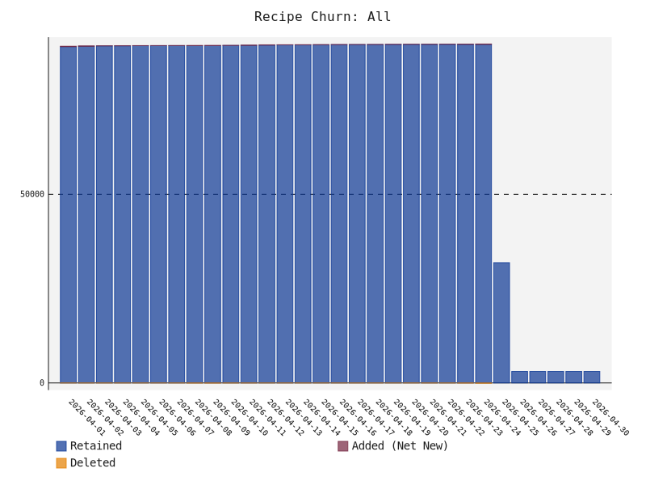

# Chocolatey Radar
A data-driven, automated discovery and ranking engine for the Chocolatey package manager ecosystem on Windows

# Build Status


# 📊 Ecosystem Health
* **Total Unique Recipes**: 2138
* **Ecosystem Auto-Update Health**: 29.96%
* **Ecosystem Reliability**: 100.0% (Sampled URL Health)
* **Official vs. Community**: 1 Official / 2319 Community

* **Stale/Abandoned Sources (> 1 Year)**: 🪦 31

### Ecosystem Growth (All Recipes)
<picture>
  <source media="(prefers-color-scheme: dark)" srcset="growth_all_dark.svg">
  <source media="(prefers-color-scheme: light)" srcset="growth_all_light.svg">
  
</picture>


# 🚀 Getting Started
To add and use any of the repositories listed below, run the appropriate command for your package manager:


```powershell
choco source add -n <source-name> -s <source-url>
choco install <app-name> --source <source-name>
```


# Third party repositories by popularity


## 💎 Hidden Gems
These repositories are actively maintained and feature a high percentage of **unique** applications not found in official repositories. Great for discovering niche tools!

| Repository | Unique Recipes | Total Recipes | Score | Auto-Update |
| :--- | :---: | :---: | :---: | :---: |
| **[mandiant/VM-Packages](directory/mandiant+VM-Packages.md)** | 💎 295 (100.0%) | 📦 295 | ⭐ 1.0 | 🔄 0% |
| **[teknowledgist/Chocolatey-packages](directory/teknowledgist+Chocolatey-packages.md)** | 💎 266 (100.0%) | 📦 266 | ⭐ 1.0 | 🔄 63% |
| **[pauby/ChocoPackages](directory/pauby+ChocoPackages.md)** | 💎 197 (100.0%) | 📦 197 | ⭐ 1.0 | 🔄 59% |
| **[flcdrg/au-packages](directory/flcdrg+au-packages.md)** | 💎 103 (100.0%) | 📦 103 | ⭐ 1.0 | 🔄 56% |
| **[jakublevy/chocopkgs](directory/jakublevy+chocopkgs.md)** | 💎 98 (100.0%) | 📦 98 | ⭐ 1.0 | 🔄 97% |
| **[virtualex-itv/chocolatey-packages](directory/virtualex-itv+chocolatey-packages.md)** | 💎 73 (100.0%) | 📦 73 | ⭐ 1.0 | 🔄 75% |
| **[EpicMorg/chocolatey](directory/EpicMorg+chocolatey.md)** | 💎 57 (100.0%) | 📦 57 | ⭐ 1.0 | 🔄 0% |
| **[Thilas/chocolatey-packages](directory/Thilas+chocolatey-packages.md)** | 💎 32 (100.0%) | 📦 32 | ⭐ 1.0 | 🔄 97% |
| **[strausmann/ChocolateyPackages](directory/strausmann+ChocolateyPackages.md)** | 💎 32 (100.0%) | 📦 32 | ⭐ 1.0 | 🔄 50% |
| **[piraces/chocolatey-packages](directory/piraces+chocolatey-packages.md)** | 💎 18 (100.0%) | 📦 18 | ⭐ 1.0 | 🔄 100% |


## 📦 All Known Sources
A combined list of every source discovered in the ecosystem.

<details>
<summary><b>Click to expand all 77 discovered sources</b></summary>

| Repository | Recipes | Score | Auto-Update | Badges |
| :--- | :---: | :---: | :---: | :--- |
| **[bcurran3/ChocolateyPackages](directory/bcurran3+ChocolateyPackages.md)** | 📦 597 | ⭐ 1.0 | 🔄 1% |  |
| **[mandiant/VM-Packages](directory/mandiant+VM-Packages.md)** | 📦 295 | ⭐ 1.0 | 🔄 0% |  |
| **[teknowledgist/Chocolatey-packages](directory/teknowledgist+Chocolatey-packages.md)** | 📦 266 | ⭐ 1.0 | 🔄 63% |  |
| **[pauby/ChocoPackages](directory/pauby+ChocoPackages.md)** | 📦 197 | ⭐ 1.0 | 🔄 59% |  |
| **[adgellida/chocolateyautomaticpackages](directory/adgellida+chocolateyautomaticpackages.md)** | 📦 153 | ⭐ 1.0 | 🔄 0% |  |
| **[flcdrg/au-packages](directory/flcdrg+au-packages.md)** | 📦 103 | ⭐ 1.0 | 🔄 56% |  |
| **[jakublevy/chocopkgs](directory/jakublevy+chocopkgs.md)** | 📦 98 | ⭐ 1.0 | 🔄 97% |  |
| **[virtualex-itv/chocolatey-packages](directory/virtualex-itv+chocolatey-packages.md)** | 📦 73 | ⭐ 1.0 | 🔄 75% |  |
| **[majkinetor/au-packages](directory/majkinetor+au-packages.md)** | 📦 110 | ⭐ 1.0 | 🔄 50% |  |
| **[EpicMorg/chocolatey](directory/EpicMorg+chocolatey.md)** | 📦 57 | ⭐ 1.0 | 🔄 0% |  |
| **[Thilas/chocolatey-packages](directory/Thilas+chocolatey-packages.md)** | 📦 32 | ⭐ 1.0 | 🔄 97% |  |
| **[strausmann/ChocolateyPackages](directory/strausmann+ChocolateyPackages.md)** | 📦 32 | ⭐ 1.0 | 🔄 50% |  |
| **[piraces/chocolatey-packages](directory/piraces+chocolatey-packages.md)** | 📦 18 | ⭐ 1.0 | 🔄 100% |  |
| **[pascalberger/chocolatey-packages](directory/pascalberger+chocolatey-packages.md)** | 📦 15 | ⭐ 1.0 | 🔄 87% |  |
| **[hoanganhduc/chocolatey](directory/hoanganhduc+chocolatey.md)** | 📦 12 | ⭐ 1.0 | 🔄 0% |  |
| **[naveen521kk/au-packages](directory/naveen521kk+au-packages.md)** | 📦 12 | ⭐ 1.0 | 🔄 83% |  |
| **[C4illin/Choco-Packages](directory/C4illin+Choco-Packages.md)** | 📦 9 | ⭐ 1.0 | 🔄 89% |  |
| **[kai2nenobu/chocolatey-packages](directory/kai2nenobu+chocolatey-packages.md)** | 📦 7 | ⭐ 1.0 | 🔄 100% |  |
| **[kwilliams1987/chocolatey-packages](directory/kwilliams1987+chocolatey-packages.md)** | 📦 7 | ⭐ 1.0 | 🔄 0% |  |
| **[michidk/choco](directory/michidk+choco.md)** | 📦 6 | ⭐ 1.0 | 🔄 100% |  |
| **[pact-foundation/choco](directory/pact-foundation+choco.md)** | 📦 7 | ⭐ 1.0 | 🔄 0% |  |
| **[robertZaufall/chocolatey-packages](directory/robertZaufall+chocolatey-packages.md)** | 📦 5 | ⭐ 1.0 | 🔄 60% |  |
| **[darinegan/chocolatey-packages](directory/darinegan+chocolatey-packages.md)** | 📦 4 | ⭐ 1.0 | 🔄 100% |  |
| **[AJDurant/choco-packages](directory/AJDurant+choco-packages.md)** | 📦 3 | ⭐ 1.0 | 🔄 100% |  |
| **[Takmg/chocolatey](directory/Takmg+chocolatey.md)** | 📦 4 | ⭐ 1.0 | 🔄 50% |  |
| **[DrFaust92/chocolatey-packages](directory/DrFaust92+chocolatey-packages.md)** | 📦 3 | ⭐ 1.0 | 🔄 0% |  |
| **[philiparola/chocolatey-packages](directory/philiparola+chocolatey-packages.md)** | 📦 3 | ⭐ 1.0 | 🔄 0% |  |
| **[tricktux/choco-neovim](directory/tricktux+choco-neovim.md)** | 📦 2 | ⭐ 1.0 | 🔄 0% |  |
| **[streamlink/streamlink-twitch-gui-chocolatey](directory/streamlink+streamlink-twitch-gui-chocolatey.md)** | 📦 2 | ⭐ 1.0 | 🔄 0% |  |
| **[robertZaufall/ChocolateStoreCore](directory/robertZaufall+ChocolateStoreCore.md)** | 📦 2 | ⭐ 1.0 | 🔄 0% |  |
| **[rstudio/tinytex-releases](directory/rstudio+tinytex-releases.md)** | 📦 1 | ⭐ 1.0 | 🔄 0% |  |
| **[open-circle-ltd/chocolatey.microsoft-office-deployment](directory/open-circle-ltd+chocolatey.microsoft-office-deployment.md)** | 📦 1 | ⭐ 1.0 | 🔄 0% |  |
| **[jufab/jenkins-x-chocolatey](directory/jufab+jenkins-x-chocolatey.md)** | 📦 1 | ⭐ 1.0 | 🔄 0% |  |
| **[brogers5/chocolatey-package-controlmymonitor](directory/brogers5+chocolatey-package-controlmymonitor.md)** | 📦 1 | ⭐ 1.0 | 🔄 100% |  |
| **[streamlink/streamlink-chocolatey](directory/streamlink+streamlink-chocolatey.md)** | 📦 1 | ⭐ 1.0 | 🔄 0% |  |
| **[LogtalkDotOrg/chocolatey-packages](directory/LogtalkDotOrg+chocolatey-packages.md)** | 📦 1 | ⭐ 1.0 | 🔄 0% |  |
| **[sacloud/chocolatey-usacloud](directory/sacloud+chocolatey-usacloud.md)** | 📦 1 | ⭐ 1.0 | 🔄 0% |  |
| **[sacloud/chocolatey-docker-machine-sakuracloud](directory/sacloud+chocolatey-docker-machine-sakuracloud.md)** | 📦 1 | ⭐ 1.0 | 🔄 0% |  |
| **[sacloud/chocolatey-terraform-provider-sakuracloud](directory/sacloud+chocolatey-terraform-provider-sakuracloud.md)** | 📦 1 | ⭐ 1.0 | 🔄 0% |  |
| **[open-circle-ltd/chocolatey.wwphone-cti](directory/open-circle-ltd+chocolatey.wwphone-cti.md)** | 📦 1 | ⭐ 1.0 | 🔄 0% |  |
| **[treeverse/chocolatey-dvc](directory/treeverse+chocolatey-dvc.md)** | 📦 1 | ⭐ 1.0 | 🔄 0% |  |
| **[brogers5/chocolatey-package-ps-remote-play](directory/brogers5+chocolatey-package-ps-remote-play.md)** | 📦 1 | ⭐ 1.0 | 🔄 100% |  |
| **[chocolatey-community/chocolatey-hooks](directory/chocolatey-community+chocolatey-hooks.md)** | 📦 1 | ⭐ 1.0 | 🔄 0% | 👑 Official |
| **[AJDurant/choco-docker-engine](directory/AJDurant+choco-docker-engine.md)** | 📦 1 | ⭐ 1.0 | 🔄 0% |  |
| **[tailscale/tailscale-chocolatey](directory/tailscale+tailscale-chocolatey.md)** | 📦 1 | ⭐ 1.0 | 🔄 0% |  |
| **[brogers5/chocolatey-package-openrgb](directory/brogers5+chocolatey-package-openrgb.md)** | 📦 1 | ⭐ 1.0 | 🔄 100% |  |
| **[brogers5/chocolatey-package-twinkle-tray](directory/brogers5+chocolatey-package-twinkle-tray.md)** | 📦 1 | ⭐ 1.0 | 🔄 100% |  |
| **[blaiz2023/Blaiz-Tools](directory/blaiz2023+Blaiz-Tools.md)** | 📦 1 | ⭐ 1.0 | 🔄 0% |  |
| **[agabrys/chocolatey-packages](directory/agabrys+chocolatey-packages.md)** | 📦 13 | ⭐ 1.0 | 🔄 0% |  |
| **[brogers5/chocolatey-package-vivetool](directory/brogers5+chocolatey-package-vivetool.md)** | 📦 1 | ⭐ 1.0 | 🔄 100% |  |
| **[brogers5/chocolatey-package-localsend.install](directory/brogers5+chocolatey-package-localsend.install.md)** | 📦 1 | ⭐ 1.0 | 🔄 100% |  |
| **[giseongeom/chocolatey-packages](directory/giseongeom+chocolatey-packages.md)** | 📦 13 | ⭐ 1.0 | 🔄 0% |  |
| **[ark0f/choco-ryujinx](directory/ark0f+choco-ryujinx.md)** | 📦 1 | ⭐ 1.0 | 🔄 100% |  |
| **[JourneyOver/chocolatey-packages](directory/JourneyOver+chocolatey-packages.md)** | 📦 34 | ⭐ 1.0 | 🔄 0% |  |
| **[simeononsecurity/chocolateypackages](directory/simeononsecurity+chocolateypackages.md)** | 📦 9 | ⭐ 1.0 | 🔄 22% |  |
| **[echizenryoma/Chocolatey-Package](directory/echizenryoma+Chocolatey-Package.md)** | 📦 3 | ⭐ 1.0 | 🔄 100% |  |
| **[Kristinita/SashaChocolatey](directory/Kristinita+SashaChocolatey.md)** | 📦 37 | ⭐ 1.0 | 🔄 0% |  |
| **[HaxeFoundation/haxe-choco](directory/HaxeFoundation+haxe-choco.md)** | 📦 2 | ⭐ 1.0 | 🔄 0% |  |
| **[Mahagon/chocolatey-packages](directory/Mahagon+chocolatey-packages.md)** | 📦 1 | ⭐ 1.0 | 🔄 0% |  |
| **[open-circle-ltd/chocolatey.adobe-acrobat-reader-dc](directory/open-circle-ltd+chocolatey.adobe-acrobat-reader-dc.md)** | 📦 1 | ⭐ 1.0 | 🔄 100% |  |
| **[open-circle-ltd/chocolatey.adobe-creative-cloud](directory/open-circle-ltd+chocolatey.adobe-creative-cloud.md)** | 📦 1 | ⭐ 1.0 | 🔄 0% |  |
| **[open-circle-ltd/chocolatey.jabra-direct](directory/open-circle-ltd+chocolatey.jabra-direct.md)** | 📦 1 | ⭐ 1.0 | 🔄 0% |  |
| **[dariusz-wozniak/Chocolatey-Packages](directory/dariusz-wozniak+Chocolatey-Packages.md)** | 📦 9 | ⭐ 1.0 | 🔄 0% |  |
| **[dittodhole/chocolatey-superorca](directory/dittodhole+chocolatey-superorca.md)** | 📦 1 | ⭐ 1.0 | 🔄 0% |  |
| **[C-Duv/chocolatey-fusioninventory-agent](directory/C-Duv+chocolatey-fusioninventory-agent.md)** | 📦 3 | ⭐ 1.0 | 🔄 0% |  |
| **[majkinetor/au](directory/majkinetor+au.md)** | 📦 3 | ⭐ 1.0 | 🔄 67% |  |
| **[aminya/chocolatey-wabt](directory/aminya+chocolatey-wabt.md)** | 📦 1 | ⭐ 1.0 | 🔄 0% |  |
| **[marcinbojko/forticlient](directory/marcinbojko+forticlient.md)** | 📦 1 | ⭐ 1.0 | 🔄 0% |  |
| **[Cossey/chocopackages](directory/Cossey+chocopackages.md)** | 📦 1 | ⭐ 1.0 | 🔄 0% |  |
| **[devkitspaces/boxstarter-workspace](directory/devkitspaces+boxstarter-workspace.md)** | 📦 4 | ⭐ 1.0 | 🔄 0% |  |
| **[kujotx/chocolatey-packages](directory/kujotx+chocolatey-packages.md)** | 📦 2 | ⭐ 1.0 | 🔄 0% |  |
| **[JamieMagee/chocolatey-packages](directory/JamieMagee+chocolatey-packages.md)** | 📦 9 | ⭐ 1.0 | 🔄 100% |  |
| **[flcdrg/chocolatey-dellcommandupdate](directory/flcdrg+chocolatey-dellcommandupdate.md)** | 📦 1 | ⭐ 1.0 | 🔄 0% |  |
| **[nhos-project/choco-nhs_gemalto-middleware](directory/nhos-project+choco-nhs_gemalto-middleware.md)** | 📦 1 | ⭐ 1.0 | 🔄 0% |  |
| **[TobseF/jce-chocolatey-package](directory/TobseF+jce-chocolatey-package.md)** | 📦 1 | ⭐ 1.0 | 🔄 0% |  |
| **[JetBrains/Chocolatey](directory/JetBrains+Chocolatey.md)** | 📦 2 | ⭐ 1.0 | 🔄 0% |  |
| **[trajano/choco-packages](directory/trajano+choco-packages.md)** | 📦 11 | ⭐ 1.0 | 🔄 0% |  |

</details>

# 🛠️ Operational Health (Crawler Metrics)
* **Total Crawler Runs**: 6
* **Total Repo Updates**: 360
* **Ecosystem Growth (Since Last Run)**:
  * 🪣 +35 Repositories
  * 📦 +126 Recipes
* **Eviction Count**: 🗑️ 0
* **API Rate Limit Retries**: ⏳ 0
* **Cache Size**: 💾 0.35 MB
* **Pipeline Times (Last Run)**:
  * 🔍 Discovery: 0.19s
  * 📥 Update: 0.30s
* **Cumulative Compute Time**: 0.4 minutes
