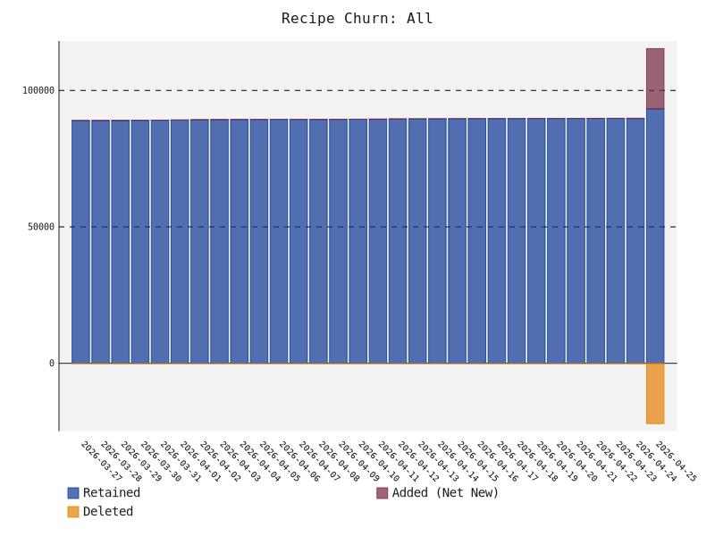
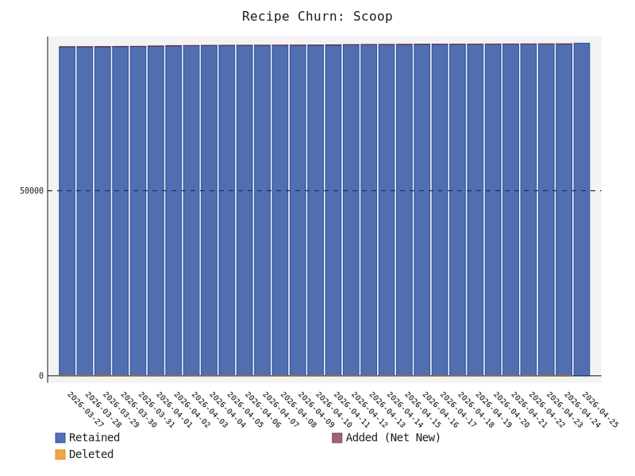
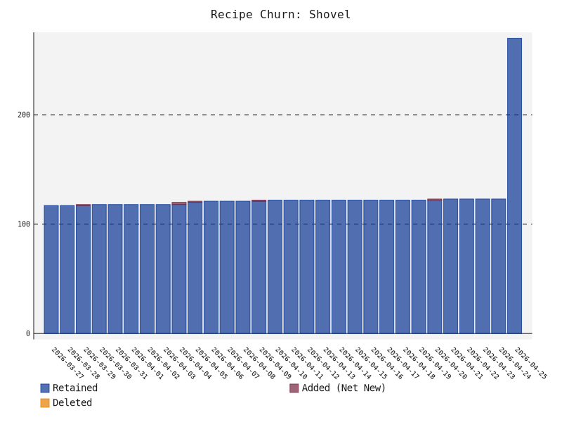

# scoop-radar
A data-driven, automated discovery and ranking engine for the Scoop package manager ecosystem on Windows

# Build Status


# Acknowledgements
This project was heavily inspired by the original `awesome-scoop` directories maintained by [algomaniac](https://github.com/algomaniac) and [tapannallan](https://github.com/tapannallan).

# 📊 Ecosystem Health
* **Total Unique Recipes**: 27451
* **Ecosystem Auto-Update Health**: 85.99%
* **Ecosystem Reliability**: 89.9% (Sampled URL Health)
* **Official vs. Community**: 33024 Official / 56088 Community
* **Bucket Ecosystem**: 481 Scoop / 10 Shovel
* **Bucket Graveyard (Stale > 1 Year)**: 🪦 135

### Ecosystem Growth (All Recipes)
<picture>
  <source media="(prefers-color-scheme: dark)" srcset="growth_all_dark.svg">
  <source media="(prefers-color-scheme: light)" srcset="growth_all_light.svg">
  
</picture>

### Scoop vs Shovel Growth
<p align="center">
  <picture>
    <source media="(prefers-color-scheme: dark)" srcset="growth_scoop_dark.svg">
    <source media="(prefers-color-scheme: light)" srcset="growth_scoop_light.svg">
    
  </picture>
  <picture>
    <source media="(prefers-color-scheme: dark)" srcset="growth_shovel_dark.svg">
    <source media="(prefers-color-scheme: light)" srcset="growth_shovel_light.svg">
    
  </picture>
</p>

# 🚀 Getting Started
To add and use any of the buckets listed below, simply run the following command in your terminal:
```powershell
scoop bucket add <bucket-name> <bucket-url>
```
For example, to add a specific bucket, find its URL from the list below and run:
```powershell
scoop bucket add my-awesome-bucket https://github.com/user/my-awesome-bucket
```
After adding the bucket, you can install any of its applications like this:
```powershell
scoop install my-awesome-bucket/<app-name>
```

# Third party buckets by popularity


## 💎 Hidden Gems
These buckets are actively maintained and feature a high percentage of **unique** applications not found in official repositories. Great for discovering niche tools!


### [AntonOks/scoop-aoks](https://github.com/AntonOks/scoop-aoks)
*   **Unique Recipes:** 241 (100.0% unique)
*   **Total Recipes:** 241

### [davidxuang/scoop-type](https://github.com/davidxuang/scoop-type)
*   **Unique Recipes:** 113 (100.0% unique)
*   **Total Recipes:** 113

### [suquiya/suquiya_bucket](https://github.com/suquiya/suquiya_bucket)
*   **Unique Recipes:** 47 (100.0% unique)
*   **Total Recipes:** 47

### [Scoopforge/Extras-Plus](https://github.com/Scoopforge/Extras-Plus)
*   **Unique Recipes:** 45 (100.0% unique)
*   **Total Recipes:** 45

### [matracey/scoop-bucket](https://github.com/matracey/scoop-bucket)
*   **Unique Recipes:** 44 (100.0% unique)
*   **Total Recipes:** 44

### [asimov-platform/scoop-bucket](https://github.com/asimov-platform/scoop-bucket)
*   **Unique Recipes:** 33 (100.0% unique)
*   **Total Recipes:** 33

### [ppyv/scoop-jp-fonts](https://github.com/ppyv/scoop-jp-fonts)
*   **Unique Recipes:** 33 (100.0% unique)
*   **Total Recipes:** 33

### [icecreamZeng/scoop-bucket](https://github.com/icecreamZeng/scoop-bucket)
*   **Unique Recipes:** 29 (100.0% unique)
*   **Total Recipes:** 29

### [littleli/scoop-clojure](https://github.com/littleli/scoop-clojure)
*   **Unique Recipes:** 27 (100.0% unique)
*   **Total Recipes:** 27

### [TheRandomLabs/Scoop-Python](https://github.com/TheRandomLabs/Scoop-Python)
*   **Unique Recipes:** 25 (100.0% unique)
*   **Total Recipes:** 25


## 🥄 Scoop Compatible Buckets
These buckets are fully compatible with Scoop (and Shovel). They contain standard JSON manifests.

<details>
<summary><b>Click to expand 481 Scoop buckets</b></summary>

| Repository | Recipes | Score | Auto-Update | Badges |
| :--- | :---: | :---: | :---: | :--- |
| **[anderlli0053/DEV-tools](directory/anderlli0053+DEV-tools.md)** | 📦 23621 | ⭐ 1.0 | 🔄 83% |  |
| **[cmontage/scoopbucket-third](directory/cmontage+scoopbucket-third.md)** | 📦 13731 | ⭐ 1.0 | 🔄 87% |  |
| **[kkzzhizhou/scoop-apps](directory/kkzzhizhou+scoop-apps.md)** | 📦 13531 | ⭐ 1.0 | 🔄 87% |  |
| **[lzwme/scoop-proxy-cn](directory/lzwme+scoop-proxy-cn.md)** | 📦 10673 | ⭐ 1.0 | 🔄 86% |  |
| **[hoilc/scoop-lemon](directory/hoilc+scoop-lemon.md)** | 📦 2520 | ⭐ 1.0 | 🔄 95% |  |
| **[duzyn/scoop-cn](directory/duzyn+scoop-cn.md)** | 📦 6337 | ⭐ 1.0 | 🔄 85% |  |
| **[DoveBoy/Apps](directory/DoveBoy+Apps.md)** | 📦 811 | ⭐ 1.0 | 🔄 100% |  |
| **[Calinou/scoop-games](directory/Calinou+scoop-games.md)** | 📦 398 | ⭐ 1.0 | 🔄 92% | ⭐ Known Scoop<br>⭐ Known Shovel |
| **[matthewjberger/scoop-nerd-fonts](directory/matthewjberger+scoop-nerd-fonts.md)** | 📦 366 | ⭐ 1.0 | 🔄 92% | ⭐ Known Scoop<br>⭐ Known Shovel |
| **[xrgzs/sdoog](directory/xrgzs+sdoog.md)** | 📦 342 | ⭐ 1.0 | 🔄 93% |  |
| **[wwvl/Scoop-Cursor](directory/wwvl+Scoop-Cursor.md)** | 📦 288 | ⭐ 1.0 | 🔄 0% |  |
| **[arch3rPro/PST-Bucket](directory/arch3rPro+PST-Bucket.md)** | 📦 260 | ⭐ 1.0 | 🔄 93% |  |
| **[AntonOks/scoop-aoks](directory/AntonOks+scoop-aoks.md)** | 📦 241 | ⭐ 1.0 | 🔄 99% |  |
| **[chawyehsu/dorado](directory/chawyehsu+dorado.md)** | 📦 271 | ⭐ 1.0 | 🔄 94% |  |
| **[aliesbelik/poldi](directory/aliesbelik+poldi.md)** | 📦 220 | ⭐ 1.0 | 🔄 100% |  |
| **[gdm257/scoop-257](directory/gdm257+scoop-257.md)** | 📦 192 | ⭐ 1.0 | 🔄 90% |  |
| **[brian6932/dank-scoop](directory/brian6932+dank-scoop.md)** | 📦 183 | ⭐ 1.0 | 🔄 97% |  |
| **[Jadeiin/scoop](directory/Jadeiin+scoop.md)** | 📦 190 | ⭐ 1.0 | 🔄 99% |  |
| **[KnotUntied/scoop-fonts](directory/KnotUntied+scoop-fonts.md)** | 📦 161 | ⭐ 1.0 | 🔄 67% |  |
| **[ACooper81/scoop-apps](directory/ACooper81+scoop-apps.md)** | 📦 152 | ⭐ 1.0 | 🔄 94% |  |
| **[ViCrack/scoop-bucket](directory/ViCrack+scoop-bucket.md)** | 📦 148 | ⭐ 1.0 | 🔄 99% |  |
| **[hu3rror/scoop-muggle](directory/hu3rror+scoop-muggle.md)** | 📦 164 | ⭐ 1.0 | 🔄 82% |  |
| **[davidxuang/scoop-type](directory/davidxuang+scoop-type.md)** | 📦 113 | ⭐ 1.0 | 🔄 100% |  |
| **[tldrw/scoop-security](directory/tldrw+scoop-security.md)** | 📦 119 | ⭐ 1.0 | 🔄 97% |  |
| **[amorphobia/siku](directory/amorphobia+siku.md)** | 📦 100 | ⭐ 1.0 | 🔄 95% |  |
| **[batkiz/backit](directory/batkiz+backit.md)** | 📦 146 | ⭐ 1.0 | 🔄 99% |  |
| **[Scoopforge/Extras-CN](directory/Scoopforge+Extras-CN.md)** | 📦 89 | ⭐ 1.0 | 🔄 97% |  |
| **[cesaryuan/scoop-cesar](directory/cesaryuan+scoop-cesar.md)** | 📦 92 | ⭐ 1.0 | 🔄 82% |  |
| **[babo4d/scoop-xrtools](directory/babo4d+scoop-xrtools.md)** | 📦 78 | ⭐ 1.0 | 🔄 95% |  |
| **[akirco/aki-apps](directory/akirco+aki-apps.md)** | 📦 302 | ⭐ 1.0 | 🔄 86% |  |
| **[niheaven/scoop-sysinternals](directory/niheaven+scoop-sysinternals.md)** | 📦 75 | ⭐ 1.0 | 🔄 100% | ⭐ Known Scoop |
| **[Donaldduck8/malware-analysis-bucket](directory/Donaldduck8+malware-analysis-bucket.md)** | 📦 80 | ⭐ 1.0 | 🔄 69% |  |
| **[Capella87/capella-bucket](directory/Capella87+capella-bucket.md)** | 📦 119 | ⭐ 1.0 | 🔄 96% |  |
| **[kengwang/scoop-ctftools-bucket](directory/kengwang+scoop-ctftools-bucket.md)** | 📦 77 | ⭐ 1.0 | 🔄 99% |  |
| **[KnotUntied/scoop-knotuntied](directory/KnotUntied+scoop-knotuntied.md)** | 📦 77 | ⭐ 1.0 | 🔄 82% |  |
| **[rasa/scoops](directory/rasa+scoops.md)** | 📦 78 | ⭐ 1.0 | 🔄 71% |  |
| **[WantChane/doge_bucket](directory/WantChane+doge_bucket.md)** | 📦 88 | ⭐ 1.0 | 🔄 99% |  |
| **[zeldrisho/scoop-bucket](directory/zeldrisho+scoop-bucket.md)** | 📦 106 | ⭐ 1.0 | 🔄 97% |  |
| **[404NetworkError/scoop-bucket](directory/404NetworkError+scoop-bucket.md)** | 📦 81 | ⭐ 1.0 | 🔄 96% |  |
| **[huxiaoning/scoop_bucket](directory/huxiaoning+scoop_bucket.md)** | 📦 70 | ⭐ 1.0 | 🔄 83% |  |
| **[ZhangTianrong/scoop-bucket](directory/ZhangTianrong+scoop-bucket.md)** | 📦 82 | ⭐ 1.0 | 🔄 93% |  |
| **[Velgus/Scoop-Portapps](directory/Velgus+Scoop-Portapps.md)** | 📦 61 | ⭐ 1.0 | 🔄 100% |  |
| **[cc713/ownscoop](directory/cc713+ownscoop.md)** | 📦 76 | ⭐ 1.0 | 🔄 100% |  |
| **[HUMORCE/nuke](directory/HUMORCE+nuke.md)** | 📦 90 | ⭐ 1.0 | 🔄 79% |  |
| **[hymkor/scoop-bucket](directory/hymkor+scoop-bucket.md)** | 📦 57 | ⭐ 1.0 | 🔄 100% |  |
| **[li-ruijie/scoop](directory/li-ruijie+scoop.md)** | 📦 59 | ⭐ 1.0 | 🔄 100% |  |
| **[seumsc/scoop-seu](directory/seumsc+scoop-seu.md)** | 📦 57 | ⭐ 1.0 | 🔄 95% |  |
| **[abgox/abgo_bucket](directory/abgox+abgo_bucket.md)** | 📦 166 | ⭐ 1.0 | 🔄 99% |  |
| **[mvrpl/windows-apps](directory/mvrpl+windows-apps.md)** | 📦 53 | ⭐ 1.0 | 🔄 94% |  |
| **[qwerty12/scoop-alts](directory/qwerty12+scoop-alts.md)** | 📦 60 | ⭐ 1.0 | 🔄 78% |  |
| **[suquiya/suquiya_bucket](directory/suquiya+suquiya_bucket.md)** | 📦 47 | ⭐ 1.0 | 🔄 96% |  |
| **[milnak/scoop-bucket](directory/milnak+scoop-bucket.md)** | 📦 52 | ⭐ 1.0 | 🔄 98% |  |
| **[jonz94/scoop-sarasa-nerd-fonts](directory/jonz94+scoop-sarasa-nerd-fonts.md)** | 📦 49 | ⭐ 1.0 | 🔄 100% |  |
| **[Scoopforge/Extras-Plus](directory/Scoopforge+Extras-Plus.md)** | 📦 45 | ⭐ 1.0 | 🔄 100% |  |
| **[cderv/r-bucket](directory/cderv+r-bucket.md)** | 📦 54 | ⭐ 1.0 | 🔄 94% |  |
| **[nateify/scoop-nateify](directory/nateify+scoop-nateify.md)** | 📦 46 | ⭐ 1.0 | 🔄 96% |  |
| **[issaclin32/scoop-bucket](directory/issaclin32+scoop-bucket.md)** | 📦 44 | ⭐ 1.0 | 🔄 68% |  |
| **[Paxxs/Cluttered-bucket](directory/Paxxs+Cluttered-bucket.md)** | 📦 46 | ⭐ 1.0 | 🔄 91% |  |
| **[beer-psi/scoop-bucket](directory/beer-psi+scoop-bucket.md)** | 📦 51 | ⭐ 1.0 | 🔄 80% |  |
| **[Spiraster/scoop-bucket](directory/Spiraster+scoop-bucket.md)** | 📦 41 | ⭐ 1.0 | 🔄 93% |  |
| **[zhoujin7/tomato](directory/zhoujin7+tomato.md)** | 📦 52 | ⭐ 1.0 | 🔄 85% |  |
| **[LaelLuo/scoop](directory/LaelLuo+scoop.md)** | 📦 52 | ⭐ 1.0 | 🔄 100% |  |
| **[windedge/ladle-bucket](directory/windedge+ladle-bucket.md)** | 📦 49 | ⭐ 1.0 | 🔄 100% |  |
| **[jat001/scoop-ox](directory/jat001+scoop-ox.md)** | 📦 38 | ⭐ 1.0 | 🔄 100% |  |
| **[tomcdj71/scoop-essential-apps](directory/tomcdj71+scoop-essential-apps.md)** | 📦 113 | ⭐ 1.0 | 🔄 97% |  |
| **[matracey/scoop-bucket](directory/matracey+scoop-bucket.md)** | 📦 44 | ⭐ 1.0 | 🔄 100% |  |
| **[huangnauh/carrot](directory/huangnauh+carrot.md)** | 📦 113 | ⭐ 1.0 | 🔄 99% |  |
| **[Lutra-Fs/scoop-bucket](directory/Lutra-Fs+scoop-bucket.md)** | 📦 38 | ⭐ 1.0 | 🔄 95% |  |
| **[p8rdev/scoop-portableapps](directory/p8rdev+scoop-portableapps.md)** | 📦 440 | ⭐ 1.0 | 🔄 100% |  |
| **[magicedy/scoop-bucket-m](directory/magicedy+scoop-bucket-m.md)** | 📦 107 | ⭐ 1.0 | 🔄 91% |  |
| **[mslxl/ScoopIt](directory/mslxl+ScoopIt.md)** | 📦 36 | ⭐ 1.0 | 🔄 92% |  |
| **[niceEli/Pail](directory/niceEli+Pail.md)** | 📦 41 | ⭐ 1.0 | 🔄 93% |  |
| **[iquiw/scoop-bucket](directory/iquiw+scoop-bucket.md)** | 📦 35 | ⭐ 1.0 | 🔄 100% |  |
| **[maoyeedy/Scoop](directory/maoyeedy+Scoop.md)** | 📦 35 | ⭐ 1.0 | 🔄 94% |  |
| **[Locietta/sniffer](directory/Locietta+sniffer.md)** | 📦 42 | ⭐ 1.0 | 🔄 100% |  |
| **[Strappazzon/scoop](directory/Strappazzon+scoop.md)** | 📦 36 | ⭐ 1.0 | 🔄 100% |  |
| **[asimov-platform/scoop-bucket](directory/asimov-platform+scoop-bucket.md)** | 📦 33 | ⭐ 1.0 | 🔄 100% |  |
| **[apeiraco/scoop-bucket](directory/apeiraco+scoop-bucket.md)** | 📦 46 | ⭐ 1.0 | 🔄 96% |  |
| **[AkariiinMKII/Scoop4kariiin](directory/AkariiinMKII+Scoop4kariiin.md)** | 📦 33 | ⭐ 1.0 | 🔄 73% |  |
| **[MagicalDrizzle/scoop-personal](directory/MagicalDrizzle+scoop-personal.md)** | 📦 33 | ⭐ 1.0 | 🔄 79% |  |
| **[ppyv/scoop-jp-fonts](directory/ppyv+scoop-jp-fonts.md)** | 📦 33 | ⭐ 1.0 | 🔄 100% |  |
| **[ScoopInstaller/Extras](directory/ScoopInstaller+Extras.md)** | 📦 2300 | ⭐ 1.0 | 🔄 92% | 👑 Official Scoop<br>⭐ Known Shovel |
| **[TianXiaTech/scoop-txt](directory/TianXiaTech+scoop-txt.md)** | 📦 40 | ⭐ 1.0 | 🔄 90% |  |
| **[lewis-yeung/scoop-bucket](directory/lewis-yeung+scoop-bucket.md)** | 📦 85 | ⭐ 1.0 | 🔄 86% |  |
| **[Jastmaskerrr/Rojem-Scoop](directory/Jastmaskerrr+Rojem-Scoop.md)** | 📦 41 | ⭐ 1.0 | 🔄 95% |  |
| **[natecohen/scoop-av](directory/natecohen+scoop-av.md)** | 📦 33 | ⭐ 1.0 | 🔄 79% |  |
| **[nicerloop/scoop-nicerloop](directory/nicerloop+scoop-nicerloop.md)** | 📦 32 | ⭐ 1.0 | 🔄 62% |  |
| **[ScoopInstaller/Main](directory/ScoopInstaller+Main.md)** | 📦 1506 | ⭐ 1.0 | 🔄 94% | 👑 Official Scoop<br>⭐ Known Shovel |
| **[icecreamZeng/scoop-bucket](directory/icecreamZeng+scoop-bucket.md)** | 📦 29 | ⭐ 1.0 | 🔄 66% |  |
| **[filip2cz/scoop-retro](directory/filip2cz+scoop-retro.md)** | 📦 47 | ⭐ 1.0 | 🔄 2% |  |
| **[NSPC911/le-bucket](directory/NSPC911+le-bucket.md)** | 📦 37 | ⭐ 1.0 | 🔄 97% |  |
| **[Scoopforge/Main-Plus](directory/Scoopforge+Main-Plus.md)** | 📦 30 | ⭐ 1.0 | 🔄 100% |  |
| **[joaoricarte/jr-bucket](directory/joaoricarte+jr-bucket.md)** | 📦 44 | ⭐ 1.0 | 🔄 95% |  |
| **[Zevan770/scoop_zev](directory/Zevan770+scoop_zev.md)** | 📦 32 | ⭐ 1.0 | 🔄 91% |  |
| **[notPlancha/bucket](directory/notPlancha+bucket.md)** | 📦 29 | ⭐ 1.0 | 🔄 100% |  |
| **[cmontage/scoopbucket-soup](directory/cmontage+scoopbucket-soup.md)** | 📦 28 | ⭐ 1.0 | 🔄 100% |  |
| **[ptbwu/dango](directory/ptbwu+dango.md)** | 📦 141 | ⭐ 1.0 | 🔄 89% |  |
| **[raisercostin/raiser-scoop-bucket](directory/raisercostin+raiser-scoop-bucket.md)** | 📦 34 | ⭐ 1.0 | 🔄 76% |  |
| **[jfut/scoop-jfut](directory/jfut+scoop-jfut.md)** | 📦 33 | ⭐ 1.0 | 🔄 94% |  |
| **[janlindblom/scoops](directory/janlindblom+scoops.md)** | 📦 33 | ⭐ 1.0 | 🔄 58% |  |
| **[kkzzhizhou/scoop-zapps](directory/kkzzhizhou+scoop-zapps.md)** | 📦 34 | ⭐ 1.0 | 🔄 94% |  |
| **[TheRandomLabs/Scoop-Python](directory/TheRandomLabs+Scoop-Python.md)** | 📦 25 | ⭐ 1.0 | 🔄 100% |  |
| **[wzv5/ScoopBucket](directory/wzv5+ScoopBucket.md)** | 📦 34 | ⭐ 1.0 | 🔄 97% |  |
| **[ScoopInstaller/Versions](directory/ScoopInstaller+Versions.md)** | 📦 571 | ⭐ 1.0 | 🔄 74% | 👑 Official Scoop<br>⭐ Known Shovel |
| **[NSIS-Dev/scoop-nsis](directory/NSIS-Dev+scoop-nsis.md)** | 📦 70 | ⭐ 1.0 | 🔄 100% |  |
| **[tac091/scoop-multi](directory/tac091+scoop-multi.md)** | 📦 31 | ⭐ 1.0 | 🔄 87% |  |
| **[tomcdj71/scoop-dev-apps](directory/tomcdj71+scoop-dev-apps.md)** | 📦 146 | ⭐ 1.0 | 🔄 88% |  |
| **[souhaiebtar/scoop-apps](directory/souhaiebtar+scoop-apps.md)** | 📦 86 | ⭐ 1.0 | 🔄 93% |  |
| **[ScoopInstaller/PHP](directory/ScoopInstaller+PHP.md)** | 📦 391 | ⭐ 1.0 | 🔄 4% | 👑 Official Scoop<br>⭐ Known Shovel |
| **[Bergbok/Scoop-Bucket](directory/Bergbok+Scoop-Bucket.md)** | 📦 28 | ⭐ 1.0 | 🔄 68% |  |
| **[strxnge-effects/scoopert](directory/strxnge-effects+scoopert.md)** | 📦 21 | ⭐ 1.0 | 🔄 71% |  |
| **[borger/scoop-galaxy-integrations](directory/borger+scoop-galaxy-integrations.md)** | 📦 21 | ⭐ 1.0 | 🔄 100% |  |
| **[se35710/scoop-redhat](directory/se35710+scoop-redhat.md)** | 📦 22 | ⭐ 1.0 | 🔄 100% |  |
| **[yurical/scoop-mint](directory/yurical+scoop-mint.md)** | 📦 29 | ⭐ 1.0 | 🔄 97% |  |
| **[ScoopInstaller/Java](directory/ScoopInstaller+Java.md)** | 📦 329 | ⭐ 1.0 | 🔄 86% | 👑 Official Scoop<br>⭐ Known Shovel |
| **[noql-net/scoop](directory/noql-net+scoop.md)** | 📦 28 | ⭐ 1.0 | 🔄 100% |  |
| **[Rinkerbel/scooped](directory/Rinkerbel+scooped.md)** | 📦 20 | ⭐ 1.0 | 🔄 100% |  |
| **[ScoopInstaller/Nirsoft](directory/ScoopInstaller+Nirsoft.md)** | 📦 290 | ⭐ 1.0 | 🔄 100% | 👑 Official Scoop |
| **[jbwfu/scoop-bucket](directory/jbwfu+scoop-bucket.md)** | 📦 38 | ⭐ 1.0 | 🔄 97% |  |
| **[jonisb/Misc-scoops](directory/jonisb+Misc-scoops.md)** | 📦 23 | ⭐ 1.0 | 🔄 100% |  |
| **[leic4u/Scoop-Store](directory/leic4u+Scoop-Store.md)** | 📦 38 | ⭐ 1.0 | 🔄 97% |  |
| **[phnthnhnm/Scoop](directory/phnthnhnm+Scoop.md)** | 📦 19 | ⭐ 1.0 | 🔄 100% |  |
| **[younger-1/scoop-it](directory/younger-1+scoop-it.md)** | 📦 24 | ⭐ 1.0 | 🔄 92% |  |
| **[danalec/scoop-alts](directory/danalec+scoop-alts.md)** | 📦 18 | ⭐ 1.0 | 🔄 89% |  |
| **[amano41/scoop-bucket](directory/amano41+scoop-bucket.md)** | 📦 27 | ⭐ 1.0 | 🔄 96% |  |
| **[KO6FCH/scoop-ham](directory/KO6FCH+scoop-ham.md)** | 📦 20 | ⭐ 1.0 | 🔄 100% |  |
| **[touhoured/ScoopBucket](directory/touhoured+ScoopBucket.md)** | 📦 17 | ⭐ 1.0 | 🔄 94% |  |
| **[plutotree/scoop-bucket](directory/plutotree+scoop-bucket.md)** | 📦 18 | ⭐ 1.0 | 🔄 100% |  |
| **[ScoopInstaller/Nonportable](directory/ScoopInstaller+Nonportable.md)** | 📦 131 | ⭐ 1.0 | 🔄 88% | 👑 Official Scoop |
| **[TheCjw/scoop-retools](directory/TheCjw+scoop-retools.md)** | 📦 19 | ⭐ 1.0 | 🔄 79% |  |
| **[bodrick/scoop-bucket](directory/bodrick+scoop-bucket.md)** | 📦 20 | ⭐ 1.0 | 🔄 100% |  |
| **[nikkoura/scoop-bucket-elitedangerous](directory/nikkoura+scoop-bucket-elitedangerous.md)** | 📦 15 | ⭐ 1.0 | 🔄 100% |  |
| **[prettycation/margin](directory/prettycation+margin.md)** | 📦 15 | ⭐ 1.0 | 🔄 93% |  |
| **[typst-community/scoop-bucket](directory/typst-community+scoop-bucket.md)** | 📦 17 | ⭐ 1.0 | 🔄 100% |  |
| **[bobo2334/scoop-bucket](directory/bobo2334+scoop-bucket.md)** | 📦 19 | ⭐ 1.0 | 🔄 95% |  |
| **[hmerritt/scoop-bucket](directory/hmerritt+scoop-bucket.md)** | 📦 15 | ⭐ 1.0 | 🔄 93% |  |
| **[ypxun/scoop_bucket](directory/ypxun+scoop_bucket.md)** | 📦 41 | ⭐ 1.0 | 🔄 100% |  |
| **[kanami09/Scoop-xPack](directory/kanami09+Scoop-xPack.md)** | 📦 14 | ⭐ 1.0 | 🔄 57% |  |
| **[haomingz/scoop-bucket](directory/haomingz+scoop-bucket.md)** | 📦 14 | ⭐ 1.0 | 🔄 100% |  |
| **[Snowflyt/snowforge](directory/Snowflyt+snowforge.md)** | 📦 15 | ⭐ 1.0 | 🔄 93% |  |
| **[sbklb1/scoop-bucket](directory/sbklb1+scoop-bucket.md)** | 📦 13 | ⭐ 1.0 | 🔄 77% |  |
| **[wanstarge/scoopx](directory/wanstarge+scoopx.md)** | 📦 42 | ⭐ 1.0 | 🔄 93% |  |
| **[Hayxi/Soap](directory/Hayxi+Soap.md)** | 📦 24 | ⭐ 1.0 | 🔄 96% |  |
| **[Edenwize/scoop-apps](directory/Edenwize+scoop-apps.md)** | 📦 13 | ⭐ 1.0 | 🔄 46% |  |
| **[MoonWX/scoop_bucket](directory/MoonWX+scoop_bucket.md)** | 📦 17 | ⭐ 1.0 | 🔄 100% |  |
| **[NECOtype/dip](directory/NECOtype+dip.md)** | 📦 12 | ⭐ 1.0 | 🔄 100% |  |
| **[WenSimEHRP/OpenTTD-bucket](directory/WenSimEHRP+OpenTTD-bucket.md)** | 📦 12 | ⭐ 1.0 | 🔄 75% |  |
| **[bughug/scoop](directory/bughug+scoop.md)** | 📦 15 | ⭐ 1.0 | 🔄 100% |  |
| **[santarl/scoop_bucket](directory/santarl+scoop_bucket.md)** | 📦 14 | ⭐ 1.0 | 🔄 86% |  |
| **[TheRandomLabs/scoop-nonportable](directory/TheRandomLabs+scoop-nonportable.md)** | 📦 73 | ⭐ 1.0 | 🔄 86% | <br>⭐ Known Shovel |
| **[swxfe/miscbucket](directory/swxfe+miscbucket.md)** | 📦 11 | ⭐ 1.0 | 🔄 100% |  |
| **[Jojo4GH/scoop-JojoIV](directory/Jojo4GH+scoop-JojoIV.md)** | 📦 11 | ⭐ 1.0 | 🔄 91% |  |
| **[tkit1994/scoop_bucket](directory/tkit1994+scoop_bucket.md)** | 📦 16 | ⭐ 1.0 | 🔄 100% |  |
| **[ddavness/scoop-roblox](directory/ddavness+scoop-roblox.md)** | 📦 12 | ⭐ 1.0 | 🔄 100% |  |
| **[ltguillaume/schep](directory/ltguillaume+schep.md)** | 📦 18 | ⭐ 1.0 | 🔄 100% |  |
| **[ycrack/scoop-ycrack](directory/ycrack+scoop-ycrack.md)** | 📦 10 | ⭐ 1.0 | 🔄 100% |  |
| **[tetradice/scoop-iyokan-jp](directory/tetradice+scoop-iyokan-jp.md)** | 📦 13 | ⭐ 1.0 | 🔄 100% |  |
| **[bbkane/scoop-bucket](directory/bbkane+scoop-bucket.md)** | 📦 10 | ⭐ 1.0 | 🔄 0% |  |
| **[dyuu7/docket](directory/dyuu7+docket.md)** | 📦 10 | ⭐ 1.0 | 🔄 80% |  |
| **[lucaspimentel/scoop-bucket](directory/lucaspimentel+scoop-bucket.md)** | 📦 10 | ⭐ 1.0 | 🔄 100% |  |
| **[jack-mil/scoop-bucket](directory/jack-mil+scoop-bucket.md)** | 📦 11 | ⭐ 1.0 | 🔄 100% |  |
| **[Dott-rus/apps](directory/Dott-rus+apps.md)** | 📦 19 | ⭐ 1.0 | 🔄 100% |  |
| **[narnaud/scoop-bucket](directory/narnaud+scoop-bucket.md)** | 📦 9 | ⭐ 1.0 | 🔄 100% |  |
| **[felixmaker/scoop-felixmaker](directory/felixmaker+scoop-felixmaker.md)** | 📦 9 | ⭐ 1.0 | 🔄 100% |  |
| **[JotmKKmkLTzE/Scoop-apps](directory/JotmKKmkLTzE+Scoop-apps.md)** | 📦 12 | ⭐ 1.0 | 🔄 100% |  |
| **[pierreteam/scoop-js-engine](directory/pierreteam+scoop-js-engine.md)** | 📦 10 | ⭐ 1.0 | 🔄 100% |  |
| **[kenjiwho/scoop-bucket](directory/kenjiwho+scoop-bucket.md)** | 📦 10 | ⭐ 1.0 | 🔄 100% |  |
| **[guitarrapc/scoop-bucket](directory/guitarrapc+scoop-bucket.md)** | 📦 12 | ⭐ 1.0 | 🔄 100% |  |
| **[TheRandomLabs/Scoop-Spotify](directory/TheRandomLabs+Scoop-Spotify.md)** | 📦 10 | ⭐ 1.0 | 🔄 90% |  |
| **[rsteube/scoop-bucket](directory/rsteube+scoop-bucket.md)** | 📦 9 | ⭐ 1.0 | 🔄 0% |  |
| **[kltk/scoop-bucket](directory/kltk+scoop-bucket.md)** | 📦 15 | ⭐ 1.0 | 🔄 100% |  |
| **[Nevuly/frostbite](directory/Nevuly+frostbite.md)** | 📦 8 | ⭐ 1.0 | 🔄 100% |  |
| **[AureateGarden/Zeo-Apps](directory/AureateGarden+Zeo-Apps.md)** | 📦 8 | ⭐ 1.0 | 🔄 100% |  |
| **[Vodes/Bucket](directory/Vodes+Bucket.md)** | 📦 9 | ⭐ 1.0 | 🔄 100% |  |
| **[chrismeller/scoop-bucket](directory/chrismeller+scoop-bucket.md)** | 📦 9 | ⭐ 1.0 | 🔄 100% |  |
| **[Virakal/ScoopBucket](directory/Virakal+ScoopBucket.md)** | 📦 9 | ⭐ 1.0 | 🔄 100% |  |
| **[henshouse/scoop](directory/henshouse+scoop.md)** | 📦 8 | ⭐ 1.0 | 🔄 88% |  |
| **[fahim-ahmed05/scoop-bucket](directory/fahim-ahmed05+scoop-bucket.md)** | 📦 8 | ⭐ 1.0 | 🔄 100% |  |
| **[gitfool/scoop-vpinball](directory/gitfool+scoop-vpinball.md)** | 📦 7 | ⭐ 1.0 | 🔄 100% |  |
| **[Bennett-Yang/benckets](directory/Bennett-Yang+benckets.md)** | 📦 7 | ⭐ 1.0 | 🔄 100% |  |
| **[AndreiVernon/scoop-cone](directory/AndreiVernon+scoop-cone.md)** | 📦 8 | ⭐ 1.0 | 🔄 100% |  |
| **[urihcim/scoop-urihcim](directory/urihcim+scoop-urihcim.md)** | 📦 8 | ⭐ 1.0 | 🔄 100% |  |
| **[amorphobia/ScoopMirrored](directory/amorphobia+ScoopMirrored.md)** | 📦 19 | ⭐ 1.0 | 🔄 100% |  |
| **[lkhrs/eve-tools](directory/lkhrs+eve-tools.md)** | 📦 7 | ⭐ 1.0 | 🔄 100% |  |
| **[Deskehs/personalBucket](directory/Deskehs+personalBucket.md)** | 📦 9 | ⭐ 1.0 | 🔄 100% |  |
| **[ifvlaboratory/ScoopBucket-ifvlab](directory/ifvlaboratory+ScoopBucket-ifvlab.md)** | 📦 12 | ⭐ 1.0 | 🔄 83% |  |
| **[baaamn/Scoopercalifragilisticexpialidocious](directory/baaamn+Scoopercalifragilisticexpialidocious.md)** | 📦 12 | ⭐ 1.0 | 🔄 100% |  |
| **[YDX-2147483647/scoop-bucket](directory/YDX-2147483647+scoop-bucket.md)** | 📦 8 | ⭐ 1.0 | 🔄 100% |  |
| **[back-lacking/personal-scoop](directory/back-lacking+personal-scoop.md)** | 📦 7 | ⭐ 1.0 | 🔄 29% |  |
| **[zhangfeiran/mybucket](directory/zhangfeiran+mybucket.md)** | 📦 8 | ⭐ 1.0 | 🔄 50% |  |
| **[haukuen/endless](directory/haukuen+endless.md)** | 📦 9 | ⭐ 1.0 | 🔄 100% |  |
| **[EFLKumo/jam](directory/EFLKumo+jam.md)** | 📦 10 | ⭐ 1.0 | 🔄 100% |  |
| **[robinovitch61/scoop-bucket](directory/robinovitch61+scoop-bucket.md)** | 📦 6 | ⭐ 1.0 | 🔄 0% |  |
| **[Exterminate5573/ScoopBucket](directory/Exterminate5573+ScoopBucket.md)** | 📦 6 | ⭐ 1.0 | 🔄 83% |  |
| **[SwingURM/scoop_bucket](directory/SwingURM+scoop_bucket.md)** | 📦 6 | ⭐ 1.0 | 🔄 100% |  |
| **[Koalhack/SCrispyBucket](directory/Koalhack+SCrispyBucket.md)** | 📦 7 | ⭐ 1.0 | 🔄 71% |  |
| **[BoringBoredom/scoop-bucket](directory/BoringBoredom+scoop-bucket.md)** | 📦 6 | ⭐ 1.0 | 🔄 100% |  |
| **[schmitzCatz/awesome-scoop-bucket](directory/schmitzCatz+awesome-scoop-bucket.md)** | 📦 6 | ⭐ 1.0 | 🔄 100% |  |
| **[john180/scoop-bucket](directory/john180+scoop-bucket.md)** | 📦 7 | ⭐ 1.0 | 🔄 100% |  |
| **[mtpdx/scoop-bucket](directory/mtpdx+scoop-bucket.md)** | 📦 6 | ⭐ 1.0 | 🔄 100% |  |
| **[SnowSquire/scoop](directory/SnowSquire+scoop.md)** | 📦 5 | ⭐ 1.0 | 🔄 100% |  |
| **[aliesbelik/astro](directory/aliesbelik+astro.md)** | 📦 5 | ⭐ 1.0 | 🔄 100% |  |
| **[MahdiAkrami01/scoop-bucket](directory/MahdiAkrami01+scoop-bucket.md)** | 📦 9 | ⭐ 1.0 | 🔄 100% |  |
| **[stasjok/my-scoop-bucket](directory/stasjok+my-scoop-bucket.md)** | 📦 7 | ⭐ 1.0 | 🔄 100% |  |
| **[endowdly/endo-scoop](directory/endowdly+endo-scoop.md)** | 📦 7 | ⭐ 1.0 | 🔄 71% |  |
| **[scowalt/scoop-apps](directory/scowalt+scoop-apps.md)** | 📦 5 | ⭐ 1.0 | 🔄 100% |  |
| **[sammary114/self-custom](directory/sammary114+self-custom.md)** | 📦 6 | ⭐ 1.0 | 🔄 83% |  |
| **[mistyrosetta/mistyscoop](directory/mistyrosetta+mistyscoop.md)** | 📦 5 | ⭐ 1.0 | 🔄 100% |  |
| **[go-feature-flag/scoop](directory/go-feature-flag+scoop.md)** | 📦 5 | ⭐ 1.0 | 🔄 0% |  |
| **[0x0003/0x0003-s-bucket](directory/0x0003+0x0003-s-bucket.md)** | 📦 5 | ⭐ 1.0 | 🔄 100% |  |
| **[yi-Xu-0100/scoop-bucket](directory/yi-Xu-0100+scoop-bucket.md)** | 📦 10 | ⭐ 1.0 | 🔄 90% |  |
| **[arrow2nd/scoop-bucket](directory/arrow2nd+scoop-bucket.md)** | 📦 6 | ⭐ 1.0 | 🔄 0% |  |
| **[NoPlagiarism/noplag](directory/NoPlagiarism+noplag.md)** | 📦 4 | ⭐ 1.0 | 🔄 75% |  |
| **[kaweezle/scoop-bucket](directory/kaweezle+scoop-bucket.md)** | 📦 4 | ⭐ 1.0 | 🔄 0% |  |
| **[nostorg/scoop-nostr](directory/nostorg+scoop-nostr.md)** | 📦 10 | ⭐ 1.0 | 🔄 100% |  |
| **[amreus/bucket](directory/amreus+bucket.md)** | 📦 12 | ⭐ 1.0 | 🔄 75% |  |
| **[Velgus/Scoop-Velgus](directory/Velgus+Scoop-Velgus.md)** | 📦 6 | ⭐ 1.0 | 🔄 100% |  |
| **[emotion3459/Bucket](directory/emotion3459+Bucket.md)** | 📦 4 | ⭐ 1.0 | 🔄 100% |  |
| **[Dumpinground/expert-eureka](directory/Dumpinground+expert-eureka.md)** | 📦 4 | ⭐ 1.0 | 🔄 100% |  |
| **[tree-s/unity3d](directory/tree-s+unity3d.md)** | 📦 8 | ⭐ 1.0 | 🔄 100% |  |
| **[DenisionSoft/scoop-box](directory/DenisionSoft+scoop-box.md)** | 📦 5 | ⭐ 1.0 | 🔄 40% |  |
| **[zknx/scoop-bucket](directory/zknx+scoop-bucket.md)** | 📦 4 | ⭐ 1.0 | 🔄 100% |  |
| **[goreleaser/scoop-bucket](directory/goreleaser+scoop-bucket.md)** | 📦 4 | ⭐ 1.0 | 🔄 0% |  |
| **[ShihaoShenDev/ScoopBucket](directory/ShihaoShenDev+ScoopBucket.md)** | 📦 4 | ⭐ 1.0 | 🔄 100% |  |
| **[filip2cz/scoop-installers](directory/filip2cz+scoop-installers.md)** | 📦 4 | ⭐ 1.0 | 🔄 50% |  |
| **[sunfkny/scoop-bucket](directory/sunfkny+scoop-bucket.md)** | 📦 4 | ⭐ 1.0 | 🔄 75% |  |
| **[Animesh-Ghosh/kulfi-scoop](directory/Animesh-Ghosh+kulfi-scoop.md)** | 📦 4 | ⭐ 1.0 | 🔄 100% |  |
| **[coatl-dev/scoop-coatl-dev](directory/coatl-dev+scoop-coatl-dev.md)** | 📦 7 | ⭐ 1.0 | 🔄 100% |  |
| **[wtbxsjy/mattress](directory/wtbxsjy+mattress.md)** | 📦 6 | ⭐ 1.0 | 🔄 100% |  |
| **[tree-s/vsbuildtools](directory/tree-s+vsbuildtools.md)** | 📦 3 | ⭐ 1.0 | 🔄 100% |  |
| **[mitoteam/scoop-bucket](directory/mitoteam+scoop-bucket.md)** | 📦 3 | ⭐ 1.0 | 🔄 100% |  |
| **[somaz94/scoop-bucket](directory/somaz94+scoop-bucket.md)** | 📦 3 | ⭐ 1.0 | 🔄 0% |  |
| **[hrshtst/scoop-bucket](directory/hrshtst+scoop-bucket.md)** | 📦 6 | ⭐ 1.0 | 🔄 100% |  |
| **[quardbreak/scoop-bucket](directory/quardbreak+scoop-bucket.md)** | 📦 7 | ⭐ 1.0 | 🔄 100% |  |
| **[peterrichards-lr/scoop-bucket](directory/peterrichards-lr+scoop-bucket.md)** | 📦 3 | ⭐ 1.0 | 🔄 100% |  |
| **[tech189/tech189-bucket](directory/tech189+tech189-bucket.md)** | 📦 9 | ⭐ 1.0 | 🔄 100% |  |
| **[Ziyph/Scoop](directory/Ziyph+Scoop.md)** | 📦 3 | ⭐ 1.0 | 🔄 100% |  |
| **[Zalk0/ZalkosBucket](directory/Zalk0+ZalkosBucket.md)** | 📦 3 | ⭐ 1.0 | 🔄 67% |  |
| **[eclecticbouquet/pail](directory/eclecticbouquet+pail.md)** | 📦 3 | ⭐ 1.0 | 🔄 100% |  |
| **[indra87g/awesome-indonesia-dev](directory/indra87g+awesome-indonesia-dev.md)** | 📦 3 | ⭐ 1.0 | 🔄 100% |  |
| **[ClaudiaHeart/scoop-bucket-claudiaheart](directory/ClaudiaHeart+scoop-bucket-claudiaheart.md)** | 📦 6 | ⭐ 1.0 | 🔄 83% |  |
| **[zandercodes/scoop-pangolin](directory/zandercodes+scoop-pangolin.md)** | 📦 3 | ⭐ 1.0 | 🔄 100% |  |
| **[fredjoseph/scoop-bucket](directory/fredjoseph+scoop-bucket.md)** | 📦 8 | ⭐ 1.0 | 🔄 88% |  |
| **[enndubyu/scoop-zig](directory/enndubyu+scoop-zig.md)** | 📦 4 | ⭐ 1.0 | 🔄 100% |  |
| **[tree-s/windowsSDK](directory/tree-s+windowsSDK.md)** | 📦 2 | ⭐ 1.0 | 🔄 100% |  |
| **[tree-s/arc](directory/tree-s+arc.md)** | 📦 2 | ⭐ 1.0 | 🔄 100% |  |
| **[max-sn/personal-bucket](directory/max-sn+personal-bucket.md)** | 📦 2 | ⭐ 1.0 | 🔄 100% |  |
| **[xavidop/scoop-bucket](directory/xavidop+scoop-bucket.md)** | 📦 2 | ⭐ 1.0 | 🔄 0% |  |
| **[snyk/scoop-snyk](directory/snyk+scoop-snyk.md)** | 📦 2 | ⭐ 1.0 | 🔄 0% |  |
| **[idleberg/scoop-playdate-sdk](directory/idleberg+scoop-playdate-sdk.md)** | 📦 2 | ⭐ 1.0 | 🔄 100% |  |
| **[yuanying1199/scoopbucket](directory/yuanying1199+scoopbucket.md)** | 📦 29 | ⭐ 1.0 | 🔄 86% |  |
| **[ba230t/scoop-bucket](directory/ba230t+scoop-bucket.md)** | 📦 2 | ⭐ 1.0 | 🔄 100% |  |
| **[toddyoe/scoop-canary](directory/toddyoe+scoop-canary.md)** | 📦 2 | ⭐ 1.0 | 🔄 100% |  |
| **[nzbr/scoop-bucket](directory/nzbr+scoop-bucket.md)** | 📦 2 | ⭐ 1.0 | 🔄 100% |  |
| **[speratus/redot-engine-bucket](directory/speratus+redot-engine-bucket.md)** | 📦 2 | ⭐ 1.0 | 🔄 100% |  |
| **[perryhq/perryhq-scoop](directory/perryhq+perryhq-scoop.md)** | 📦 2 | ⭐ 1.0 | 🔄 100% |  |
| **[cppbear/scoop-cppbear](directory/cppbear+scoop-cppbear.md)** | 📦 2 | ⭐ 1.0 | 🔄 100% |  |
| **[jbangdev/scoop-bucket](directory/jbangdev+scoop-bucket.md)** | 📦 2 | ⭐ 1.0 | 🔄 100% |  |
| **[kengwang/scoop-bucket-kw](directory/kengwang+scoop-bucket-kw.md)** | 📦 7 | ⭐ 1.0 | 🔄 100% |  |
| **[amrbashir/scoop-bucket](directory/amrbashir+scoop-bucket.md)** | 📦 3 | ⭐ 1.0 | 🔄 100% |  |
| **[nightshadecf/scoop-bucket](directory/nightshadecf+scoop-bucket.md)** | 📦 3 | ⭐ 1.0 | 🔄 100% |  |
| **[SamTherapy/scoop](directory/SamTherapy+scoop.md)** | 📦 3 | ⭐ 1.0 | 🔄 67% |  |
| **[OmyDaGreat/MaleficBucket](directory/OmyDaGreat+MaleficBucket.md)** | 📦 2 | ⭐ 1.0 | 🔄 100% |  |
| **[tod-org/tod](directory/tod-org+tod.md)** | 📦 1 | ⭐ 1.0 | 🔄 0% |  |
| **[LSchallot/JellyRoller](directory/LSchallot+JellyRoller.md)** | 📦 1 | ⭐ 1.0 | 🔄 100% |  |
| **[exoscale/cli](directory/exoscale+cli.md)** | 📦 1 | ⭐ 1.0 | 🔄 0% |  |
| **[meshery/scoop-bucket](directory/meshery+scoop-bucket.md)** | 📦 1 | ⭐ 1.0 | 🔄 0% |  |
| **[BenjaminMichaelis/Config](directory/BenjaminMichaelis+Config.md)** | 📦 1 | ⭐ 1.0 | 🔄 100% |  |
| **[auth0/scoop-auth0-cli](directory/auth0+scoop-auth0-cli.md)** | 📦 1 | ⭐ 1.0 | 🔄 0% |  |
| **[rustfs/scoop-bucket](directory/rustfs+scoop-bucket.md)** | 📦 1 | ⭐ 1.0 | 🔄 100% |  |
| **[rnine/scoop-duobolt](directory/rnine+scoop-duobolt.md)** | 📦 1 | ⭐ 1.0 | 🔄 100% |  |
| **[kdash-rs/scoop-kdash](directory/kdash-rs+scoop-kdash.md)** | 📦 1 | ⭐ 1.0 | 🔄 100% |  |
| **[mohitmishra786/scoop-bucket](directory/mohitmishra786+scoop-bucket.md)** | 📦 1 | ⭐ 1.0 | 🔄 100% |  |
| **[ipatalas/scoop-bucket](directory/ipatalas+scoop-bucket.md)** | 📦 1 | ⭐ 1.0 | 🔄 100% |  |
| **[kubri/scoop-bucket](directory/kubri+scoop-bucket.md)** | 📦 1 | ⭐ 1.0 | 🔄 0% |  |
| **[Nimblesite/scoop-bucket](directory/Nimblesite+scoop-bucket.md)** | 📦 1 | ⭐ 1.0 | 🔄 100% |  |
| **[systempromptio/scoop-bucket](directory/systempromptio+scoop-bucket.md)** | 📦 1 | ⭐ 1.0 | 🔄 100% |  |
| **[RTF22/scoop-vocix](directory/RTF22+scoop-vocix.md)** | 📦 1 | ⭐ 1.0 | 🔄 100% |  |
| **[geekifier/underscoop](directory/geekifier+underscoop.md)** | 📦 1 | ⭐ 1.0 | 🔄 100% |  |
| **[monkescience/scoop-bucket](directory/monkescience+scoop-bucket.md)** | 📦 1 | ⭐ 1.0 | 🔄 0% |  |
| **[ionos-cloud/scoop-bucket](directory/ionos-cloud+scoop-bucket.md)** | 📦 1 | ⭐ 1.0 | 🔄 0% |  |
| **[prskr/scoop-the-prancing-package](directory/prskr+scoop-the-prancing-package.md)** | 📦 1 | ⭐ 1.0 | 🔄 0% |  |
| **[yanghanlin/orihime-first](directory/yanghanlin+orihime-first.md)** | 📦 3 | ⭐ 1.0 | 🔄 67% |  |
| **[configcat/scoop-configcat](directory/configcat+scoop-configcat.md)** | 📦 1 | ⭐ 1.0 | 🔄 100% |  |
| **[itsHardStyl3r/scoop-personal](directory/itsHardStyl3r+scoop-personal.md)** | 📦 4 | ⭐ 1.0 | 🔄 75% |  |
| **[ecsdeployer/scoop-bucket](directory/ecsdeployer+scoop-bucket.md)** | 📦 1 | ⭐ 1.0 | 🔄 0% |  |
| **[henrygd/beszel-scoops](directory/henrygd+beszel-scoops.md)** | 📦 1 | ⭐ 1.0 | 🔄 0% |  |
| **[Ast3risk-ops/spotx-bucket](directory/Ast3risk-ops+spotx-bucket.md)** | 📦 1 | ⭐ 1.0 | 🔄 100% |  |
| **[nareshnavinash/scoop-bucket](directory/nareshnavinash+scoop-bucket.md)** | 📦 1 | ⭐ 1.0 | 🔄 100% |  |
| **[xhorntail/xho-scoops](directory/xhorntail+xho-scoops.md)** | 📦 1 | ⭐ 1.0 | 🔄 100% |  |
| **[PranavU-Coder/scoop-bucket](directory/PranavU-Coder+scoop-bucket.md)** | 📦 1 | ⭐ 1.0 | 🔄 100% |  |
| **[stefanlogue/scoops](directory/stefanlogue+scoops.md)** | 📦 1 | ⭐ 1.0 | 🔄 0% |  |
| **[timrabl/scoop-bucket](directory/timrabl+scoop-bucket.md)** | 📦 1 | ⭐ 1.0 | 🔄 100% |  |
| **[shoehorn-dev/scoop-bucket](directory/shoehorn-dev+scoop-bucket.md)** | 📦 1 | ⭐ 1.0 | 🔄 100% |  |
| **[yazeed/scoop-bucket-proc](directory/yazeed+scoop-bucket-proc.md)** | 📦 1 | ⭐ 1.0 | 🔄 100% |  |
| **[voicemeet/scoop-bucket](directory/voicemeet+scoop-bucket.md)** | 📦 1 | ⭐ 1.0 | 🔄 100% |  |
| **[mlm-games/buckets-scoop](directory/mlm-games+buckets-scoop.md)** | 📦 2 | ⭐ 1.0 | 🔄 100% |  |
| **[caffeine-addictt/scoop-bucket](directory/caffeine-addictt+scoop-bucket.md)** | 📦 1 | ⭐ 1.0 | 🔄 0% |  |
| **[ddanielsantos/dd-bucket](directory/ddanielsantos+dd-bucket.md)** | 📦 2 | ⭐ 1.0 | 🔄 50% |  |
| **[ArmoryNode/PersonalScoopBucket](directory/ArmoryNode+PersonalScoopBucket.md)** | 📦 7 | ⭐ 1.0 | 🔄 100% |  |
| **[danielealbano/scoop-mcp-tools](directory/danielealbano+scoop-mcp-tools.md)** | 📦 1 | ⭐ 1.0 | 🔄 100% |  |
| **[Gasoid/baker-scoop](directory/Gasoid+baker-scoop.md)** | 📦 1 | ⭐ 1.0 | 🔄 100% |  |
| **[twpayne/scoop-bucket](directory/twpayne+scoop-bucket.md)** | 📦 1 | ⭐ 1.0 | 🔄 0% |  |
| **[Aetopia/scoop-webview2](directory/Aetopia+scoop-webview2.md)** | 📦 1 | ⭐ 1.0 | 🔄 0% |  |
| **[psmux/scoop-psmux](directory/psmux+scoop-psmux.md)** | 📦 1 | ⭐ 1.0 | 🔄 100% |  |
| **[tree-s/virtualbox](directory/tree-s+virtualbox.md)** | 📦 1 | ⭐ 1.0 | 🔄 100% |  |
| **[ysthakur/my-scoop-extras](directory/ysthakur+my-scoop-extras.md)** | 📦 1 | ⭐ 1.0 | 🔄 100% |  |
| **[AChep/keyguard-repo-scoop](directory/AChep+keyguard-repo-scoop.md)** | 📦 1 | ⭐ 1.0 | 🔄 100% |  |
| **[terraform-docs/scoop-bucket](directory/terraform-docs+scoop-bucket.md)** | 📦 1 | ⭐ 1.0 | 🔄 0% |  |
| **[roma-glushko/scoop-tango](directory/roma-glushko+scoop-tango.md)** | 📦 1 | ⭐ 1.0 | 🔄 0% |  |
| **[sarub0b0/scoop-bucket](directory/sarub0b0+scoop-bucket.md)** | 📦 1 | ⭐ 1.0 | 🔄 100% |  |
| **[nikkoura/scoop-bucket-vkb](directory/nikkoura+scoop-bucket-vkb.md)** | 📦 6 | ⭐ 1.0 | 🔄 100% |  |
| **[sohamw03/Scoop-Bucket](directory/sohamw03+Scoop-Bucket.md)** | 📦 1 | ⭐ 1.0 | 🔄 100% |  |
| **[StasysMusial/scoop-bucket](directory/StasysMusial+scoop-bucket.md)** | 📦 1 | ⭐ 1.0 | 🔄 0% |  |
| **[tree-s/GBStudio](directory/tree-s+GBStudio.md)** | 📦 1 | ⭐ 1.0 | 🔄 100% |  |
| **[DoveBoy/Scoop-Bucket](directory/DoveBoy+Scoop-Bucket.md)** | 📦 3 | ⭐ 1.0 | 🔄 100% |  |
| **[Bedingled403/scoop-cool](directory/Bedingled403+scoop-cool.md)** | 📦 1 | ⭐ 1.0 | 🔄 100% |  |
| **[leonismoe/scoop-bucket](directory/leonismoe+scoop-bucket.md)** | 📦 1 | ⭐ 1.0 | 🔄 100% |  |
| **[ultimateanu/homebrew-software](directory/ultimateanu+homebrew-software.md)** | 📦 1 | ⭐ 1.0 | 🔄 0% |  |
| **[rafalohaki/oofscoop](directory/rafalohaki+oofscoop.md)** | 📦 1 | ⭐ 1.0 | 🔄 100% |  |
| **[ypurpl/bucket](directory/ypurpl+bucket.md)** | 📦 2 | ⭐ 1.0 | 🔄 50% |  |
| **[belleradh/birdbucket](directory/belleradh+birdbucket.md)** | 📦 1 | ⭐ 1.0 | 🔄 100% |  |
| **[Lelio88/he-bucket](directory/Lelio88+he-bucket.md)** | 📦 1 | ⭐ 1.0 | 🔄 100% |  |
| **[meenzen/scoop](directory/meenzen+scoop.md)** | 📦 1 | ⭐ 1.0 | 🔄 100% |  |
| **[wenmin92/scoop-wenmin92](directory/wenmin92+scoop-wenmin92.md)** | 📦 4 | ⭐ 1.0 | 🔄 100% |  |
| **[sbolch/ScoopZed](directory/sbolch+ScoopZed.md)** | 📦 1 | ⭐ 1.0 | 🔄 100% |  |
| **[nettracex/nettracex-bucket](directory/nettracex+nettracex-bucket.md)** | 📦 1 | ⭐ 1.0 | 🔄 0% |  |
| **[aisair/scoop-bucket](directory/aisair+scoop-bucket.md)** | 📦 1 | ⭐ 1.0 | 🔄 100% |  |
| **[nginx/scoop-bucket](directory/nginx+scoop-bucket.md)** | 📦 1 | ⭐ 1.0 | 🔄 0% |  |
| **[dh6wk/ScoopRepo](directory/dh6wk+ScoopRepo.md)** | 📦 5 | ⭐ 1.0 | 🔄 80% |  |
| **[rayun56/scoop-bucket](directory/rayun56+scoop-bucket.md)** | 📦 1 | ⭐ 1.0 | 🔄 100% |  |
| **[rocketblend/scoop-bucket](directory/rocketblend+scoop-bucket.md)** | 📦 2 | ⭐ 1.0 | 🔄 0% |  |
| **[Overimagine1/Poop](directory/Overimagine1+Poop.md)** | 📦 2 | ⭐ 1.0 | 🔄 100% |  |
| **[ldez/scoop-bucket](directory/ldez+scoop-bucket.md)** | 📦 6 | ⭐ 1.0 | 🔄 0% |  |
| **[SunsetMkt/scoop-aliceincradle](directory/SunsetMkt+scoop-aliceincradle.md)** | 📦 1 | ⭐ 1.0 | 🔄 100% |  |
| **[KhoiCanDev/scoop-vietnamese-softwares-bucket](directory/KhoiCanDev+scoop-vietnamese-softwares-bucket.md)** | 📦 6 | ⭐ 1.0 | 🔄 33% |  |
| **[jahanbani/scoop-anaconda3](directory/jahanbani+scoop-anaconda3.md)** | 📦 1 | ⭐ 1.0 | 🔄 100% |  |
| **[QZLin/winscp-trans](directory/QZLin+winscp-trans.md)** | 📦 1 | ⭐ 1.0 | 🔄 0% |  |
| **[Shivelight/scoop-bucket](directory/Shivelight+scoop-bucket.md)** | 📦 1 | ⭐ 1.0 | 🔄 100% |  |
| **[Absolucy/scoop-lucy](directory/Absolucy+scoop-lucy.md)** | 📦 4 | ⭐ 1.0 | 🔄 100% |  |
| **[jazzwang/scoop-bucket](directory/jazzwang+scoop-bucket.md)** | 📦 9 | ⭐ 1.0 | 🔄 0% |  |
| **[Der-Floh/scoop-bucket](directory/Der-Floh+scoop-bucket.md)** | 📦 1 | ⭐ 1.0 | 🔄 100% |  |
| **[Qv2ray/mochi](directory/Qv2ray+mochi.md)** | 📦 15 | ⭐ 1.0 | 🔄 53% |  |
| **[luke-beep/azrael-scoop](directory/luke-beep+azrael-scoop.md)** | 📦 4 | ⭐ 1.0 | 🔄 0% |  |
| **[Excalian/scoop](directory/Excalian+scoop.md)** | 📦 1 | ⭐ 1.0 | 🔄 100% |  |
| **[Bennett-Yang/bencket](directory/Bennett-Yang+bencket.md)** | 📦 5 | ⭐ 1.0 | 🔄 100% |  |
| **[Cooperter/scoop-bucket](directory/Cooperter+scoop-bucket.md)** | 📦 4 | ⭐ 1.0 | 🔄 75% |  |
| **[Desdaemon/scoop-repo](directory/Desdaemon+scoop-repo.md)** | 📦 3 | ⭐ 1.0 | 🔄 100% |  |
| **[lisonge/scoop-ls](directory/lisonge+scoop-ls.md)** | 📦 2 | ⭐ 1.0 | 🔄 100% |  |
| **[wriftai/scoop-bucket](directory/wriftai+scoop-bucket.md)** | 📦 1 | ⭐ 1.0 | 🔄 0% |  |
| **[MichaelHaussmann/scoop-play](directory/MichaelHaussmann+scoop-play.md)** | 📦 2 | ⭐ 1.0 | 🔄 0% |  |
| **[tinymce/scoop-bucket](directory/tinymce+scoop-bucket.md)** | 📦 69 | ⭐ 1.0 | 🔄 100% |  |
| **[Elypha/garden](directory/Elypha+garden.md)** | 📦 4 | ⭐ 1.0 | 🔄 100% |  |
| **[Orphoros/scoop-bucket](directory/Orphoros+scoop-bucket.md)** | 📦 2 | ⭐ 1.0 | 🔄 100% |  |
| **[skiletro/scoop-vr-software-bucket](directory/skiletro+scoop-vr-software-bucket.md)** | 📦 2 | ⭐ 1.0 | 🔄 100% |  |
| **[wind-mask/scoop-bucket-repository](directory/wind-mask+scoop-bucket-repository.md)** | 📦 7 | ⭐ 1.0 | 🔄 86% |  |
| **[h-takesg/h-takesg_bucket](directory/h-takesg+h-takesg_bucket.md)** | 📦 5 | ⭐ 1.0 | 🔄 80% |  |
| **[x-idian/scoop-bucket](directory/x-idian+scoop-bucket.md)** | 📦 1 | ⭐ 1.0 | 🔄 100% |  |
| **[kevinboss/maple](directory/kevinboss+maple.md)** | 📦 3 | ⭐ 1.0 | 🔄 100% |  |
| **[trdthg/scoop-bucket](directory/trdthg+scoop-bucket.md)** | 📦 2 | ⭐ 1.0 | 🔄 100% |  |
| **[SKalt/scoop-git-cc](directory/SKalt+scoop-git-cc.md)** | 📦 1 | ⭐ 1.0 | 🔄 0% |  |
| **[ZhenyuXiao/toolbox](directory/ZhenyuXiao+toolbox.md)** | 📦 1 | ⭐ 1.0 | 🔄 0% |  |
| **[tree-s/mIRC](directory/tree-s+mIRC.md)** | 📦 1 | ⭐ 1.0 | 🔄 100% |  |
| **[SunsetMkt/scoop-vlmcsd](directory/SunsetMkt+scoop-vlmcsd.md)** | 📦 1 | ⭐ 1.0 | 🔄 100% |  |
| **[phanirithvij/scop](directory/phanirithvij+scop.md)** | 📦 12 | ⭐ 1.0 | 🔄 75% |  |
| **[tree-s/progressquest](directory/tree-s+progressquest.md)** | 📦 1 | ⭐ 1.0 | 🔄 0% |  |
| **[lumen-oss/rocks-scoop](directory/lumen-oss+rocks-scoop.md)** | 📦 2 | ⭐ 1.0 | 🔄 50% |  |
| **[tlipoca9/scoop-bucket](directory/tlipoca9+scoop-bucket.md)** | 📦 1 | ⭐ 1.0 | 🔄 0% |  |
| **[Jenway/scoop](directory/Jenway+scoop.md)** | 📦 8 | ⭐ 1.0 | 🔄 100% |  |
| **[nonperforming/scoop](directory/nonperforming+scoop.md)** | 📦 1 | ⭐ 1.0 | 🔄 0% |  |
| **[aeswibon/scoop-bucket](directory/aeswibon+scoop-bucket.md)** | 📦 1 | ⭐ 1.0 | 🔄 100% |  |
| **[heroku-miraheze/scoop-bucket](directory/heroku-miraheze+scoop-bucket.md)** | 📦 3 | ⭐ 1.0 | 🔄 67% |  |
| **[upyun/carrot](directory/upyun+carrot.md)** | 📦 2 | ⭐ 1.0 | 🔄 100% |  |
| **[Qile0317/compbio-scoop-bucket](directory/Qile0317+compbio-scoop-bucket.md)** | 📦 1 | ⭐ 1.0 | 🔄 100% |  |
| **[darkliquid/bucket](directory/darkliquid+bucket.md)** | 📦 7 | ⭐ 1.0 | 🔄 86% |  |
| **[Dreista/scoop-bucket](directory/Dreista+scoop-bucket.md)** | 📦 1 | ⭐ 1.0 | 🔄 100% |  |
| **[Daniele-rolli/Beaver-Bucket](directory/Daniele-rolli+Beaver-Bucket.md)** | 📦 2 | ⭐ 1.0 | 🔄 100% |  |
| **[Dumpinground/openra-mods](directory/Dumpinground+openra-mods.md)** | 📦 2 | ⭐ 1.0 | 🔄 100% |  |
| **[DelineaXPM/scoop-bucket](directory/DelineaXPM+scoop-bucket.md)** | 📦 1 | ⭐ 1.0 | 🔄 0% |  |
| **[Nriver/Scoop-Nriver](directory/Nriver+Scoop-Nriver.md)** | 📦 2 | ⭐ 1.0 | 🔄 100% |  |
| **[tree-s/shiftcrypto](directory/tree-s+shiftcrypto.md)** | 📦 1 | ⭐ 1.0 | 🔄 100% |  |
| **[FrostyNick/scoop-bucket](directory/FrostyNick+scoop-bucket.md)** | 📦 3 | ⭐ 1.0 | 🔄 33% |  |
| **[syrinka/scoop](directory/syrinka+scoop.md)** | 📦 5 | ⭐ 1.0 | 🔄 100% |  |
| **[Sectly/scoop-bucket](directory/Sectly+scoop-bucket.md)** | 📦 3 | ⭐ 1.0 | 🔄 100% |  |
| **[subchen/scoop-bucket](directory/subchen+scoop-bucket.md)** | 📦 5 | ⭐ 1.0 | 🔄 100% |  |
| **[celsiusnarhwal/kirigiri](directory/celsiusnarhwal+kirigiri.md)** | 📦 1 | ⭐ 1.0 | 🔄 100% |  |
| **[sirredbeard/determined-bucket](directory/sirredbeard+determined-bucket.md)** | 📦 1 | ⭐ 1.0 | 🔄 100% |  |
| **[ncruces/scoop](directory/ncruces+scoop.md)** | 📦 3 | ⭐ 1.0 | 🔄 33% |  |
| **[42wim/scoop-bucket](directory/42wim+scoop-bucket.md)** | 📦 13 | ⭐ 1.0 | 🔄 85% |  |
| **[elliot40404/elliot](directory/elliot40404+elliot.md)** | 📦 2 | ⭐ 1.0 | 🔄 0% |  |
| **[Notenoughusernames/bluemoon](directory/Notenoughusernames+bluemoon.md)** | 📦 2 | ⭐ 1.0 | 🔄 0% |  |
| **[cOborski/chartreuse-triceratops](directory/cOborski+chartreuse-triceratops.md)** | 📦 2 | ⭐ 1.0 | 🔄 100% |  |
| **[rexlManu/scoop-bucket](directory/rexlManu+scoop-bucket.md)** | 📦 1 | ⭐ 1.0 | 🔄 100% |  |
| **[tree-s/fraps](directory/tree-s+fraps.md)** | 📦 1 | ⭐ 1.0 | 🔄 100% |  |
| **[GunMoe/scoop-bucket](directory/GunMoe+scoop-bucket.md)** | 📦 13 | ⭐ 1.0 | 🔄 69% |  |
| **[skellygore/scoop-bucket](directory/skellygore+scoop-bucket.md)** | 📦 9 | ⭐ 1.0 | 🔄 0% |  |
| **[acdzh/zpt](directory/acdzh+zpt.md)** | 📦 12 | ⭐ 1.0 | 🔄 100% |  |
| **[MANICX100/scoop](directory/MANICX100+scoop.md)** | 📦 6 | ⭐ 1.0 | 🔄 0% |  |
| **[jlaasonen/scoop-bucket](directory/jlaasonen+scoop-bucket.md)** | 📦 1 | ⭐ 1.0 | 🔄 100% |  |
| **[dem2k/scoop-bucket](directory/dem2k+scoop-bucket.md)** | 📦 6 | ⭐ 1.0 | 🔄 100% |  |
| **[Vechro/ryence](directory/Vechro+ryence.md)** | 📦 7 | ⭐ 1.0 | 🔄 100% |  |
| **[miketvo/scoop-miketvo](directory/miketvo+scoop-miketvo.md)** | 📦 1 | ⭐ 1.0 | 🔄 100% |  |
| **[sebagomez/scoopbucket](directory/sebagomez+scoopbucket.md)** | 📦 3 | ⭐ 1.0 | 🔄 0% |  |
| **[burgr033/burgrBucket](directory/burgr033+burgrBucket.md)** | 📦 6 | ⭐ 1.0 | 🔄 100% |  |
| **[Madh93/scoop-bucket](directory/Madh93+scoop-bucket.md)** | 📦 2 | ⭐ 1.0 | 🔄 0% |  |
| **[foosel/scoop-bucket](directory/foosel+scoop-bucket.md)** | 📦 7 | ⭐ 1.0 | 🔄 100% |  |
| **[jihuayu/jscoop](directory/jihuayu+jscoop.md)** | 📦 8 | ⭐ 1.0 | 🔄 100% |  |
| **[AkinoKaede/maple](directory/AkinoKaede+maple.md)** | 📦 20 | ⭐ 1.0 | 🔄 100% |  |
| **[Alveel/scoop-bucket](directory/Alveel+scoop-bucket.md)** | 📦 2 | ⭐ 1.0 | 🔄 50% |  |
| **[gaojr/MyScoopBucket](directory/gaojr+MyScoopBucket.md)** | 📦 7 | ⭐ 1.0 | 🔄 86% |  |
| **[sveltinio/scoop-sveltin](directory/sveltinio+scoop-sveltin.md)** | 📦 1 | ⭐ 1.0 | 🔄 0% |  |
| **[wiuri/wr_scoop_bucket](directory/wiuri+wr_scoop_bucket.md)** | 📦 1 | ⭐ 1.0 | 🔄 100% |  |
| **[anderlli0053/Staging](directory/anderlli0053+Staging.md)** | 📦 1 | ⭐ 1.0 | 🔄 100% |  |
| **[Skyppex/sky-bucket](directory/Skyppex+sky-bucket.md)** | 📦 2 | ⭐ 1.0 | 🔄 100% |  |
| **[tejasraman/Konsole-Scoop](directory/tejasraman+Konsole-Scoop.md)** | 📦 1 | ⭐ 1.0 | 🔄 100% |  |
| **[rkolka/scoop-manifold](directory/rkolka+scoop-manifold.md)** | 📦 9 | ⭐ 1.0 | 🔄 56% |  |
| **[thesilvercraft/SilverCraftBucket](directory/thesilvercraft+SilverCraftBucket.md)** | 📦 2 | ⭐ 1.0 | 🔄 0% |  |
| **[ereborstudios/scoop-bucket](directory/ereborstudios+scoop-bucket.md)** | 📦 1 | ⭐ 1.0 | 🔄 0% |  |
| **[Aldebaranoro/scoop-bucket](directory/Aldebaranoro+scoop-bucket.md)** | 📦 1 | ⭐ 1.0 | 🔄 0% |  |
| **[jingyu9575/scoop-jingyu9575](directory/jingyu9575+scoop-jingyu9575.md)** | 📦 46 | ⭐ 1.0 | 🔄 74% |  |
| **[pvarentsov/scoop-iola](directory/pvarentsov+scoop-iola.md)** | 📦 1 | ⭐ 1.0 | 🔄 100% |  |
| **[littleli/scoop-garage](directory/littleli+scoop-garage.md)** | 📦 31 | ⭐ 1.0 | 🔄 77% |  |
| **[comp500/scoop-comp500](directory/comp500+scoop-comp500.md)** | 📦 7 | ⭐ 1.0 | 🔄 86% |  |
| **[Logiase/scoop-embedded](directory/Logiase+scoop-embedded.md)** | 📦 4 | ⭐ 1.0 | 🔄 100% |  |
| **[pgollangi/scoop-bucket](directory/pgollangi+scoop-bucket.md)** | 📦 3 | ⭐ 1.0 | 🔄 0% |  |
| **[gfieldGG/bucket](directory/gfieldGG+bucket.md)** | 📦 2 | ⭐ 1.0 | 🔄 0% |  |
| **[xfournet/scoop-sboot](directory/xfournet+scoop-sboot.md)** | 📦 1 | ⭐ 1.0 | 🔄 100% |  |
| **[hjjhjj/doraemon-bucket](directory/hjjhjj+doraemon-bucket.md)** | 📦 3 | ⭐ 1.0 | 🔄 67% |  |
| **[flvinny/scoop-bucket](directory/flvinny+scoop-bucket.md)** | 📦 2 | ⭐ 1.0 | 🔄 100% |  |
| **[adamrodger/scoop-bucket](directory/adamrodger+scoop-bucket.md)** | 📦 1 | ⭐ 1.0 | 🔄 100% |  |
| **[backd-io/scoop-bucket](directory/backd-io+scoop-bucket.md)** | 📦 1 | ⭐ 1.0 | 🔄 0% |  |
| **[Dumpinground/themes](directory/Dumpinground+themes.md)** | 📦 1 | ⭐ 1.0 | 🔄 100% |  |
| **[arnos-stuff/arnos-scoop-bucket](directory/arnos-stuff+arnos-scoop-bucket.md)** | 📦 6 | ⭐ 1.0 | 🔄 0% |  |
| **[JManch/scoop-bucket](directory/JManch+scoop-bucket.md)** | 📦 3 | ⭐ 1.0 | 🔄 100% |  |
| **[so1ve/destiny](directory/so1ve+destiny.md)** | 📦 8 | ⭐ 1.0 | 🔄 100% |  |
| **[WiiDatabase/scoop-bucket](directory/WiiDatabase+scoop-bucket.md)** | 📦 64 | ⭐ 1.0 | 🔄 80% |  |
| **[TonyZYT2000/scoop-Andromeda](directory/TonyZYT2000+scoop-Andromeda.md)** | 📦 6 | ⭐ 1.0 | 🔄 83% |  |
| **[pasoevi/more-scoops](directory/pasoevi+more-scoops.md)** | 📦 2 | ⭐ 1.0 | 🔄 0% |  |
| **[nimzo6689/Scoop-nimzo6689](directory/nimzo6689+Scoop-nimzo6689.md)** | 📦 1 | ⭐ 1.0 | 🔄 100% |  |
| **[Duckle29/duckles_bucket](directory/Duckle29+duckles_bucket.md)** | 📦 2 | ⭐ 1.0 | 🔄 100% |  |
| **[studoot/my-scoop-bucket](directory/studoot+my-scoop-bucket.md)** | 📦 5 | ⭐ 1.0 | 🔄 100% |  |
| **[cidertool/scoop-bucket](directory/cidertool+scoop-bucket.md)** | 📦 1 | ⭐ 1.0 | 🔄 0% |  |
| **[gpailler/scoop-apps](directory/gpailler+scoop-apps.md)** | 📦 5 | ⭐ 1.0 | 🔄 100% |  |
| **[vsviridov/scoop-bucket](directory/vsviridov+scoop-bucket.md)** | 📦 1 | ⭐ 1.0 | 🔄 100% |  |
| **[CALMorACT/hola_bucket](directory/CALMorACT+hola_bucket.md)** | 📦 18 | ⭐ 1.0 | 🔄 83% |  |
| **[KNOXDEV/wsl](directory/KNOXDEV+wsl.md)** | 📦 12 | ⭐ 1.0 | 🔄 25% |  |
| **[tclog/scoop-tclog](directory/tclog+scoop-tclog.md)** | 📦 1 | ⭐ 1.0 | 🔄 0% |  |
| **[GreatGodApollo/trough](directory/GreatGodApollo+trough.md)** | 📦 2 | ⭐ 1.0 | 🔄 0% |  |
| **[Dumpinground/simulator-tools](directory/Dumpinground+simulator-tools.md)** | 📦 5 | ⭐ 1.0 | 🔄 80% |  |
| **[Etsinshao/scoop-bucket](directory/Etsinshao+scoop-bucket.md)** | 📦 7 | ⭐ 1.0 | 🔄 100% |  |
| **[fire/scoop-fire](directory/fire+scoop-fire.md)** | 📦 1 | ⭐ 1.0 | 🔄 100% |  |
| **[AndreasBrostrom/arma3-scoop-bucket](directory/AndreasBrostrom+arma3-scoop-bucket.md)** | 📦 1 | ⭐ 1.0 | 🔄 100% |  |
| **[Kazanami/zeus-bucket](directory/Kazanami+zeus-bucket.md)** | 📦 5 | ⭐ 1.0 | 🔄 60% |  |
| **[jku1995/Jbucket](directory/jku1995+Jbucket.md)** | 📦 1 | ⭐ 1.0 | 🔄 100% |  |
| **[MCOfficer/scoop-bucket](directory/MCOfficer+scoop-bucket.md)** | 📦 53 | ⭐ 1.0 | 🔄 98% |  |
| **[TheRandomLabs/Scoop-Bucket](directory/TheRandomLabs+Scoop-Bucket.md)** | 📦 13 | ⭐ 1.0 | 🔄 85% |  |
| **[pigsflew/scoop-arbitrariae](directory/pigsflew+scoop-arbitrariae.md)** | 📦 5 | ⭐ 1.0 | 🔄 100% |  |
| **[garyng/scoop-garyng](directory/garyng+scoop-garyng.md)** | 📦 2 | ⭐ 1.0 | 🔄 100% |  |
| **[brad-jones/scoop-bucket](directory/brad-jones+scoop-bucket.md)** | 📦 5 | ⭐ 1.0 | 🔄 0% |  |
| **[prantlf/scoop-bucket](directory/prantlf+scoop-bucket.md)** | 📦 3 | ⭐ 1.0 | 🔄 0% |  |
| **[devcsrj/scoop-bucket](directory/devcsrj+scoop-bucket.md)** | 📦 1 | ⭐ 1.0 | 🔄 0% |  |
| **[ChungZH/peach](directory/ChungZH+peach.md)** | 📦 16 | ⭐ 1.0 | 🔄 94% |  |
| **[leonidboykov/scoop-bucket](directory/leonidboykov+scoop-bucket.md)** | 📦 2 | ⭐ 1.0 | 🔄 0% |  |
| **[PorridgePi/scoop-bucket](directory/PorridgePi+scoop-bucket.md)** | 📦 3 | ⭐ 1.0 | 🔄 100% |  |
| **[filippobuletto/pot-pourri](directory/filippobuletto+pot-pourri.md)** | 📦 7 | ⭐ 1.0 | 🔄 57% |  |
| **[aenthill/scoop-bucket](directory/aenthill+scoop-bucket.md)** | 📦 1 | ⭐ 1.0 | 🔄 0% |  |
| **[icedream/scoop-bucket](directory/icedream+scoop-bucket.md)** | 📦 2 | ⭐ 1.0 | 🔄 100% |  |
| **[TheAsuro/scoop-stuff](directory/TheAsuro+scoop-stuff.md)** | 📦 2 | ⭐ 1.0 | 🔄 100% |  |
| **[Master-Hash/bucket](directory/Master-Hash+bucket.md)** | 📦 4 | ⭐ 1.0 | 🔄 100% |  |
| **[Kantouzin/scoop-bucketouzin](directory/Kantouzin+scoop-bucketouzin.md)** | 📦 2 | ⭐ 1.0 | 🔄 50% |  |
| **[mogeko/scoop-sysinternals](directory/mogeko+scoop-sysinternals.md)** | 📦 75 | ⭐ 1.0 | 🔄 100% |  |
| **[nickbudi/scoop-bucket](directory/nickbudi+scoop-bucket.md)** | 📦 30 | ⭐ 1.0 | 🔄 80% |  |
| **[earnestma/scoop-earne](directory/earnestma+scoop-earne.md)** | 📦 10 | ⭐ 1.0 | 🔄 70% |  |
| **[Mushus/scoop-bucket](directory/Mushus+scoop-bucket.md)** | 📦 3 | ⭐ 1.0 | 🔄 67% |  |
| **[lptstr/lptstr-scoop](directory/lptstr+lptstr-scoop.md)** | 📦 3 | ⭐ 1.0 | 🔄 100% |  |
| **[FDUZS/spoon](directory/FDUZS+spoon.md)** | 📦 42 | ⭐ 1.0 | 🔄 98% |  |
| **[rkbk60/scoop-for-jp](directory/rkbk60+scoop-for-jp.md)** | 📦 7 | ⭐ 1.0 | 🔄 100% |  |
| **[tobyvin/scoop-tobyvin](directory/tobyvin+scoop-tobyvin.md)** | 📦 25 | ⭐ 1.0 | 🔄 72% |  |
| **[Harakku/harakkus-scoop-bucket](directory/Harakku+harakkus-scoop-bucket.md)** | 📦 21 | ⭐ 1.0 | 🔄 86% |  |
| **[ProfElements/EmulatorBucket](directory/ProfElements+EmulatorBucket.md)** | 📦 27 | ⭐ 1.0 | 🔄 0% |  |
| **[krproject/qi-windows](directory/krproject+qi-windows.md)** | 📦 14 | ⭐ 1.0 | 🔄 100% |  |


</details>

## ⛏️ Shovel Specific Buckets
These buckets utilize Shovel-specific features (like native YAML manifests) or are explicitly tagged for Shovel. They may not work with standard Scoop.

<details>
<summary><b>Click to expand 10 Shovel buckets</b></summary>

| Repository | Recipes | Score | Auto-Update | Badges |
| :--- | :---: | :---: | :---: | :--- |

| **[starise/Scoop-Confetti](directory/starise+Scoop-Confetti.md)** | 📦 54 | ⭐ 1.0 | 🔄 96% |  |

| **[Small-Ku/turbo-bucket](directory/Small-Ku+turbo-bucket.md)** | 📦 49 | ⭐ 1.0 | 🔄 96% |  |

| **[littleli/Scoop-littleli](directory/littleli+Scoop-littleli.md)** | 📦 45 | ⭐ 1.0 | 🔄 100% |  |

| **[Darkatse/Scoop-Darkatse](directory/Darkatse+Scoop-Darkatse.md)** | 📦 32 | ⭐ 1.0 | 🔄 97% |  |

| **[littleli/scoop-clojure](directory/littleli+scoop-clojure.md)** | 📦 27 | ⭐ 1.0 | 🔄 100% |  |

| **[caoli5288/scoop-bucket](directory/caoli5288+scoop-bucket.md)** | 📦 25 | ⭐ 1.0 | 🔄 84% |  |

| **[littleli/Scoop-AtariEmulators](directory/littleli+Scoop-AtariEmulators.md)** | 📦 19 | ⭐ 1.0 | 🔄 95% |  |

| **[dearrrfish/scoop-bucket](directory/dearrrfish+scoop-bucket.md)** | 📦 6 | ⭐ 1.0 | 🔄 100% |  |

| **[Darkatse/Scoop-KanColle](directory/Darkatse+Scoop-KanColle.md)** | 📦 9 | ⭐ 1.0 | 🔄 100% |  |

| **[Jeddunk/scoop-bucket](directory/Jeddunk+scoop-bucket.md)** | 📦 10 | ⭐ 1.0 | 🔄 90% |  |


</details>

## 📦 All Known Buckets
A combined list of every bucket discovered in the ecosystem.

<details>
<summary><b>Click to expand all 491 discovered buckets</b></summary>

| Repository | Recipes | Score | Auto-Update | Badges |
| :--- | :---: | :---: | :---: | :--- |
| **[anderlli0053/DEV-tools](directory/anderlli0053+DEV-tools.md)** | 📦 23621 | ⭐ 1.0 | 🔄 83% |  |
| **[cmontage/scoopbucket-third](directory/cmontage+scoopbucket-third.md)** | 📦 13731 | ⭐ 1.0 | 🔄 87% |  |
| **[kkzzhizhou/scoop-apps](directory/kkzzhizhou+scoop-apps.md)** | 📦 13531 | ⭐ 1.0 | 🔄 87% |  |
| **[lzwme/scoop-proxy-cn](directory/lzwme+scoop-proxy-cn.md)** | 📦 10673 | ⭐ 1.0 | 🔄 86% |  |
| **[hoilc/scoop-lemon](directory/hoilc+scoop-lemon.md)** | 📦 2520 | ⭐ 1.0 | 🔄 95% |  |
| **[duzyn/scoop-cn](directory/duzyn+scoop-cn.md)** | 📦 6337 | ⭐ 1.0 | 🔄 85% |  |
| **[DoveBoy/Apps](directory/DoveBoy+Apps.md)** | 📦 811 | ⭐ 1.0 | 🔄 100% |  |
| **[Calinou/scoop-games](directory/Calinou+scoop-games.md)** | 📦 398 | ⭐ 1.0 | 🔄 92% | ⭐ Known Scoop<br>⭐ Known Shovel |
| **[matthewjberger/scoop-nerd-fonts](directory/matthewjberger+scoop-nerd-fonts.md)** | 📦 366 | ⭐ 1.0 | 🔄 92% | ⭐ Known Scoop<br>⭐ Known Shovel |
| **[xrgzs/sdoog](directory/xrgzs+sdoog.md)** | 📦 342 | ⭐ 1.0 | 🔄 93% |  |
| **[wwvl/Scoop-Cursor](directory/wwvl+Scoop-Cursor.md)** | 📦 288 | ⭐ 1.0 | 🔄 0% |  |
| **[arch3rPro/PST-Bucket](directory/arch3rPro+PST-Bucket.md)** | 📦 260 | ⭐ 1.0 | 🔄 93% |  |
| **[AntonOks/scoop-aoks](directory/AntonOks+scoop-aoks.md)** | 📦 241 | ⭐ 1.0 | 🔄 99% |  |
| **[chawyehsu/dorado](directory/chawyehsu+dorado.md)** | 📦 271 | ⭐ 1.0 | 🔄 94% |  |
| **[aliesbelik/poldi](directory/aliesbelik+poldi.md)** | 📦 220 | ⭐ 1.0 | 🔄 100% |  |
| **[gdm257/scoop-257](directory/gdm257+scoop-257.md)** | 📦 192 | ⭐ 1.0 | 🔄 90% |  |
| **[brian6932/dank-scoop](directory/brian6932+dank-scoop.md)** | 📦 183 | ⭐ 1.0 | 🔄 97% |  |
| **[Jadeiin/scoop](directory/Jadeiin+scoop.md)** | 📦 190 | ⭐ 1.0 | 🔄 99% |  |
| **[KnotUntied/scoop-fonts](directory/KnotUntied+scoop-fonts.md)** | 📦 161 | ⭐ 1.0 | 🔄 67% |  |
| **[ACooper81/scoop-apps](directory/ACooper81+scoop-apps.md)** | 📦 152 | ⭐ 1.0 | 🔄 94% |  |
| **[ViCrack/scoop-bucket](directory/ViCrack+scoop-bucket.md)** | 📦 148 | ⭐ 1.0 | 🔄 99% |  |
| **[hu3rror/scoop-muggle](directory/hu3rror+scoop-muggle.md)** | 📦 164 | ⭐ 1.0 | 🔄 82% |  |
| **[davidxuang/scoop-type](directory/davidxuang+scoop-type.md)** | 📦 113 | ⭐ 1.0 | 🔄 100% |  |
| **[tldrw/scoop-security](directory/tldrw+scoop-security.md)** | 📦 119 | ⭐ 1.0 | 🔄 97% |  |
| **[amorphobia/siku](directory/amorphobia+siku.md)** | 📦 100 | ⭐ 1.0 | 🔄 95% |  |
| **[batkiz/backit](directory/batkiz+backit.md)** | 📦 146 | ⭐ 1.0 | 🔄 99% |  |
| **[Scoopforge/Extras-CN](directory/Scoopforge+Extras-CN.md)** | 📦 89 | ⭐ 1.0 | 🔄 97% |  |
| **[cesaryuan/scoop-cesar](directory/cesaryuan+scoop-cesar.md)** | 📦 92 | ⭐ 1.0 | 🔄 82% |  |
| **[babo4d/scoop-xrtools](directory/babo4d+scoop-xrtools.md)** | 📦 78 | ⭐ 1.0 | 🔄 95% |  |
| **[akirco/aki-apps](directory/akirco+aki-apps.md)** | 📦 302 | ⭐ 1.0 | 🔄 86% |  |
| **[niheaven/scoop-sysinternals](directory/niheaven+scoop-sysinternals.md)** | 📦 75 | ⭐ 1.0 | 🔄 100% | ⭐ Known Scoop |
| **[Donaldduck8/malware-analysis-bucket](directory/Donaldduck8+malware-analysis-bucket.md)** | 📦 80 | ⭐ 1.0 | 🔄 69% |  |
| **[Capella87/capella-bucket](directory/Capella87+capella-bucket.md)** | 📦 119 | ⭐ 1.0 | 🔄 96% |  |
| **[kengwang/scoop-ctftools-bucket](directory/kengwang+scoop-ctftools-bucket.md)** | 📦 77 | ⭐ 1.0 | 🔄 99% |  |
| **[KnotUntied/scoop-knotuntied](directory/KnotUntied+scoop-knotuntied.md)** | 📦 77 | ⭐ 1.0 | 🔄 82% |  |
| **[rasa/scoops](directory/rasa+scoops.md)** | 📦 78 | ⭐ 1.0 | 🔄 71% |  |
| **[WantChane/doge_bucket](directory/WantChane+doge_bucket.md)** | 📦 88 | ⭐ 1.0 | 🔄 99% |  |
| **[zeldrisho/scoop-bucket](directory/zeldrisho+scoop-bucket.md)** | 📦 106 | ⭐ 1.0 | 🔄 97% |  |
| **[404NetworkError/scoop-bucket](directory/404NetworkError+scoop-bucket.md)** | 📦 81 | ⭐ 1.0 | 🔄 96% |  |
| **[huxiaoning/scoop_bucket](directory/huxiaoning+scoop_bucket.md)** | 📦 70 | ⭐ 1.0 | 🔄 83% |  |
| **[ZhangTianrong/scoop-bucket](directory/ZhangTianrong+scoop-bucket.md)** | 📦 82 | ⭐ 1.0 | 🔄 93% |  |
| **[Velgus/Scoop-Portapps](directory/Velgus+Scoop-Portapps.md)** | 📦 61 | ⭐ 1.0 | 🔄 100% |  |
| **[cc713/ownscoop](directory/cc713+ownscoop.md)** | 📦 76 | ⭐ 1.0 | 🔄 100% |  |
| **[HUMORCE/nuke](directory/HUMORCE+nuke.md)** | 📦 90 | ⭐ 1.0 | 🔄 79% |  |
| **[hymkor/scoop-bucket](directory/hymkor+scoop-bucket.md)** | 📦 57 | ⭐ 1.0 | 🔄 100% |  |
| **[li-ruijie/scoop](directory/li-ruijie+scoop.md)** | 📦 59 | ⭐ 1.0 | 🔄 100% |  |
| **[seumsc/scoop-seu](directory/seumsc+scoop-seu.md)** | 📦 57 | ⭐ 1.0 | 🔄 95% |  |
| **[abgox/abgo_bucket](directory/abgox+abgo_bucket.md)** | 📦 166 | ⭐ 1.0 | 🔄 99% |  |
| **[mvrpl/windows-apps](directory/mvrpl+windows-apps.md)** | 📦 53 | ⭐ 1.0 | 🔄 94% |  |
| **[qwerty12/scoop-alts](directory/qwerty12+scoop-alts.md)** | 📦 60 | ⭐ 1.0 | 🔄 78% |  |
| **[suquiya/suquiya_bucket](directory/suquiya+suquiya_bucket.md)** | 📦 47 | ⭐ 1.0 | 🔄 96% |  |
| **[milnak/scoop-bucket](directory/milnak+scoop-bucket.md)** | 📦 52 | ⭐ 1.0 | 🔄 98% |  |
| **[jonz94/scoop-sarasa-nerd-fonts](directory/jonz94+scoop-sarasa-nerd-fonts.md)** | 📦 49 | ⭐ 1.0 | 🔄 100% |  |
| **[starise/Scoop-Confetti](directory/starise+Scoop-Confetti.md)** | 📦 54 | ⭐ 1.0 | 🔄 96% |  |
| **[Scoopforge/Extras-Plus](directory/Scoopforge+Extras-Plus.md)** | 📦 45 | ⭐ 1.0 | 🔄 100% |  |
| **[cderv/r-bucket](directory/cderv+r-bucket.md)** | 📦 54 | ⭐ 1.0 | 🔄 94% |  |
| **[nateify/scoop-nateify](directory/nateify+scoop-nateify.md)** | 📦 46 | ⭐ 1.0 | 🔄 96% |  |
| **[Small-Ku/turbo-bucket](directory/Small-Ku+turbo-bucket.md)** | 📦 49 | ⭐ 1.0 | 🔄 96% |  |
| **[issaclin32/scoop-bucket](directory/issaclin32+scoop-bucket.md)** | 📦 44 | ⭐ 1.0 | 🔄 68% |  |
| **[Paxxs/Cluttered-bucket](directory/Paxxs+Cluttered-bucket.md)** | 📦 46 | ⭐ 1.0 | 🔄 91% |  |
| **[beer-psi/scoop-bucket](directory/beer-psi+scoop-bucket.md)** | 📦 51 | ⭐ 1.0 | 🔄 80% |  |
| **[Spiraster/scoop-bucket](directory/Spiraster+scoop-bucket.md)** | 📦 41 | ⭐ 1.0 | 🔄 93% |  |
| **[zhoujin7/tomato](directory/zhoujin7+tomato.md)** | 📦 52 | ⭐ 1.0 | 🔄 85% |  |
| **[LaelLuo/scoop](directory/LaelLuo+scoop.md)** | 📦 52 | ⭐ 1.0 | 🔄 100% |  |
| **[windedge/ladle-bucket](directory/windedge+ladle-bucket.md)** | 📦 49 | ⭐ 1.0 | 🔄 100% |  |
| **[jat001/scoop-ox](directory/jat001+scoop-ox.md)** | 📦 38 | ⭐ 1.0 | 🔄 100% |  |
| **[littleli/Scoop-littleli](directory/littleli+Scoop-littleli.md)** | 📦 45 | ⭐ 1.0 | 🔄 100% |  |
| **[tomcdj71/scoop-essential-apps](directory/tomcdj71+scoop-essential-apps.md)** | 📦 113 | ⭐ 1.0 | 🔄 97% |  |
| **[matracey/scoop-bucket](directory/matracey+scoop-bucket.md)** | 📦 44 | ⭐ 1.0 | 🔄 100% |  |
| **[huangnauh/carrot](directory/huangnauh+carrot.md)** | 📦 113 | ⭐ 1.0 | 🔄 99% |  |
| **[Lutra-Fs/scoop-bucket](directory/Lutra-Fs+scoop-bucket.md)** | 📦 38 | ⭐ 1.0 | 🔄 95% |  |
| **[p8rdev/scoop-portableapps](directory/p8rdev+scoop-portableapps.md)** | 📦 440 | ⭐ 1.0 | 🔄 100% |  |
| **[magicedy/scoop-bucket-m](directory/magicedy+scoop-bucket-m.md)** | 📦 107 | ⭐ 1.0 | 🔄 91% |  |
| **[mslxl/ScoopIt](directory/mslxl+ScoopIt.md)** | 📦 36 | ⭐ 1.0 | 🔄 92% |  |
| **[niceEli/Pail](directory/niceEli+Pail.md)** | 📦 41 | ⭐ 1.0 | 🔄 93% |  |
| **[iquiw/scoop-bucket](directory/iquiw+scoop-bucket.md)** | 📦 35 | ⭐ 1.0 | 🔄 100% |  |
| **[maoyeedy/Scoop](directory/maoyeedy+Scoop.md)** | 📦 35 | ⭐ 1.0 | 🔄 94% |  |
| **[Locietta/sniffer](directory/Locietta+sniffer.md)** | 📦 42 | ⭐ 1.0 | 🔄 100% |  |
| **[Strappazzon/scoop](directory/Strappazzon+scoop.md)** | 📦 36 | ⭐ 1.0 | 🔄 100% |  |
| **[asimov-platform/scoop-bucket](directory/asimov-platform+scoop-bucket.md)** | 📦 33 | ⭐ 1.0 | 🔄 100% |  |
| **[apeiraco/scoop-bucket](directory/apeiraco+scoop-bucket.md)** | 📦 46 | ⭐ 1.0 | 🔄 96% |  |
| **[AkariiinMKII/Scoop4kariiin](directory/AkariiinMKII+Scoop4kariiin.md)** | 📦 33 | ⭐ 1.0 | 🔄 73% |  |
| **[MagicalDrizzle/scoop-personal](directory/MagicalDrizzle+scoop-personal.md)** | 📦 33 | ⭐ 1.0 | 🔄 79% |  |
| **[ppyv/scoop-jp-fonts](directory/ppyv+scoop-jp-fonts.md)** | 📦 33 | ⭐ 1.0 | 🔄 100% |  |
| **[ScoopInstaller/Extras](directory/ScoopInstaller+Extras.md)** | 📦 2300 | ⭐ 1.0 | 🔄 92% | 👑 Official Scoop<br>⭐ Known Shovel |
| **[TianXiaTech/scoop-txt](directory/TianXiaTech+scoop-txt.md)** | 📦 40 | ⭐ 1.0 | 🔄 90% |  |
| **[lewis-yeung/scoop-bucket](directory/lewis-yeung+scoop-bucket.md)** | 📦 85 | ⭐ 1.0 | 🔄 86% |  |
| **[Jastmaskerrr/Rojem-Scoop](directory/Jastmaskerrr+Rojem-Scoop.md)** | 📦 41 | ⭐ 1.0 | 🔄 95% |  |
| **[natecohen/scoop-av](directory/natecohen+scoop-av.md)** | 📦 33 | ⭐ 1.0 | 🔄 79% |  |
| **[nicerloop/scoop-nicerloop](directory/nicerloop+scoop-nicerloop.md)** | 📦 32 | ⭐ 1.0 | 🔄 62% |  |
| **[ScoopInstaller/Main](directory/ScoopInstaller+Main.md)** | 📦 1506 | ⭐ 1.0 | 🔄 94% | 👑 Official Scoop<br>⭐ Known Shovel |
| **[icecreamZeng/scoop-bucket](directory/icecreamZeng+scoop-bucket.md)** | 📦 29 | ⭐ 1.0 | 🔄 66% |  |
| **[filip2cz/scoop-retro](directory/filip2cz+scoop-retro.md)** | 📦 47 | ⭐ 1.0 | 🔄 2% |  |
| **[NSPC911/le-bucket](directory/NSPC911+le-bucket.md)** | 📦 37 | ⭐ 1.0 | 🔄 97% |  |
| **[Scoopforge/Main-Plus](directory/Scoopforge+Main-Plus.md)** | 📦 30 | ⭐ 1.0 | 🔄 100% |  |
| **[joaoricarte/jr-bucket](directory/joaoricarte+jr-bucket.md)** | 📦 44 | ⭐ 1.0 | 🔄 95% |  |
| **[Darkatse/Scoop-Darkatse](directory/Darkatse+Scoop-Darkatse.md)** | 📦 32 | ⭐ 1.0 | 🔄 97% |  |
| **[Zevan770/scoop_zev](directory/Zevan770+scoop_zev.md)** | 📦 32 | ⭐ 1.0 | 🔄 91% |  |
| **[notPlancha/bucket](directory/notPlancha+bucket.md)** | 📦 29 | ⭐ 1.0 | 🔄 100% |  |
| **[cmontage/scoopbucket-soup](directory/cmontage+scoopbucket-soup.md)** | 📦 28 | ⭐ 1.0 | 🔄 100% |  |
| **[ptbwu/dango](directory/ptbwu+dango.md)** | 📦 141 | ⭐ 1.0 | 🔄 89% |  |
| **[littleli/scoop-clojure](directory/littleli+scoop-clojure.md)** | 📦 27 | ⭐ 1.0 | 🔄 100% |  |
| **[raisercostin/raiser-scoop-bucket](directory/raisercostin+raiser-scoop-bucket.md)** | 📦 34 | ⭐ 1.0 | 🔄 76% |  |
| **[jfut/scoop-jfut](directory/jfut+scoop-jfut.md)** | 📦 33 | ⭐ 1.0 | 🔄 94% |  |
| **[janlindblom/scoops](directory/janlindblom+scoops.md)** | 📦 33 | ⭐ 1.0 | 🔄 58% |  |
| **[kkzzhizhou/scoop-zapps](directory/kkzzhizhou+scoop-zapps.md)** | 📦 34 | ⭐ 1.0 | 🔄 94% |  |
| **[TheRandomLabs/Scoop-Python](directory/TheRandomLabs+Scoop-Python.md)** | 📦 25 | ⭐ 1.0 | 🔄 100% |  |
| **[wzv5/ScoopBucket](directory/wzv5+ScoopBucket.md)** | 📦 34 | ⭐ 1.0 | 🔄 97% |  |
| **[ScoopInstaller/Versions](directory/ScoopInstaller+Versions.md)** | 📦 571 | ⭐ 1.0 | 🔄 74% | 👑 Official Scoop<br>⭐ Known Shovel |
| **[NSIS-Dev/scoop-nsis](directory/NSIS-Dev+scoop-nsis.md)** | 📦 70 | ⭐ 1.0 | 🔄 100% |  |
| **[tac091/scoop-multi](directory/tac091+scoop-multi.md)** | 📦 31 | ⭐ 1.0 | 🔄 87% |  |
| **[tomcdj71/scoop-dev-apps](directory/tomcdj71+scoop-dev-apps.md)** | 📦 146 | ⭐ 1.0 | 🔄 88% |  |
| **[souhaiebtar/scoop-apps](directory/souhaiebtar+scoop-apps.md)** | 📦 86 | ⭐ 1.0 | 🔄 93% |  |
| **[caoli5288/scoop-bucket](directory/caoli5288+scoop-bucket.md)** | 📦 25 | ⭐ 1.0 | 🔄 84% |  |
| **[ScoopInstaller/PHP](directory/ScoopInstaller+PHP.md)** | 📦 391 | ⭐ 1.0 | 🔄 4% | 👑 Official Scoop<br>⭐ Known Shovel |
| **[Bergbok/Scoop-Bucket](directory/Bergbok+Scoop-Bucket.md)** | 📦 28 | ⭐ 1.0 | 🔄 68% |  |
| **[strxnge-effects/scoopert](directory/strxnge-effects+scoopert.md)** | 📦 21 | ⭐ 1.0 | 🔄 71% |  |
| **[borger/scoop-galaxy-integrations](directory/borger+scoop-galaxy-integrations.md)** | 📦 21 | ⭐ 1.0 | 🔄 100% |  |
| **[se35710/scoop-redhat](directory/se35710+scoop-redhat.md)** | 📦 22 | ⭐ 1.0 | 🔄 100% |  |
| **[yurical/scoop-mint](directory/yurical+scoop-mint.md)** | 📦 29 | ⭐ 1.0 | 🔄 97% |  |
| **[ScoopInstaller/Java](directory/ScoopInstaller+Java.md)** | 📦 329 | ⭐ 1.0 | 🔄 86% | 👑 Official Scoop<br>⭐ Known Shovel |
| **[noql-net/scoop](directory/noql-net+scoop.md)** | 📦 28 | ⭐ 1.0 | 🔄 100% |  |
| **[Rinkerbel/scooped](directory/Rinkerbel+scooped.md)** | 📦 20 | ⭐ 1.0 | 🔄 100% |  |
| **[ScoopInstaller/Nirsoft](directory/ScoopInstaller+Nirsoft.md)** | 📦 290 | ⭐ 1.0 | 🔄 100% | 👑 Official Scoop |
| **[jbwfu/scoop-bucket](directory/jbwfu+scoop-bucket.md)** | 📦 38 | ⭐ 1.0 | 🔄 97% |  |
| **[jonisb/Misc-scoops](directory/jonisb+Misc-scoops.md)** | 📦 23 | ⭐ 1.0 | 🔄 100% |  |
| **[leic4u/Scoop-Store](directory/leic4u+Scoop-Store.md)** | 📦 38 | ⭐ 1.0 | 🔄 97% |  |
| **[phnthnhnm/Scoop](directory/phnthnhnm+Scoop.md)** | 📦 19 | ⭐ 1.0 | 🔄 100% |  |
| **[younger-1/scoop-it](directory/younger-1+scoop-it.md)** | 📦 24 | ⭐ 1.0 | 🔄 92% |  |
| **[danalec/scoop-alts](directory/danalec+scoop-alts.md)** | 📦 18 | ⭐ 1.0 | 🔄 89% |  |
| **[amano41/scoop-bucket](directory/amano41+scoop-bucket.md)** | 📦 27 | ⭐ 1.0 | 🔄 96% |  |
| **[KO6FCH/scoop-ham](directory/KO6FCH+scoop-ham.md)** | 📦 20 | ⭐ 1.0 | 🔄 100% |  |
| **[touhoured/ScoopBucket](directory/touhoured+ScoopBucket.md)** | 📦 17 | ⭐ 1.0 | 🔄 94% |  |
| **[plutotree/scoop-bucket](directory/plutotree+scoop-bucket.md)** | 📦 18 | ⭐ 1.0 | 🔄 100% |  |
| **[ScoopInstaller/Nonportable](directory/ScoopInstaller+Nonportable.md)** | 📦 131 | ⭐ 1.0 | 🔄 88% | 👑 Official Scoop |
| **[TheCjw/scoop-retools](directory/TheCjw+scoop-retools.md)** | 📦 19 | ⭐ 1.0 | 🔄 79% |  |
| **[bodrick/scoop-bucket](directory/bodrick+scoop-bucket.md)** | 📦 20 | ⭐ 1.0 | 🔄 100% |  |
| **[nikkoura/scoop-bucket-elitedangerous](directory/nikkoura+scoop-bucket-elitedangerous.md)** | 📦 15 | ⭐ 1.0 | 🔄 100% |  |
| **[prettycation/margin](directory/prettycation+margin.md)** | 📦 15 | ⭐ 1.0 | 🔄 93% |  |
| **[typst-community/scoop-bucket](directory/typst-community+scoop-bucket.md)** | 📦 17 | ⭐ 1.0 | 🔄 100% |  |
| **[bobo2334/scoop-bucket](directory/bobo2334+scoop-bucket.md)** | 📦 19 | ⭐ 1.0 | 🔄 95% |  |
| **[littleli/Scoop-AtariEmulators](directory/littleli+Scoop-AtariEmulators.md)** | 📦 19 | ⭐ 1.0 | 🔄 95% |  |
| **[hmerritt/scoop-bucket](directory/hmerritt+scoop-bucket.md)** | 📦 15 | ⭐ 1.0 | 🔄 93% |  |
| **[ypxun/scoop_bucket](directory/ypxun+scoop_bucket.md)** | 📦 41 | ⭐ 1.0 | 🔄 100% |  |
| **[kanami09/Scoop-xPack](directory/kanami09+Scoop-xPack.md)** | 📦 14 | ⭐ 1.0 | 🔄 57% |  |
| **[haomingz/scoop-bucket](directory/haomingz+scoop-bucket.md)** | 📦 14 | ⭐ 1.0 | 🔄 100% |  |
| **[Snowflyt/snowforge](directory/Snowflyt+snowforge.md)** | 📦 15 | ⭐ 1.0 | 🔄 93% |  |
| **[sbklb1/scoop-bucket](directory/sbklb1+scoop-bucket.md)** | 📦 13 | ⭐ 1.0 | 🔄 77% |  |
| **[wanstarge/scoopx](directory/wanstarge+scoopx.md)** | 📦 42 | ⭐ 1.0 | 🔄 93% |  |
| **[Hayxi/Soap](directory/Hayxi+Soap.md)** | 📦 24 | ⭐ 1.0 | 🔄 96% |  |
| **[Edenwize/scoop-apps](directory/Edenwize+scoop-apps.md)** | 📦 13 | ⭐ 1.0 | 🔄 46% |  |
| **[MoonWX/scoop_bucket](directory/MoonWX+scoop_bucket.md)** | 📦 17 | ⭐ 1.0 | 🔄 100% |  |
| **[NECOtype/dip](directory/NECOtype+dip.md)** | 📦 12 | ⭐ 1.0 | 🔄 100% |  |
| **[WenSimEHRP/OpenTTD-bucket](directory/WenSimEHRP+OpenTTD-bucket.md)** | 📦 12 | ⭐ 1.0 | 🔄 75% |  |
| **[bughug/scoop](directory/bughug+scoop.md)** | 📦 15 | ⭐ 1.0 | 🔄 100% |  |
| **[santarl/scoop_bucket](directory/santarl+scoop_bucket.md)** | 📦 14 | ⭐ 1.0 | 🔄 86% |  |
| **[TheRandomLabs/scoop-nonportable](directory/TheRandomLabs+scoop-nonportable.md)** | 📦 73 | ⭐ 1.0 | 🔄 86% | <br>⭐ Known Shovel |
| **[swxfe/miscbucket](directory/swxfe+miscbucket.md)** | 📦 11 | ⭐ 1.0 | 🔄 100% |  |
| **[Jojo4GH/scoop-JojoIV](directory/Jojo4GH+scoop-JojoIV.md)** | 📦 11 | ⭐ 1.0 | 🔄 91% |  |
| **[tkit1994/scoop_bucket](directory/tkit1994+scoop_bucket.md)** | 📦 16 | ⭐ 1.0 | 🔄 100% |  |
| **[ddavness/scoop-roblox](directory/ddavness+scoop-roblox.md)** | 📦 12 | ⭐ 1.0 | 🔄 100% |  |
| **[ltguillaume/schep](directory/ltguillaume+schep.md)** | 📦 18 | ⭐ 1.0 | 🔄 100% |  |
| **[ycrack/scoop-ycrack](directory/ycrack+scoop-ycrack.md)** | 📦 10 | ⭐ 1.0 | 🔄 100% |  |
| **[tetradice/scoop-iyokan-jp](directory/tetradice+scoop-iyokan-jp.md)** | 📦 13 | ⭐ 1.0 | 🔄 100% |  |
| **[bbkane/scoop-bucket](directory/bbkane+scoop-bucket.md)** | 📦 10 | ⭐ 1.0 | 🔄 0% |  |
| **[dyuu7/docket](directory/dyuu7+docket.md)** | 📦 10 | ⭐ 1.0 | 🔄 80% |  |
| **[lucaspimentel/scoop-bucket](directory/lucaspimentel+scoop-bucket.md)** | 📦 10 | ⭐ 1.0 | 🔄 100% |  |
| **[jack-mil/scoop-bucket](directory/jack-mil+scoop-bucket.md)** | 📦 11 | ⭐ 1.0 | 🔄 100% |  |
| **[Dott-rus/apps](directory/Dott-rus+apps.md)** | 📦 19 | ⭐ 1.0 | 🔄 100% |  |
| **[narnaud/scoop-bucket](directory/narnaud+scoop-bucket.md)** | 📦 9 | ⭐ 1.0 | 🔄 100% |  |
| **[felixmaker/scoop-felixmaker](directory/felixmaker+scoop-felixmaker.md)** | 📦 9 | ⭐ 1.0 | 🔄 100% |  |
| **[JotmKKmkLTzE/Scoop-apps](directory/JotmKKmkLTzE+Scoop-apps.md)** | 📦 12 | ⭐ 1.0 | 🔄 100% |  |
| **[pierreteam/scoop-js-engine](directory/pierreteam+scoop-js-engine.md)** | 📦 10 | ⭐ 1.0 | 🔄 100% |  |
| **[kenjiwho/scoop-bucket](directory/kenjiwho+scoop-bucket.md)** | 📦 10 | ⭐ 1.0 | 🔄 100% |  |
| **[guitarrapc/scoop-bucket](directory/guitarrapc+scoop-bucket.md)** | 📦 12 | ⭐ 1.0 | 🔄 100% |  |
| **[TheRandomLabs/Scoop-Spotify](directory/TheRandomLabs+Scoop-Spotify.md)** | 📦 10 | ⭐ 1.0 | 🔄 90% |  |
| **[rsteube/scoop-bucket](directory/rsteube+scoop-bucket.md)** | 📦 9 | ⭐ 1.0 | 🔄 0% |  |
| **[kltk/scoop-bucket](directory/kltk+scoop-bucket.md)** | 📦 15 | ⭐ 1.0 | 🔄 100% |  |
| **[Nevuly/frostbite](directory/Nevuly+frostbite.md)** | 📦 8 | ⭐ 1.0 | 🔄 100% |  |
| **[AureateGarden/Zeo-Apps](directory/AureateGarden+Zeo-Apps.md)** | 📦 8 | ⭐ 1.0 | 🔄 100% |  |
| **[Vodes/Bucket](directory/Vodes+Bucket.md)** | 📦 9 | ⭐ 1.0 | 🔄 100% |  |
| **[chrismeller/scoop-bucket](directory/chrismeller+scoop-bucket.md)** | 📦 9 | ⭐ 1.0 | 🔄 100% |  |
| **[Virakal/ScoopBucket](directory/Virakal+ScoopBucket.md)** | 📦 9 | ⭐ 1.0 | 🔄 100% |  |
| **[henshouse/scoop](directory/henshouse+scoop.md)** | 📦 8 | ⭐ 1.0 | 🔄 88% |  |
| **[fahim-ahmed05/scoop-bucket](directory/fahim-ahmed05+scoop-bucket.md)** | 📦 8 | ⭐ 1.0 | 🔄 100% |  |
| **[gitfool/scoop-vpinball](directory/gitfool+scoop-vpinball.md)** | 📦 7 | ⭐ 1.0 | 🔄 100% |  |
| **[Bennett-Yang/benckets](directory/Bennett-Yang+benckets.md)** | 📦 7 | ⭐ 1.0 | 🔄 100% |  |
| **[AndreiVernon/scoop-cone](directory/AndreiVernon+scoop-cone.md)** | 📦 8 | ⭐ 1.0 | 🔄 100% |  |
| **[urihcim/scoop-urihcim](directory/urihcim+scoop-urihcim.md)** | 📦 8 | ⭐ 1.0 | 🔄 100% |  |
| **[amorphobia/ScoopMirrored](directory/amorphobia+ScoopMirrored.md)** | 📦 19 | ⭐ 1.0 | 🔄 100% |  |
| **[lkhrs/eve-tools](directory/lkhrs+eve-tools.md)** | 📦 7 | ⭐ 1.0 | 🔄 100% |  |
| **[Deskehs/personalBucket](directory/Deskehs+personalBucket.md)** | 📦 9 | ⭐ 1.0 | 🔄 100% |  |
| **[ifvlaboratory/ScoopBucket-ifvlab](directory/ifvlaboratory+ScoopBucket-ifvlab.md)** | 📦 12 | ⭐ 1.0 | 🔄 83% |  |
| **[baaamn/Scoopercalifragilisticexpialidocious](directory/baaamn+Scoopercalifragilisticexpialidocious.md)** | 📦 12 | ⭐ 1.0 | 🔄 100% |  |
| **[YDX-2147483647/scoop-bucket](directory/YDX-2147483647+scoop-bucket.md)** | 📦 8 | ⭐ 1.0 | 🔄 100% |  |
| **[back-lacking/personal-scoop](directory/back-lacking+personal-scoop.md)** | 📦 7 | ⭐ 1.0 | 🔄 29% |  |
| **[zhangfeiran/mybucket](directory/zhangfeiran+mybucket.md)** | 📦 8 | ⭐ 1.0 | 🔄 50% |  |
| **[haukuen/endless](directory/haukuen+endless.md)** | 📦 9 | ⭐ 1.0 | 🔄 100% |  |
| **[EFLKumo/jam](directory/EFLKumo+jam.md)** | 📦 10 | ⭐ 1.0 | 🔄 100% |  |
| **[robinovitch61/scoop-bucket](directory/robinovitch61+scoop-bucket.md)** | 📦 6 | ⭐ 1.0 | 🔄 0% |  |
| **[Exterminate5573/ScoopBucket](directory/Exterminate5573+ScoopBucket.md)** | 📦 6 | ⭐ 1.0 | 🔄 83% |  |
| **[SwingURM/scoop_bucket](directory/SwingURM+scoop_bucket.md)** | 📦 6 | ⭐ 1.0 | 🔄 100% |  |
| **[Koalhack/SCrispyBucket](directory/Koalhack+SCrispyBucket.md)** | 📦 7 | ⭐ 1.0 | 🔄 71% |  |
| **[BoringBoredom/scoop-bucket](directory/BoringBoredom+scoop-bucket.md)** | 📦 6 | ⭐ 1.0 | 🔄 100% |  |
| **[schmitzCatz/awesome-scoop-bucket](directory/schmitzCatz+awesome-scoop-bucket.md)** | 📦 6 | ⭐ 1.0 | 🔄 100% |  |
| **[john180/scoop-bucket](directory/john180+scoop-bucket.md)** | 📦 7 | ⭐ 1.0 | 🔄 100% |  |
| **[mtpdx/scoop-bucket](directory/mtpdx+scoop-bucket.md)** | 📦 6 | ⭐ 1.0 | 🔄 100% |  |
| **[SnowSquire/scoop](directory/SnowSquire+scoop.md)** | 📦 5 | ⭐ 1.0 | 🔄 100% |  |
| **[aliesbelik/astro](directory/aliesbelik+astro.md)** | 📦 5 | ⭐ 1.0 | 🔄 100% |  |
| **[MahdiAkrami01/scoop-bucket](directory/MahdiAkrami01+scoop-bucket.md)** | 📦 9 | ⭐ 1.0 | 🔄 100% |  |
| **[stasjok/my-scoop-bucket](directory/stasjok+my-scoop-bucket.md)** | 📦 7 | ⭐ 1.0 | 🔄 100% |  |
| **[endowdly/endo-scoop](directory/endowdly+endo-scoop.md)** | 📦 7 | ⭐ 1.0 | 🔄 71% |  |
| **[scowalt/scoop-apps](directory/scowalt+scoop-apps.md)** | 📦 5 | ⭐ 1.0 | 🔄 100% |  |
| **[sammary114/self-custom](directory/sammary114+self-custom.md)** | 📦 6 | ⭐ 1.0 | 🔄 83% |  |
| **[mistyrosetta/mistyscoop](directory/mistyrosetta+mistyscoop.md)** | 📦 5 | ⭐ 1.0 | 🔄 100% |  |
| **[dearrrfish/scoop-bucket](directory/dearrrfish+scoop-bucket.md)** | 📦 6 | ⭐ 1.0 | 🔄 100% |  |
| **[go-feature-flag/scoop](directory/go-feature-flag+scoop.md)** | 📦 5 | ⭐ 1.0 | 🔄 0% |  |
| **[0x0003/0x0003-s-bucket](directory/0x0003+0x0003-s-bucket.md)** | 📦 5 | ⭐ 1.0 | 🔄 100% |  |
| **[yi-Xu-0100/scoop-bucket](directory/yi-Xu-0100+scoop-bucket.md)** | 📦 10 | ⭐ 1.0 | 🔄 90% |  |
| **[arrow2nd/scoop-bucket](directory/arrow2nd+scoop-bucket.md)** | 📦 6 | ⭐ 1.0 | 🔄 0% |  |
| **[NoPlagiarism/noplag](directory/NoPlagiarism+noplag.md)** | 📦 4 | ⭐ 1.0 | 🔄 75% |  |
| **[kaweezle/scoop-bucket](directory/kaweezle+scoop-bucket.md)** | 📦 4 | ⭐ 1.0 | 🔄 0% |  |
| **[nostorg/scoop-nostr](directory/nostorg+scoop-nostr.md)** | 📦 10 | ⭐ 1.0 | 🔄 100% |  |
| **[amreus/bucket](directory/amreus+bucket.md)** | 📦 12 | ⭐ 1.0 | 🔄 75% |  |
| **[Velgus/Scoop-Velgus](directory/Velgus+Scoop-Velgus.md)** | 📦 6 | ⭐ 1.0 | 🔄 100% |  |
| **[emotion3459/Bucket](directory/emotion3459+Bucket.md)** | 📦 4 | ⭐ 1.0 | 🔄 100% |  |
| **[Dumpinground/expert-eureka](directory/Dumpinground+expert-eureka.md)** | 📦 4 | ⭐ 1.0 | 🔄 100% |  |
| **[tree-s/unity3d](directory/tree-s+unity3d.md)** | 📦 8 | ⭐ 1.0 | 🔄 100% |  |
| **[DenisionSoft/scoop-box](directory/DenisionSoft+scoop-box.md)** | 📦 5 | ⭐ 1.0 | 🔄 40% |  |
| **[zknx/scoop-bucket](directory/zknx+scoop-bucket.md)** | 📦 4 | ⭐ 1.0 | 🔄 100% |  |
| **[goreleaser/scoop-bucket](directory/goreleaser+scoop-bucket.md)** | 📦 4 | ⭐ 1.0 | 🔄 0% |  |
| **[ShihaoShenDev/ScoopBucket](directory/ShihaoShenDev+ScoopBucket.md)** | 📦 4 | ⭐ 1.0 | 🔄 100% |  |
| **[filip2cz/scoop-installers](directory/filip2cz+scoop-installers.md)** | 📦 4 | ⭐ 1.0 | 🔄 50% |  |
| **[sunfkny/scoop-bucket](directory/sunfkny+scoop-bucket.md)** | 📦 4 | ⭐ 1.0 | 🔄 75% |  |
| **[Animesh-Ghosh/kulfi-scoop](directory/Animesh-Ghosh+kulfi-scoop.md)** | 📦 4 | ⭐ 1.0 | 🔄 100% |  |
| **[coatl-dev/scoop-coatl-dev](directory/coatl-dev+scoop-coatl-dev.md)** | 📦 7 | ⭐ 1.0 | 🔄 100% |  |
| **[wtbxsjy/mattress](directory/wtbxsjy+mattress.md)** | 📦 6 | ⭐ 1.0 | 🔄 100% |  |
| **[tree-s/vsbuildtools](directory/tree-s+vsbuildtools.md)** | 📦 3 | ⭐ 1.0 | 🔄 100% |  |
| **[mitoteam/scoop-bucket](directory/mitoteam+scoop-bucket.md)** | 📦 3 | ⭐ 1.0 | 🔄 100% |  |
| **[somaz94/scoop-bucket](directory/somaz94+scoop-bucket.md)** | 📦 3 | ⭐ 1.0 | 🔄 0% |  |
| **[hrshtst/scoop-bucket](directory/hrshtst+scoop-bucket.md)** | 📦 6 | ⭐ 1.0 | 🔄 100% |  |
| **[quardbreak/scoop-bucket](directory/quardbreak+scoop-bucket.md)** | 📦 7 | ⭐ 1.0 | 🔄 100% |  |
| **[peterrichards-lr/scoop-bucket](directory/peterrichards-lr+scoop-bucket.md)** | 📦 3 | ⭐ 1.0 | 🔄 100% |  |
| **[tech189/tech189-bucket](directory/tech189+tech189-bucket.md)** | 📦 9 | ⭐ 1.0 | 🔄 100% |  |
| **[Ziyph/Scoop](directory/Ziyph+Scoop.md)** | 📦 3 | ⭐ 1.0 | 🔄 100% |  |
| **[Zalk0/ZalkosBucket](directory/Zalk0+ZalkosBucket.md)** | 📦 3 | ⭐ 1.0 | 🔄 67% |  |
| **[eclecticbouquet/pail](directory/eclecticbouquet+pail.md)** | 📦 3 | ⭐ 1.0 | 🔄 100% |  |
| **[indra87g/awesome-indonesia-dev](directory/indra87g+awesome-indonesia-dev.md)** | 📦 3 | ⭐ 1.0 | 🔄 100% |  |
| **[ClaudiaHeart/scoop-bucket-claudiaheart](directory/ClaudiaHeart+scoop-bucket-claudiaheart.md)** | 📦 6 | ⭐ 1.0 | 🔄 83% |  |
| **[zandercodes/scoop-pangolin](directory/zandercodes+scoop-pangolin.md)** | 📦 3 | ⭐ 1.0 | 🔄 100% |  |
| **[fredjoseph/scoop-bucket](directory/fredjoseph+scoop-bucket.md)** | 📦 8 | ⭐ 1.0 | 🔄 88% |  |
| **[enndubyu/scoop-zig](directory/enndubyu+scoop-zig.md)** | 📦 4 | ⭐ 1.0 | 🔄 100% |  |
| **[tree-s/windowsSDK](directory/tree-s+windowsSDK.md)** | 📦 2 | ⭐ 1.0 | 🔄 100% |  |
| **[tree-s/arc](directory/tree-s+arc.md)** | 📦 2 | ⭐ 1.0 | 🔄 100% |  |
| **[max-sn/personal-bucket](directory/max-sn+personal-bucket.md)** | 📦 2 | ⭐ 1.0 | 🔄 100% |  |
| **[xavidop/scoop-bucket](directory/xavidop+scoop-bucket.md)** | 📦 2 | ⭐ 1.0 | 🔄 0% |  |
| **[snyk/scoop-snyk](directory/snyk+scoop-snyk.md)** | 📦 2 | ⭐ 1.0 | 🔄 0% |  |
| **[idleberg/scoop-playdate-sdk](directory/idleberg+scoop-playdate-sdk.md)** | 📦 2 | ⭐ 1.0 | 🔄 100% |  |
| **[yuanying1199/scoopbucket](directory/yuanying1199+scoopbucket.md)** | 📦 29 | ⭐ 1.0 | 🔄 86% |  |
| **[ba230t/scoop-bucket](directory/ba230t+scoop-bucket.md)** | 📦 2 | ⭐ 1.0 | 🔄 100% |  |
| **[toddyoe/scoop-canary](directory/toddyoe+scoop-canary.md)** | 📦 2 | ⭐ 1.0 | 🔄 100% |  |
| **[nzbr/scoop-bucket](directory/nzbr+scoop-bucket.md)** | 📦 2 | ⭐ 1.0 | 🔄 100% |  |
| **[speratus/redot-engine-bucket](directory/speratus+redot-engine-bucket.md)** | 📦 2 | ⭐ 1.0 | 🔄 100% |  |
| **[perryhq/perryhq-scoop](directory/perryhq+perryhq-scoop.md)** | 📦 2 | ⭐ 1.0 | 🔄 100% |  |
| **[cppbear/scoop-cppbear](directory/cppbear+scoop-cppbear.md)** | 📦 2 | ⭐ 1.0 | 🔄 100% |  |
| **[jbangdev/scoop-bucket](directory/jbangdev+scoop-bucket.md)** | 📦 2 | ⭐ 1.0 | 🔄 100% |  |
| **[kengwang/scoop-bucket-kw](directory/kengwang+scoop-bucket-kw.md)** | 📦 7 | ⭐ 1.0 | 🔄 100% |  |
| **[amrbashir/scoop-bucket](directory/amrbashir+scoop-bucket.md)** | 📦 3 | ⭐ 1.0 | 🔄 100% |  |
| **[nightshadecf/scoop-bucket](directory/nightshadecf+scoop-bucket.md)** | 📦 3 | ⭐ 1.0 | 🔄 100% |  |
| **[SamTherapy/scoop](directory/SamTherapy+scoop.md)** | 📦 3 | ⭐ 1.0 | 🔄 67% |  |
| **[OmyDaGreat/MaleficBucket](directory/OmyDaGreat+MaleficBucket.md)** | 📦 2 | ⭐ 1.0 | 🔄 100% |  |
| **[tod-org/tod](directory/tod-org+tod.md)** | 📦 1 | ⭐ 1.0 | 🔄 0% |  |
| **[LSchallot/JellyRoller](directory/LSchallot+JellyRoller.md)** | 📦 1 | ⭐ 1.0 | 🔄 100% |  |
| **[exoscale/cli](directory/exoscale+cli.md)** | 📦 1 | ⭐ 1.0 | 🔄 0% |  |
| **[meshery/scoop-bucket](directory/meshery+scoop-bucket.md)** | 📦 1 | ⭐ 1.0 | 🔄 0% |  |
| **[BenjaminMichaelis/Config](directory/BenjaminMichaelis+Config.md)** | 📦 1 | ⭐ 1.0 | 🔄 100% |  |
| **[auth0/scoop-auth0-cli](directory/auth0+scoop-auth0-cli.md)** | 📦 1 | ⭐ 1.0 | 🔄 0% |  |
| **[rustfs/scoop-bucket](directory/rustfs+scoop-bucket.md)** | 📦 1 | ⭐ 1.0 | 🔄 100% |  |
| **[rnine/scoop-duobolt](directory/rnine+scoop-duobolt.md)** | 📦 1 | ⭐ 1.0 | 🔄 100% |  |
| **[kdash-rs/scoop-kdash](directory/kdash-rs+scoop-kdash.md)** | 📦 1 | ⭐ 1.0 | 🔄 100% |  |
| **[mohitmishra786/scoop-bucket](directory/mohitmishra786+scoop-bucket.md)** | 📦 1 | ⭐ 1.0 | 🔄 100% |  |
| **[ipatalas/scoop-bucket](directory/ipatalas+scoop-bucket.md)** | 📦 1 | ⭐ 1.0 | 🔄 100% |  |
| **[kubri/scoop-bucket](directory/kubri+scoop-bucket.md)** | 📦 1 | ⭐ 1.0 | 🔄 0% |  |
| **[Nimblesite/scoop-bucket](directory/Nimblesite+scoop-bucket.md)** | 📦 1 | ⭐ 1.0 | 🔄 100% |  |
| **[systempromptio/scoop-bucket](directory/systempromptio+scoop-bucket.md)** | 📦 1 | ⭐ 1.0 | 🔄 100% |  |
| **[RTF22/scoop-vocix](directory/RTF22+scoop-vocix.md)** | 📦 1 | ⭐ 1.0 | 🔄 100% |  |
| **[geekifier/underscoop](directory/geekifier+underscoop.md)** | 📦 1 | ⭐ 1.0 | 🔄 100% |  |
| **[monkescience/scoop-bucket](directory/monkescience+scoop-bucket.md)** | 📦 1 | ⭐ 1.0 | 🔄 0% |  |
| **[ionos-cloud/scoop-bucket](directory/ionos-cloud+scoop-bucket.md)** | 📦 1 | ⭐ 1.0 | 🔄 0% |  |
| **[prskr/scoop-the-prancing-package](directory/prskr+scoop-the-prancing-package.md)** | 📦 1 | ⭐ 1.0 | 🔄 0% |  |
| **[yanghanlin/orihime-first](directory/yanghanlin+orihime-first.md)** | 📦 3 | ⭐ 1.0 | 🔄 67% |  |
| **[configcat/scoop-configcat](directory/configcat+scoop-configcat.md)** | 📦 1 | ⭐ 1.0 | 🔄 100% |  |
| **[itsHardStyl3r/scoop-personal](directory/itsHardStyl3r+scoop-personal.md)** | 📦 4 | ⭐ 1.0 | 🔄 75% |  |
| **[ecsdeployer/scoop-bucket](directory/ecsdeployer+scoop-bucket.md)** | 📦 1 | ⭐ 1.0 | 🔄 0% |  |
| **[henrygd/beszel-scoops](directory/henrygd+beszel-scoops.md)** | 📦 1 | ⭐ 1.0 | 🔄 0% |  |
| **[Ast3risk-ops/spotx-bucket](directory/Ast3risk-ops+spotx-bucket.md)** | 📦 1 | ⭐ 1.0 | 🔄 100% |  |
| **[nareshnavinash/scoop-bucket](directory/nareshnavinash+scoop-bucket.md)** | 📦 1 | ⭐ 1.0 | 🔄 100% |  |
| **[xhorntail/xho-scoops](directory/xhorntail+xho-scoops.md)** | 📦 1 | ⭐ 1.0 | 🔄 100% |  |
| **[PranavU-Coder/scoop-bucket](directory/PranavU-Coder+scoop-bucket.md)** | 📦 1 | ⭐ 1.0 | 🔄 100% |  |
| **[stefanlogue/scoops](directory/stefanlogue+scoops.md)** | 📦 1 | ⭐ 1.0 | 🔄 0% |  |
| **[timrabl/scoop-bucket](directory/timrabl+scoop-bucket.md)** | 📦 1 | ⭐ 1.0 | 🔄 100% |  |
| **[shoehorn-dev/scoop-bucket](directory/shoehorn-dev+scoop-bucket.md)** | 📦 1 | ⭐ 1.0 | 🔄 100% |  |
| **[yazeed/scoop-bucket-proc](directory/yazeed+scoop-bucket-proc.md)** | 📦 1 | ⭐ 1.0 | 🔄 100% |  |
| **[voicemeet/scoop-bucket](directory/voicemeet+scoop-bucket.md)** | 📦 1 | ⭐ 1.0 | 🔄 100% |  |
| **[mlm-games/buckets-scoop](directory/mlm-games+buckets-scoop.md)** | 📦 2 | ⭐ 1.0 | 🔄 100% |  |
| **[caffeine-addictt/scoop-bucket](directory/caffeine-addictt+scoop-bucket.md)** | 📦 1 | ⭐ 1.0 | 🔄 0% |  |
| **[ddanielsantos/dd-bucket](directory/ddanielsantos+dd-bucket.md)** | 📦 2 | ⭐ 1.0 | 🔄 50% |  |
| **[ArmoryNode/PersonalScoopBucket](directory/ArmoryNode+PersonalScoopBucket.md)** | 📦 7 | ⭐ 1.0 | 🔄 100% |  |
| **[danielealbano/scoop-mcp-tools](directory/danielealbano+scoop-mcp-tools.md)** | 📦 1 | ⭐ 1.0 | 🔄 100% |  |
| **[Gasoid/baker-scoop](directory/Gasoid+baker-scoop.md)** | 📦 1 | ⭐ 1.0 | 🔄 100% |  |
| **[twpayne/scoop-bucket](directory/twpayne+scoop-bucket.md)** | 📦 1 | ⭐ 1.0 | 🔄 0% |  |
| **[Aetopia/scoop-webview2](directory/Aetopia+scoop-webview2.md)** | 📦 1 | ⭐ 1.0 | 🔄 0% |  |
| **[psmux/scoop-psmux](directory/psmux+scoop-psmux.md)** | 📦 1 | ⭐ 1.0 | 🔄 100% |  |
| **[tree-s/virtualbox](directory/tree-s+virtualbox.md)** | 📦 1 | ⭐ 1.0 | 🔄 100% |  |
| **[ysthakur/my-scoop-extras](directory/ysthakur+my-scoop-extras.md)** | 📦 1 | ⭐ 1.0 | 🔄 100% |  |
| **[AChep/keyguard-repo-scoop](directory/AChep+keyguard-repo-scoop.md)** | 📦 1 | ⭐ 1.0 | 🔄 100% |  |
| **[terraform-docs/scoop-bucket](directory/terraform-docs+scoop-bucket.md)** | 📦 1 | ⭐ 1.0 | 🔄 0% |  |
| **[roma-glushko/scoop-tango](directory/roma-glushko+scoop-tango.md)** | 📦 1 | ⭐ 1.0 | 🔄 0% |  |
| **[sarub0b0/scoop-bucket](directory/sarub0b0+scoop-bucket.md)** | 📦 1 | ⭐ 1.0 | 🔄 100% |  |
| **[nikkoura/scoop-bucket-vkb](directory/nikkoura+scoop-bucket-vkb.md)** | 📦 6 | ⭐ 1.0 | 🔄 100% |  |
| **[sohamw03/Scoop-Bucket](directory/sohamw03+Scoop-Bucket.md)** | 📦 1 | ⭐ 1.0 | 🔄 100% |  |
| **[StasysMusial/scoop-bucket](directory/StasysMusial+scoop-bucket.md)** | 📦 1 | ⭐ 1.0 | 🔄 0% |  |
| **[tree-s/GBStudio](directory/tree-s+GBStudio.md)** | 📦 1 | ⭐ 1.0 | 🔄 100% |  |
| **[DoveBoy/Scoop-Bucket](directory/DoveBoy+Scoop-Bucket.md)** | 📦 3 | ⭐ 1.0 | 🔄 100% |  |
| **[Bedingled403/scoop-cool](directory/Bedingled403+scoop-cool.md)** | 📦 1 | ⭐ 1.0 | 🔄 100% |  |
| **[leonismoe/scoop-bucket](directory/leonismoe+scoop-bucket.md)** | 📦 1 | ⭐ 1.0 | 🔄 100% |  |
| **[ultimateanu/homebrew-software](directory/ultimateanu+homebrew-software.md)** | 📦 1 | ⭐ 1.0 | 🔄 0% |  |
| **[rafalohaki/oofscoop](directory/rafalohaki+oofscoop.md)** | 📦 1 | ⭐ 1.0 | 🔄 100% |  |
| **[ypurpl/bucket](directory/ypurpl+bucket.md)** | 📦 2 | ⭐ 1.0 | 🔄 50% |  |
| **[belleradh/birdbucket](directory/belleradh+birdbucket.md)** | 📦 1 | ⭐ 1.0 | 🔄 100% |  |
| **[Lelio88/he-bucket](directory/Lelio88+he-bucket.md)** | 📦 1 | ⭐ 1.0 | 🔄 100% |  |
| **[meenzen/scoop](directory/meenzen+scoop.md)** | 📦 1 | ⭐ 1.0 | 🔄 100% |  |
| **[wenmin92/scoop-wenmin92](directory/wenmin92+scoop-wenmin92.md)** | 📦 4 | ⭐ 1.0 | 🔄 100% |  |
| **[sbolch/ScoopZed](directory/sbolch+ScoopZed.md)** | 📦 1 | ⭐ 1.0 | 🔄 100% |  |
| **[nettracex/nettracex-bucket](directory/nettracex+nettracex-bucket.md)** | 📦 1 | ⭐ 1.0 | 🔄 0% |  |
| **[aisair/scoop-bucket](directory/aisair+scoop-bucket.md)** | 📦 1 | ⭐ 1.0 | 🔄 100% |  |
| **[nginx/scoop-bucket](directory/nginx+scoop-bucket.md)** | 📦 1 | ⭐ 1.0 | 🔄 0% |  |
| **[dh6wk/ScoopRepo](directory/dh6wk+ScoopRepo.md)** | 📦 5 | ⭐ 1.0 | 🔄 80% |  |
| **[rayun56/scoop-bucket](directory/rayun56+scoop-bucket.md)** | 📦 1 | ⭐ 1.0 | 🔄 100% |  |
| **[rocketblend/scoop-bucket](directory/rocketblend+scoop-bucket.md)** | 📦 2 | ⭐ 1.0 | 🔄 0% |  |
| **[Overimagine1/Poop](directory/Overimagine1+Poop.md)** | 📦 2 | ⭐ 1.0 | 🔄 100% |  |
| **[ldez/scoop-bucket](directory/ldez+scoop-bucket.md)** | 📦 6 | ⭐ 1.0 | 🔄 0% |  |
| **[SunsetMkt/scoop-aliceincradle](directory/SunsetMkt+scoop-aliceincradle.md)** | 📦 1 | ⭐ 1.0 | 🔄 100% |  |
| **[KhoiCanDev/scoop-vietnamese-softwares-bucket](directory/KhoiCanDev+scoop-vietnamese-softwares-bucket.md)** | 📦 6 | ⭐ 1.0 | 🔄 33% |  |
| **[jahanbani/scoop-anaconda3](directory/jahanbani+scoop-anaconda3.md)** | 📦 1 | ⭐ 1.0 | 🔄 100% |  |
| **[QZLin/winscp-trans](directory/QZLin+winscp-trans.md)** | 📦 1 | ⭐ 1.0 | 🔄 0% |  |
| **[Shivelight/scoop-bucket](directory/Shivelight+scoop-bucket.md)** | 📦 1 | ⭐ 1.0 | 🔄 100% |  |
| **[Absolucy/scoop-lucy](directory/Absolucy+scoop-lucy.md)** | 📦 4 | ⭐ 1.0 | 🔄 100% |  |
| **[jazzwang/scoop-bucket](directory/jazzwang+scoop-bucket.md)** | 📦 9 | ⭐ 1.0 | 🔄 0% |  |
| **[Der-Floh/scoop-bucket](directory/Der-Floh+scoop-bucket.md)** | 📦 1 | ⭐ 1.0 | 🔄 100% |  |
| **[Qv2ray/mochi](directory/Qv2ray+mochi.md)** | 📦 15 | ⭐ 1.0 | 🔄 53% |  |
| **[luke-beep/azrael-scoop](directory/luke-beep+azrael-scoop.md)** | 📦 4 | ⭐ 1.0 | 🔄 0% |  |
| **[Excalian/scoop](directory/Excalian+scoop.md)** | 📦 1 | ⭐ 1.0 | 🔄 100% |  |
| **[Bennett-Yang/bencket](directory/Bennett-Yang+bencket.md)** | 📦 5 | ⭐ 1.0 | 🔄 100% |  |
| **[Cooperter/scoop-bucket](directory/Cooperter+scoop-bucket.md)** | 📦 4 | ⭐ 1.0 | 🔄 75% |  |
| **[Desdaemon/scoop-repo](directory/Desdaemon+scoop-repo.md)** | 📦 3 | ⭐ 1.0 | 🔄 100% |  |
| **[lisonge/scoop-ls](directory/lisonge+scoop-ls.md)** | 📦 2 | ⭐ 1.0 | 🔄 100% |  |
| **[wriftai/scoop-bucket](directory/wriftai+scoop-bucket.md)** | 📦 1 | ⭐ 1.0 | 🔄 0% |  |
| **[MichaelHaussmann/scoop-play](directory/MichaelHaussmann+scoop-play.md)** | 📦 2 | ⭐ 1.0 | 🔄 0% |  |
| **[tinymce/scoop-bucket](directory/tinymce+scoop-bucket.md)** | 📦 69 | ⭐ 1.0 | 🔄 100% |  |
| **[Elypha/garden](directory/Elypha+garden.md)** | 📦 4 | ⭐ 1.0 | 🔄 100% |  |
| **[Orphoros/scoop-bucket](directory/Orphoros+scoop-bucket.md)** | 📦 2 | ⭐ 1.0 | 🔄 100% |  |
| **[skiletro/scoop-vr-software-bucket](directory/skiletro+scoop-vr-software-bucket.md)** | 📦 2 | ⭐ 1.0 | 🔄 100% |  |
| **[wind-mask/scoop-bucket-repository](directory/wind-mask+scoop-bucket-repository.md)** | 📦 7 | ⭐ 1.0 | 🔄 86% |  |
| **[h-takesg/h-takesg_bucket](directory/h-takesg+h-takesg_bucket.md)** | 📦 5 | ⭐ 1.0 | 🔄 80% |  |
| **[x-idian/scoop-bucket](directory/x-idian+scoop-bucket.md)** | 📦 1 | ⭐ 1.0 | 🔄 100% |  |
| **[kevinboss/maple](directory/kevinboss+maple.md)** | 📦 3 | ⭐ 1.0 | 🔄 100% |  |
| **[trdthg/scoop-bucket](directory/trdthg+scoop-bucket.md)** | 📦 2 | ⭐ 1.0 | 🔄 100% |  |
| **[SKalt/scoop-git-cc](directory/SKalt+scoop-git-cc.md)** | 📦 1 | ⭐ 1.0 | 🔄 0% |  |
| **[ZhenyuXiao/toolbox](directory/ZhenyuXiao+toolbox.md)** | 📦 1 | ⭐ 1.0 | 🔄 0% |  |
| **[tree-s/mIRC](directory/tree-s+mIRC.md)** | 📦 1 | ⭐ 1.0 | 🔄 100% |  |
| **[SunsetMkt/scoop-vlmcsd](directory/SunsetMkt+scoop-vlmcsd.md)** | 📦 1 | ⭐ 1.0 | 🔄 100% |  |
| **[phanirithvij/scop](directory/phanirithvij+scop.md)** | 📦 12 | ⭐ 1.0 | 🔄 75% |  |
| **[tree-s/progressquest](directory/tree-s+progressquest.md)** | 📦 1 | ⭐ 1.0 | 🔄 0% |  |
| **[lumen-oss/rocks-scoop](directory/lumen-oss+rocks-scoop.md)** | 📦 2 | ⭐ 1.0 | 🔄 50% |  |
| **[tlipoca9/scoop-bucket](directory/tlipoca9+scoop-bucket.md)** | 📦 1 | ⭐ 1.0 | 🔄 0% |  |
| **[Jenway/scoop](directory/Jenway+scoop.md)** | 📦 8 | ⭐ 1.0 | 🔄 100% |  |
| **[nonperforming/scoop](directory/nonperforming+scoop.md)** | 📦 1 | ⭐ 1.0 | 🔄 0% |  |
| **[aeswibon/scoop-bucket](directory/aeswibon+scoop-bucket.md)** | 📦 1 | ⭐ 1.0 | 🔄 100% |  |
| **[heroku-miraheze/scoop-bucket](directory/heroku-miraheze+scoop-bucket.md)** | 📦 3 | ⭐ 1.0 | 🔄 67% |  |
| **[upyun/carrot](directory/upyun+carrot.md)** | 📦 2 | ⭐ 1.0 | 🔄 100% |  |
| **[Qile0317/compbio-scoop-bucket](directory/Qile0317+compbio-scoop-bucket.md)** | 📦 1 | ⭐ 1.0 | 🔄 100% |  |
| **[darkliquid/bucket](directory/darkliquid+bucket.md)** | 📦 7 | ⭐ 1.0 | 🔄 86% |  |
| **[Dreista/scoop-bucket](directory/Dreista+scoop-bucket.md)** | 📦 1 | ⭐ 1.0 | 🔄 100% |  |
| **[Daniele-rolli/Beaver-Bucket](directory/Daniele-rolli+Beaver-Bucket.md)** | 📦 2 | ⭐ 1.0 | 🔄 100% |  |
| **[Dumpinground/openra-mods](directory/Dumpinground+openra-mods.md)** | 📦 2 | ⭐ 1.0 | 🔄 100% |  |
| **[DelineaXPM/scoop-bucket](directory/DelineaXPM+scoop-bucket.md)** | 📦 1 | ⭐ 1.0 | 🔄 0% |  |
| **[Nriver/Scoop-Nriver](directory/Nriver+Scoop-Nriver.md)** | 📦 2 | ⭐ 1.0 | 🔄 100% |  |
| **[tree-s/shiftcrypto](directory/tree-s+shiftcrypto.md)** | 📦 1 | ⭐ 1.0 | 🔄 100% |  |
| **[FrostyNick/scoop-bucket](directory/FrostyNick+scoop-bucket.md)** | 📦 3 | ⭐ 1.0 | 🔄 33% |  |
| **[syrinka/scoop](directory/syrinka+scoop.md)** | 📦 5 | ⭐ 1.0 | 🔄 100% |  |
| **[Sectly/scoop-bucket](directory/Sectly+scoop-bucket.md)** | 📦 3 | ⭐ 1.0 | 🔄 100% |  |
| **[subchen/scoop-bucket](directory/subchen+scoop-bucket.md)** | 📦 5 | ⭐ 1.0 | 🔄 100% |  |
| **[celsiusnarhwal/kirigiri](directory/celsiusnarhwal+kirigiri.md)** | 📦 1 | ⭐ 1.0 | 🔄 100% |  |
| **[sirredbeard/determined-bucket](directory/sirredbeard+determined-bucket.md)** | 📦 1 | ⭐ 1.0 | 🔄 100% |  |
| **[ncruces/scoop](directory/ncruces+scoop.md)** | 📦 3 | ⭐ 1.0 | 🔄 33% |  |
| **[42wim/scoop-bucket](directory/42wim+scoop-bucket.md)** | 📦 13 | ⭐ 1.0 | 🔄 85% |  |
| **[elliot40404/elliot](directory/elliot40404+elliot.md)** | 📦 2 | ⭐ 1.0 | 🔄 0% |  |
| **[Notenoughusernames/bluemoon](directory/Notenoughusernames+bluemoon.md)** | 📦 2 | ⭐ 1.0 | 🔄 0% |  |
| **[cOborski/chartreuse-triceratops](directory/cOborski+chartreuse-triceratops.md)** | 📦 2 | ⭐ 1.0 | 🔄 100% |  |
| **[rexlManu/scoop-bucket](directory/rexlManu+scoop-bucket.md)** | 📦 1 | ⭐ 1.0 | 🔄 100% |  |
| **[tree-s/fraps](directory/tree-s+fraps.md)** | 📦 1 | ⭐ 1.0 | 🔄 100% |  |
| **[GunMoe/scoop-bucket](directory/GunMoe+scoop-bucket.md)** | 📦 13 | ⭐ 1.0 | 🔄 69% |  |
| **[skellygore/scoop-bucket](directory/skellygore+scoop-bucket.md)** | 📦 9 | ⭐ 1.0 | 🔄 0% |  |
| **[acdzh/zpt](directory/acdzh+zpt.md)** | 📦 12 | ⭐ 1.0 | 🔄 100% |  |
| **[MANICX100/scoop](directory/MANICX100+scoop.md)** | 📦 6 | ⭐ 1.0 | 🔄 0% |  |
| **[jlaasonen/scoop-bucket](directory/jlaasonen+scoop-bucket.md)** | 📦 1 | ⭐ 1.0 | 🔄 100% |  |
| **[dem2k/scoop-bucket](directory/dem2k+scoop-bucket.md)** | 📦 6 | ⭐ 1.0 | 🔄 100% |  |
| **[Vechro/ryence](directory/Vechro+ryence.md)** | 📦 7 | ⭐ 1.0 | 🔄 100% |  |
| **[miketvo/scoop-miketvo](directory/miketvo+scoop-miketvo.md)** | 📦 1 | ⭐ 1.0 | 🔄 100% |  |
| **[sebagomez/scoopbucket](directory/sebagomez+scoopbucket.md)** | 📦 3 | ⭐ 1.0 | 🔄 0% |  |
| **[burgr033/burgrBucket](directory/burgr033+burgrBucket.md)** | 📦 6 | ⭐ 1.0 | 🔄 100% |  |
| **[Madh93/scoop-bucket](directory/Madh93+scoop-bucket.md)** | 📦 2 | ⭐ 1.0 | 🔄 0% |  |
| **[foosel/scoop-bucket](directory/foosel+scoop-bucket.md)** | 📦 7 | ⭐ 1.0 | 🔄 100% |  |
| **[jihuayu/jscoop](directory/jihuayu+jscoop.md)** | 📦 8 | ⭐ 1.0 | 🔄 100% |  |
| **[AkinoKaede/maple](directory/AkinoKaede+maple.md)** | 📦 20 | ⭐ 1.0 | 🔄 100% |  |
| **[Alveel/scoop-bucket](directory/Alveel+scoop-bucket.md)** | 📦 2 | ⭐ 1.0 | 🔄 50% |  |
| **[gaojr/MyScoopBucket](directory/gaojr+MyScoopBucket.md)** | 📦 7 | ⭐ 1.0 | 🔄 86% |  |
| **[sveltinio/scoop-sveltin](directory/sveltinio+scoop-sveltin.md)** | 📦 1 | ⭐ 1.0 | 🔄 0% |  |
| **[wiuri/wr_scoop_bucket](directory/wiuri+wr_scoop_bucket.md)** | 📦 1 | ⭐ 1.0 | 🔄 100% |  |
| **[Darkatse/Scoop-KanColle](directory/Darkatse+Scoop-KanColle.md)** | 📦 9 | ⭐ 1.0 | 🔄 100% |  |
| **[anderlli0053/Staging](directory/anderlli0053+Staging.md)** | 📦 1 | ⭐ 1.0 | 🔄 100% |  |
| **[Skyppex/sky-bucket](directory/Skyppex+sky-bucket.md)** | 📦 2 | ⭐ 1.0 | 🔄 100% |  |
| **[tejasraman/Konsole-Scoop](directory/tejasraman+Konsole-Scoop.md)** | 📦 1 | ⭐ 1.0 | 🔄 100% |  |
| **[rkolka/scoop-manifold](directory/rkolka+scoop-manifold.md)** | 📦 9 | ⭐ 1.0 | 🔄 56% |  |
| **[thesilvercraft/SilverCraftBucket](directory/thesilvercraft+SilverCraftBucket.md)** | 📦 2 | ⭐ 1.0 | 🔄 0% |  |
| **[ereborstudios/scoop-bucket](directory/ereborstudios+scoop-bucket.md)** | 📦 1 | ⭐ 1.0 | 🔄 0% |  |
| **[Aldebaranoro/scoop-bucket](directory/Aldebaranoro+scoop-bucket.md)** | 📦 1 | ⭐ 1.0 | 🔄 0% |  |
| **[jingyu9575/scoop-jingyu9575](directory/jingyu9575+scoop-jingyu9575.md)** | 📦 46 | ⭐ 1.0 | 🔄 74% |  |
| **[pvarentsov/scoop-iola](directory/pvarentsov+scoop-iola.md)** | 📦 1 | ⭐ 1.0 | 🔄 100% |  |
| **[littleli/scoop-garage](directory/littleli+scoop-garage.md)** | 📦 31 | ⭐ 1.0 | 🔄 77% |  |
| **[comp500/scoop-comp500](directory/comp500+scoop-comp500.md)** | 📦 7 | ⭐ 1.0 | 🔄 86% |  |
| **[Logiase/scoop-embedded](directory/Logiase+scoop-embedded.md)** | 📦 4 | ⭐ 1.0 | 🔄 100% |  |
| **[pgollangi/scoop-bucket](directory/pgollangi+scoop-bucket.md)** | 📦 3 | ⭐ 1.0 | 🔄 0% |  |
| **[gfieldGG/bucket](directory/gfieldGG+bucket.md)** | 📦 2 | ⭐ 1.0 | 🔄 0% |  |
| **[xfournet/scoop-sboot](directory/xfournet+scoop-sboot.md)** | 📦 1 | ⭐ 1.0 | 🔄 100% |  |
| **[hjjhjj/doraemon-bucket](directory/hjjhjj+doraemon-bucket.md)** | 📦 3 | ⭐ 1.0 | 🔄 67% |  |
| **[flvinny/scoop-bucket](directory/flvinny+scoop-bucket.md)** | 📦 2 | ⭐ 1.0 | 🔄 100% |  |
| **[adamrodger/scoop-bucket](directory/adamrodger+scoop-bucket.md)** | 📦 1 | ⭐ 1.0 | 🔄 100% |  |
| **[Jeddunk/scoop-bucket](directory/Jeddunk+scoop-bucket.md)** | 📦 10 | ⭐ 1.0 | 🔄 90% |  |
| **[backd-io/scoop-bucket](directory/backd-io+scoop-bucket.md)** | 📦 1 | ⭐ 1.0 | 🔄 0% |  |
| **[Dumpinground/themes](directory/Dumpinground+themes.md)** | 📦 1 | ⭐ 1.0 | 🔄 100% |  |
| **[arnos-stuff/arnos-scoop-bucket](directory/arnos-stuff+arnos-scoop-bucket.md)** | 📦 6 | ⭐ 1.0 | 🔄 0% |  |
| **[JManch/scoop-bucket](directory/JManch+scoop-bucket.md)** | 📦 3 | ⭐ 1.0 | 🔄 100% |  |
| **[so1ve/destiny](directory/so1ve+destiny.md)** | 📦 8 | ⭐ 1.0 | 🔄 100% |  |
| **[WiiDatabase/scoop-bucket](directory/WiiDatabase+scoop-bucket.md)** | 📦 64 | ⭐ 1.0 | 🔄 80% |  |
| **[TonyZYT2000/scoop-Andromeda](directory/TonyZYT2000+scoop-Andromeda.md)** | 📦 6 | ⭐ 1.0 | 🔄 83% |  |
| **[pasoevi/more-scoops](directory/pasoevi+more-scoops.md)** | 📦 2 | ⭐ 1.0 | 🔄 0% |  |
| **[nimzo6689/Scoop-nimzo6689](directory/nimzo6689+Scoop-nimzo6689.md)** | 📦 1 | ⭐ 1.0 | 🔄 100% |  |
| **[Duckle29/duckles_bucket](directory/Duckle29+duckles_bucket.md)** | 📦 2 | ⭐ 1.0 | 🔄 100% |  |
| **[studoot/my-scoop-bucket](directory/studoot+my-scoop-bucket.md)** | 📦 5 | ⭐ 1.0 | 🔄 100% |  |
| **[cidertool/scoop-bucket](directory/cidertool+scoop-bucket.md)** | 📦 1 | ⭐ 1.0 | 🔄 0% |  |
| **[gpailler/scoop-apps](directory/gpailler+scoop-apps.md)** | 📦 5 | ⭐ 1.0 | 🔄 100% |  |
| **[vsviridov/scoop-bucket](directory/vsviridov+scoop-bucket.md)** | 📦 1 | ⭐ 1.0 | 🔄 100% |  |
| **[CALMorACT/hola_bucket](directory/CALMorACT+hola_bucket.md)** | 📦 18 | ⭐ 1.0 | 🔄 83% |  |
| **[KNOXDEV/wsl](directory/KNOXDEV+wsl.md)** | 📦 12 | ⭐ 1.0 | 🔄 25% |  |
| **[tclog/scoop-tclog](directory/tclog+scoop-tclog.md)** | 📦 1 | ⭐ 1.0 | 🔄 0% |  |
| **[GreatGodApollo/trough](directory/GreatGodApollo+trough.md)** | 📦 2 | ⭐ 1.0 | 🔄 0% |  |
| **[Dumpinground/simulator-tools](directory/Dumpinground+simulator-tools.md)** | 📦 5 | ⭐ 1.0 | 🔄 80% |  |
| **[Etsinshao/scoop-bucket](directory/Etsinshao+scoop-bucket.md)** | 📦 7 | ⭐ 1.0 | 🔄 100% |  |
| **[fire/scoop-fire](directory/fire+scoop-fire.md)** | 📦 1 | ⭐ 1.0 | 🔄 100% |  |
| **[AndreasBrostrom/arma3-scoop-bucket](directory/AndreasBrostrom+arma3-scoop-bucket.md)** | 📦 1 | ⭐ 1.0 | 🔄 100% |  |
| **[Kazanami/zeus-bucket](directory/Kazanami+zeus-bucket.md)** | 📦 5 | ⭐ 1.0 | 🔄 60% |  |
| **[jku1995/Jbucket](directory/jku1995+Jbucket.md)** | 📦 1 | ⭐ 1.0 | 🔄 100% |  |
| **[MCOfficer/scoop-bucket](directory/MCOfficer+scoop-bucket.md)** | 📦 53 | ⭐ 1.0 | 🔄 98% |  |
| **[TheRandomLabs/Scoop-Bucket](directory/TheRandomLabs+Scoop-Bucket.md)** | 📦 13 | ⭐ 1.0 | 🔄 85% |  |
| **[pigsflew/scoop-arbitrariae](directory/pigsflew+scoop-arbitrariae.md)** | 📦 5 | ⭐ 1.0 | 🔄 100% |  |
| **[garyng/scoop-garyng](directory/garyng+scoop-garyng.md)** | 📦 2 | ⭐ 1.0 | 🔄 100% |  |
| **[brad-jones/scoop-bucket](directory/brad-jones+scoop-bucket.md)** | 📦 5 | ⭐ 1.0 | 🔄 0% |  |
| **[prantlf/scoop-bucket](directory/prantlf+scoop-bucket.md)** | 📦 3 | ⭐ 1.0 | 🔄 0% |  |
| **[devcsrj/scoop-bucket](directory/devcsrj+scoop-bucket.md)** | 📦 1 | ⭐ 1.0 | 🔄 0% |  |
| **[ChungZH/peach](directory/ChungZH+peach.md)** | 📦 16 | ⭐ 1.0 | 🔄 94% |  |
| **[leonidboykov/scoop-bucket](directory/leonidboykov+scoop-bucket.md)** | 📦 2 | ⭐ 1.0 | 🔄 0% |  |
| **[PorridgePi/scoop-bucket](directory/PorridgePi+scoop-bucket.md)** | 📦 3 | ⭐ 1.0 | 🔄 100% |  |
| **[filippobuletto/pot-pourri](directory/filippobuletto+pot-pourri.md)** | 📦 7 | ⭐ 1.0 | 🔄 57% |  |
| **[aenthill/scoop-bucket](directory/aenthill+scoop-bucket.md)** | 📦 1 | ⭐ 1.0 | 🔄 0% |  |
| **[icedream/scoop-bucket](directory/icedream+scoop-bucket.md)** | 📦 2 | ⭐ 1.0 | 🔄 100% |  |
| **[TheAsuro/scoop-stuff](directory/TheAsuro+scoop-stuff.md)** | 📦 2 | ⭐ 1.0 | 🔄 100% |  |
| **[Master-Hash/bucket](directory/Master-Hash+bucket.md)** | 📦 4 | ⭐ 1.0 | 🔄 100% |  |
| **[Kantouzin/scoop-bucketouzin](directory/Kantouzin+scoop-bucketouzin.md)** | 📦 2 | ⭐ 1.0 | 🔄 50% |  |
| **[mogeko/scoop-sysinternals](directory/mogeko+scoop-sysinternals.md)** | 📦 75 | ⭐ 1.0 | 🔄 100% |  |
| **[nickbudi/scoop-bucket](directory/nickbudi+scoop-bucket.md)** | 📦 30 | ⭐ 1.0 | 🔄 80% |  |
| **[earnestma/scoop-earne](directory/earnestma+scoop-earne.md)** | 📦 10 | ⭐ 1.0 | 🔄 70% |  |
| **[Mushus/scoop-bucket](directory/Mushus+scoop-bucket.md)** | 📦 3 | ⭐ 1.0 | 🔄 67% |  |
| **[lptstr/lptstr-scoop](directory/lptstr+lptstr-scoop.md)** | 📦 3 | ⭐ 1.0 | 🔄 100% |  |
| **[FDUZS/spoon](directory/FDUZS+spoon.md)** | 📦 42 | ⭐ 1.0 | 🔄 98% |  |
| **[rkbk60/scoop-for-jp](directory/rkbk60+scoop-for-jp.md)** | 📦 7 | ⭐ 1.0 | 🔄 100% |  |
| **[tobyvin/scoop-tobyvin](directory/tobyvin+scoop-tobyvin.md)** | 📦 25 | ⭐ 1.0 | 🔄 72% |  |
| **[Harakku/harakkus-scoop-bucket](directory/Harakku+harakkus-scoop-bucket.md)** | 📦 21 | ⭐ 1.0 | 🔄 86% |  |
| **[ProfElements/EmulatorBucket](directory/ProfElements+EmulatorBucket.md)** | 📦 27 | ⭐ 1.0 | 🔄 0% |  |
| **[krproject/qi-windows](directory/krproject+qi-windows.md)** | 📦 14 | ⭐ 1.0 | 🔄 100% |  |


</details>

# 🛠️ Operational Health (Crawler Metrics)
* **Total Crawler Runs**: 10
* **Total Repo Updates**: 540
* **Ecosystem Growth (Since Last Run)**:
  * 🪣 +55 Buckets
  * 📦 +433 Recipes
* **Eviction Count**: 🗑️ 0
* **API Rate Limit Retries**: ⏳ 0
* **Cache Size**: 💾 6.00 MB
* **Pipeline Times (Last Run)**:
  * 🔍 Discovery: 0.76s
  * 📥 Update: 12.46s
* **Cumulative Compute Time**: 12.4 minutes
