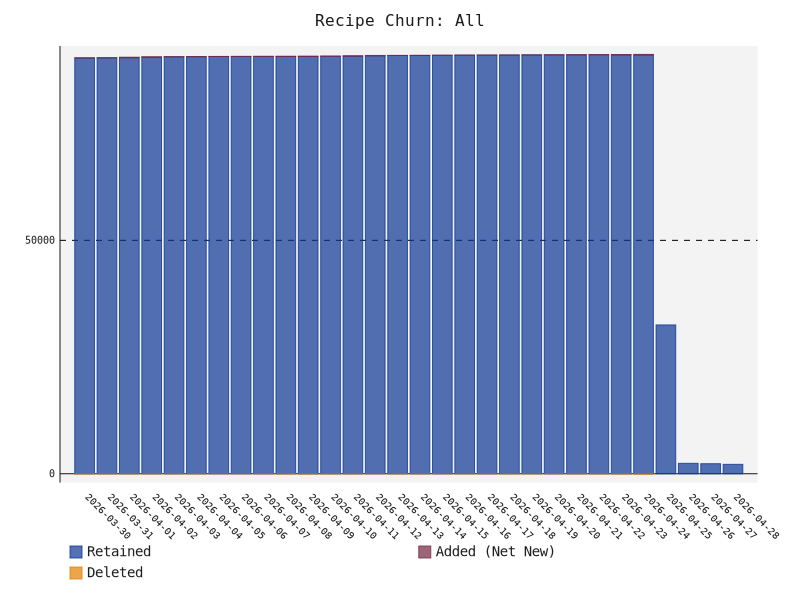

# Winget Radar
A data-driven, automated discovery and ranking engine for the Winget package manager ecosystem on Windows

# Build Status


# 📊 Ecosystem Health
* **Total Unique Recipes**: 2001
* **Ecosystem Auto-Update Health**: 0.0%
* **Ecosystem Reliability**: 100.0% (Sampled URL Health)
* **Official vs. Community**: 4965 Official / 3705 Community

* **Stale/Abandoned Sources (> 1 Year)**: 🪦 2

### Ecosystem Growth (All Recipes)
<picture>
  <source media="(prefers-color-scheme: dark)" srcset="growth_all_dark.svg">
  <source media="(prefers-color-scheme: light)" srcset="growth_all_light.svg">
  
</picture>


# 🚀 Getting Started
To add and use any of the repositories listed below, run the appropriate command for your package manager:


```powershell
winget source add -n <source-name> -a <source-url>
winget install <app-name> --source <source-name>
```


# Third party repositories by popularity


## 💎 Hidden Gems
These repositories are actively maintained and feature a high percentage of **unique** applications not found in official repositories. Great for discovering niche tools!

| Repository | Unique Recipes | Total Recipes | Score | Auto-Update |
| :--- | :---: | :---: | :---: | :---: |
| **[pl4nty/winget-pkgs-selfhost](directory/pl4nty+winget-pkgs-selfhost.md)** | 💎 41 (95.3%) | 📦 43 | ⭐ 1.0 | 🔄 0% |


## 📦 All Known Sources
A combined list of every source discovered in the ecosystem.

<details>
<summary><b>Click to expand all 9 discovered sources</b></summary>

| Repository | Recipes | Score | Auto-Update | Badges |
| :--- | :---: | :---: | :---: | :--- |
| **[microsoft/winget-pkgs-submission-test](directory/microsoft+winget-pkgs-submission-test.md)** | 📦 4867 | ⭐ 1.0 | 🔄 0% | 👑 Official |
| **[eliaor/winget-pkgs](directory/eliaor+winget-pkgs.md)** | 📦 3400 | ⭐ 1.0 | 🔄 0% |  |
| **[vedantmgoyal9/winget-pkgs-automation](directory/vedantmgoyal9+winget-pkgs-automation.md)** | 📦 342 | ⭐ 1.0 | 🔄 0% |  |
| **[pl4nty/winget-pkgs-selfhost](directory/pl4nty+winget-pkgs-selfhost.md)** | 📦 43 | ⭐ 1.0 | 🔄 0% |  |
| **[picguard/winget-updater](directory/picguard+winget-updater.md)** | 📦 4 | ⭐ 1.0 | 🔄 0% |  |
| **[voicemeet/winget-updater](directory/voicemeet+winget-updater.md)** | 📦 2 | ⭐ 1.0 | 🔄 0% |  |
| **[223n/winget-usacloud](directory/223n+winget-usacloud.md)** | 📦 2 | ⭐ 1.0 | 🔄 0% |  |
| **[cloudflightio/winget-pkgs](directory/cloudflightio+winget-pkgs.md)** | 📦 1 | ⭐ 1.0 | 🔄 0% |  |
| **[RadikaRules/scripts](directory/RadikaRules+scripts.md)** | 📦 9 | ⭐ 1.0 | 🔄 0% |  |

</details>

# 🛠️ Operational Health (Crawler Metrics)
* **Total Crawler Runs**: 75
* **Total Repo Updates**: 2394
* **Ecosystem Growth (Since Last Run)**:
  * 🪣 +0 Repositories
  * 📦 +0 Recipes
* **Eviction Count**: 🗑️ 1
* **API Rate Limit Retries**: ⏳ 0
* **Cache Size**: 💾 0.93 MB
* **Pipeline Times (Last Run)**:
  * 🔍 Discovery: 2.66s
  * 📥 Update: 14.64s
* **Cumulative Compute Time**: 19.5 minutes
